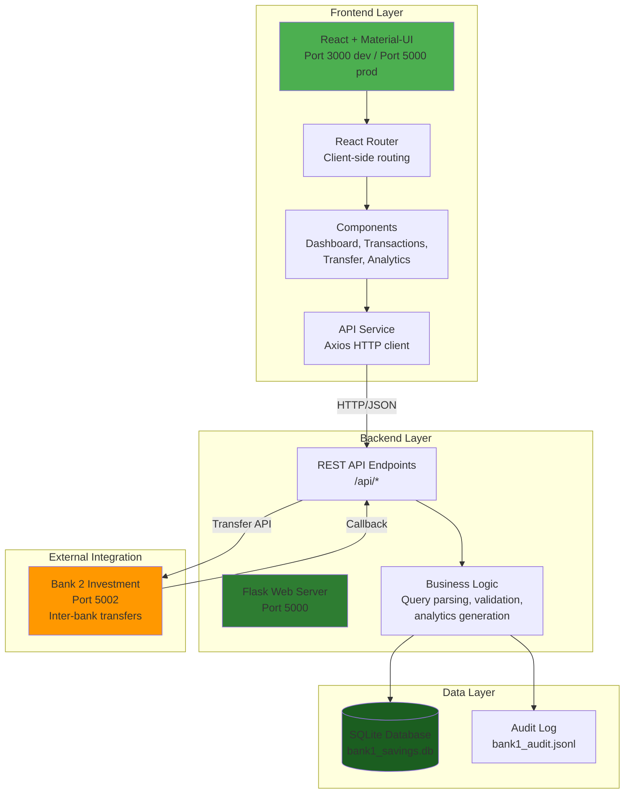

# Use Case 1: Security Vulnerability

Bob に次のように聞くと、アプリの理解から始められます。  
`app.py が何をするのか、高レベル説明、全体アーキテクチャ図、UI を含めて説明して。アプリの起動方法と UI の立ち上げ方法も教えて。`

# Bank1-Savings アプリ概要

## 🎯 高レベル説明

**Bank1-Savings** は、**React + Material-UI フロントエンド** と **Flask（Python）バックエンド** を組み合わせたモダンなフルスタック銀行アプリです。残高照会、取引履歴、銀行間振込、支出分析、監査ログといった機能を備えています。

---

## 🏗️ 全体アーキテクチャ



---

## 📊 コンポーネント内訳

### **Frontend (React + Material-UI)**

**技術スタック**
- React 18 with hooks
- Material-UI v5
- React Router
- Axios
- Vite

**主要コンポーネント**
1. **Dashboard** - 残高や口座概要の表示
2. **TransactionList** - 取引履歴の閲覧
3. **TransferForm** - 銀行間振込
4. **Analytics** - チャートによる支出分析

**UI の特徴**
- モバイル / デスクトップ対応
- 顧客選択ドロップダウン
- 左サイドバーのナビゲーション
- リアルタイム残高更新
- 対話的なチャート

### **Backend (Flask Python)**

**主な能力**

1. **データベース管理**
   - SQLite の 3 テーブル: `customers`, `accounts`, `transactions`
   - スキーマ自動初期化
   - デモデータ投入（5 顧客）
   - パラメータ化クエリによる SQL Injection 防止

2. **REST API**
   - `POST /api/balance` - 残高取得
   - `POST /api/transactions` - 取引履歴取得
   - `POST /api/analytics` - 支出分析生成
   - `POST /api/transfer` - 銀行間振込
   - `POST /api/custom_query` - 自然言語クエリ
   - `GET /api/audit_log` - 監査ログ取得
   - `GET /health` - ヘルスチェック

3. **セキュリティ機能**
   - パラメータ化 SQL
   - スキーマ検証
   - 顧客データ分離
   - SHA-256 を使った監査証跡
   - 障害時のロールバック

4. **分析エンジン**
   - Plotly による可視化
   - Pandas によるデータ処理
   - 円グラフ（カテゴリ別支出）
   - 折れ線グラフ（支出推移）

5. **自然言語処理**
   - "last 5 transactions over $100" のような質問を解釈
   - SQL テンプレートに変換
   - 複数の問い合わせパターンに対応

---

## 🗄️ データベーススキーマ

```text
customers
├── customer_id (PK)
├── name
├── email (UNIQUE)
└── created_at

accounts
├── account_id (PK)
├── customer_id (FK)
├── account_type
├── balance (CHECK >= 0)
└── created_at

transactions
├── transaction_id (PK)
├── account_id (FK)
├── customer_id (FK)
├── transaction_type
├── category
├── amount
├── description
└── transaction_date
```

---

## 🚀 アプリの起動方法

### **前提条件**
```bash
# Required software
- Python 3.8+
- Node.js 16+
- npm or yarn
```

### **Option 1: 開発モード（フロント / バック分離）**

**Terminal 1 - バックエンド起動**
```bash
cd bank1-savings

# Install Python dependencies
pip install -r requirements.txt

# Start Flask backend
python app.py

# Backend runs on: http://localhost:5000
```

**Terminal 2 - フロントエンド起動**
```bash
cd bank1-savings/frontend

# Install Node dependencies
npm install

# Start Vite dev server
npm run dev

# Frontend runs on: http://localhost:3000
```

**UI の確認先**
- **http://localhost:3000**
- フロントエンドはバックエンドの 5000 番ポートへ API をプロキシします

---

### **Option 2: 本番モード（統合）**

```bash
cd bank1-savings/frontend

# Build React app
npm run build

# This creates bank1-savings/static/ directory

cd ..

# Start Flask (serves both API and built React app)
python app.py

# Access at: http://localhost:5000
```

---

### **Option 3: Docker デプロイ**

```bash
cd bank1-savings

# Build Docker image
docker build -t bank1-savings .

# Run container
docker run -p 5000:5000 bank1-savings

# Access at: http://localhost:5000
```

---

## 🖥️ UI の使い方

### **1. アプリを開く**
開発モードでは `http://localhost:3000`、本番モードでは `http://localhost:5000` を開きます。

### **2. 顧客を選ぶ**
- 右上のドロップダウンで顧客を選択
- 顧客切り替えに応じて残高が更新される

### **3. 機能を切り替える**

**Dashboard** 📊
- 口座残高を確認
- 口座サマリーを見る
- 主要指標を把握する

**Transactions** 📋
- 取引履歴を確認
- 日付や種別で見る
- 入出金内容を確認する

**Transfer** 💸
- Bank 2（Investment）へ送金
- 金額入力
- 振込実行
- 更新後の残高確認

**Analytics** 📈
- カテゴリ別支出を確認
- 支出推移を確認
- 取引傾向を把握する

---

## 🔄 データフロー例: 振込

```text
1. User clicks "Transfer" in UI
   ↓
2. React component calls apiService.transfer(customerId, amount)
   ↓
3. Axios sends POST to /api/transfer
   ↓
4. Flask validates request and checks balance
   ↓
5. Deducts from Bank1 account (SQLite UPDATE)
   ↓
6. Records withdrawal transaction
   ↓
7. Calls Bank2 API: POST /api/receive_transfer
   ↓
8. Bank2 adds to investment account
   ↓
9. Returns success response
   ↓
10. UI updates balance and shows confirmation
```

---

## 📁 主要ファイル

**Backend**
- [`app.py`](bank1-savings/app.py:1) - メインの Flask アプリ
- [`requirements.txt`](bank1-savings/requirements.txt:1) - Python 依存関係

**Frontend**
- [`frontend/src/App.jsx`](bank1-savings/frontend/src/App.jsx:1) - メイン React コンポーネント
- [`frontend/src/components/`](bank1-savings/frontend/src/components/) - UI コンポーネント群
- [`frontend/src/services/api.js`](bank1-savings/frontend/src/services/api.js:1) - API クライアント
- [`frontend/package.json`](bank1-savings/frontend/package.json:1) - Node 依存関係

**Database**
- `bank1_savings.db` - SQLite データベース
- `bank1_audit.jsonl` - 監査ログ

---

## 🎨 UI 画面イメージ

**Main Dashboard**
- 緑系の配色（`#2E7D32`）
- 左サイドバー
- 上部に顧客セレクタ
- カードベースの主画面
- 大きく表示された残高

**Transaction List**
- 色分けされた取引（緑=入金、赤=出金）
- 日付、金額、カテゴリ、説明
- スクロール可能
- リアルタイム更新

**Transfer Form**
- 金額入力欄
- 送金先銀行の表示
- Confirm / Cancel ボタン
- 成功 / エラーメッセージ

**Analytics**
- 対話的な Plotly チャート
- カテゴリ別円グラフ
- 支出推移の折れ線
- 合計支出の要約

---

## 🔧 設定

**環境変数**
```bash
BANK_NAME="Savings Bank"
BANK_ID="bank1"
BANK_COLOR="#2E7D32"
DB_PATH="bank1_savings.db"
AUDIT_LOG_PATH="bank1_audit.jsonl"
BANK2_URL="http://localhost:5002"
```

---

## ✅ 簡易確認

起動後は次を確認します。

```bash
# Check backend health
curl http://localhost:5000/health

# Check frontend loads
open http://localhost:3000

# Test API
curl -X POST http://localhost:5000/api/balance \
  -H "Content-Type: application/json" \
  -d '{"customer_id": 1}'
```

---

このアプリは、React、Material-UI、Flask、SQLite を組み合わせたモダンなフルスタック開発例として、銀行デモや教育用途に向いています。
