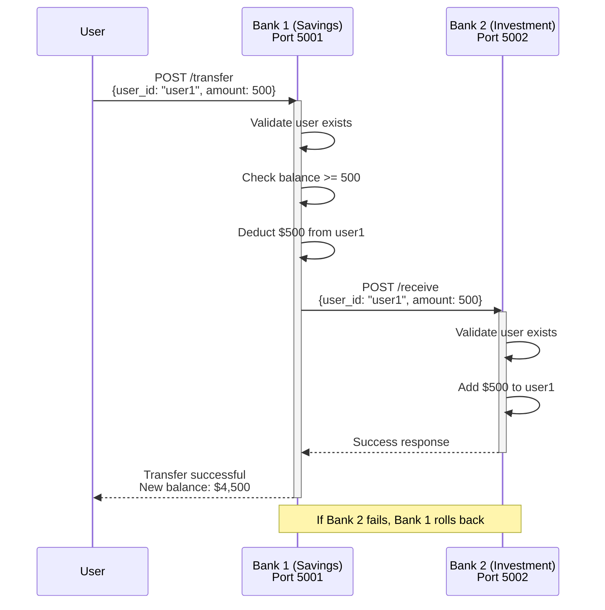
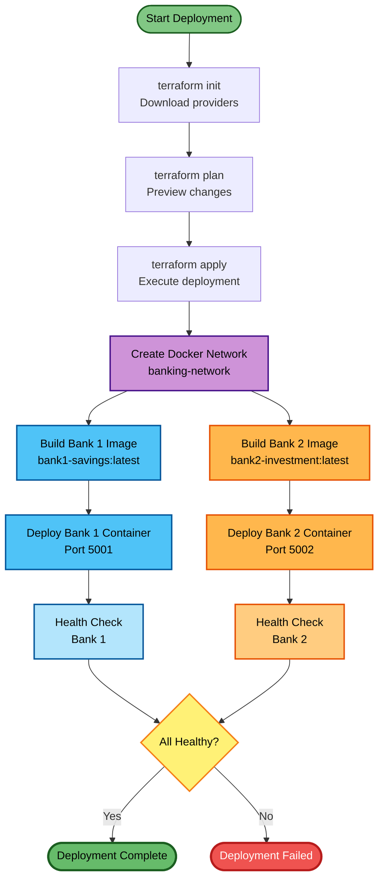
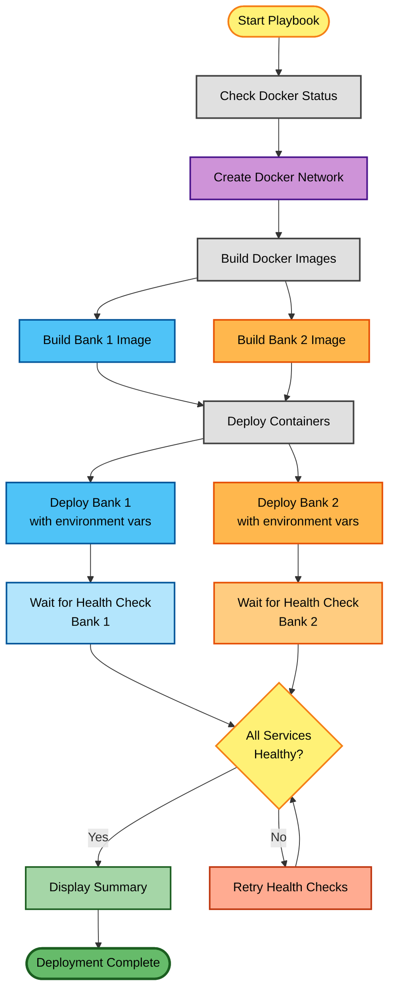
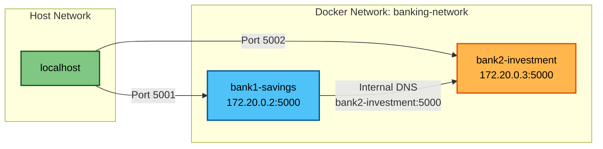
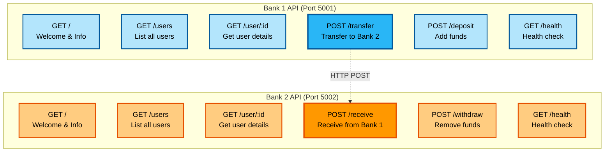
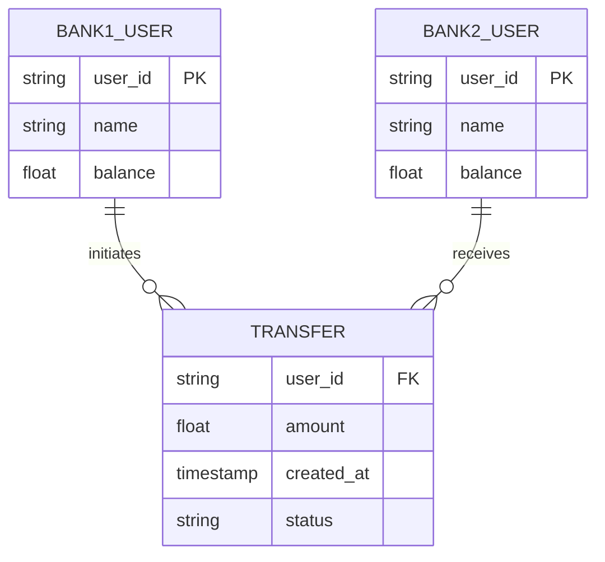
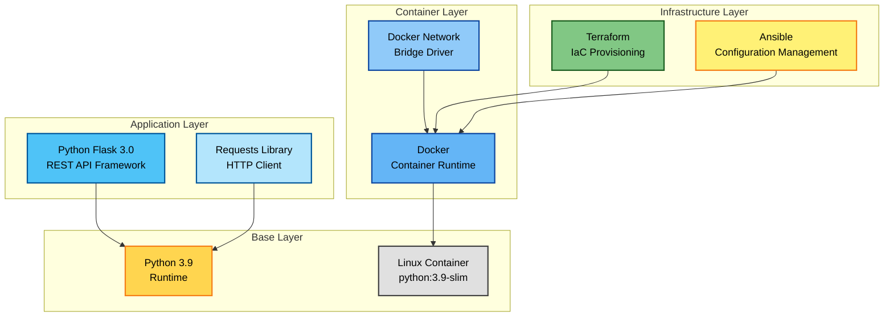
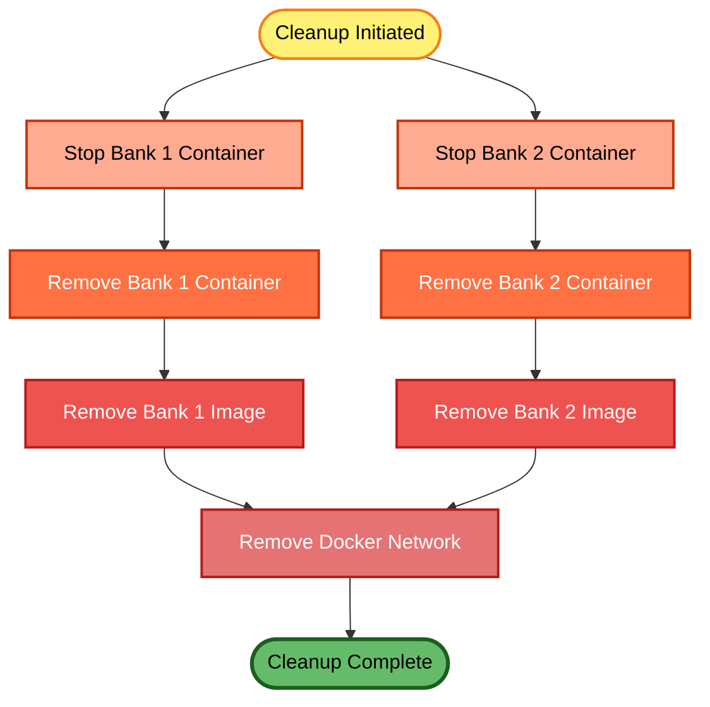

# Banking Demo - Architecture Diagrams

> **Note**: This file contains the original architecture diagrams with improved readability.
> For comprehensive architecture documentation, see [System Architecture](../architecture/SYSTEM_ARCHITECTURE.md).

## System Architecture

```mermaid
graph TB
    subgraph "MacBook Host / Azure Cloud"
        subgraph "Docker Environment / Azure Container Instances"
            Network[Docker Network / Azure VNet<br/>banking-network<br/>172.20.0.0/16]
            
            subgraph "Bank 1 Container"
                B1[Bank 1 - Savings<br/>React Frontend + Flask API<br/>Port 5001]
                B1Data[(SQLite Database<br/>Customers, Accounts<br/>Transactions, Audit Log)]
            end
            
            subgraph "Bank 2 Container"
                B2[Bank 2 - Investment<br/>Flask API (Traditional)<br/>Port 5002]
                B2Data[(SQLite Database<br/>Customers, Accounts<br/>Transactions, Audit Log)]
            end
        end
        
        subgraph "Deployment Tools"
            TF[Terraform<br/>Infrastructure as Code]
            AN[Ansible<br/>Configuration Management<br/>Local Only]
        end
    end
    
    User[User/Browser] -->|HTTP :5001| B1
    User -->|HTTP :5002| B2
    B1 <-->|Inter-Bank Transfer API| B2
    B1 -.-> B1Data
    B2 -.-> B2Data
    B1 -.-> Network
    B2 -.-> Network
    TF -.->|Provisions| Network
    TF -.->|Deploys| B1
    TF -.->|Deploys| B2
    AN -.->|Configures Local| B1
    AN -.->|Configures Local| B2
    
    style B1 fill:#4FC3F7,stroke:#01579B,stroke-width:2px,color:#000
    style B2 fill:#FFB74D,stroke:#E65100,stroke-width:2px,color:#000
    style Network fill:#CE93D8,stroke:#4A148C,stroke-width:2px,color:#000
    style TF fill:#81C784,stroke:#1B5E20,stroke-width:2px,color:#000
    style AN fill:#FFF176,stroke:#F57F17,stroke-width:2px,color:#000
    style B1Data fill:#B3E5FC,stroke:#01579B,stroke-width:2px,color:#000
    style B2Data fill:#FFCC80,stroke:#E65100,stroke-width:2px,color:#000
    style User fill:#90CAF9,stroke:#0D47A1,stroke-width:2px,color:#000
```

## Transfer Flow



## Deployment Flow - Terraform



## Deployment Flow - Ansible



## Container Communication



## API Endpoints



## Data Model



## Technology Stack



## Cleanup Process



## Viewing These Diagrams

These diagrams are written in Mermaid syntax and can be viewed in:

1. **GitHub** - Automatically renders Mermaid diagrams
2. **VS Code** - Install "Markdown Preview Mermaid Support" extension
3. **Online** - https://mermaid.live/
4. **Documentation sites** - GitBook, Docusaurus, etc.

## Diagram Legend

- 🔵 Blue boxes: Bank 1 (Savings) components
- 🟠 Orange boxes: Bank 2 (Investment) components
- 🟣 Purple boxes: Network infrastructure
- 🟢 Green boxes: Terraform components
- 🟡 Yellow boxes: Ansible components
- Solid lines: Direct communication
- Dashed lines: Management/configuration