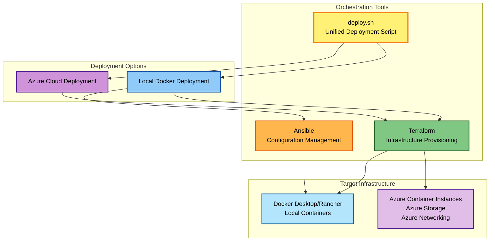
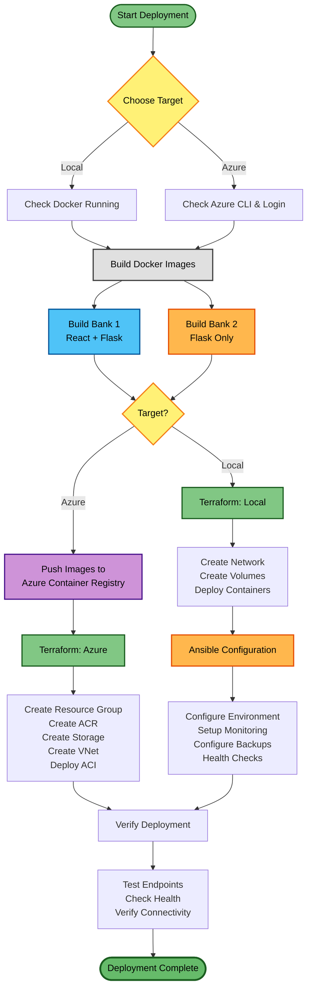
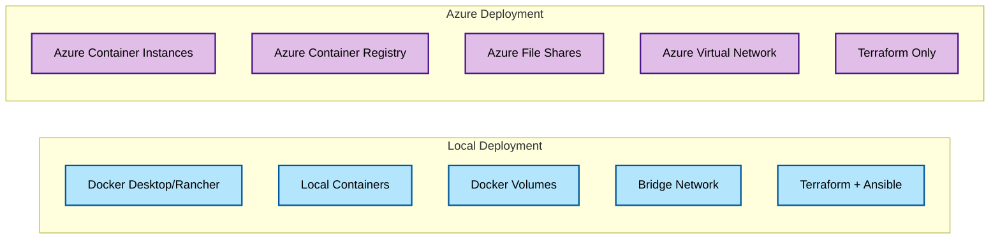
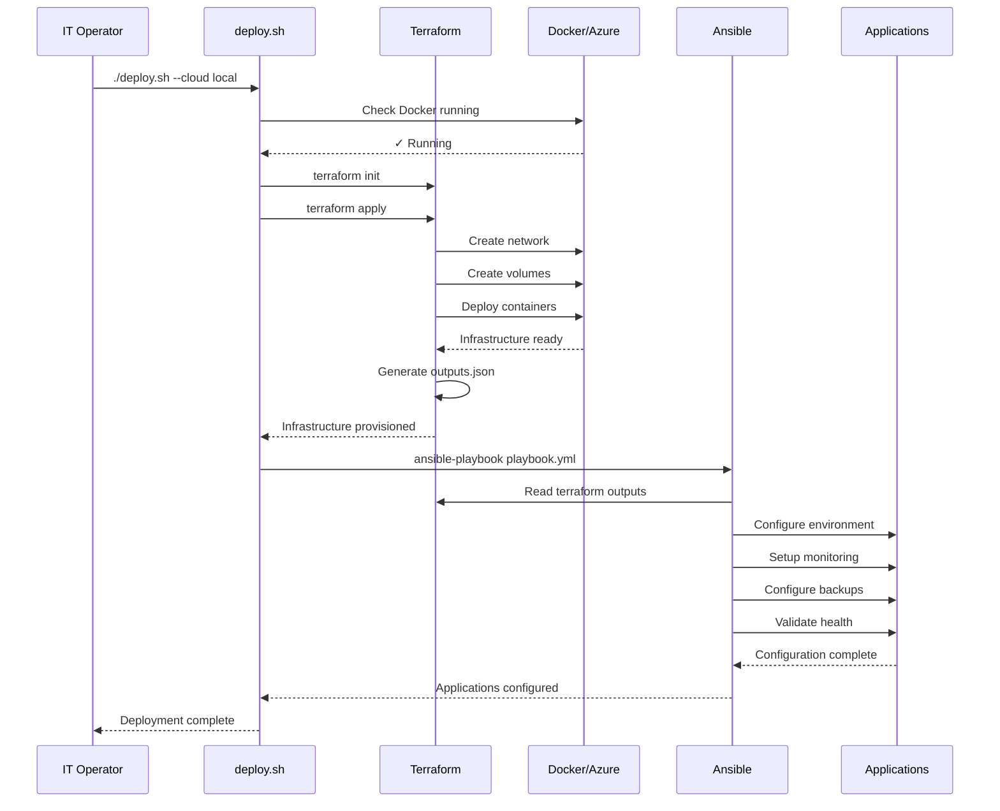
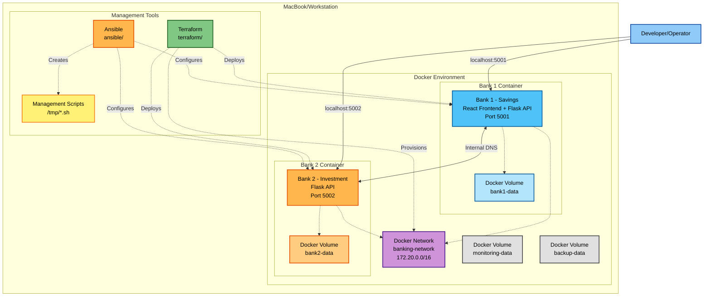
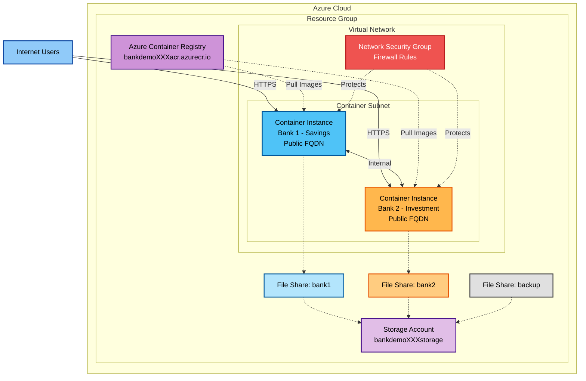

# Deployment Overview - IT Operations Guide

## Executive Summary

This document provides a comprehensive overview of deployment options for the Banking Demo application, designed for IT Operations teams managing infrastructure deployment and maintenance.

## Deployment Architecture

### High-Level Overview



## Deployment Workflow

### Complete Deployment Process



## Deployment Options Comparison

### Local vs Azure Deployment



| Feature | Local Deployment | Azure Deployment |
|---------|-----------------|------------------|
| **Infrastructure** | Docker Desktop/Rancher | Azure Container Instances |
| **Networking** | Docker Bridge Network | Azure Virtual Network |
| **Storage** | Docker Volumes | Azure File Shares |
| **Registry** | Local Images | Azure Container Registry |
| **Orchestration** | Terraform + Ansible | Terraform Only |
| **Cost** | Free (local resources) | ~$66/month |
| **Scalability** | Limited to local machine | Cloud-scale |
| **Accessibility** | localhost only | Public internet |
| **Use Case** | Development, Testing | Production, Demo |

## Tool Integration: Terraform & Ansible

### How They Work Together



### Terraform Responsibilities (WHAT)

- **Infrastructure Provisioning**
  - Create Docker networks or Azure VNets
  - Deploy containers or Azure Container Instances
  - Create storage volumes or Azure File Shares
  - Configure basic networking and ports

- **State Management**
  - Track infrastructure state
  - Plan changes before applying
  - Enable infrastructure versioning

- **Outputs**
  - Container names and IDs
  - Network details
  - Volume mount points
  - URLs and endpoints

### Ansible Responsibilities (HOW)

- **Application Configuration**
  - Set environment variables
  - Configure inter-service communication
  - Setup application-specific settings

- **Operational Tools**
  - Create monitoring scripts
  - Setup backup automation
  - Configure log rotation
  - Implement health checks

- **Validation**
  - Verify service health
  - Test connectivity
  - Validate configuration

## Quick Start Commands

### Local Deployment

```bash
# One-command deployment
./deploy.sh

# Or step-by-step
./deploy.sh --cloud local

# Skip image rebuild
./deploy.sh --skip-build

# Auto-approve (no prompts)
./deploy.sh --auto-approve
```

### Azure Deployment

```bash
# Deploy to Azure
./deploy.sh --cloud azure

# With auto-approve
./deploy.sh --cloud azure --auto-approve

# Prerequisites
az login
# Edit terraform-azure/terraform.tfvars with unique names
```

## Infrastructure Components

### Local Deployment Architecture



### Azure Deployment Architecture



## Management Operations

### Monitoring

```bash
# Local deployment - Ansible creates these scripts
/tmp/monitor_bank1.sh    # Continuous health monitoring
/tmp/monitor_bank2.sh    # Continuous health monitoring

# Azure deployment
az container logs --resource-group <rg-name> --name <container-name>
```

### Backup

```bash
# Local deployment
/tmp/backup_banks.sh     # Backup databases and logs

# Azure deployment
# Data persists in Azure File Shares automatically
```

### Log Management

```bash
# Local deployment
/tmp/rotate_logs.sh      # Rotate and compress logs

# Azure deployment
az container logs --resource-group <rg-name> --name <container-name>
```

### Health Checks

```bash
# Local deployment
curl http://localhost:5001/health
curl http://localhost:5002/health

# Azure deployment
curl http://<bank1-fqdn>:5000/health
curl http://<bank2-fqdn>:5000/health
```

## Troubleshooting

### Common Issues

#### Docker Not Running (Local)
```bash
# Check status
docker info

# Start Docker Desktop
open -a Docker

# Start Rancher Desktop
rdctl start
```

#### Azure Login Issues
```bash
# Login to Azure
az login

# Verify subscription
az account show

# List subscriptions
az account list --output table
```

#### Port Conflicts (Local)
```bash
# Check what's using ports
lsof -i :5001
lsof -i :5002

# Kill process or change ports in terraform/variables.tf
```

#### Terraform State Issues
```bash
# Reinitialize
cd terraform && rm -rf .terraform && terraform init

# Force refresh
terraform refresh

# View state
terraform show
```

## Cleanup

### Local Deployment
```bash
cd terraform
terraform destroy -auto-approve
```

### Azure Deployment
```bash
cd terraform-azure
terraform destroy -auto-approve
```

## Security Considerations

### Local Deployment
- ✅ Isolated Docker network
- ✅ No external exposure (localhost only)
- ✅ Volume-based data persistence
- ⚠️ No authentication (demo environment)

### Azure Deployment
- ✅ Azure Virtual Network isolation
- ✅ Network Security Group firewall
- ✅ Private Container Registry
- ✅ Encrypted storage at rest
- ⚠️ Public endpoints (configure NSG rules)
- ⚠️ No authentication (add Azure AD)

## Cost Management

### Local Deployment
- **Cost**: Free (uses local resources)
- **Resources**: CPU, memory, disk from local machine

### Azure Deployment
- **Estimated Monthly Cost**: ~$66
  - Container Instances: ~$60
  - Container Registry: ~$5
  - Storage: ~$0.50
  - Bandwidth: ~$0.87

### Cost Optimization
- Stop containers when not in use
- Use Azure Dev/Test pricing
- Implement auto-shutdown schedules
- Monitor usage with Azure Cost Management

## Next Steps

- **For Development**: Use local deployment
- **For Production**: Use Azure deployment with additional security
- **For Testing**: Use either, depending on test requirements
- **For Demos**: Use Azure deployment for accessibility

## Related Documentation

- [Architecture Overview](../architecture/SYSTEM_ARCHITECTURE.md)
- [Local Deployment Guide](../guides/LOCAL_DEPLOYMENT.md)
- [Azure Deployment Guide](../guides/AZURE_DEPLOYMENT.md)
- [Terraform & Ansible Integration](../guides/TERRAFORM_ANSIBLE.md)
- [Troubleshooting Guide](../reference/TROUBLESHOOTING.md)

---

**Document Version**: 1.0  
**Last Updated**: 2025-11-21  
**Maintained By**: IT Operations Team