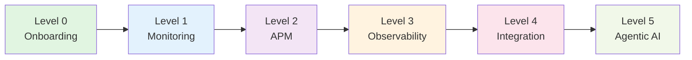

# Instana成熟度モデル

Instanaの導入から高度な活用まで、段階的に機能を習得していくためのロードマップです。

指摘箇所はGitHubの[Issue](https://github.com/IBM/japan-technology/issues/new)にて以下情報とあわせてご連絡ください。

```text
Title : <ページ名>の修正依頼
Description : 指摘ページのURLと指摘内容を記載ください。
```

---

## 学習パス

各レベルの機能を順番に習得していくことで、Instanaを最大限に活用できます。



| レベル | 名称 | 達成できること |
|-------|------|---------------|
| 0 | Onboarding | 初期設定、用語理解、基本操作の習得 |
| 1 | Monitoring | 基本的な監視機能の確立 |
| 2 | APM | アプリケーションパフォーマンスの詳細な監視と分析 |
| 3 | Observability | 深い可観測性の実現と高度な分析 |
| 4 | Integration | 他のツールやプラットフォームとの統合 |
| 5 | Agentic AI | AI駆動の自律的な運用と最適化 |

※それぞれ学習用リンクを記載していますが、`(仮)`がついているリンクは、執筆中のため公式ドキュメント等へ遷移します。

---

## Level 0: Onboarding

**目標:** 初期設定、用語理解、基本操作の習得

| 機能 | 説明 | ドキュメント |
|------|------|-------------|
| オンボーディングガイド | Instanaの初期セットアップ手順 | [Link](https://ibm.github.io/japan-technology/onboarding-docs/) |

---

## Level 1: Monitoring

**目標:** 基本的な監視機能の確立

| 機能 | 説明 | ドキュメント |
|------|------|-------------|
| チーム＆ロール | Instanaにおけるロールベースアクセス制御| [Link(仮)](https://community.ibm.com/community/user/blogs/vishnu-m-s/2025/11/12/understanding-teams-and-roles) |
| ネットワーク設定 | エージェント通信の最適化やセキュアなネットワーク接続 | [Link](./1_Monitoring/ネットワーク設定/nw-settings.md) |
| ホストエージェントの設定（基礎） | エージェント設定の基本 | [Link](./1_Monitoring/configuring-host-agents.md) |
| アラートの構成と管理 | アラートの基本設定 | [Link](./1_Monitoring/alerts-configuring-managing.md) |
| スマート・アラート | 静的/動的しきい値によるアラート設定 | [Link](./1_Monitoring/applications-smart-alerts.md) |
| カスタム・ダッシュボード | 独自の監視ダッシュボード作成 | [Link](./1_Monitoring/instana-building-custom-dashboards.md) |
| Instana設定のIaC化 | Infrastructure as Codeによる設定管理 | [Link](./1_Monitoring/apis-instana-terraform-provider.md) |

---

## Level 2: APM (Application Performance Monitoring)

**目標:** アプリケーションパフォーマンスの詳細な監視と分析

| 機能 | 説明 | ドキュメント |
|------|------|-------------|
| ホストエージェントの設定（応用）| センサーの有効化や認証情報の設定| [Link(仮)](./2_APM/ホストエージェントの設定/cha-configuring-host-agents-by-using-agent-configuration-file.md) |
| サービス・レベル目標 | SLI/SLOの設定と管理 | [Link](./2_APM/service-level-objectives.md) |
| Web サイトのモニター | Webサイトのパフォーマンス監視 | [Link](./2_APM/instana-monitoring-websites.md) |
| 合成モニタリング | 合成トランザクションによる監視 | [Link](./2_APM/instana-synthetic-monitoring.md) |
| モバイル・アプリケーションのモニター | モバイルアプリの監視 | [Link](./2_APM/instana-monitoring-mobile-applications.md) |
| API | Instana APIの活用 | [Link](./2_APM/instana-rest-api-sdks.md) |
| Logs | ログデータの統合と分析 | [Link](./2_APM/capabilities-logging.md) |

---

## Level 3: Observability

**目標:** 深い可観測性の実現と高度な分析

| 機能 | 説明 | ドキュメント |
|------|------|-------------|
| DBmarlin | データベースパフォーマンス監視 | [Link](./3_Observability/integrations-dbmarlin.md) |
| Instana AutoProfile | 自動プロファイリング | [Link](./3_Observability/instana-profile-processes.md) |
| OpenTelemetry | トレース、メトリクスの統合 | [Link](./3_Observability/opentelemetry.md) |
| 自動化フレームワーク | 運用自動化の実装 | [Link](./3_Observability/technologies-automation-action-script.md) |

---

## Level 4: Integration

**目標:** 他のツールやプラットフォームとの統合

| 機能 | 説明 | ドキュメント |
|------|------|-------------|
| Prometheus | Prometheusとの統合 | [Link(仮)](https://www.ibm.com/docs/ja/instana-observability/latest?topic=integrations-prometheus) |
| Grafana | Grafanaダッシュボード連携 | [Link(仮)](https://www.ibm.com/docs/ja/instana-observability/latest?topic=integrations-grafana) |
| Zabbix | Zabbixとの統合 | [Link(仮)](https://qiita.com/mumumu_yurano/items/b0125395ac3acc9aa9ad) |
| Concert | IBM Concertとの連携 | [Link(仮)](https://www.ibm.com/docs/ja/instana-observability/latest?topic=hosted-integrating-concert) |
| Turbonomic | Turbonomicとの統合 | [Link(仮)](https://www.ibm.com/docs/ja/instana-observability/latest?topic=hosted-integrating-turbonomic) |
| Kubecost | Kubernetesコスト管理 | [Link(仮)](https://www.ibm.com/docs/ja/instana-observability/latest?topic=hosted-integrating-kubecost) |

---

## Level 5: Agentic AI

**目標:** AI駆動の自律的な運用と最適化

| 機能 | 説明 | ドキュメント |
|------|------|-------------|
| インテリジェントな修復 | AI による自動修復（プレビュー） | [Link](./5_Agentic-AI/intelligent-remediation.md) |
| AIゲートウェイ | AIモデルの統合管理 | [Link](./5_Agentic-AI/ai-gateway.md) |
| MCP Server | Model Context Protocolサーバー | [Link](./5_Agentic-AI/sdks-mcp-server-instana.md) |


## 関連リソース

- [IBM Instana公式ドキュメント](https://www.ibm.com/docs/ja/instana-observability/current)
- [GitHubリポジトリ](https://github.com/instana)
- [TechXchangeコミュニティ - Instana](https://community.ibm.com/community/user/groups/community-home?CommunityKey=8d661410-d1fb-4067-ab9a-019475fc541e) (英語サイト)
- [AIOps Group Japan](https://community.ibm.com/community/user/usergroup?CommunityKey=1507c7fa-70f3-451c-a5f6-eed79a229022)
