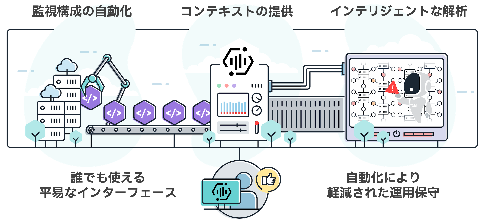

# IBM Instana Observability

IBM Instana Observability（以降、Instana）をご利用いただきありがとうございます。  
本ガイドは、SaaS版 Instanaの導入から活用までをスムーズに進めていただくためのオンボーディングガイドです。  
初めての方でも安心してご利用いただけるよう、これから SaaS版 Instana を導入もしくは利用される全ての方を対象として、基本的な操作方法から活用例までを丁寧にご紹介しています。

なお、Self-Hosted版 Instana を利用される方はまず [公式ドキュメント](https://www.ibm.com/docs/ja/instana-observability/current?topic=planning-instana-deployment-options#instana-self-hosted-deployment) を参照の上、Backend の導入を行なってください。Backend導入後は、適宜読み替えてご利用いただくことが可能です。  

また、以下の点をサポートすることを目的としています。

- Instana の基本的な使い方を理解する 主要な機能や画面構成を把握し、操作に慣れることを目指します。

- 初期セットアップをスムーズに進める アカウントの準備、エージェントの導入、ダッシュボードの基本操作など、導入初期に必要なステップをわかりやすく解説します。

- ダッシュボードやアラート通知機能を一通り体験する 実際に Instana を操作しながら、監視データの可視化やアラート設定の基本を学びます。

Instana を通じて、システムの可観測性を高め、運用の効率化と品質向上を実現しましょう。

## オンボーディングの全体像

01. [オンボーディングの流れ(タイムライン)](./overview_of_the_onboarding_process/onboarding_process/)

## Instanaとは

02. [Instanaとは](./what_is_instana/what_is_instana/)
03. [成熟度モデルとカスタマージャーニー](./what_is_instana/maturity_model/)

## Instana Agentの導入

04. [Instana Agentの要件](./instana_agent_installation/requirements/)
05. [Linuxワンライナー](./instana_agent_installation/linux_one_liner/)
06. [Windowsインストーラー](./instana_agent_installation/windows_agent/)
07. [OpenShift Operator](./instana_agent_installation/openshift_operator/)
08. [エージェントの設定](./instana_agent_installation/setup_agent/)

## アカウントの準備

09. [サインインとユーザー登録](./account_set_up/user_registration/)
10. [ユーザーロールとグループ](./account_set_up/user_roles_and_groups/)
11. [MFAの設定](./account_set_up/setting_of_MFA/)

## 基本機能の紹介

12. [ホームページとメニュー](./guide_of_main_features/homepage/)
13. [エージェント一覧](./guide_of_main_features/list_of_agents/)
14. [インフラストラクチャー](./guide_of_main_features/infrastructure/)
15. [アプリケーション](./guide_of_main_features/application/)
16. [組み込みアラートとインシデント](./guide_of_main_features/builtin_alerts_and_incidents/)
17. [分析](./guide_of_main_features/analysis/)

## トラブルシューティング

18. [よくあるエラーと対処法](./troubleshooting/errors_and_solution/)
19. [サポートへの問い合わせ方法](./troubleshooting/how_to_contact_support/)

## 次のステップ

20. [オンボーディング完了後の流れ](./next_steps/post_onboarding_process/)
21. [継続的な学習リソース](./next_steps/continuous_learning_resources/)
22. [コミュニティやサポートチャネルの紹介](./next_steps/information_of_community_and_support_channel/)

## 付録

23. [用語集(公式ドキュメント)](https://www.ibm.com/docs/ja/instana-observability/current?topic=glossary)
