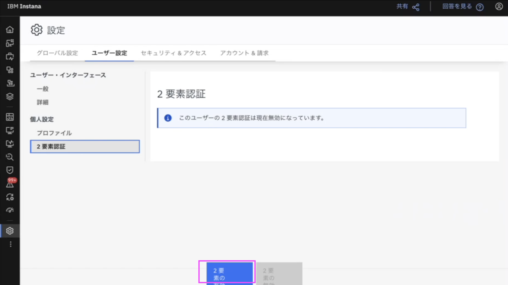
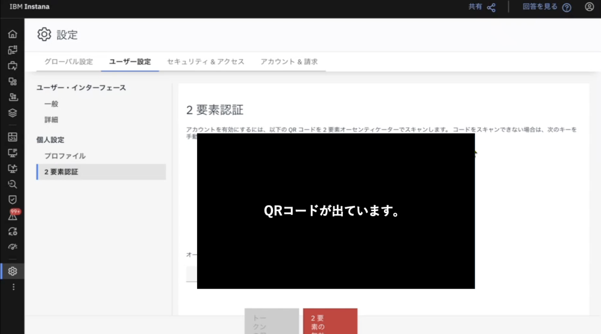
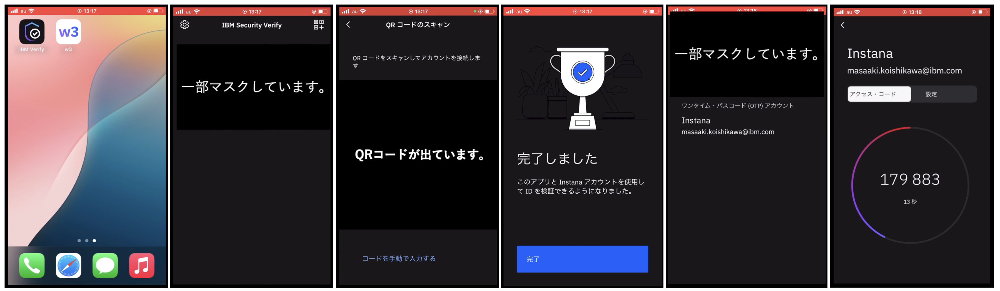
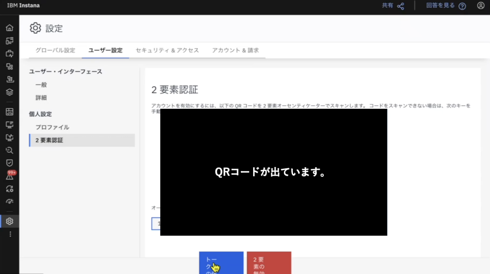
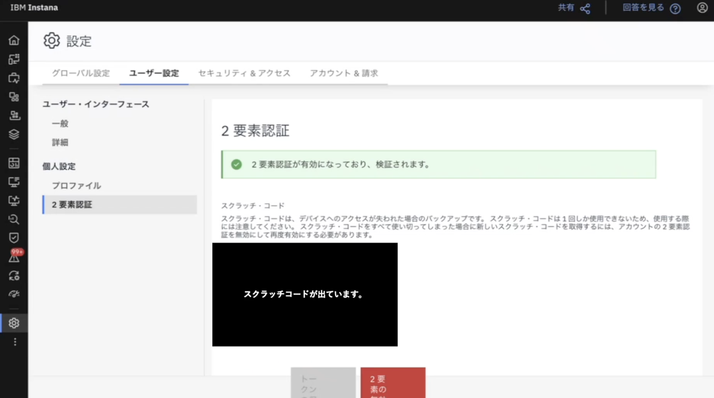
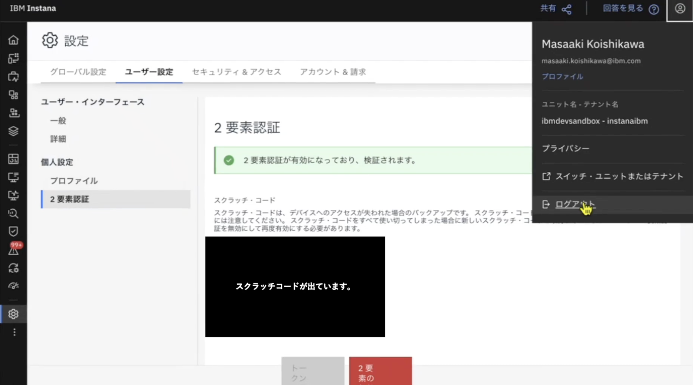
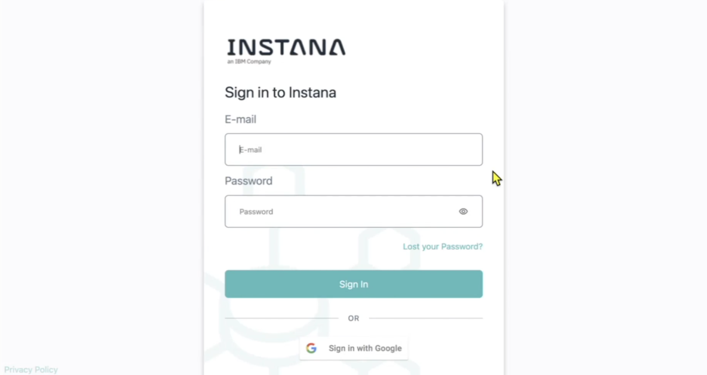
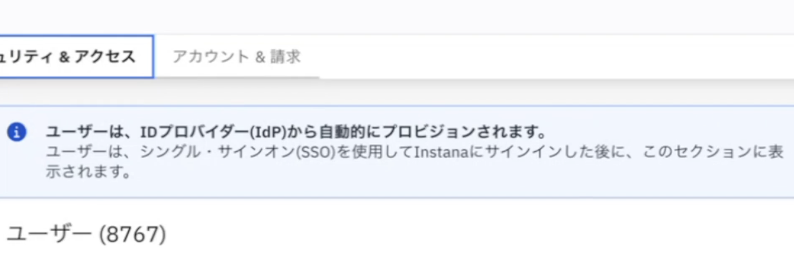
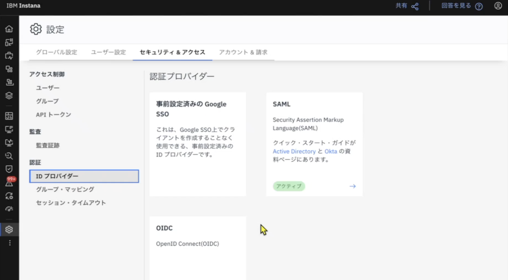
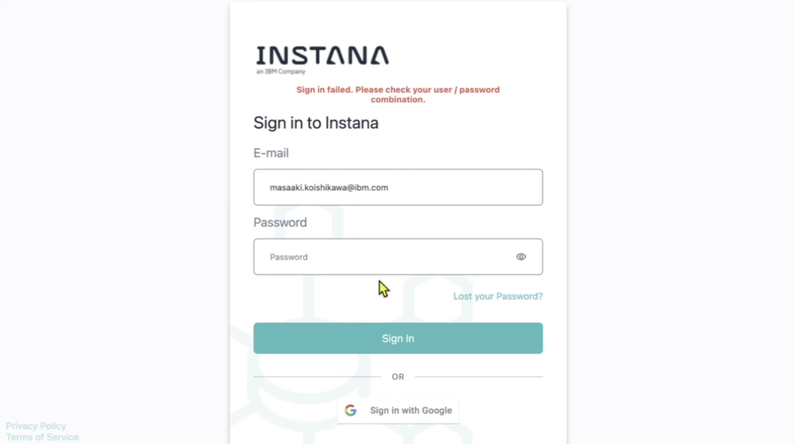

# MFAの設定

公式ドキュメント：<https://www.ibm.com/docs/en/instana-observability/current?topic=instana-configuring-user-settings#two-factor-authentication-2fa>

## はじめに

本ページでは、 Instana の2要素認証を設定するまでの手順を記述しています。

事前に、IBM Vefify、Google Authenticatorなどの認証ツール(オーセンティケーターツール, Authenticatorツール、認証アプリ)をご準備ください。  
本ページでは、IBM Verifyを利用しています。

## QRコードの表示

  

左サイドバーから設定画面を表示し、ユーザー設定のタブを選択します。  
個人設定から、「2要素認証」をクリックしましょう。  
<!-- 2要素認証のボタンが消えて、見つからない -->
次に、画面の下に表示される「2要素認証の有効化」をクリックすると、下の画像のように画面が切り替わります。

  

QRコードと、手動で入力するためのコードが表示されます。  
今回はQRコードでの認証を説明します。

## 認証ツール での QRコード読み取り

  

認証ツール を開き、右上のコード読み取りボタンをクリックし、QRコードをスキャンします。  
「完了しました」という画面から、ホーム画面に切り替わると、「ワンタイム・パスコード（OTP）アカウント」が追加されていることが分かります。  
「ワンタイム・パスコード（OTP）アカウント」を選択すると、アクセスコードが表示されます。  
このアクセスコードは30秒で切り替わります。  

## アクセスコードの入力

  
アクセスコードを上の画面の、「トークンを入力してください」というところに入力します。  
次に、画面下に表示される「トークンの保存」をクリックします。

  
「2要素認証が有効になっており、検証されます。」と表示されたら、2要素認証の設定は完了です。  
※ スクラッチコードは、デバイスのアクセスが失われた場合のバックアップになりますので、必ず保管しましょう。

## 2要素認証の有効化の確認

  

右上のメニューから、ログアウトします。

  
サインインページで、E-mailアドレスとパスワードを入力します。  
すると、IBM Verify にパスワードが表示されるようになります。

## 注意事項

2要素認証とSAML認証のどちらを有効にするかは、最初に決めておきましょう。

  
上の画像のように、「セキュリティ＆アクセス」タブを開いたときに、「ユーザーは、IDプロバイダー(IdP)から自動的にプロビジョンされます。」という文章が表示されたら、SAML認証が設定されています。

  
また、「セキュリティ＆アクセス」タブの「IDプロバイダー」を表示すると、SAML認証がアクティブになっていることが分かります。

  
アクティブだったSAML認証を無効化した場合、事前にパスワードを設定していないと、ログインできないようになってしまいますので注意してください。

## 参考情報

Instana における2段階認証（2FA）設定についての動画です。この動画では、InstanaのUIとIBM Verifyを活用して、2FAを設定する方法を案内しております。

- [https://video.ibm.com/recorded/134409568](https://video.ibm.com/recorded/134409568)
