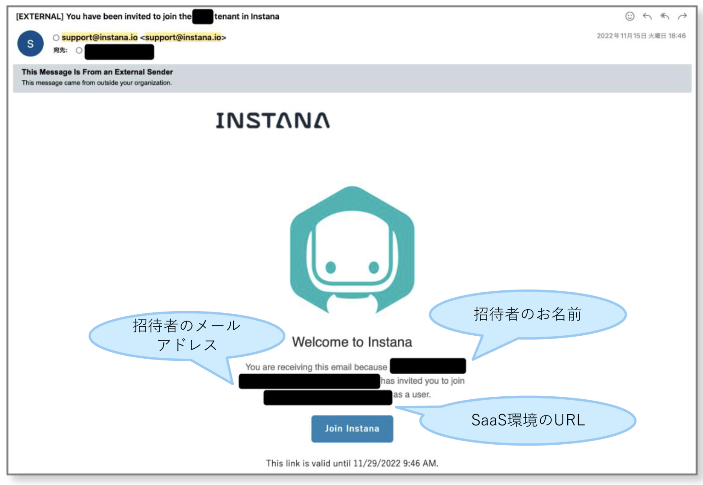
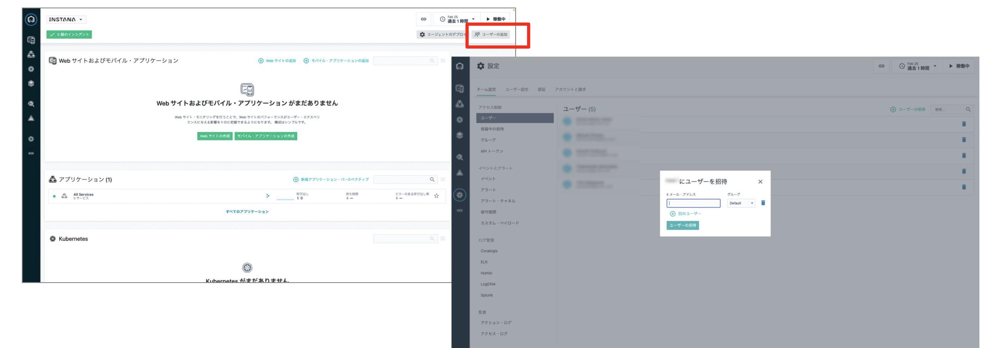
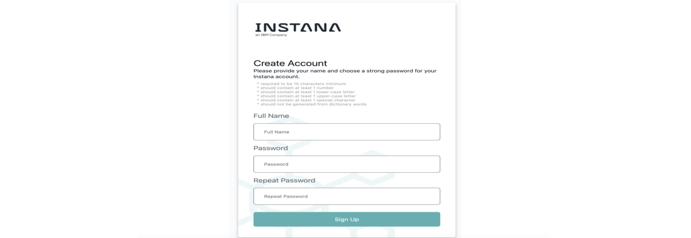

# サインインとユーザー登録

公式ドキュメント：

- ユーザー・アクセスの管理: <https://www.ibm.com/docs/ja/instana-observability/current?topic=instana-managing-user-access>
- 認証の構成: <https://www.ibm.com/docs/ja/instana-observability/current?topic=instana-configuring-authentication>

# はじめに

このドキュメントでは、デフォルトの認証構成である**ユーザー名とパスワードによる認証**を使った認証方法についてご案内しています。  
もし多要素認証を用いたい場合は、[多要素認証の設定](../setting_of_MFA/)を参照してください。  
Active Directoryやその他IdPと連携したい場合は、[公式ドキュメント:認証の構成](https://www.ibm.com/docs/ja/instana-observability/current?topic=instana-configuring-authentication)を参照してください。

## Step1: 管理者タスク: 管理者サインイン(初回ログイン)

ご契約後、お客様には SaaSを構築するためのプロビジョニングシートをご提出いただきます。  
IBMはこのプロビジョニングシートに沿ってInstana SaaSのプロビジョニングを行います。  
プロビジョニングが完了したタイミングで、ライセンス管理者として登録された方のメールアドレスに以下の招待メールが届きます。

  

件名: You have been invited to join the [tenant名] tenant in Instana  
差出人: <support@instana.io>

> [!IMPORTANT]  
> このメールを見落とさない様に注意してください!  
> アカウントが作成される方のメールアドレスとテナントのURLが記載されています。

メールを受信した管理者は、`Join Instana` のボタンをクリックし、サインインを行ってください。  
このボタンの有効期限は2週間です。

このユーザーは管理者権限を持っており、続けてユーザーを招待することができます。

## Step2: 管理者タスク: ユーザーの招待

管理者はユーザーを **招待** することで、招待されたユーザーがInstanaを利用できるようになります。  
「ユーザーを招待」をクリックし、メールアドレスを入力してユーザーをInstanaに招待します。

詳細は[公式ドキュメント](https://www.ibm.com/docs/ja/instana-observability/current?topic=instana-managing-user-access#inviting-users)を参照ください。

## Step3: ユーザータスク: サインイン(初回ログイン)

招待されたユーザーは招待メールを受信したら、メール本文中の`join instana` のボタンをクリックし、Instana の画面で初期設定として名前とパスワードを設定します。

> [!NOTE]
> パスワードは以下のルールを満たす必要があります。
>
> - 最低15文字以上
> - 辞書単語から生成されていない
> - 1文字以上の 数字
> - 1文字以上の 小文字英字
> - 1文字以上の 大文字英字
> - 1文字以上の 記号

初回設定完了後は、通常ログインでInstanaを利用することができます。  
詳細は [公式ドキュメント](https://www.ibm.com/docs/ja/instana-observability/current?topic=working-user-interface#signing-in)を参照ください。
