# ユーザーロールとグループ

公式ドキュメント：<https://www.ibm.com/docs/ja/instana-observability/current?topic=instana-managing-user-access>

> [!IMPORTANT]  
> 2025年7月リリースの `1.0.301` より、新しいアクセス制御として `Team` という概念が導入されました。  
> このページの情報はすでに古くなっています。最新情報は必ず [公式ドキュメント](https://www.ibm.com/docs/ja/instana-observability/current?topic=instana-managing-user-access)を参照してください。

## RBAC の全体概要

Instanaは個々のユーザーに対して直接権限を割り当てるのではなく、ユーザーを役割が定義されたグループに所属させることで、アクセス制御を管理します。  
このことをロールベースアクセス制御（RBAC）といいます。

ここではまず、InstanaにおけるRBACの基本的な動作について解説します。  
ドキュメントはこちら：https://www.ibm.com/docs/ja/instana-observability/current?topic=instana-managing-user-access

### グループ

まずはグループについて解説します。冒頭でも説明したように、グループとは、複数の権限をまとめた単位です。

Instanaの利用を開始すると、デフォルトで以下のグループが作成されます。

- Default：全ての権限が無効。
- Owner：全ての権限が有効。

新規にユーザーを追加する際、特に指定がない場合はDefaultのグループが自動で割り当てられます。

利用を開始したら必要に応じてグループを作成していきましょう。  
グループを作成する際は、Ownerグループ もしくは 'アクセス・グループの構成'の権限を持つグループ に所属している必要があります。

作成方法は最後に簡単に説明しますので、先に権限を設定する際に出てくる用語について解説します。

### アクセス権

アクセス権は、リソース(公式Docではプロダクト・エリアなどと表現)毎に設定するアクセスレベルとアクセスタイプおよびグローバル関数の各種許可で構成されます。

それぞれみていきましょう。

#### アクセスレベル

アクセスレベルはどのリソースの情報を参照可能とするかを以下の3種類のレベルで制御します。
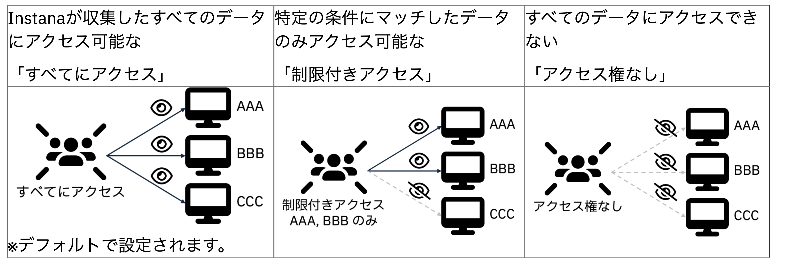

アクセスレベルを設定可能なリソースは以下となります。（○→設定可、×→設定不可）
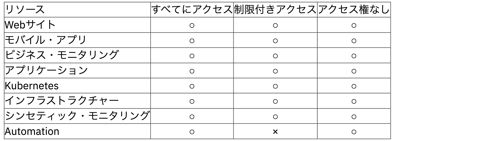

ユーザーが複数のグループに所属し、異なるアクセスレベルを持つ場合は、以下のルールで権限が付与されます。

- 制限付きアクセス > アクセス権なし > すべてにアクセス

例えば、「制限付きアクセス」と「すべてにアクセス」を持つユーザーは、制限付きアクセスの方が優先されます。
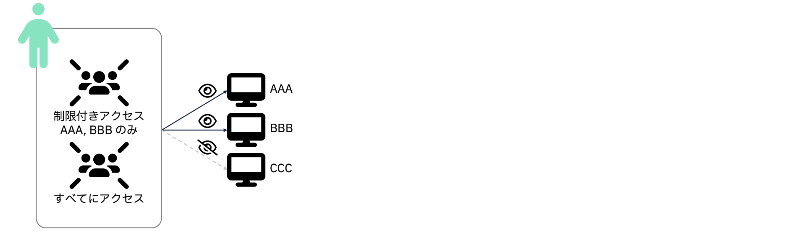

#### アクセスタイプ

アクセスタイプは、そのリソース内でどの様な操作が可能かを以下の3種類のタイプで制御します。
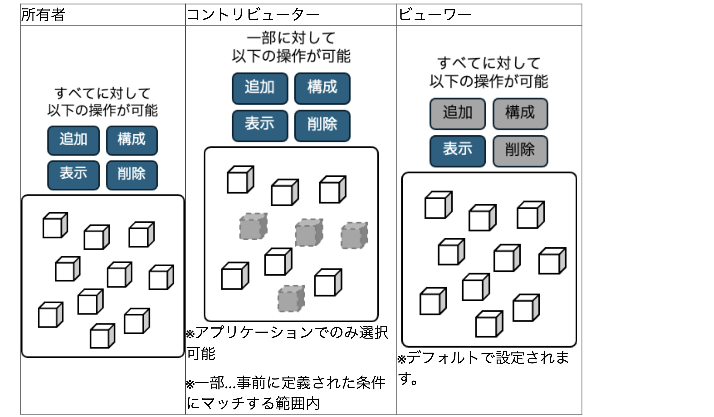

アクセスタイプを設定可能なリソースは以下となります。（○→設定可、×→設定不可）
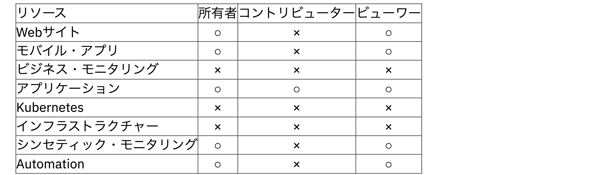

#### グローバル関数

この権限は、APIトークンの生成や、イベントおよびアラートの構成など、Instanaの機能全般に関する権限を設定します。

### グループの作成

Instana左側のメニューから、設定(歯車マーク)をクリックします。
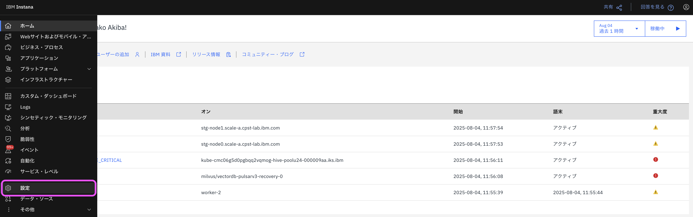

設定画面が表示されたら、[チーム設定] > [アクセス制御] > [グループ]を選択します。  
画面右上の [+ 新規グループ] をクリックします。  
新規グループの作成画面が表示されたら、 [グループの表示名] を入力します。  
今回はデフォルトのまま設定を完了するので、 [保存] をクリックします。

### グループへのユーザー割り当て

グループを作成すると、ユーザー一覧の画面が表示されます。  
作成したてなので、ユーザーは誰もいません。[+ ユーザーの追加] から追加をしてみましょう。

Instanaに登録されているユーザー一覧から、追加したいユーザーを選択して、 [保存] をクリックします。  
ユーザー数が多い場合は右上の検索ボックスも活用してください。

ユーザーが追加できました。

ユーザーをグループから削除したい場合はユーザー名の右にあるゴミ箱アイコンから削除が可能です。  
また、グループ自体を削除したい場合は、グループ一覧に戻り、グループ名の右にあるゴミ箱アイコンから削除が可能です。

## アクセス制御についての例: インフラストラクチャー

ここでは、インフラストラクチャーの設定について解説します。
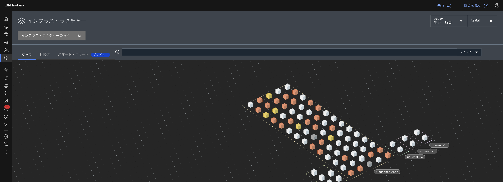

ドキュメントはこちら：https://www.ibm.com/docs/ja/instana-observability/1.0.301?topic=instana-managing-user-access#infrastructure

インフラストラクチャーに対するアクセス制御は、以下を実施することができます。

- インフラストラクチャーの画面へのアクセス可否
- アクセスできる範囲の絞り込み
- スマート・アラートの作成可否
- ヒープ/スレッド・ダンプの作成可否

### アクセスレベル

インフラストラクチャーに対しては3種類のアクセスレベルが選択できます。

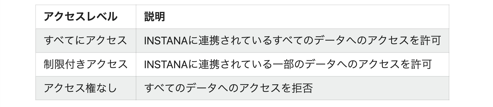

※権限の説明は後述します。

#### すべてにアクセス

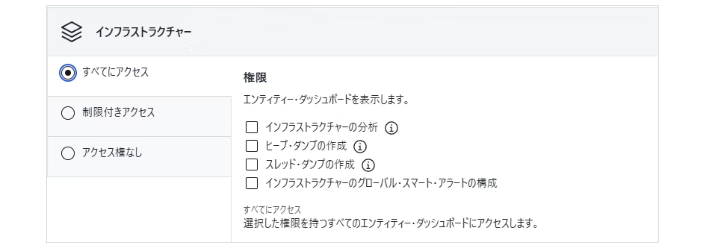

このアクセスレベルは、インフラストラクチャーに関するすべてのデータが参照可能になります。  
必要な権限のチェックをONにしてあげましょう。

#### 制限付きアクセス

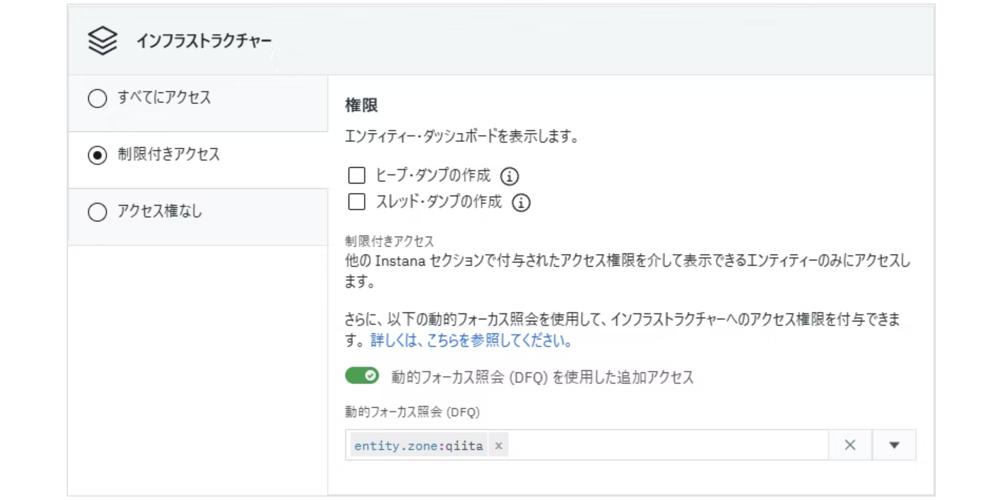

他の権限設定で許可されているデータのインフラストラクチャーに関する部分が参照可能になります。  
必要な権限のチェックをONにしてあげましょう。  
また、個別に追加でアクセス権を与えたい場合は、 "動的フォーカス照会 (DFQ) を使用した追加アクセス" を設定しましょう。

#### アクセス権なし

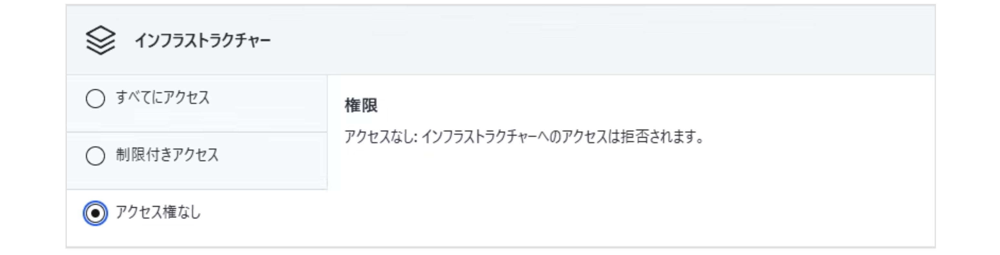

画面へのアクセスができなくなります。  
また、メニューにある "インフラストラクチャー" も表示されなくなります。

### 権限

それぞれのアクセスレベルで選択できる権限は以下の通りです。

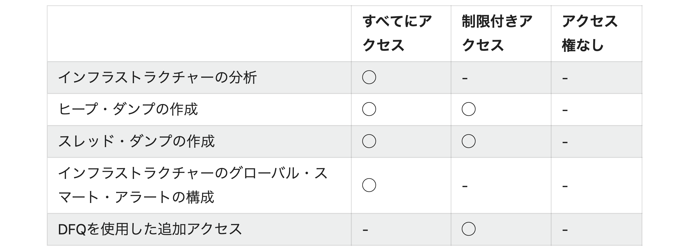

#### インフラストラクチャーの分析

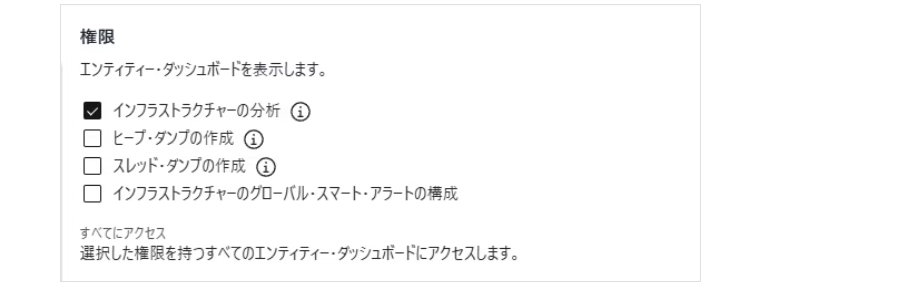

この権限が付与されていると、分析画面でインフラストラクチャーを指定できます。

#### ヒープ・ダンプの作成 & スレッド・ダンプの作成

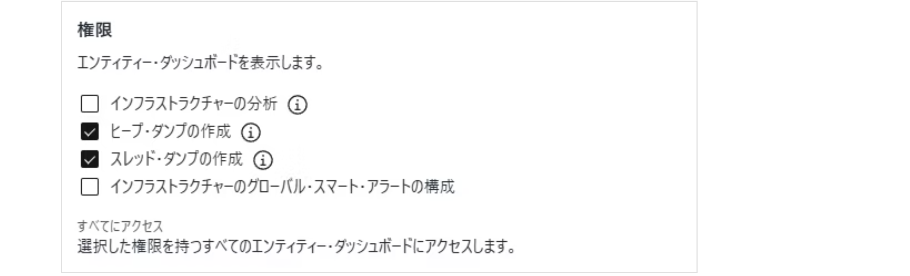

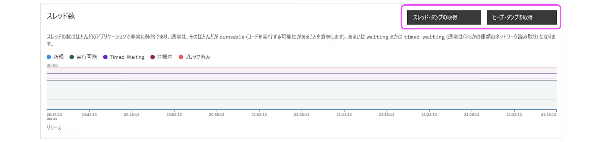

この権限がそれぞれ付与されていると、JVMの情報を見たときにUI上でダンプを取得・作成できるようになります。(画面右上の黒いボタン)

#### インフラストラクチャーのグローバル・スマート・アラートの構成

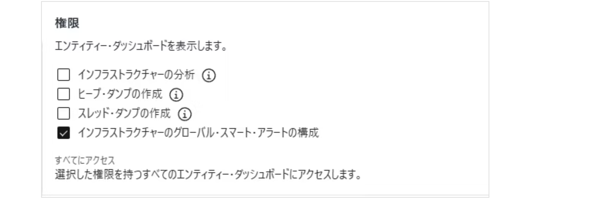

この権限が付与されていると、インフラストラクチャーのスマート・アラートの画面でアラートを新規作成できるようになります。(画面右下の青いボタン)
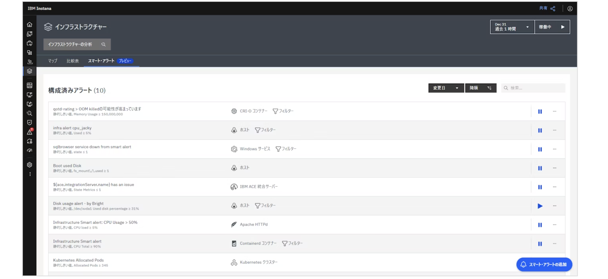

#### DFQを使用した追加アクセス

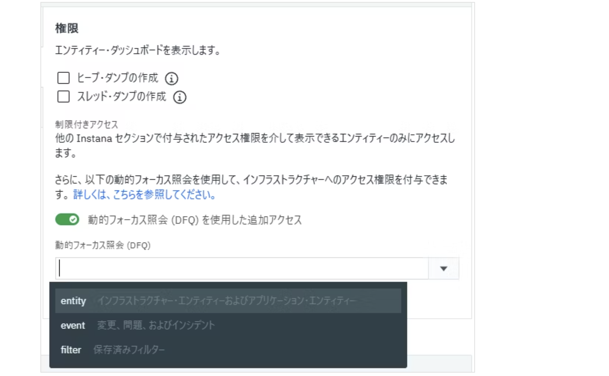

動的フォーカス照会 (DFQ) を使用した追加アクセス をONにすることで、制限付きアクセスに追加のアクセス権を付与することができます。

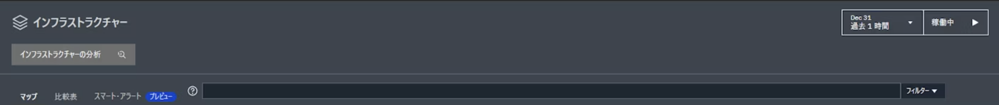

少しクセがあるので慣れないうちはインフラストラクチャーの画面で試してみて適切なクエリになっているか確認しましょう。

DFQのドキュメントはこちら：https://www.ibm.com/docs/ja/instana-observability/1.0.301?topic=instana-filtering-dynamic-focus

## プラットフォームについて

ここでは、プラットフォームの設定について解説します。
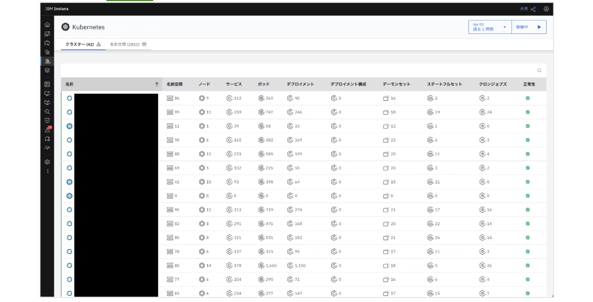

ドキュメントはこちら：https://www.ibm.com/docs/ja/instana-observability/1.0.301?topic=instana-managing-user-access#platforms

### できること

以下については、Instanaのプラットフォームメニューへのアクセス可否を設定可能です。

- Cloud Foundry
- IBM Power HMC
- IBM Z HMC
- Nutanix
- OpenStack
- vSphere
- SAP

対象のデータがInstanaにない場合、そのプラットフォームはメニューに表示されません。  
例えば、Kubernetes、SAP、vSphere を監視している環境の場合は以下のようになります。

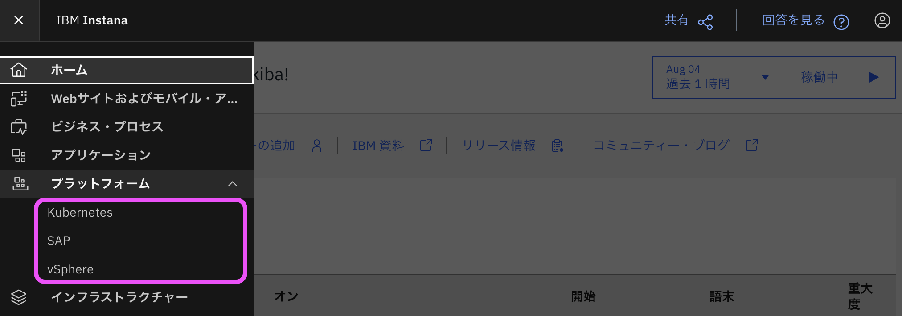

Kubernetes については、以下のように、もう少し細かく設定可能です。  

- プラットフォーム(Kubernetes)の画面へのアクセス可否
- アクセスできる範囲の絞り込み

そのため、ここでは基本的にKubernetesに対する設定を記載いたします。

### アクセスレベル

Kubernetesに対しては3種類のアクセスレベルが選択できます。  
※権限の説明は後述します。

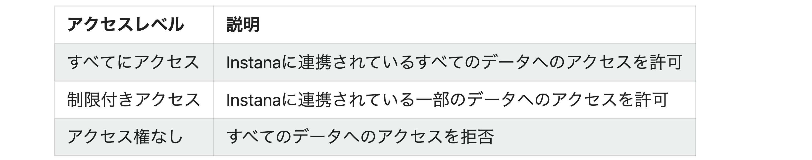

Kubernetes以外に対しては2種類のアクセスレベルが選択できます。

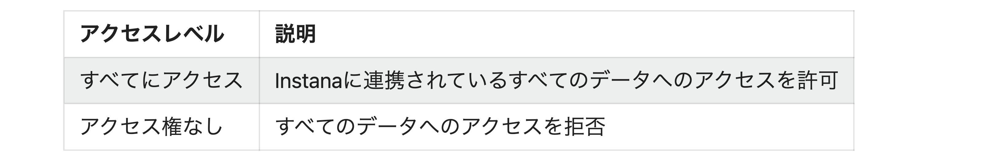

#### すべてにアクセス

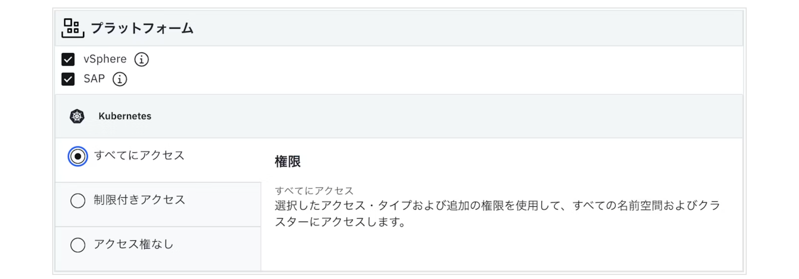

このアクセスレベルは、選択したプラットフォームに関するすべてのデータが参照可能になります。  
必要な権限のチェックをON またはラジオボタンを選択してあげましょう。

#### 制限付きアクセス

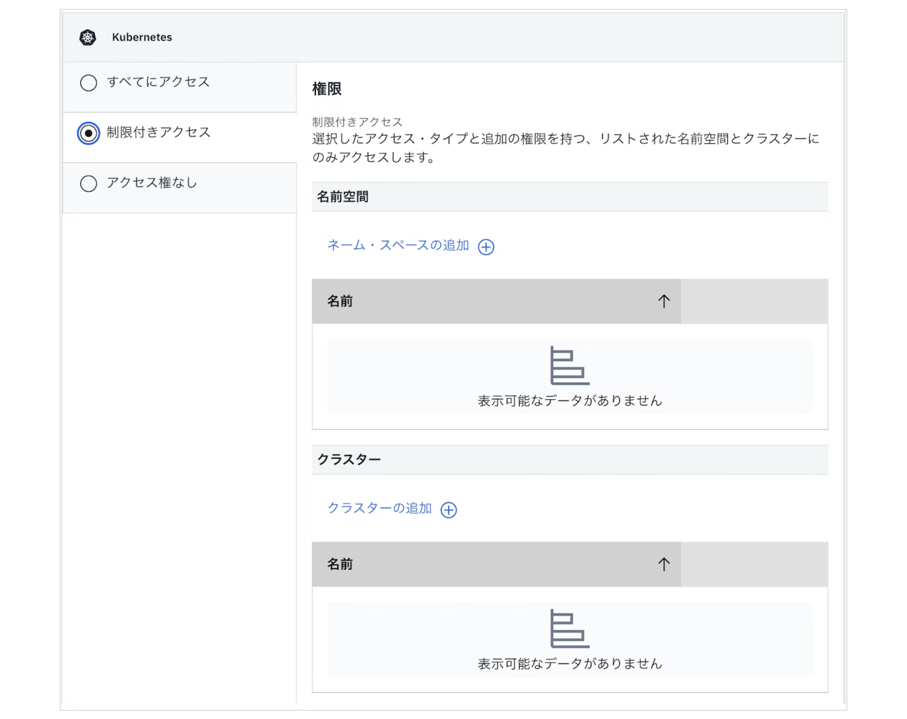

アクセスを許可したい 名前空間 と クラスター を [XXXの追加] から選択します。  
グループに所属する人に参照させたい範囲をこちらで指定しましょう。

#### アクセス権なし

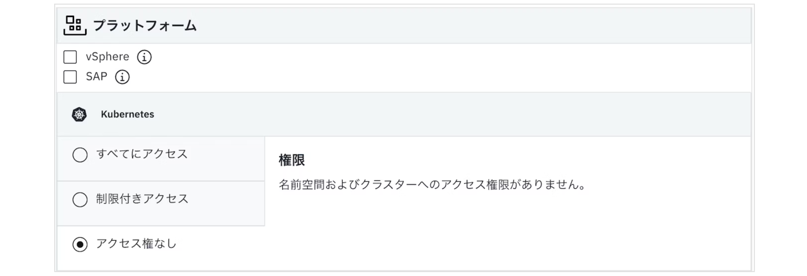

Kubernetesのアクセス権なしを選択 およびチェックをOFFにすると対象プラットフォームの画面へのアクセスができなくなります。  
設定後は、INSTANAのメニューにある "プラットフォーム" にも該当のプラットフォームが表示されなくなります。  
また、全ての権限がない場合は、以下の画像のように プラットフォームメニュー 自体が表示されなくなります。
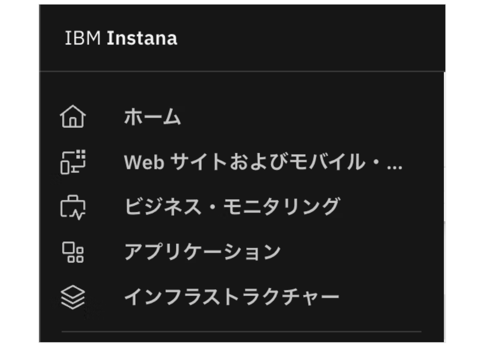
