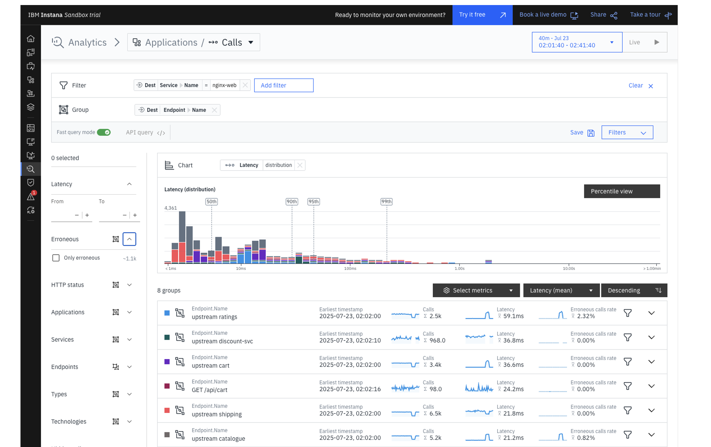
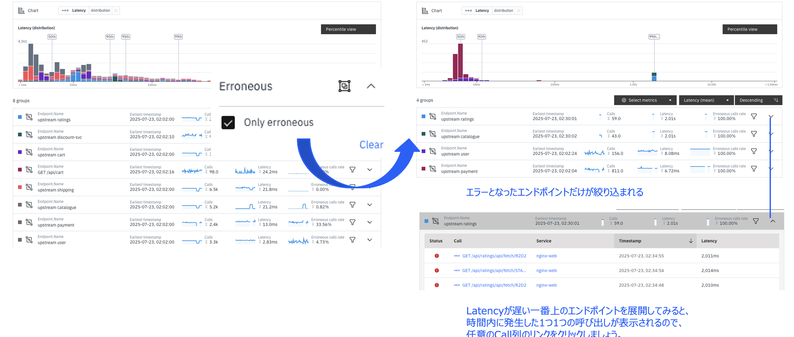
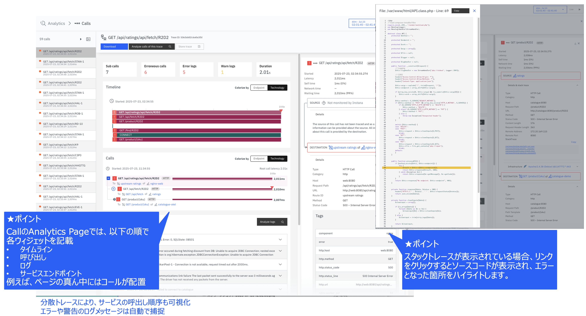

# 分析

公式ドキュメント：<https://www.ibm.com/docs/ja/instana-observability/current?topic=capabilities-unbounded-analytics>

詳細は公式ドキュメントを参照して下さい。

左のサイドバーから分析を選択すると、以下の画面が表示されます。

分析画面では、時間内の全てのエンドポイント呼び出しが表示されています。  
今回はnginx-webでエラーとなった呼び出しを分析したいので、左のメニューから Erroneous > Only erroneous のチェックをONにしましょう。  
*他にもHTTPステータスなどの絞り込みも可能です。

Latencyが遅い一番上のエンドポイントを展開してみると、時間内に発生した1つ1つの呼び出しが表示されるので、任意のCall列のリンクをクリックしましょう。

また、以下の順で各ウィジェットを記載しています。

1. タイムライン
1. 呼び出し
1. ログ
1. サービスエンドポイント

スタックトレースが表示されている場合、リンクをクリックするとソースコードが表示され、エラーとなった箇所をハイライトします。

分散トレースにより、サービスの呼出し順序が可視化されています。  
また、エラーや警告のログメッセージは自動で捕捉されます。

