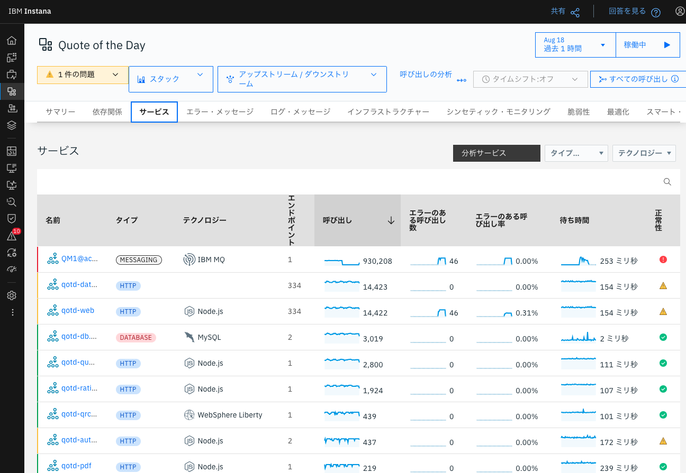
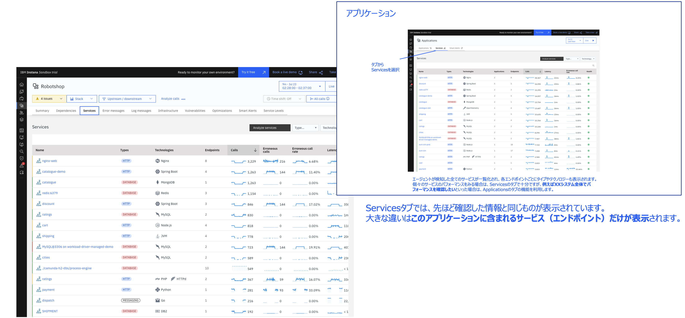

# アプリケーション

公式ドキュメント：

- アプリケーションのパースペクティブ(機能説明): <https://www.ibm.com/docs/ja/instana-observability/1.0.302?topic=capabilities-application-perspectives>
- アプリケーションのパースペティブ(設定): <https://www.ibm.com/docs/ja/instana-observability/current?topic=applications-application-perspectives>
- アプリケーションのモニター: <https://www.ibm.com/docs/ja/instana-observability/current?topic=instana-monitoring-applications>

## エージェント設定の確認

エージェントをインストールすると、Instanaセンサーが自動的にインストールされます。  
「センサー」とは、特定のテクノロジーをモニターするように設計されたモジュールです。  
ほとんどのセンサーは、エージェントのインストール後に自動的にインストールされ、構成されます。

該当のセンサーがインストールされ、正常に構成された場合アプリケーションの「サービス」画面に該当プロセスが表示されるようになります。  

もしこの画面に監視したいテクノロジーが表示されない場合は、センサーの設定を行う必要があります。例えばDb2などはAgentからDb2への接続情報を設定する必要があります。  
Instanaは非常に多くのテクノロジーに対応しています。[エージェントの設定](../../instana_agent_installation/setup_agent/) に沿ってセンサーの設定を行ってください。

## アプリケーションパースペクティブの設定

詳細は[公式ドキュメント：アプリケーションのパースペクティブ](https://www.ibm.com/docs/ja/instana-observability/current?topic=applications-application-perspectives) を参照してください。

サービスに監視したいテクノロジーが全て表示されましたら、続けてアプリケーションパースペクティブの設定を行います。  
アプリケーションパースペクティブとは、**サービスをグルーピングして見るための考え方** です。
特定のサービスを環境(本番環境、検証環境)やリージョン(US East, JP West)、Kubernetes Namespaceなどでグルーピングすることができます。また、DBAが特定のDBだけを見ること、も可能です。詳細は公式ドをュメントを参照ください。

なお、アプリケーションパースペクティブは簡単に追加削除を行うことができ、サービスの監視には影響を及ぼしません。
まずは何度か作成、削除を繰り返してみてください。

それでは、本書では **Quote of the Day** という OpenShift 上のアプリケーションを Instana で可視化した例を見てみましょう。

`Quote of the Day`は `qotd`という `namespace` にアプリケーションがデプロイされているため、  
アプリケーションパースペクティブは Kubernetesの `namespace` が `qotd` の サービスが含まれるように定義されています。  
(画像上は複数定義されていますが、簡素化のため上記のみ考えます)

複数のサービスが含まれていることがわかります。これらは`Quote of the Day`アプリケーションを構成するPod群です。

では、順番に見ていきましょう。

## アプリケーションのモニター

(詳細は[公式ドキュメント：アプリケーションのモニター](https://www.ibm.com/docs/ja/instana-observability/current?topic=instana-monitoring-applications) を参照してください。)

サービスを再度確認します。各行に、個々のサービスのテクノロジーやそのタイプ（HTTPやDATABASE, MESSAGINGなど）、および 各サービスのゴールデン・シグナル（呼び出し数、待ち時間、エラーのある呼び出し率）が表示されています。

これらのゴールデン・シグナルに対して、機械学習を適用していますので、呼び出し数の急減や応答性能の遅延、エラー率の急増といったイベントを検知して、画面の右端にて **正常性(緑色のレ点や黄色い△など)** を表示しています。

つぎに アプリケーションのタブを開きましょう。 さきほどの サービス タブは、テクノロジーのリストであり、業務ユーザーにとっては意味をなしません。検知されたテクノロジーを、ユーザーにとって意味のある体系に整理するビューがアプリケーションです。

Robot Shopアプリケーションを構成するマイクロサービス全体のサマリーダッシュボードを確認できます。  
一番上には、ゴールデン・シグナル（呼び出し数、エラーのある呼び出し率、待ち時間）およびその履歴が表示されています。  
下には関連する基盤で発生したインフラストラクチャーの問題および変更、各ゴールデンシグナルでのサービスのランキング、および処理時間が表示されています。  
下段中央の トップ・サービスでは、応答が悪化しているサービスやエラー数が多いサービスを確認できますので、特に注視が必要なものが分かります。呼び出し、エラーのある呼び出し率、待ち時間を選択し表示を切り替えてみてください。

> [!NOTE]  
> 待ち時間に記載されている `パーセンタイル` については、このページの最後を参照してください。

また、以下のようにサマリータブではサービスのゴールデンシグナルが表示されるダッシュボードが表示されます。  
右上から、タイムレンジを絞ることができ、その時間のエラー呼び出し率が拡大表示されます。

サービスタブでは、先ほど確認した情報と同じものが表示されています。
大きな違いはこのアプリケーションに含まれるサービス（エンドポイント）だけが表示されます。

上の画像はアプリケーションの呼び出し関係の可視化画面です。

ドットはライブのトラフィックを反映しており、線で繋がれたコンポーネント間を小さなドットが移動しているのを見ることができます。

特定のコンポーネントにカーソルを合わせると、そのコンポーネントのゴールデンシグナルとやり取りしているコンポーネントを強調表示することができます。

エラーやワーニングを含んだサービス(赤や黄色の枠線になっている◯)の影響範囲も簡単に確認できます。

## 補足: パーセンタイル

なぜ「平均値」ではなく「パーセンタイル値」を使うべきか？について補足します。

### 背景

ウェブサイトやAPIの応答速度は、ユーザー体験やSEO（検索順位）に大きく影響します。  
パフォーマンス改善の指標として、平均値ではなくパーセンタイル値を推奨いたします。

### 平均値 vs パーセンタイル値

平均値は、「全データの合計 ÷ 件数」で計算され、外れ値（極端に遅いレスポンス）に大きく影響を受けます。  
一方、パーセンタイルは、例えば、「90パーセンタイル → 上位10%の遅いレスポンスを除いた値」であるように外れ値の影響を受けにくく、実態に近い値を算出することができます。

### ロングテール分布の問題

実際のAPIレスポンスは「ロングテール分布」になりやすいです。  
一部のリクエストが極端に遅くなることで、平均値が大きく歪みます。  
たとえば「全データをダウンロード」などの重いクエリがあると、平均値が跳ね上がります。

### パーセンタイルの利点

90パーセンタイルを見ることで、「上位10%の遅いレスポンス」を把握することが可能です。  
外れ値に左右されず、多くのユーザーに影響が出ているかどうかを判断しやすいという利点があります。  
例えば、「90パーセンタイルが急上昇」していれば、10%以上のユーザーに影響が出ているということです。

### 実用面での活用

パフォーマンス監視やSLO（サービスレベル目標）の設定において、パーセンタイル値をKPIにすることが推奨されます。
例：95パーセンタイル以下で応答時間500ms以内、など。

参考(<https://gigazine.net/news/20210916-web-percentile-useful/>)
