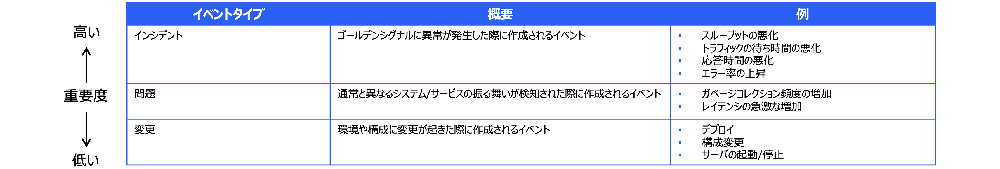
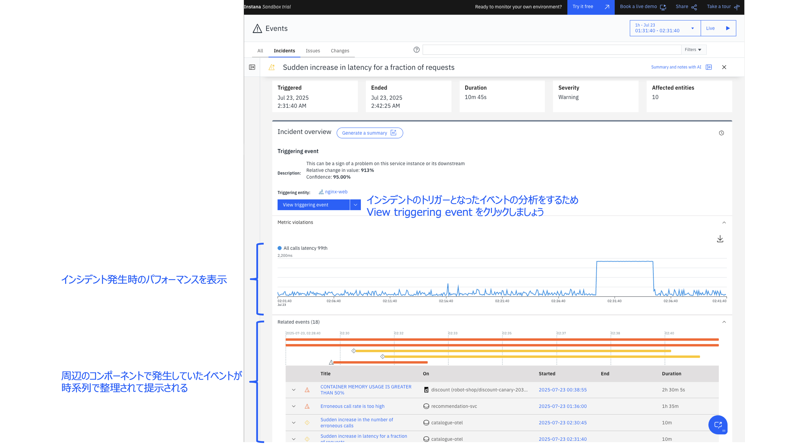
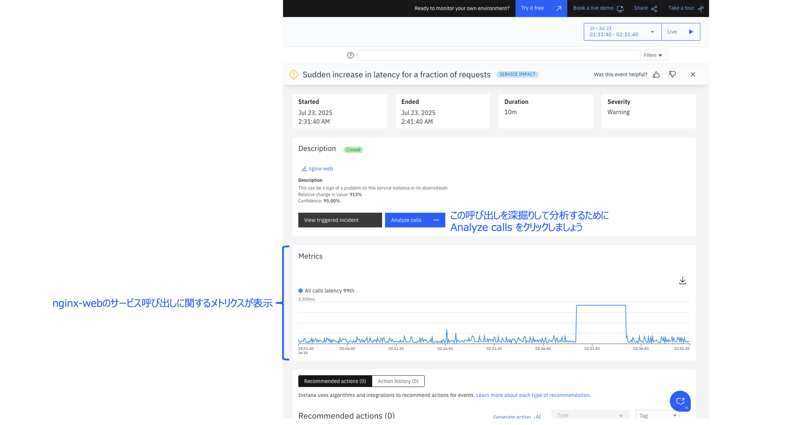

# 組み込みアラートとインシデント

公式ドキュメント：<https://www.ibm.com/docs/ja/instana-observability/current?topic=alerts-managing-built-in-issues-incidents>

アラート（インシデント）が発生すると、左パネルのイベントのアイコンに数字が表示されます。
イベントのページでは、インシデントの一覧と各インシデントの発生場所や時間などが表示されます。
ゴールデン・シグナルに対する機械学習により、トリガーとなったインシデントが表示されます。

また、イベントとは、Instanaの監視対象であるアプリケーションやインフラストラクチャーで発生した問題や事象のことを指します。
 Instanaでは、イベントを以下の3つのタイプに分類して管理しています。
 

 
 さらに、インシデントの詳細を確認することができ、周辺のコンポーネントで発生していたアラートが時系列で整理されて提示されます。

