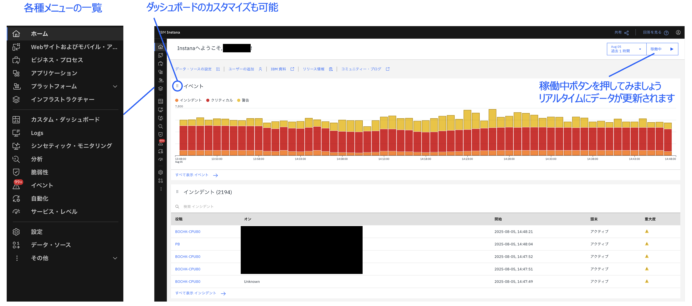

# ホームページとメニュー

公式ドキュメント：<https://www.ibm.com/docs/ja/instana-observability/current?topic=working-user-interface#home-page>

## ホームページ

ログイン後は、事前に定義された組み込みダッシュボードの画面が表示されます。  
画面左側のサイドバーのアイコンにカーソルを合わせると、各種メニューを一覧を表示することができます。  
また、ダッシュボード左上の ⋮⋮ ボタンをクリックすることで、ダッシュボードのカスタマイズも可能です。  
画面右上の稼働中ボタンをクリックすると、リアルタイムにデータが更新されます。  
さらに、タイムレンジを絞り、見たい時間帯を選択することで、例えば新サービスのデプロイ・リリース前後の状態に絞って見ることも可能です。

詳細は公式ドキュメントを参照してください。

オンボーディングレベルでは、まずは以下を押さえましょう。

- インフラストラクチャー
- アプリケーション
- イベント
- 分析
- データ・ソース (Instana Agentの導入で確認済み)
