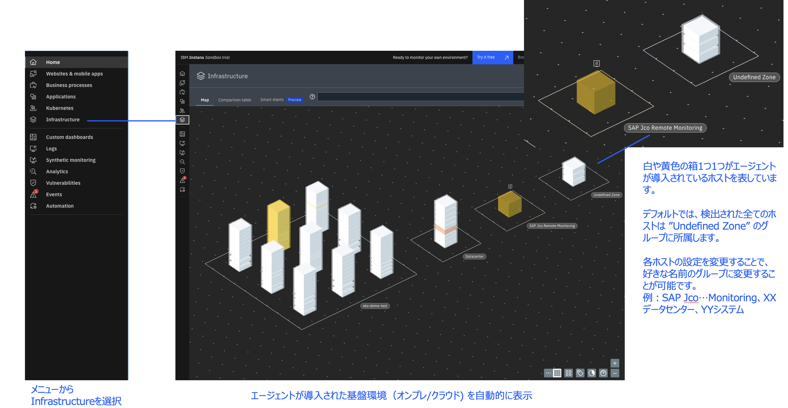
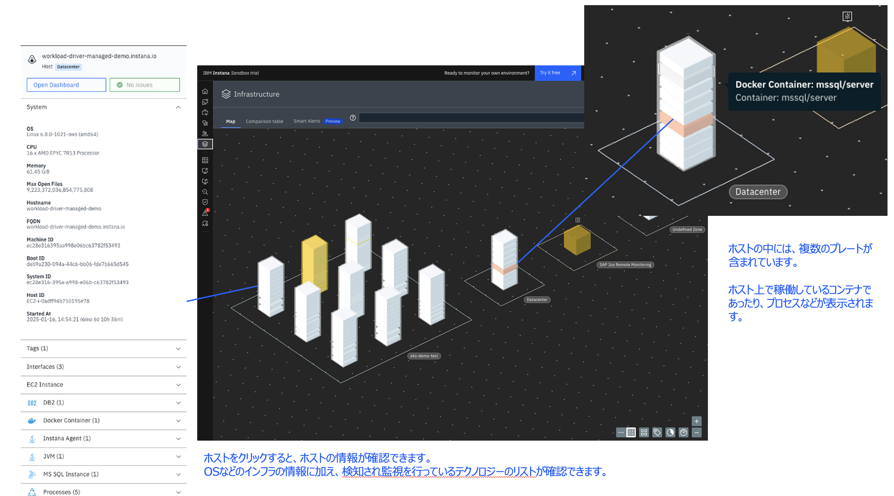
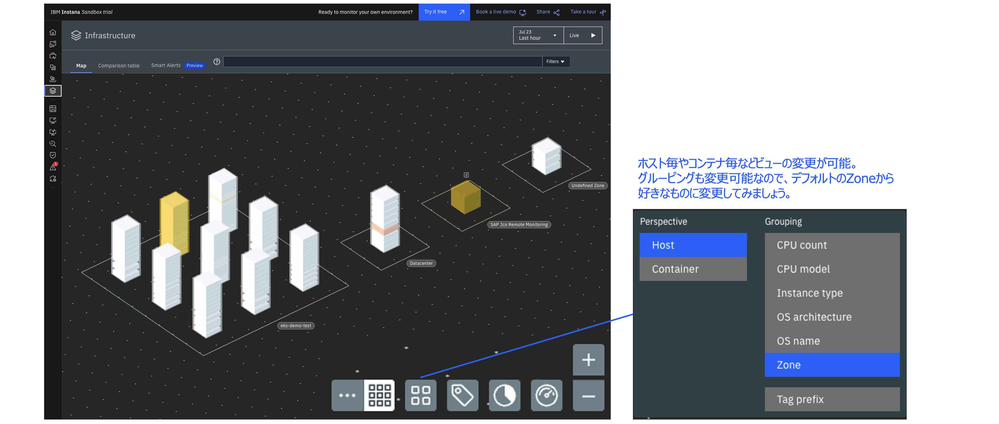
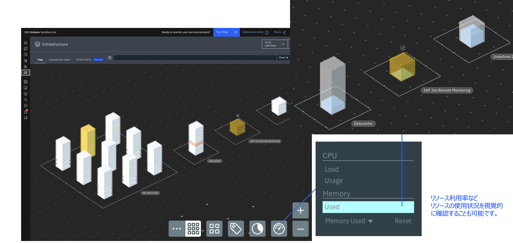
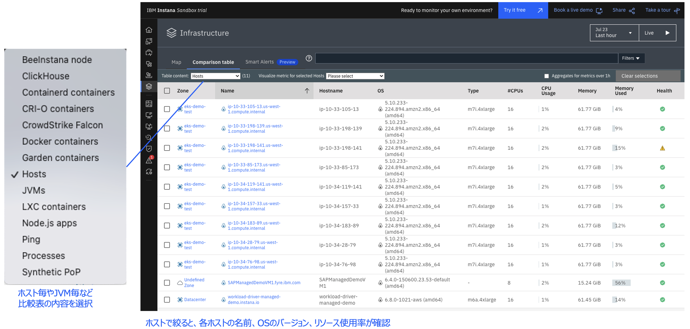
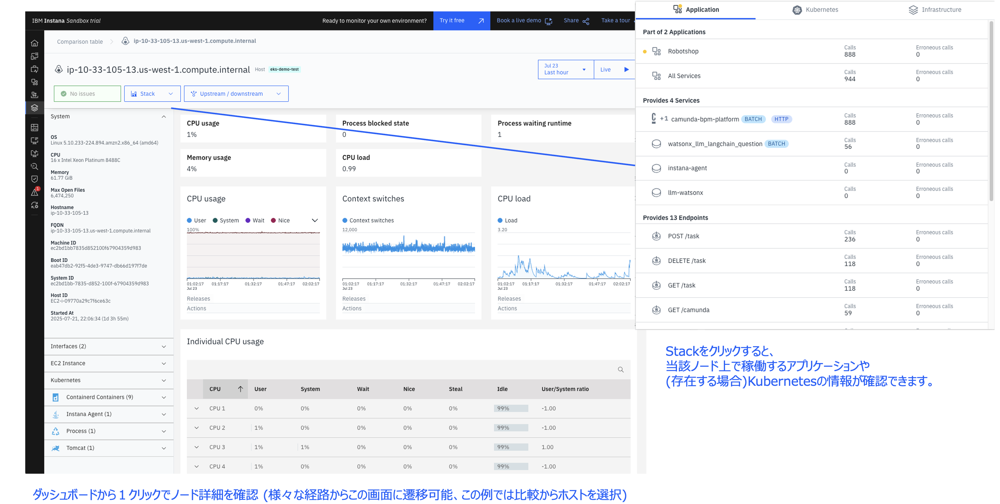

# インフラストラクチャー

公式ドキュメント：<https://www.ibm.com/docs/ja/instana-observability/current?topic=instana-monitoring-infrastructure>

## マップ

詳細は[公式ドキュメント：インフラストラクチャー・マップ](https://www.ibm.com/docs/ja/instana-observability/current?topic=infrastructure-map) を参照してください。

エージェントが導入された基盤環境（オンプレやクラウド）を表示します。  
白や黄色の箱1つ1つがエージェントが導入されているホストを表しています。  
デフォルトでは、検出された全てのホストは ”Undefined Zone” のゾーンに所属しています。

ゾーンはホストの設定を変更することで、好きな名前のグループに変更することが可能です。  
例：`SAP Monitoring`、`XXデータセンター`、`YYシステム`

ホストをクリックすると、ホストの情報が確認できます。  
OSなどのインフラの情報に加え、検知され監視を行っているテクノロジーのリストが確認できます。  
ホストの中には、複数のプレートが含まれています。  
ホスト上で稼働しているコンテナであったり、プロセスなどが表示されます。

 ホスト毎やコンテナ毎などビューの変更が可能です。
 グルーピングも変更可能なので、デフォルトのZoneから好きなものに変更してみましょう。

リソース利用率などリソースの使用状況を視覚的に確認することも可能です。

## 比較表

詳細は[公式ドキュメント：比較表](https://www.ibm.com/docs/ja/instana-observability/current?topic=infrastructure-comparison-table) を参照してください。

ホスト毎やJVM毎など比較表の内容を選択して見ることができます。  
ホスト毎に見ると、各ホストの名前、OSのバージョン、リソース使用率が確認できます。

## ノード詳細

ダッシュボードをクリックすることでノード詳細を確認することができます。  
様々な経路からこの画面に遷移することができます。  
スタックをクリックすると、当該ノード上で稼働するアプリケーションや(存在する場合)Kubernetesの情報が確認できます。

