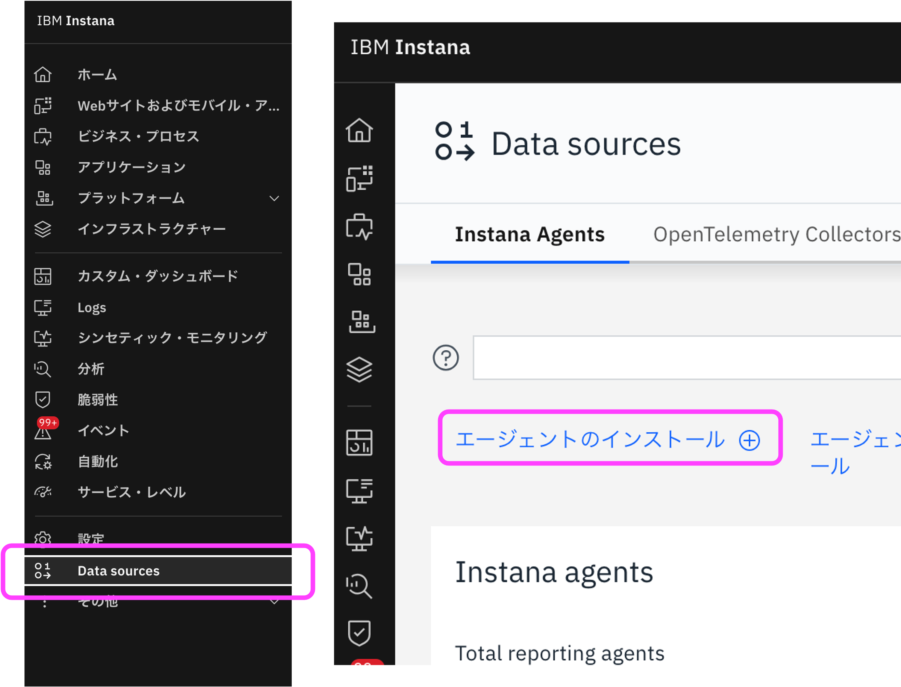
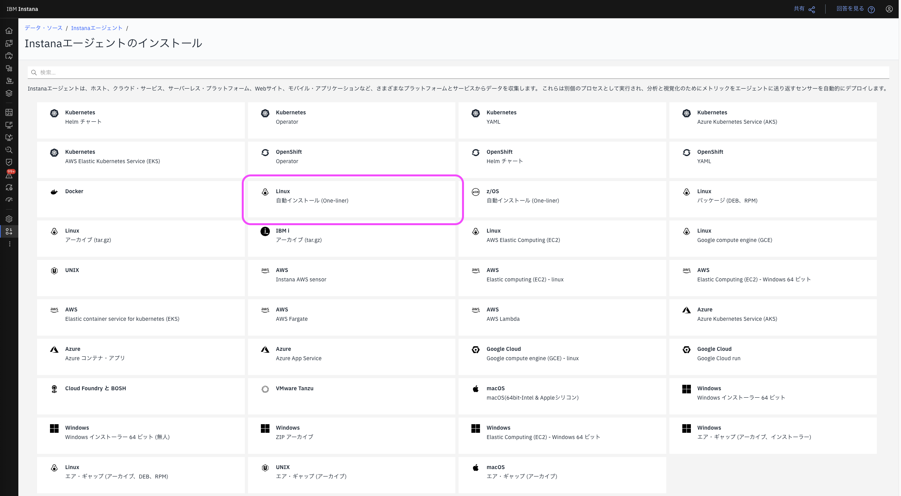
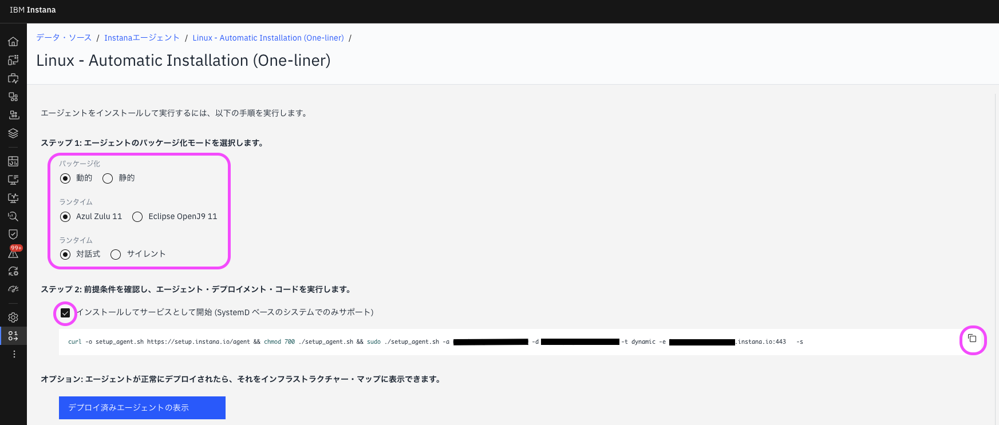
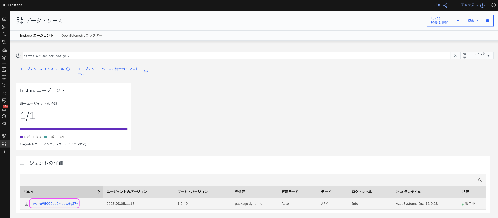
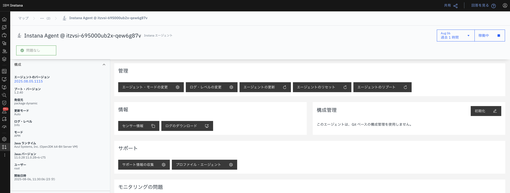
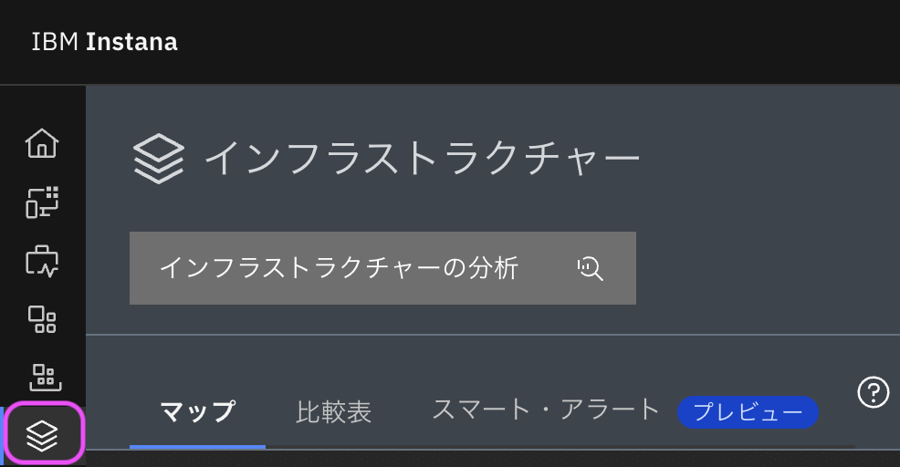
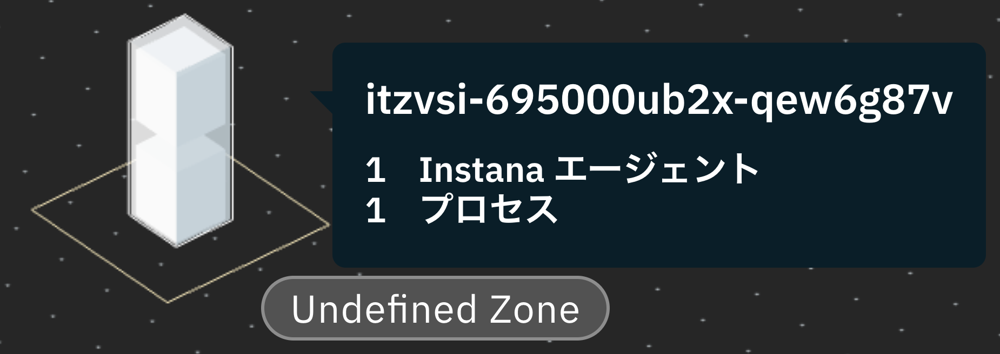
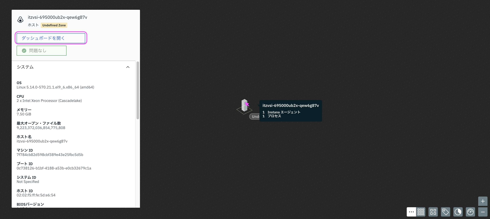
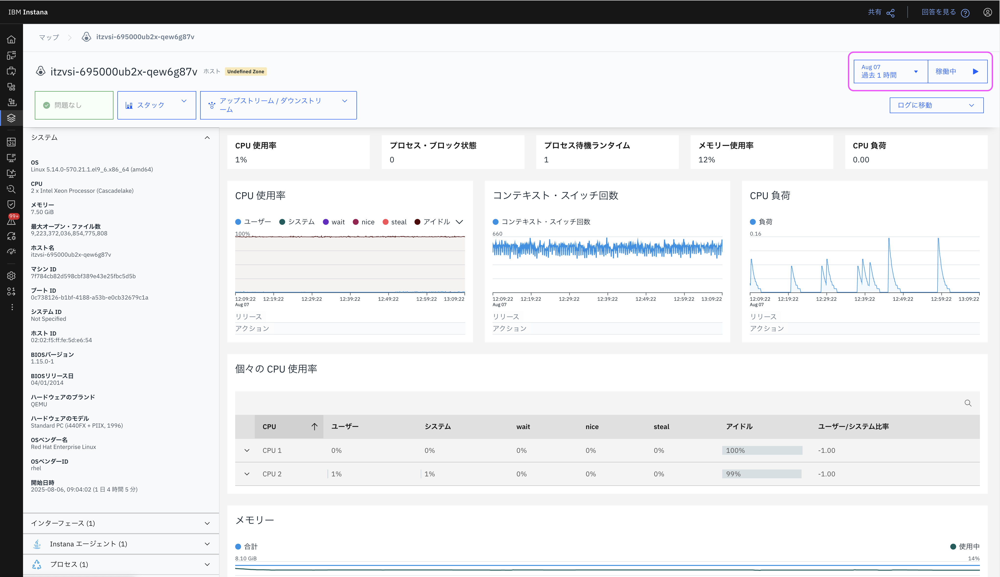

# Linuxワンライナー

公式ドキュメント：<https://www.ibm.com/docs/ja/instana-observability/current?topic=linux-installing-agent>

## はじめに

本ページでは、 Linux に Instana Agent を導入するまでの手順を記述しています。  
Linux 環境への導入は特に簡単で、数分のうちに監視体制を整えることができます。  
ここでは、 ワンライナーによる自動インストール方法について案内します。

> [!NOTE]  
> 本番環境に導入を行う前に、[公式ドキュメント:LinuxへのAgentのインストール](https://www.ibm.com/docs/ja/instana-observability/current?topic=linux-installing-agent)を参照してください。

## 対象環境

本ページ作成時の対象環境は以下です。

- 作成日:2025年8月6日
- Linux バージョン: Red Hat Enterprise Linux 9.6
- Instana バージョン: 1.0.301

## Agentインストール画面へのアクセス



Instana SaaSにログインし、メニュー (一番左のサイドバー) から「Data source」をクリックします。  
画面左上の「Agentのインストール」リンクをクリックします。



Linux 自動インストール (One-liner) を選択します。

## インストールの準備



### ステップ1: Agentのパッケージ化モードを選択

- パッケージ化: 動的と静的から選択します。動的の場合はAgentの基盤以外のモジュールが自動で更新されます。静的の場合はAgentの更新は手動で行う必要があります。
- ランタイム: AgentはJava言語で構築されています。お好みのJVMランタイムを選択してください。推奨はありません。
- 導入方式: 対話式とサイレントから選択します。通常は対話式を選択してください。

### ステップ2: Agentのインストール(デプロイメント)を実行

Agentをサービスとして管理する場合は、(Systemd ベースのシステムでのみサポート) にチェックを入れます。 通常はサービス化した方が管理が容易なため、チェックを入れることを推奨します。

## Agentのインストール

以下のコードをコピーし、Agent導入対象のLinux環境へログインし、コードを実行します。
> [!NOTE] `<replace your ***>` は皆様の環境に合わせて書き換えてください

``` bash
curl -o setup_agent.sh https://setup.instana.io/agent && chmod 700 ./setup_agent.sh && sudo ./setup_agent.sh -a <replace your agent key> -d <replace your download key> -t dynamic -e <replace your saas region api url>:443 -s
```

### インストール進行状況の確認

``` bash
Setting up Instana RPM repository  
Updating YUM metadata  
Installing Instana agent  
Importing GPG key 0x31933E68:  
   Userid    : "stan@instana.com <stan@instana.com>"  
   Fingerprint: 386F 852E 8B64 01EB 34FD 86E8 6AA7 718D 3193 3E68  
   From      : https://packages.instana.io/Instana.gpg  
Instana agent enabled on boot  
Starting instana-agent  
Instana agent service started up
```

実行中は上記のようにインストールの進行状況を確認することができます。  
処理が完了すると Agentサービスが開始されている状態になります。

## インストール済みAgentの確認

Agentの動作確を行います。この時点でAgentはLinux OSのメトリック情報の取得を開始しています。  
Linuxメトリック情報の可視化状況を確認しましょう。

### データ・ソースでの確認

データ・ソースのページで、インストールしたAgentを確認することができます。


また、Agentの詳細からAgentを選択すると、下の画像のようにAgentの詳細情報を表示することができます。



### インフラストラクチャーでの確認



左側のサイドバーから、インフラストラクチャーページを表示してみましょう。



すると、柱が表示されるようになり、InstanaAgentが追加されてていることが分かります。  
柱にカーソルを合わせると、ホスト名などが表示されます。



柱をクリックすると、システム、インターフェース、InstanaAgent、プロセスの情報を見ることができます。  
「✅問題なし」の表示から、無事に稼働していることが分かります。  
「ダッシュボードを開く」をクリックすると、下の画像のように、Agent詳細ページを表示することができます。



この画面は、柱をダブルクリックすることでも表示できます。  
右上の「過去1時間」のところでは、最短で直近1分間から状態を見ることができます。  
また、「稼働中」をクリックすると、リアルタイムの遷移を見ることができます。

以上で、Agentのインストールは完了です。

## 参考情報

[InstanaAgentのインストール(Linuxワンライナー): https://video.ibm.com/embed/recorded/134391694](https://video.ibm.com/embed/recorded/134391694)

この動画では、Linux OSに対してのワンライナーでのAgentインストールの実行を5分の動画で紹介しています。
