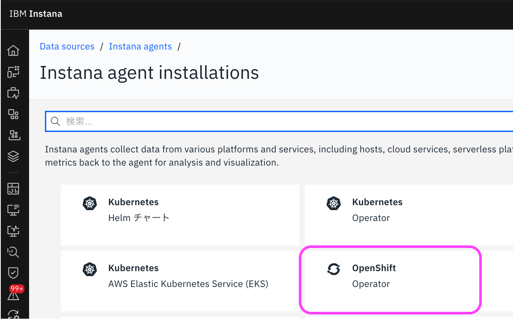
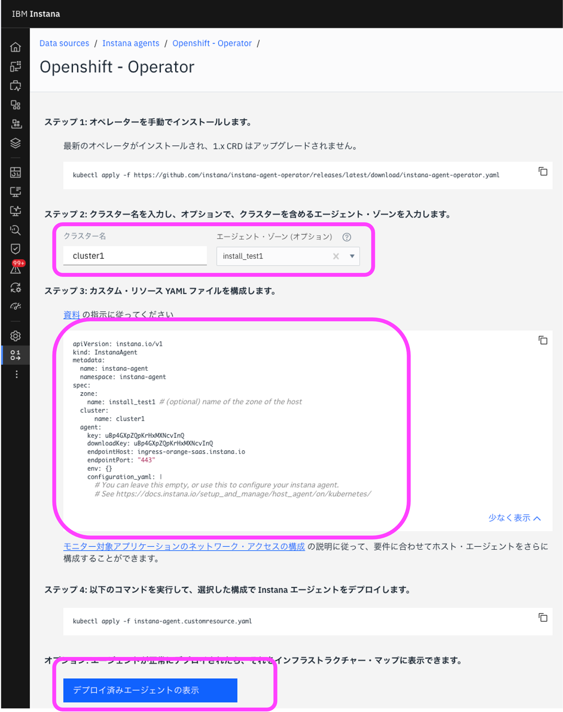
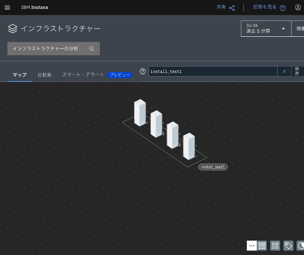

# OpenShift Operator

公式ドキュメント：<https://www.ibm.com/docs/ja/instana-observability/current?topic=agents-installing-red-hat-openshift>

## はじめに

本ページでは、OpenShift に Instana Agent を導入するまでの手順を記述しています。

OpenShift に Instana Agent を導入する方法は複数ありますが、ここでは最も簡単な Operator での導入を案内します。

> [!NOTE]  
> 本番環境に導入を行う前に、[公式ドキュメント:Red Hat OpenShiftへの Instana Agentのインストール](https://www.ibm.com/docs/ja/instana-observability/current?topic=agents-installing-red-hat-openshift)を参照してください。  
> Helmによるインストール方法や、非インターネット接続環境などでのインストールなどをご案内しています。

> [!NOTE]
> OpenShiftやKubernetesクラスタで Node.js, .NET Core, Ruby, Python アプリケーションの監視を行いたい方は、Instana Agent 導入後に Instana Autotrace Webhook をインストールしてください。  
> [公式ドキュメント:Instana AutoTrace Webhook](https://www.ibm.com/docs/ja/instana-observability/current?topic=kubernetes-instana-autotrace-webhook)
>
> なお、Instana AutoTrace Webhookは、すでに稼働しているアプリケーションには有効となりません。すでに稼働しているアプリケーションに対してInstana AutoTrace Webhookを設定するためには、Pod, ReplicaSets, StatefulStes, Deployments, DeploymentConfigsを再起動してください。

## 対象環境

本ページ作成時の対象環境は以下です。

- 作成日: 2025年7月26日
- OpenShift バージョン: 4.16
- Instana バージョン: 1.0.300

## 事前確認

OpenShift CLI(`oc`) が使えることを確認してください。  
また、`oc login` でOpenShiftに管理者権限でログインしておいてください。  
詳細は [Red Hat Documentation - OpenShift Container Platform](https://docs.redhat.com/ja/documentation/openshift_container_platform/latest/html/cli_tools/openshift-cli-oc) を参照ください。

## Instana情報の確認

Instana SaaS にログインし、メニューの「Data Sources」をクリック、「エージェントのインストール」リンクをクリックします。


OpenShift Operator を選択します。



画面に従って、Step1〜Step4を実施します。



### Step1: Operatorを手動でインストール

最新のOperatorをインストールするために、以下のコマンドを実行します。

``` bash
oc apply -f https://github.com/instana/instana-agent-operator/releases/latest/download/instana-agent-operator.yaml
```

以下の形でさまざまなオブジェクトが作成されます。

``` bash
namespace/instana-agent created
customresourcedefinition.apiextensions.k8s.io/agents.instana.io created
customresourcedefinition.apiextensions.k8s.io/agentsremote.instana.io created
serviceaccount/instana-agent-operator created
clusterrole.rbac.authorization.k8s.io/instana-agent-clusterrole created
clusterrole.rbac.authorization.k8s.io/leader-election-role created
clusterrolebinding.rbac.authorization.k8s.io/instana-agent-clusterrolebinding created
clusterrolebinding.rbac.authorization.k8s.io/leader-election-rolebinding created
configmap/manager-config created
deployment.apps/instana-agent-controller-manager created
```

> [!NOTE]
> STEP1の替わりに、OpenShiftのUIからInstana Agentを導入する方法もあります。  
> 詳細はInstana Agent Operator の説明画面をご参照ください。

### Step2: クラスター名を入力

Instana の画面上で、管理対象のクラスター名を入力します。  
例として、`cluster1`を入力します。

続けて、エージェント・ゾーンを入力します。ゾーンはInstanaのインフラストラクチャーマップでクラスタを利用者が判別するために使うもので、データセンター名やシステム名などわかりやすいものを利用してください。  
今回は、`install_test1`を入力します。

### Step3: カスタム・リソース YAML ファイルを構成

Step2で入力したクラスター名がStep3の画面上に表示されています。  
文字列をコピーし、任意のテキストエディタにペーストし、`instana-agent.customresource.yaml`として保存します。

### Step4: カスタム・リソース YAML を apply

Step3で作成した `instana-agent.customresource.yaml` を OpenShiftに適用します。

``` bash
oc apply -f instana-agent.customresource.yaml
```

以下の形でオブジェクトが作成されます。

``` bash
instanaagent.instana.io/instana-agent created
```

## Agentがデプロイされたことを確認

インストール後、以下のコマンドで全てのコマンドが`Running`であることを確認します。

``` bash
oc get pod -n instana-agent
```

10分ほどして、Instana で「インフラストラクチャー」画面を開きます。  
Instana Agentを導入したOpenShiftクラスタがWorkerノード分表現されていたら、導入は成功です。  



> [!TIP]
> エージェントを多く導入している場合は、画面中央上部の検索窓でクラスタ名(今回は`cluster1`)やゾーン名(今回は`install_test1`)を入力することで、対象を容易に絞り込むことが可能です。
