# Windowsインストーラー

公式ドキュメント：<https://www.ibm.com/docs/ja/instana-observability/current?topic=agents-installing-windows>

## はじめに

本ページでは、Windows に Instana Agent を導入するまでの手順を記述しています。

> [!NOTE]  
> 本番環境に導入を行う前に、[公式ドキュメント:Windows への Instana Agentのインストール](https://www.ibm.com/docs/ja/instana-observability/current?topic=agents-installing-windows)を参照してください。

## 対象環境

本ページ作成時の対象環境は以下です。

- 作成日: 2025年8月12日
- Windows バージョン: Windows 10
- Instana バージョン: 1.0.301

## インストール前の準備

Agentをインストールする前に、以下の2点を確認してください。

### [1] .NET Framework 4.5 以上がインストールされていることを確認

#### 1. コマンドプロンプトで、以下のコマンドを実行

``` cmd
reg query "HKLM\SOFTWARE\Microsoft\NET Framework Setup\NDP\v4\Full" /v Release
```

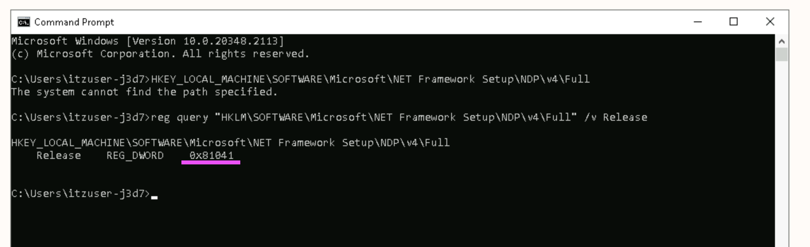

#### 2. 出力された Release の値を10進数に変換し、バージョンを判別

> 例 0x81041 → 528449 → .NET Framework 4.8.1

.NET Framework バージョンと Release 値の対応表は以下の通りです。

| Release値 | バージョン | Release値 | バージョン |
|---|---|---|---|
| 378389 | 4.5   | 460798 | 4.7   |
| 378675 | 4.5.1 | 460805 | 4.7   |
| 378758 | 4.5.1 | 461308 | 4.7.1 |
| 379893 | 4.5.2 | 461310 | 4.7.1 |
| 393295 | 4.6   | 461808 | 4.7.2 |
| 394254 | 4.6.1 | 461814 | 4.7.2 |
| 394271 | 4.6.1 | 528040 | 4.8   |
| 394802 | 4.6.2 | 528049 | 4.8   |
| 394806 | 4.6.2 | 528372 | 4.8   |
| 460798 | 4.7   | 533320 | 4.8.1 |
| 460805 | 4.7   | 533325 | 4.8.1 |

### [2] Windowsインストーラローカル管理者権限のあるユーザーで実行

権限がないと InstanaPCP.exe が起動しない可能性があります。

## Agentインストール画面へのアクセス

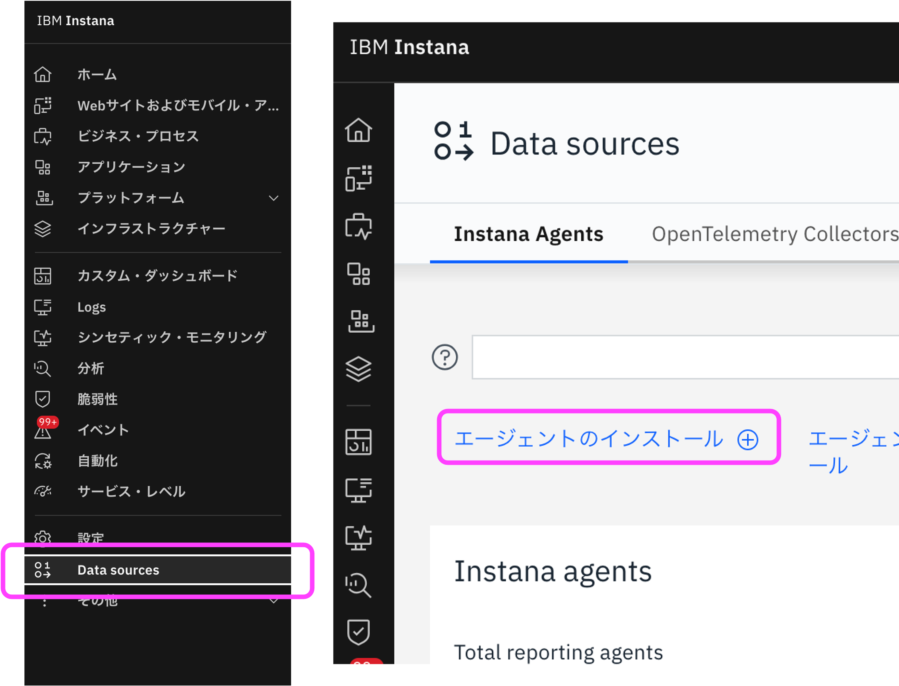

Instana SaaSにログインし、メニュー (一番左のサイドバー) から「Data source」をクリックします。  
画面左上の「Agentのインストール」リンクをクリックします。

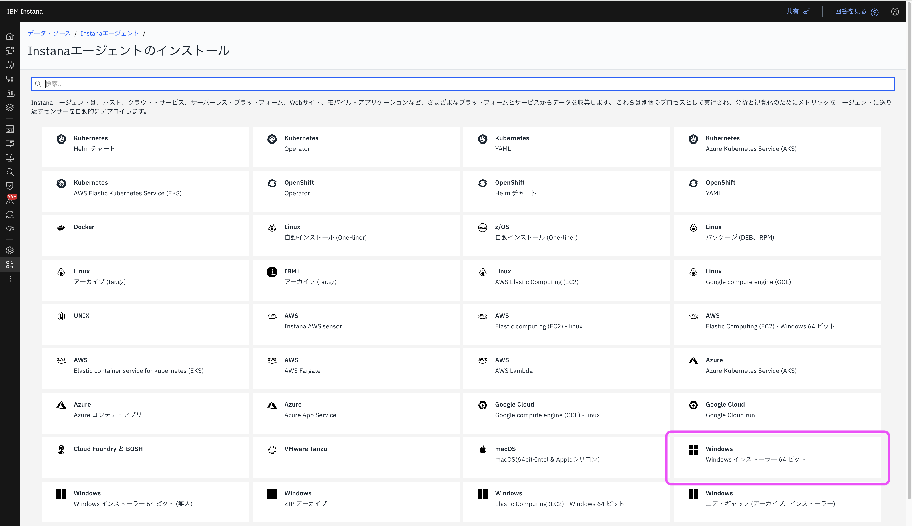

Windows インストーラー64ビット を選択します。  
※ Windows インストーラー64ビット(無人) は、無人インストールを実行するオプション、Windows ZIP アーカイブ は、exeファイルが同梱されたZip形式のオプションです。

## インストールの準備

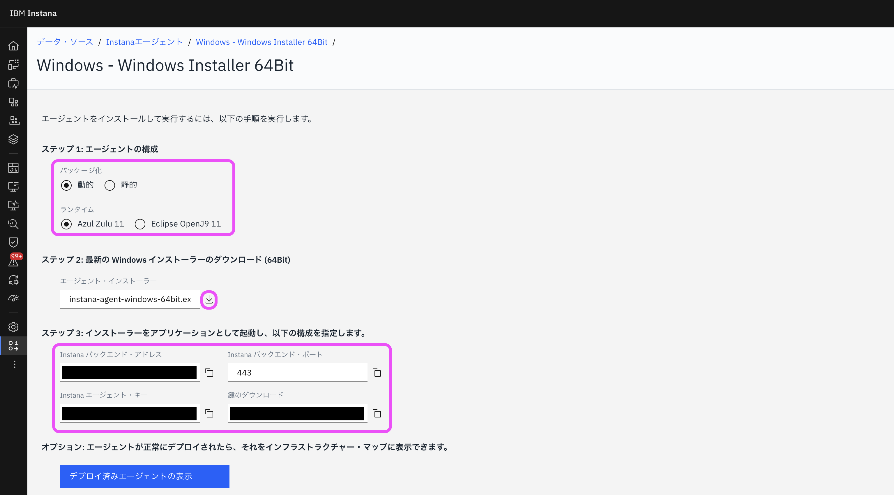

### ステップ1: Agentのパッケージ化モードを選択

- パッケージ化: 動的と静的から選択します。動的の場合はAgentの基盤以外のモジュールが自動で更新されます。静的の場合はAgentの更新は手動で行う必要があります。
- ランタイム: AgentはJava言語で構築されています。お好みのJVMランタイムを選択してください。推奨はありません。

### ステップ2: インストーラーのダウンロード

画面に表示されている「Instana バックエンド・アドレス」、「Instana Agent・キー」、「鍵のダウンロード」の値を控えておいてください。インストール時に必要になります。  
ダウンロードボタンからインストーラをダウンロードします。

## Agentのインストール

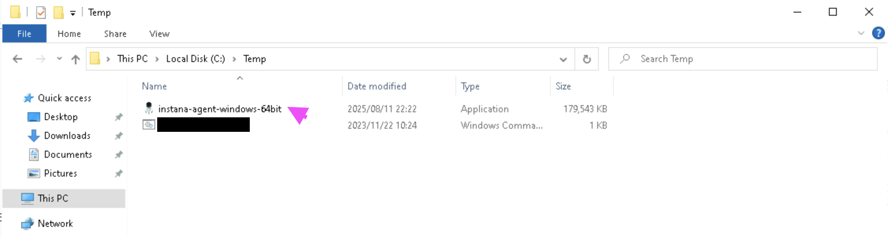

対象となるWindowsにログインし、ダウンロードしたインストーラーを任意のディレクトリ(例：C:\temp)に配置し、実行します。

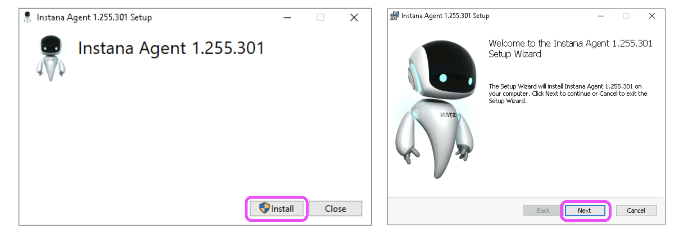

「Install」を選択し、次の画面で「Next」を選択します。

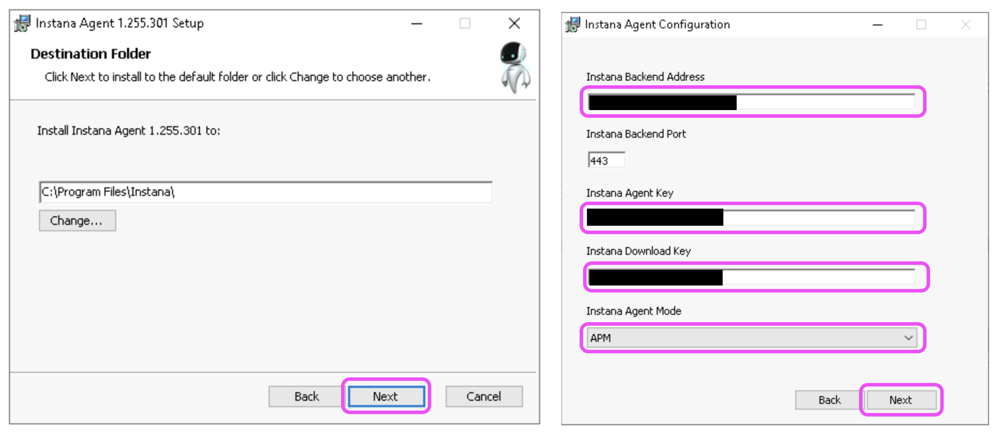

任意のインストールディレクトリを選択し、「Next」を選択します。  
次に、Installerダウンロード時に、Instana Backend画面上に表示されていた値を入力します。  
「Instana Agent Mode」を選択し、「Next」を選択します。

Instana Agent Mode には以下の3種類があります。通常はAPMを選択してください。

- APM：デフォルトのモードです。センサーをアクティブ化し、アプリケーショントレースも取得します。
- Infrastructure：センサーをアクティブ化し、モニタリングも行いますが、アプリケーショントレースは取得しないモードです。
- OFF：バックエンドで稼働していますが、モニタリングは行わないモードです。

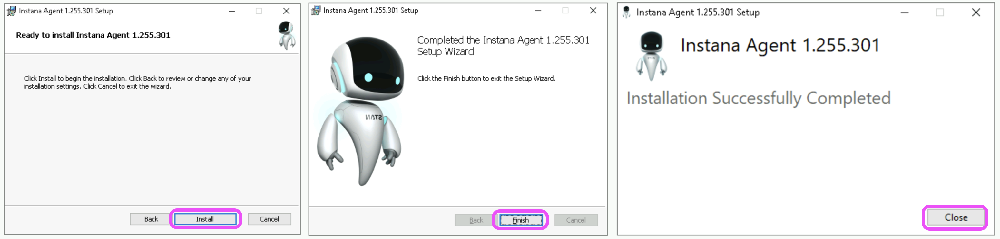

「Install」を選択し、次に「Finish」を選択します。  
これでAgentのインストールは終了です。「Close」を選択して画面を閉じます。

なお、Agentはインストール後に自動で起動しています。

## インストール済みAgentの確認

### AgentとInstanaPCPの起動確認

Agentの起動確認は下記コマンドをコマンドプロンプト上で実行します。

``` cmd
<instana-agent-install-dir>\bin\status.bat
```

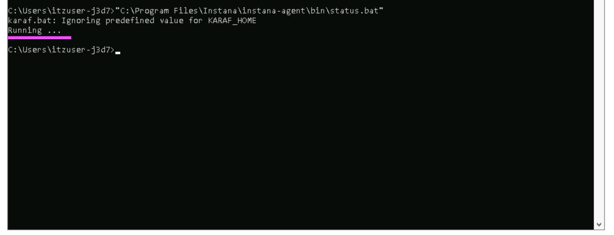

稼働時は「Running」、停止時は「Not Running」が表示されます。

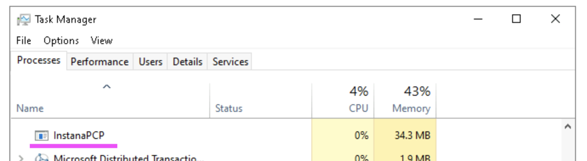

InstanaPCPは「タスクマネージャー」で起動を確認できます。
タスクバーで右クリックを押下し「タスクマネージャー」を選択し、プロセス一覧にInstanaPCPがあることを確認します。

### CPU使用率確認

「タスクマネージャー」でInstanaPCPのCPU使用率を確認します。  
InstanaPCPのCPU使用率が高騰している場合、下記手順を実行しパフォーマンスカウンターを再構築することで正常値に戻します。

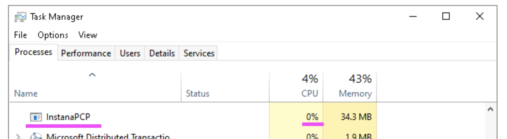

#### Step1：パフォーマンスカウンターを再構築

「コマンドプロンプト」を「管理者として実行」します。  
system32ディレクトリにあるパフォーマンスカウンターを再構築するため、以下のコマンドをコマンドプロンプトに入力し実行します。

``` cmd
%windir%\system32\lodctr /R
```

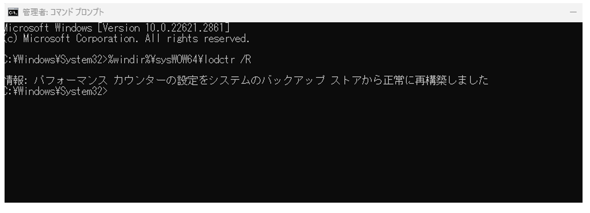

sysWOW64ディレクトリにあるパフォーマンスカウンターを再構築するため、次のコマンドを実行します。

``` cmd
%windir%\sysWOW64\lodctr /R
```

#### Step2：設定ファイルを再ロード

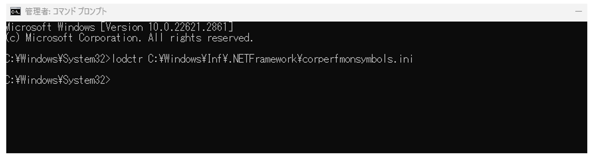

以下のコマンドをコマンドプロンプトに入力し実行します。

``` cmd
lodctr C:\Windows\Inf\.NETFramework\corperfmonsymbols.ini
```

#### Step3: コンピューターを再起動

すべてのコマンドが正常に実行された後、コンピューターを再起動します。

### データ・ソースでのインストール済みAgentの確認

データ・ソースで、InstanaAgentのページからインストールしたAgentを確認することができます。
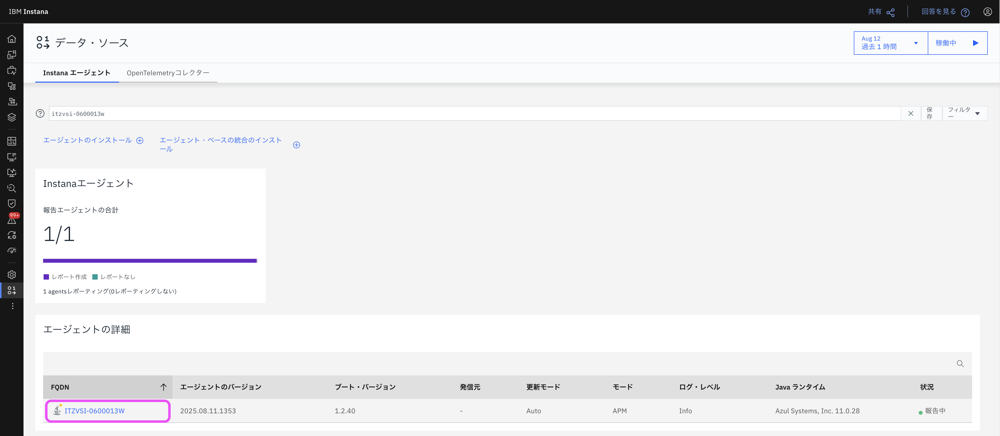

また、Agentの詳細からAgentを選択すると、下の画像のようにAgentの詳細情報を表示することができます。

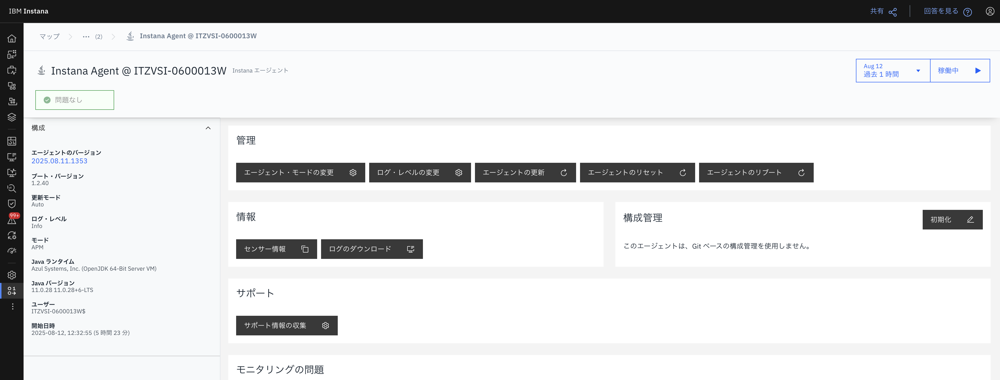

### インフラストラクチャーでのインストール済みAgentの確認

左側のサイドバーから、インフラストラクチャーページを表示してみましょう。

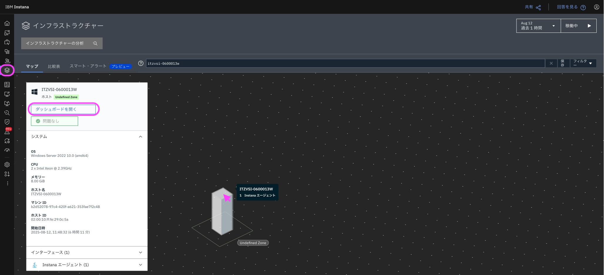

すると、柱が表示されるようになり、InstanaAgentが追加されてていることが分かります。  
柱にカーソルを合わせると、ホスト名などが表示されます。

また、柱をクリックすると、システム、インターフェース、InstanaAgent、プロセスの情報を見ることができます。  
「✅問題なし」の表示から、無事に稼働していることが分かります。  
「ダッシュボードを開く」をクリックすると、下の画像のように、Agent詳細ページを表示することができます。

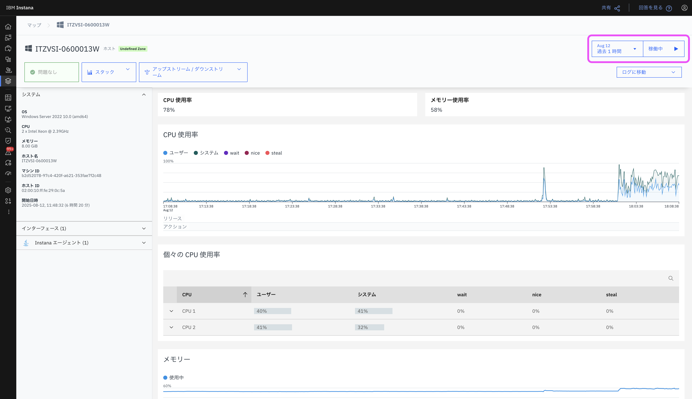

この画面は、柱をダブルクリックすることでも表示できます。  
右上の「過去1時間」のところでは、最短で直近1分間から状態を見ることができます。  
また、「稼働中」をクリックすると、リアルタイムの遷移を見ることができます。

以上でインストールは完了です。
