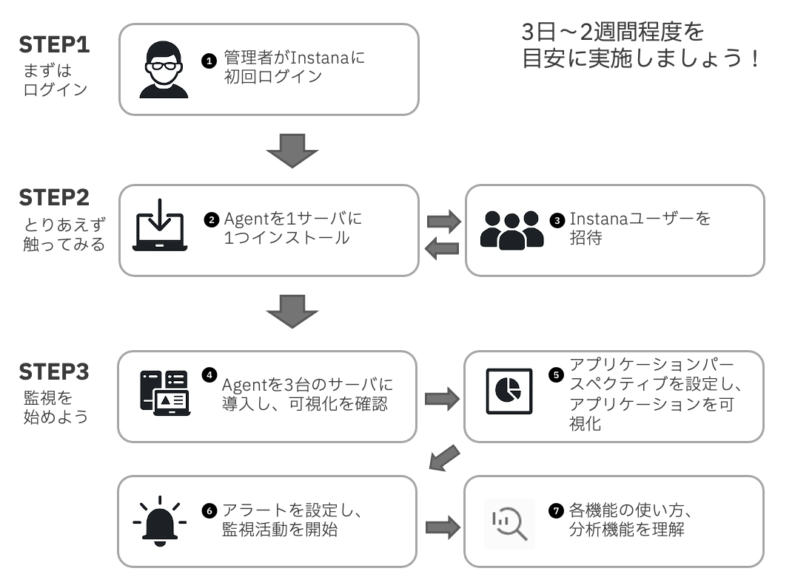

# オンボーディングの流れ（タイムライン）

## はじめに

本書は、Instana を初めて利用する方が、業務で自信を持って活用できるようになるまでのステップをわかりやすくご案内するオンボーディングガイドです。

オンボーディングは、Instana を新たに導入する場合や、新しくチームに加わったメンバーがスムーズに業務へ適応し、最大限のパフォーマンスを発揮できるようにするための重要なプロセスです。

このガイドを通じて、Instana を使いこなすための第一歩を踏み出し、より効果的なモニタリングと運用の実現を目指しましょう。

## 全体像

オンボーディングステップを以下に示します。

Instanaを初めて導入する場合はSTEP1から、新たに監視対象を追加する場合はSTEP2より開始します。

オンボーディングは、以下のステップで構成されています。

## STEP1: まずはログイン

まずはログインしてみましょう。

### 1. 管理者がInstanaに初回ログイン

Instanaの購入後、営業担当より「Instana SaaS プロビジョニング(SaaSの準備)完了」 のお知らせが、Instanaの管理を行う代表管理者の方に届きます。

Instanaの管理を行う方は、[サインインとユーザーの登録](../../account_set_up/user_registration/)に沿ってInstanaへのサインイン(初回ログイン)を行い、アクセス可能であることを確認して下さい。

## STEP2: とりあえず触ってみる

Instanaがどういうものか、体に少しづつ馴染ませていきましょう。

### 2. Agentを1サーバーにインストール

早速監視対象にAgentを導入し、可視化してみましょう。  
試験的に監視対象(サーバーやKubernetesクラスタ)を1つ用意し、Agentを導入してみましょう。以下のリンクを参考に、対象環境に応じた方法でインストールを行なってください。

- [Linux](../../instana_agent_installation/linux_one_liner/)
- [Windows](../../instana_agent_installation/windows_agent/)
- [OpenShift](../../instana_agent_installation/openshift_operator/)

Agentのインストール後、Instanaの[インフラストラクチャー](../../guide_of_main_features/infrastructure/)で監視対象が可視化されていることを確認します。

余裕があれば、[ホームページとメニュー](../../guide_of_main_features/homepage/)を参照してInstanaの使い方を理解してください。

### 3. Instanaユーザーを招待

管理者はInstanaの利用者を招待します。  
 [サインインとユーザーの登録](../../account_set_up/user_registration/)を参考に、ユーザーの追加と設定を行なってください。  

また、セキュリティを強化するため [MFAの設定](../../account_set_up/setting_of_MFA/)の設定も検討してください。  
徐々に[ユーザーロールとグループ](../../account_set_up/user_roles_and_groups/) についても検討することができます。  
このガイドでは省略しますが、IdPを使った認証も可能です。詳細は[Instana公式ドキュメント](https://www.ibm.com/docs/ja/instana-observability/current?topic=instana-configuring-authentication)を参照ください。

> [!NOTE]
> 招待人数に制限などはございませんが、オンボーディングの目安として5人以上の追加を推奨しています。

## STEP3

一部のアプリケーションを対象に、本格的に可視化と監視を開始してみましょう。

### 4. Agentを3台のサーバーに導入し可視化を確認

導入作業の影響が小さい、開発環境や検証環境にあるサーバーやクラスタを3台程度用意します。  
Webサーバー、アプリケーションサーバー、DBサーバーなどの構成がInstanaの効果を最も実感しやすいです。  
まずはそれぞれにAgentをインストールします。基本的にInstana Agentはインストール後に自動的に監視を行いますが、nginxなどの一部のアプリケーションサーバーやDb2などのデータベースはInstana Agentに設定が必要です。  
[Instana公式ドキュメント](https://www.ibm.com/docs/ja/instana-observability/current)を参照しつつ設定を行なってください。  
設定後は、以下のダッシュボードで監視対象が表示されているかどうかを確認します。

- [インフラストラクチャー](../../guide_of_main_features/infrastructure/)に対象サーバーが表示されていること
- [アプリケーション](../../guide_of_main_features/application/)のサービスに監視対象のプロセスがリストアップされていること

### 5. アプリケーションパースペクティブを設定し、アプリケーションを可視化

サービスをグルーピングし、システムごとに状態を確認できるようにします。

詳細は [アプリケーション](../../guide_of_main_features/application/)を参照してください。

### 6. アラートを設定し、監視活動を開始

設定したアプリケーションパースペクティブに対して、アラートを設定します。  
[組み込みアラートとインシデント](../../guide_of_main_features/builtin_alerts_and_incidents/) を参考に、カスタムアラートを作成してください。

### 7. 各機能の使い方、分析機能の理解

Instanaは多くの機能を有しています。まずは基本機能を理解し、アプリケーションリクエストの分析を行う方法を理解してください。

- [ホームページとメニュー](../../guide_of_main_features/homepage/)
- [分析](../../guide_of_main_features/analysis/)

## 最後に

以上でInstanaの基本機能について理解していただくことができました。

Instanaは他にも Webサイトモニタリング、シンセティックモニタリング(外形監視・・合成監視)、SLO、ログ監視、スマートアラートなど様々な機能があります。  
詳細は[Instana公式ドキュメント](https://www.ibm.com/docs/ja/instana-observability/current)をご覧いただく、ユーザー会やセミナーなどを通じて情報を得ていただければと存じます。
