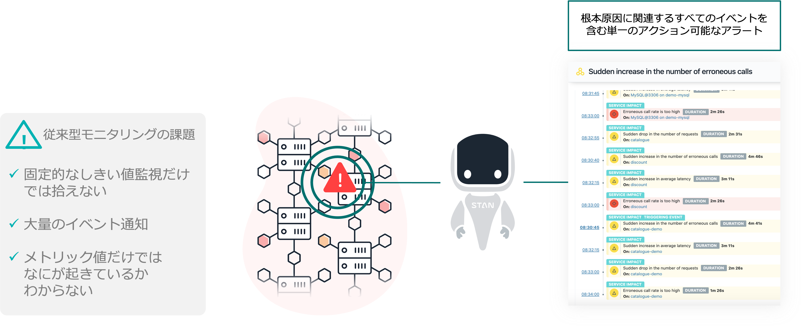

# Instanaとは

公式ドキュメント：<https://www.ibm.com/docs/ja/instana-observability/current?topic=overview>

## APMとObservability とは

IBM Instana Observability（Instana）は、APMというITシステムの監視製品として位置付けられ、かつ製品名に **Observability（可観測性）** という言葉を含めています。  
これはInstanaが単なる監視ツール、あるいはAPMにとどまらず、より高度なシステム理解と運用改善を目指す**Observabilityプラットフォーム** としての姿勢を示しています。  
Instanaを利用するにあたり、まずはAPMとは何か？Observabilityが目指すものは何か？について理解しましょう。

### APM とは

APM（Application Performance Management / アプリケーション・パフォーマンス・管理）とは、アプリケーションの動作状況をリアルタイムで監視・分析し、パフォーマンスの問題や障害を迅速に検出・解決するためのシステム監視技術やツールです。

従来よりシステム監視はさまざまなツールを通じて行われてきましたが、APMはそれとは何が異なるのでしょうか？  
まずは、従来のシステム監視と APM の違いを理解しましょう。

#### 従来のシステム監視

従来のシステム監視は、以下に示す**基盤的な監視**が中心です。

- CPU使用率、メモリー使用率、ディスク使用率
- アプリケーションサーバーやデータベースのメトリック(リソースの使用状況を示す数値)
- プロセス(アプリケーション)の生死監視

これらの監視において、以下のアプリケーション応答性能やエラー状況は、**ログからの解析調査が必要**であり、**リアルタイムには分からない**、という問題を抱えていました。

- 各コンポーネント(APやDB)のどこで遅くなっているか
- いま どのくらいの処理が捌けているか、どのくらいの応答性能で返せているか
- いまの処理が通常時に比べて遅いのか 早いのか、いつもより処理数が多いのか
- どこのコンポーネントがエラーを返しているのか

#### APM (Application Performance Monitoring/Management)によるシステム監視

APMでは、技術の進歩により、アプリケーションが実際に投げている要求をキャプチャし、リアルタイムで解析することができるようになりました。

APMはすべての要求を捕捉し、自動的にバックエンドのサーバーで解析し、各要求の応答性能、処理数、エラー数などを自動的に、リアルタイムで可視化します。

- どのコンポーネント、どの業務に処理数が来ているか、応答性能はどうか
- どの HTTP要求でエラーが出ているのか、どの SQLが遅いのか
- 問題が発生している場合、どこのコンポーネントで エラーが返されているのか

### Observability(可観測性) とは

#### Observabilityが目指すものは何か?

さまざまに議論があるところですが…

従来の監視は基盤的観点をもとにした監視で、アプリケーションの状況は「調べればわかる」という状況と言えます。  
それに対しAPMはアプリケーションの状況をリアルタイムに把握することを可能としました。  
Observability(可観測性)は、APMにさらに以下のエッセンスを加えることで、「**今起きていることを、データに基づいて説明できる**」状態を作り出すことができます。

- 複雑化したシステムを「積極的に」理解し 問題状況の把握を行うプラクティス
- システムの複数の層にわたるデータ収集と リアルタイムでの分析
- サービス改善 への取組み

#### Observability(可観測性)とは?どのように実現するか?

[CNCF (Cloud Native Computing Foundation)  TAG (Technical Advisory Group)  Observability  whitepaper](https://github.com/cncf/tag-observability/blob/main/whitepaper.md) では、以下の通り記述されています。

> observability is a measure of how well internal states of a system can be inferred from knowledge of its external outputs.  
> →可観測性とは 外部出力の情報から システムの内部状態 を どれだけうまく推測できるかを示す尺度である。

WhitePaperでは外部出力の情報を「シグナル」として表現し、そのシグナルのうち特に以下の3つを **可観測性の主要なシグナル** として捉えています。

- **メトリック**  
ある一定期間の状態を 集計可能な数値で表現したもの
- **トレース（分散トレーシング）**  
１つのトランザクション（要求）のインスタンスが、ライフサイクルに渡り、複数コンポーネントでどのように処理されたか
- **ログ**  
個別の事象を表す、構造化された、人間が読める詳細な情報

Whitepaper では さらに ２つを有益なシグナルとして紹介しています。

- プロファイル  
システム内のリソース配分の把握 CPUプロファイル、ヒープ・プロファイルなど  
サンプリング・プロファイラーの普及により、本番での取得も現実的に
- ダンプ  
クラッシュしたプロセスのトラブル・シューティングに有益

## Instanaとは

IBM Instana Observability（Instana）は、マイクロサービスやコンテナ化されたアプリケーションはもちろん、従来型のアプリケーションにも対応したObservabilityプラットフォームです。 
Instanaは、アプリケーションパフォーマンスの自動監視、エンドユーザー体験のモニタリング、根本原因分析、異常検知などを提供します。  
これにより、アプリケーションやサービスの健全性とパフォーマンスを完全に可視化できます。

### Instanaの仕組み

Instanaは、アプリケーションやサービスを自動的に可視化し、観測された情報にコンテキストを与え、その情報に基づいてインテリジェントなアクションを取れるようにします。

#### 1. 監視構成の自動化

**動的環境に自動的に対応、環境の完全な観測性を得ることができます**

Instanaは、200以上のテクノロジーに対応し、アプリケーション、サービス、インフラ、Webブラウザ、モバイルアプリなどを自動的に発見・監視します。  
さらに、分散トレーシングと1秒単位のメトリクスを通じてリアルタイムにデータを可視化します。

#### 2. コンテキストの提供

**サービスの依存関係をリアルタイムで提示します**

Instanaは、フルスタックにわたる依存関係のマッピングを自動化し、柔軟なアプリケーション視点と強力で使いやすいデータ分析機能を提供します。  
パフォーマンスデータにコンテキストを与えることで、迅速な問題予防と修復を実現します。  
アプリケーションリクエストのトレースデータ全体から、柔軟に新たな洞察を得ることが可能です。

#### 3. インテリジェントな解析

**問題の要因を理解して、迅速に問題を解決に導きます**

Instanaは、アプリケーションのパフォーマンスや安定性の問題が顧客に影響を与えた際、数秒以内に通知します。  
また、イベントの相関、パフォーマンスのしきい値、エラー、変更、SLA（サービスレベル契約）違反の分析を通じて、根本原因分析を自動化します。

### Instanaが提供する価値

Instana は、利用者に4つの価値を提供します。

1. リアルタイムのオブザーバビリティ：見つける（Find）

    - 1秒単位の高精度なリアルタイムメトリクスを提供
    - モバイルアプリ、Webサイト、アプリケーションの各視点から監視
    - モバイルアプリ、Webサイト、アプリケーションのすべてのトランザクションをエンドツーエンドでトレース
    - アプリケーションインフラ全体にわたる完全なコンテキストを提供
    - すべてのクラウド環境における本番アプリケーションをマッピング・監視・トレース
    - 物理、仮想、サーバーレスのすべてのサービスと機能をサポート

2. 迅速な問題予防と修復：修正する（Fix）

    - しきい値に基づくアラートを提供する自動スマートアラート（テンプレート付き）
    - 数クリックで根本原因にたどり着ける自動フルスタックコードプロファイリング
    - 完全に相関されたサンプリングなしのトランザクショントレースにより、アプリケーションやインフラの問題を即座に特定
    - すべてのメトリクスとトレースに対する自動・無制限の分析機能

3. オープンスタンダードとOpenTelemetry：拡張する（Expand）

    - Prometheus、Jaeger、Grafana、cAdvisor、Fluent、TelepresenceなどのOSSとの統合サポート
    - Open Collectorと高性能なInstana Agentのナレッジグラフ相関を活用したオープンソーステレメトリのサポート
    - OpenTelemetryのすべてのメトリクスとトレースに対する自動・無制限の分析
    - 新しいオープンスタンダードやOSS技術との継続的な統合

4. 自動化とインテリジェンス：最適化する（Optimize）

    - AI駆動のインテリジェントアクションにより、トラブルシューティングを防止または最小化し、パフォーマンスを最適化
    - すべてのアプリケーションとサービスに対する設定、監視、トレース、プロファイリングを自動化
    - JavaScriptを含むブラウザやモバイルアプリのエラーを自動的に検出・分離
    - IBM Watson AIOpsやTurbonomic ARMとの統合により、完全自動・半自動・手動のリアルタイム修復手順を実現

### 参考：「ゴールデンシグナル」ベースのダッシュボード

Instana はシステムの「健全性」を把握する ４つの主要シグナルをベースとしたダッシュボードを提供します。  
ダッシュボードはアプリケーションからサービス、エンドポイントへとシステムを掘り下げて理解することもできます。  
この指標により、Instanaはアプリケーションに関する様々な情報を提供することができます。加えて、発生シナリオが「未特定」の異常をとらまえることもできるようになります。

詳細は[基本機能の紹介/アプリケーションパースペクティブ](../../guide_of_main_features/application/)を参照ください。

### 参考：Instana 活用による問題解決の加速

最後に、Instanaを活用することで、問題解決を加速できるようになるユースケースをご案内します。  
性能の悪化検知と通知を短縮し、業務(開発)チームだけで調査を行い問題を判別することができるようになります。  
もしくは、業務チームと基盤チームが同じInstana情報を共有することで、コミュニケーションを円滑にし、調査を加速することができます。  
これにより、問題解決を加速することができるのです。

