# IBM Cloudへログイン

## 1. IBM ID（IBM Cloud アカウント）の作成

1. [IBM Cloud アカウント作成ページ](https://cloud.ibm.com/registration)にアクセスし、メールアドレスを入力します。

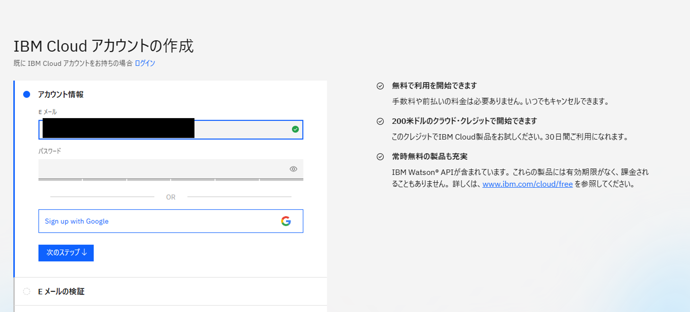

2. 既存の IBM ID がある場合はそのままログインできます。未登録の場合はパスワード設定を含むアカウント作成手順へ進みます。

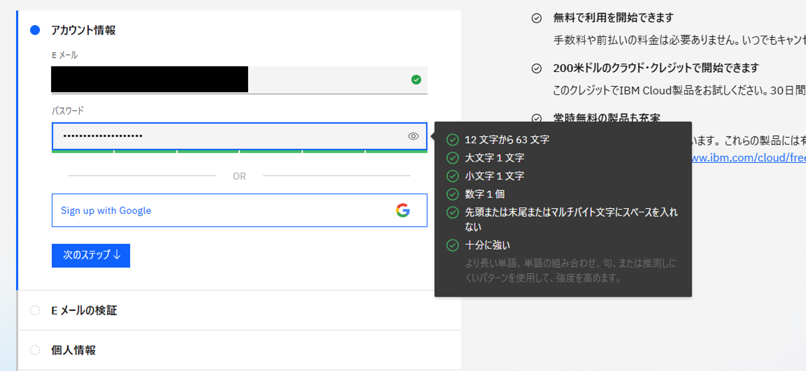

3. 確認メールが送信されます。確認コードの有効期限は 30 分です。

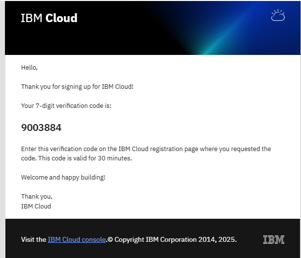

## 2. IBM Cloud ポータルの基本操作（ログイン後）

- ナビゲーションメニュー：「≡」アイコンからサービスやリソース一覧にアクセス可能

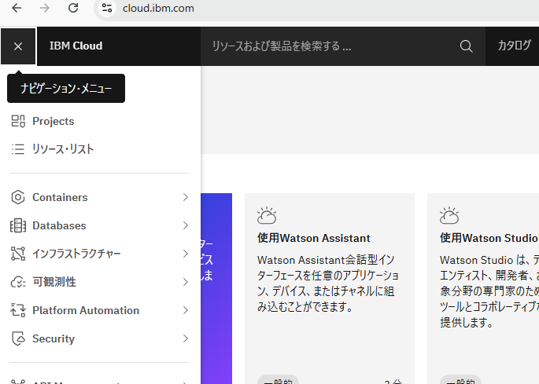

- リソース検索機能：検索ボックスから横断的に検索できる

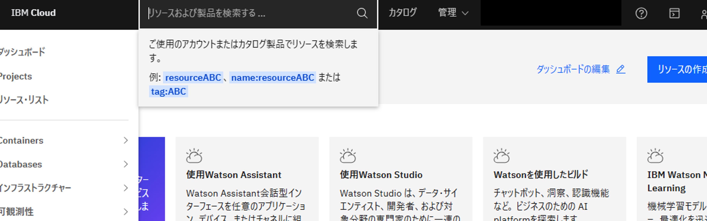

- カタログ：サービスの一覧をタイル形式で表示、検索や注文が可能

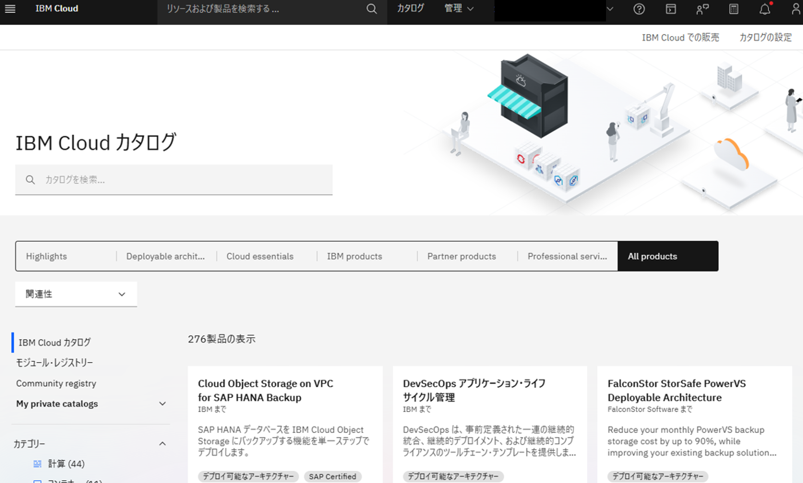

- 管理メニュー

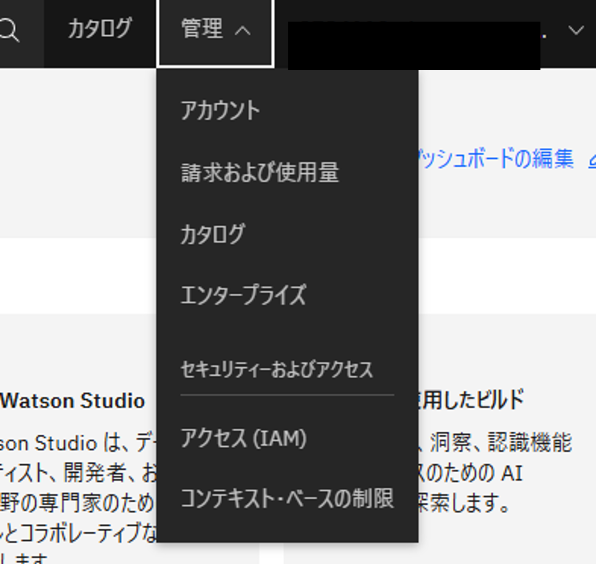

- アカウント設定の確認・変更

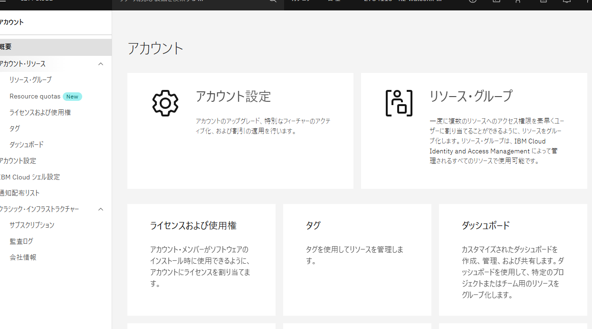

- 「請求および使用量」で課金・サブスクリプション状況を確認

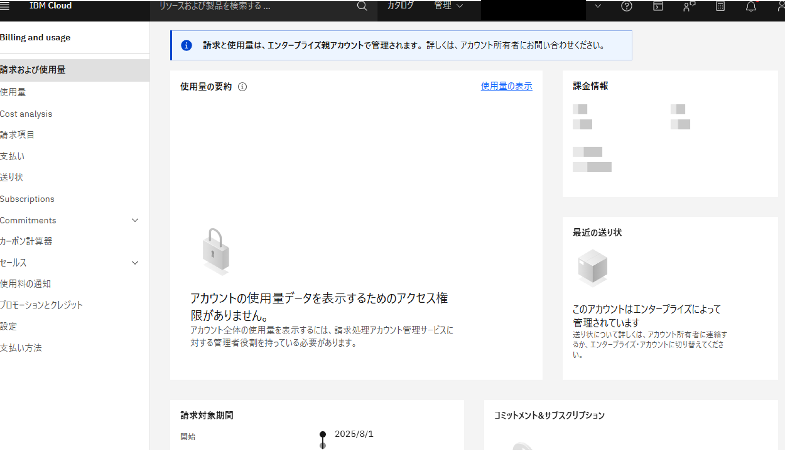

- IAM 管理（ユーザー、グループ、MFA、権限）

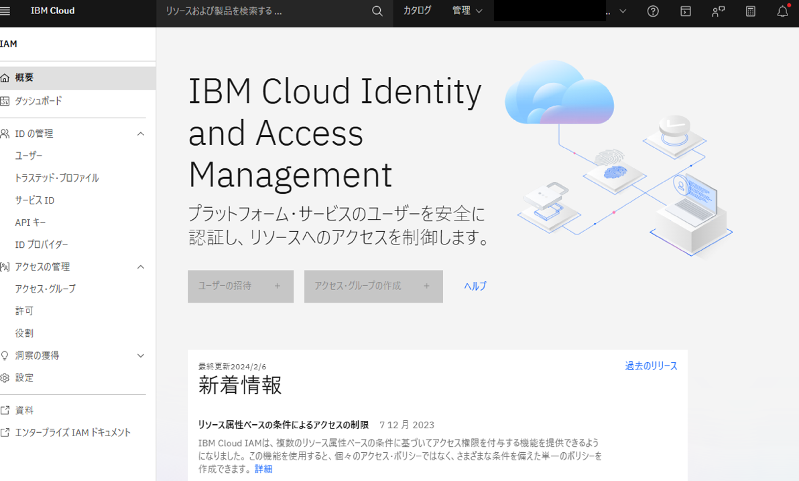

- コンテキストベースの制限でアクセス制御ルールを設定

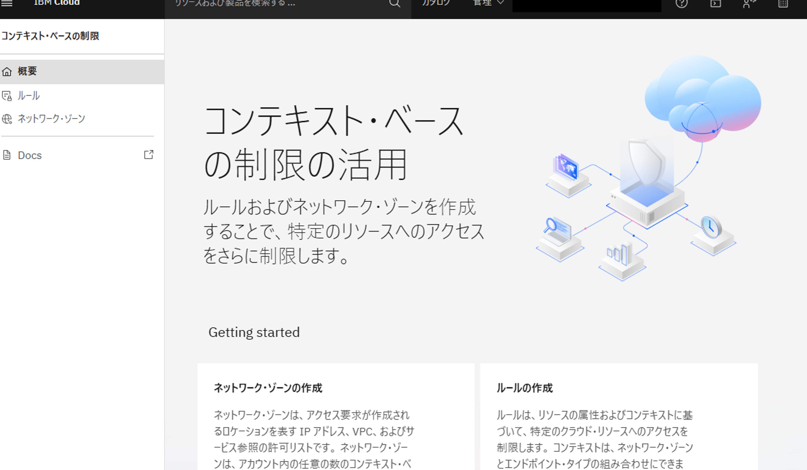

- アカウント切り替え：複数アカウントを持つ場合は簡単に切替可能

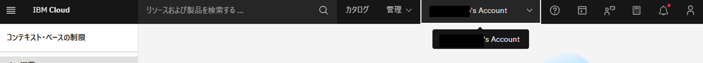

- ヘルプと通知

    - (?) アイコンから AI アシスタント、ドキュメント、サポートセンターへアクセス

    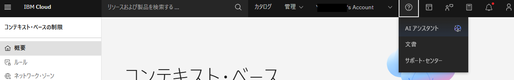

    - ベルアイコンで通知を確認（未読は赤ドット表示）
    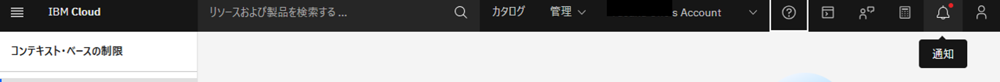