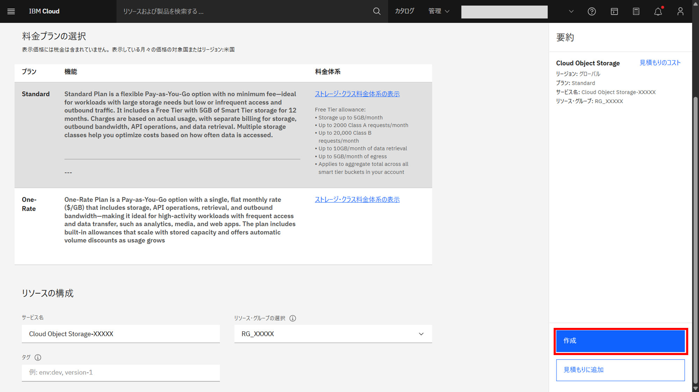

# インスタンス作成

## watsonx.ai Studio

1. 画面上の検索ボタンをクリックする

2. 表示された入力欄に **watsonx.ai Studio** と入力し、数秒後に表示される **カタログ結果** 欄の **watsonx.ai Studio** をクリックする

3. 作成するインスタンスの条件を指定する
   
   1. **ロケーションの選択** セクションで、使用するリージョンを選択する
      
      1. ダラスの場合  
      **ダラス (us-south)** を選択する
      
 
      1. 東京の場合  
      **東京 (jp-tok)** を選択する
      
    
    1. **料金プランの選択** セクションで、 **Professional** を選択する
    
    
    1. **リソースの構成** セクションで、サービス名に **watsonx.ai Studio-XXXXX** を入力(XXXXXは任意の文字列)、リソース・グループの選択で前で作成した **RG_XXXXX** を選択する。タグは空欄でOK
    

4. 画面右の要約欄で **以下のご使用条件を読み、同意します｡** にチェックを入れ、**作成** ボタンをクリックする

5. 作成した **watsonx.ai Studio** の詳細画面に自動的に遷移したら完了

## watsonx.ai Runtime (Watson Machine Learning)

1. 画面上の検索ボタンをクリックする

1. 表示された入力欄に **watsonx.ai Runtime** と入力し、数秒後に表示される **カタログ結果** 欄の **watsonx.ai Runtime** をクリックする

1. 作成するインスタンスの条件を指定する

    1. **ロケーションの選択** セクションで、使用するリージョンを選択する

        1. ダラスの場合   
        **ダラス (us-south)** を選択する
        

        1. 東京の場合   
        **東京 (jp-tok)** を選択する
        

    1. **料金プランの選択** セクションで、使用するプランを選択する

        1. Essentials の場合   
        **Essentials** を選択する
        

        1. Standard の場合   
        **Standard** を選択する
        

    1. **リソースの構成** セクションで、サービス名に **Watson Machine Learning-XXXXX** を入力(XXXXXは任意の文字列)、リソース・グループの選択で前で作成した **RG_XXXXX** を選択する。タグは空欄でOK
    

1. 画面右の要約欄で **以下のご使用条件を読み、同意します｡** にチェックを入れ、**作成** ボタンをクリックする

1. 作成した **watsonx.ai Runtime** の詳細画面に自動的に遷移したら完了

## Cloud Object Storage

1. 画面上の検索ボタンをクリックする

1. 表示された入力欄に **Object Storage** と入力し、数秒後に表示される **カタログ結果** 欄の **Object Storage** をクリックする

1. 作成するインスタンスの条件を指定する

    1. **料金プランの選択** セクションで、使用するプランを選択する

        1. Standard の場合   
        **Standard** を選択する
        

    1. **リソースの構成** セクションで、サービス名に **Cloud Object Storage-XXXXX** を入力(XXXXXは任意の文字列)、リソース・グループの選択で前で作成した **RG_XXXXX** を選択する。タグは空欄でOK
    

1. **作成** ボタンをクリックする

1. 作成した **Cloud Object Storage** の詳細画面に自動的に遷移したら完了

