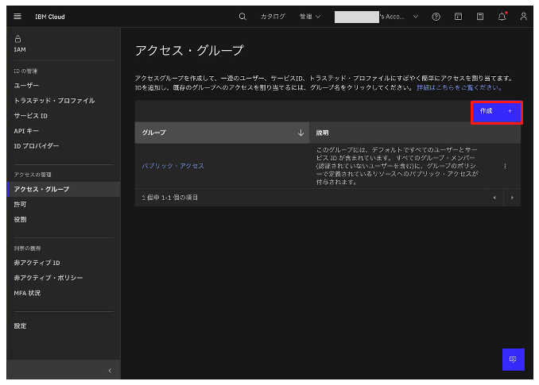
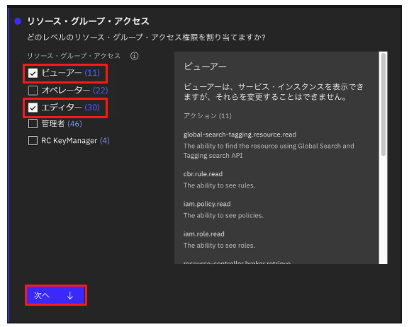
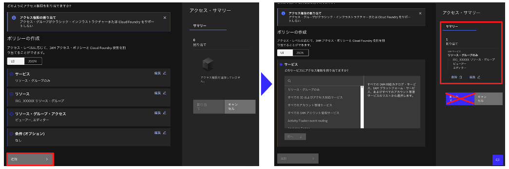

# アクセス・グループの作成

## アクセス・グループの作成

1. 画面右上「管理」→「アクセス(IAM)」をクリックする

1. 画面左側のメニューから **アクセス・グループ** をクリックする

1. **作成** ボタンをクリックする
 

1. 名前に **AG_XXXXX** と入力(XXXXXは任意の文字列)し、**作成** ボタンをクリックする
 

1. アクセス・グループが作成されるので、**アクセス** タブをクリックする
 

1. **アクセス権限の割り当て*** ボタンをクリックする
 

## リソース・グループ
1. サービスセクションで **リソース・グループのみ** を選択し、**次へ** ボタンをクリックする
 

1. リソースセクションで **条件の追加** ボタンをクリックする。属性タイプに **リソース・グループ** を選択し、値に **RG_XXXXX** を入力(XXXXXは任意の文字列)する。**次へ** ボタンをクリックする
 

1. **リソース・グループ・アクセス** セクションで **ビューアー** と **エディター** をチェックし、**次へ** ボタンをクリックする
 

1. 条件(オプション)セクションで、**レビュー** ボタンをクリックする
 

1. **追加** ボタンをクリックする。画面右 **アクセス・サマリー** に設定内容が追加されるが、**割り当て** ボタンはまだクリックせずに、続けてWatson Studio のポリシーの追加を行う
 

## Watson studio
1. サービスセクションで **watson studio** を入力し、一覧に表示された **Watson Studio** を選択し、**次へ** ボタンをクリックする
 

1. リソースセクションで **アクセス権限の範囲の指定** に **特定のリソース** を選択し、属性タイプに **サービス・インスタンス** を指定する。**オペレーター** の **値** で **Watson Studio-XXXXX** を選択し、**次へ** ボタンをクリックする
 

1. **役割とアクション** セクションで **ビューアー** と **エディター** をチェックし、**次へ** ボタンをクリックする
 

1. 条件(オプション)セクションで、**レビュー** ボタンをクリックする
 

1. **追加** ボタンをクリックする。画面右 **アクセス・サマリー** に設定内容が追加されるが、**割り当て** ボタンはまだクリックせずに、続けてWatson Machine Learning のポリシーの追加を行う
 

## watsonx.ai Runtime (Watson Machine Learning)

1. サービスセクションで **Watson Machine Learning** を入力し、一覧に表示された **Watson Machine Learning** を選択し、**次へ** ボタンをクリックする
 

1. リソースセクションで **アクセス権限の範囲の指定** に **特定のリソース** を選択し、属性タイプに **サービス・インスタンス** を指定する。**オペレーター** の **値** で **Watson Machine Learning-XXXXX** を選択し、**次へ** ボタンをクリックする
 

1. **役割とアクション** セクションで **Writer**、**Manager**、**ビューアー**、**エディター** をチェックし、**次へ** ボタンをクリックする
 

1. 条件(オプション)セクションで、**レビュー** ボタンをクリックする
 

1. **追加** ボタンをクリックする。画面右 **アクセス・サマリー** に設定内容が追加されるが、**割り当て** ボタンはまだクリックせずに、続けてCloud Object Storage のポリシーの追加を行う
 

## IBM Cloud Object Storage

1. サービスセクションで **Cloud Object Storage** を入力し、一覧に表示された **Cloud Object Storage** を選択し、**次へ** ボタンをクリックする
 

1. リソースセクションで **アクセス権限の範囲の指定** に **特定のリソース** を選択し、属性タイプに **サービス・インスタンス** を指定する。**オペレーター** の **値** で **Cloud Object Storage-XXXXX** を選択し、**次へ** ボタンをクリックする
 

1. **役割とアクション** セクションですべてのチェックボックスをチェックし、**次へ** ボタンをクリックする

1. 条件(オプション)セクションで、**レビュー** ボタンをクリックする
 

1. **追加** ボタンをクリックする。画面右 **アクセス・サマリー** に設定内容が追加されるが、**割り当て** ボタンはまだクリックせずに、続けて使用額参照のポリシーの追加を行う
 

## 使用額参照
1. サービスセクションで **billing** を入力し、一覧に表示された **Billing** を選択し、**次へ** ボタンをクリックする
 

1. リソースセクションで **アクセス権限の範囲の指定** に **特定のリソース** を選択し、属性タイプに **リソース・グループ** を指定する。**オペレーター** の **値** で **RG_XXXXX** を選択し、**次へ** ボタンをクリックする
 

1. **リソース・グループ・アクセス** セクションで **ビューアー** と **エディター** をチェックし、**次へ** ボタンをクリックする
 

1. **役割とアクション** セクションで **ビューアー** をチェックし、**次へ** ボタンをクリックする
 

1. 条件(オプション)セクションで、**レビュー** ボタンをクリックする
 

1. **追加** ボタンをクリックする。画面右 **アクセス・サマリー** に設定内容が追加され、**割り当て** ボタンをクリックする
 

1. アクセス・グループに対して各種権限が付与される

