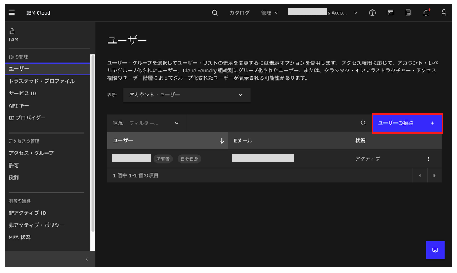
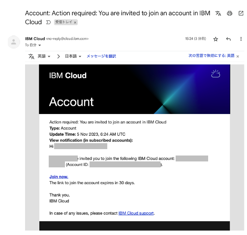

# アクセス・グループユーザーの追加

1. 画面左側のメニューから **ユーザー** をクリックする
 

1. **ユーザーの招待** ボタンをクリックする
 

1. **Eメール・アドレスを入力してください** に対象ユーザーのメールアドレスを入力し、**どのようにアクセス権限を割り当てますか？** で **アクセス・グループ** を選択する。**アクセス・グループの選択** で **AG_XXXXX** をチェックし、**追加** ボタンをクリックする
 

1. 画面右 **アクセス・サマリー** の招待ボタンをクリックする
 

参考情報) 招待を受けたユーザは以下のようなメールを受信します。**Join now** リンクからIBM Cloudにログインして招待をAcceptします。

