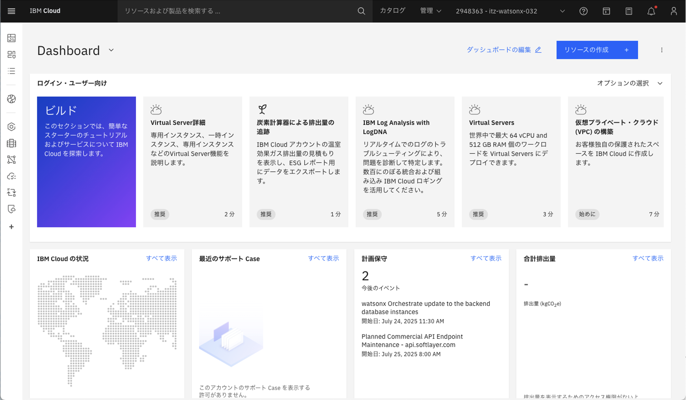
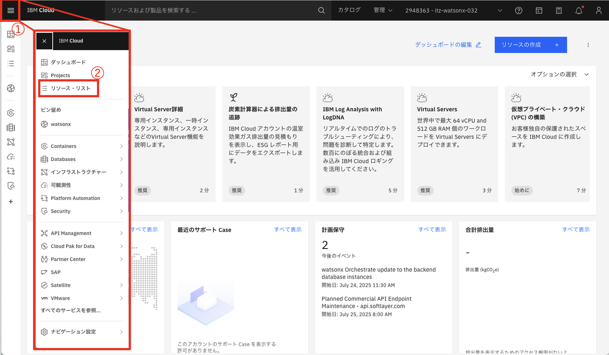
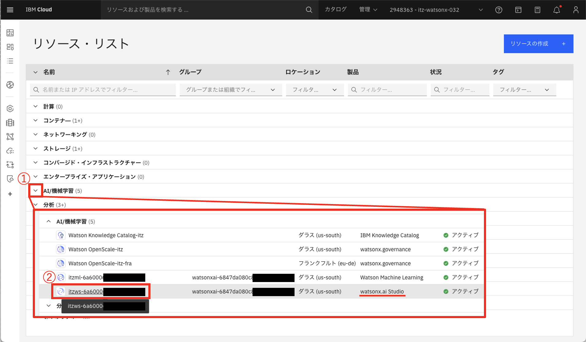
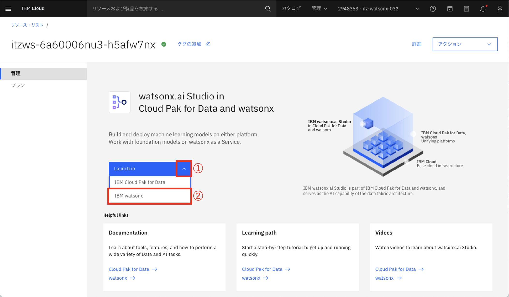
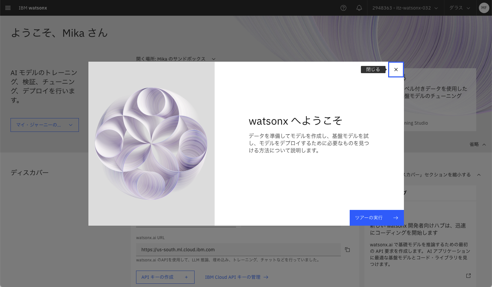
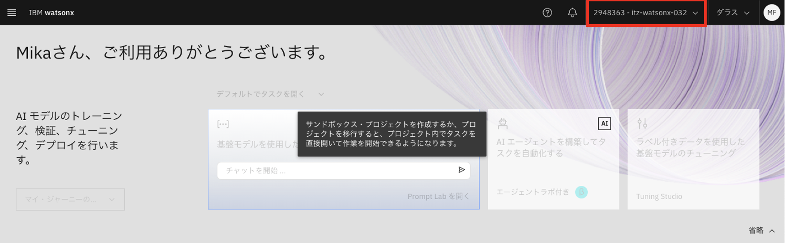

# watsonx.ai にアクセス

1. [IBM Cloud](https://cloud.ibm.com/) にアクセスする

1. ①左上のハンバーガーメニューから、②リソースリストを選択する

1. ①AI/機械学習、②watson.ai Studio を選択する

1. ①ドロップダウンを開き、②IBM watsonx をクリックしてwatsonx.aiを起動する

1. 以下の画面が表示されたらwatsonx.ai へのアクセスは完了

※Cloud Accountを複数持っている場合は勝手に切り替わることがあるため、Accountに間違いがないか確認する
