# プロジェクトの作成

watsonx.aiを利用するには、プロジェクトを作成する必要があります。
プロジェクトを作成することで、命令文の実行や保存ができます。
プロジェクトは他のメンバーと共有することができます。
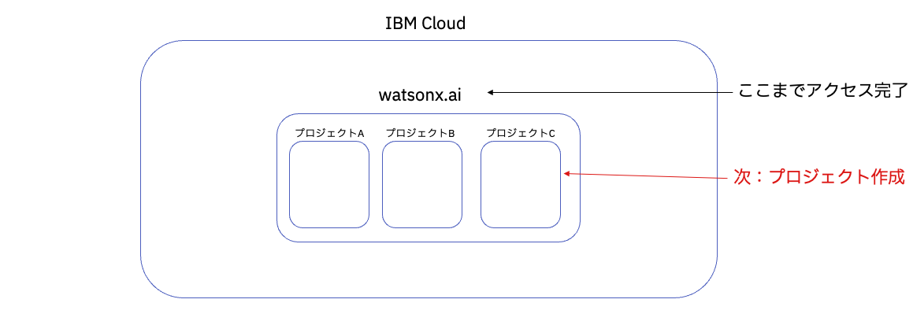

## サンドボックス・プロジェクト
1. **サンドボックス・プロジェクトの作成** をクリック
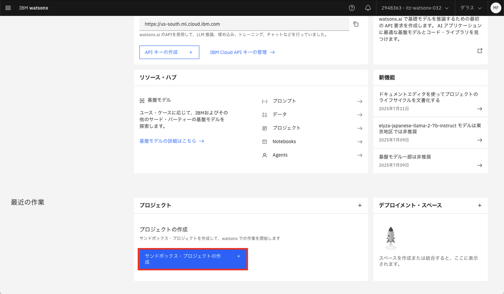

1. 以下の枠部分がアクティブになれば、準備完了
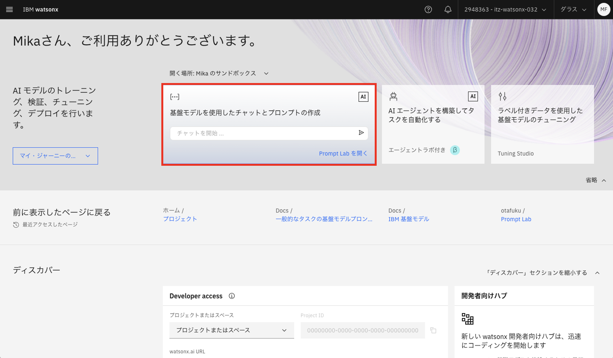

## 独自のプロジェクト

### プロジェクトの作成

1. 左上の①**ハンバーガーメニュー** から、②**すべてのプロジェクトの表示** をクリックする
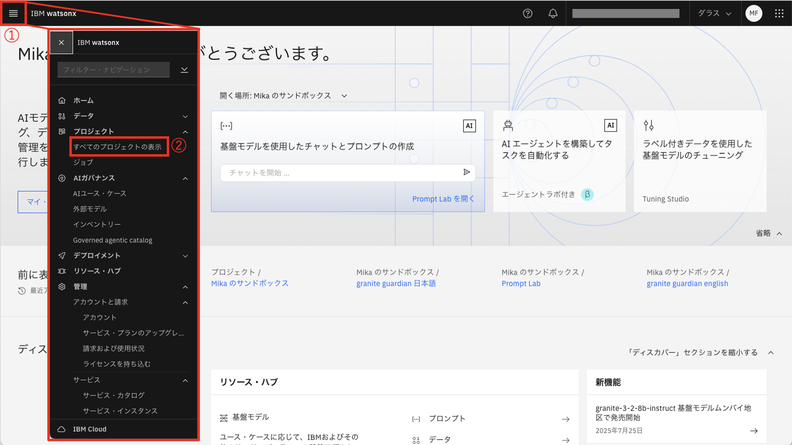 

1. 右上の **新規プロジェクト +** をクリックする
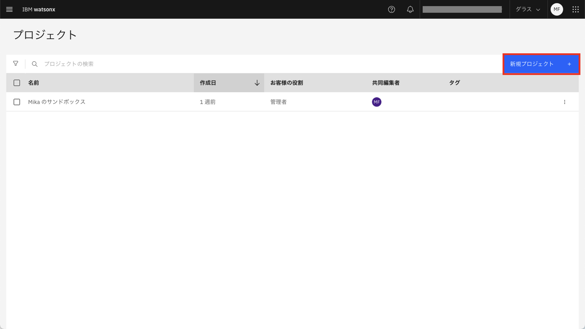 

1. ①**名前**に任意の名前を入力し、②**ストレージ・サービスの選択** でサービスを選択、③**作成** をクリックしてプロジェクトの作成は完了
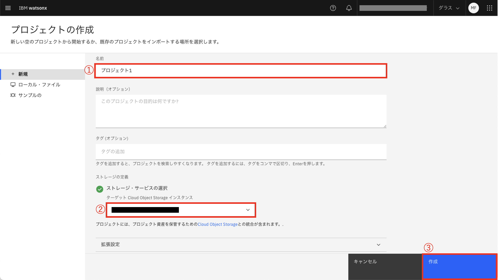

### watsonx.ai Runtime(旧名 Watson Machine Learning) のサービスの関連付け

watsonx.ai のLLM を使うには、作成したプロジェクトにwatsonx.ai Runtime のサービスの関連付けをする必要があります。

※ **Watson Machine Learning** → **watsonx.ai Runtime** に名称変更したのですが、GUI上では変更されていない箇所がいくつかあります。これらは同じものを指していますのでご留意ください。

1. プロジェクトの詳細ページに遷移するので、**管理** タブをクリックする
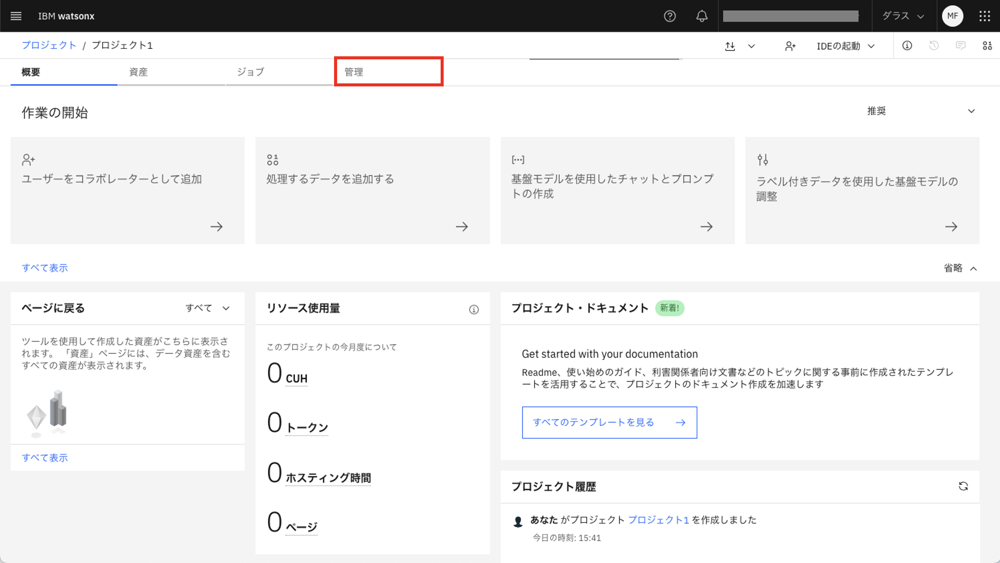

1. 左側の **サービスおよび統合** をクリックする
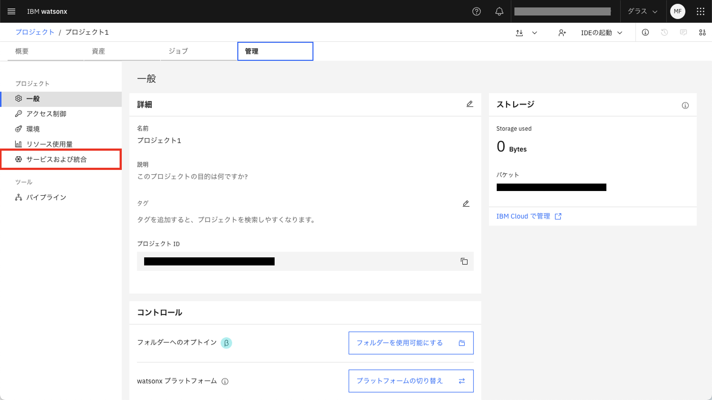

1. **サービスの関連付け** をクリックする
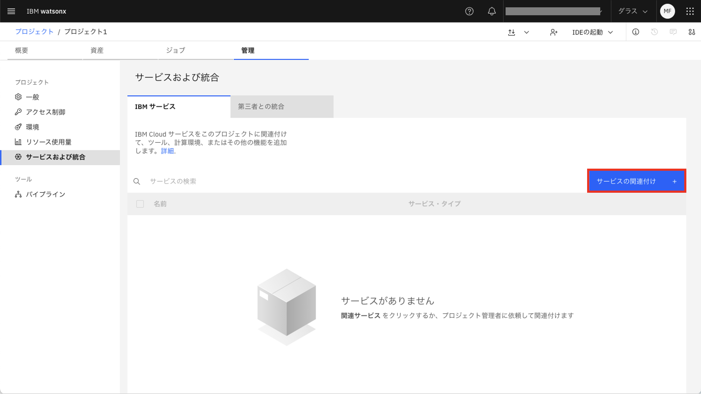

1. ①watsonx.ai Runtime (Watson Machine Learning) にチェックを入れて、②**関連付け** をクリックする
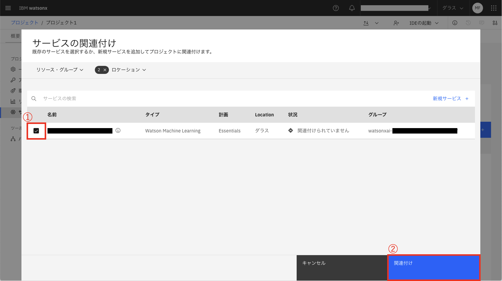

1. watsonx.ai Runtime の関連付け完了
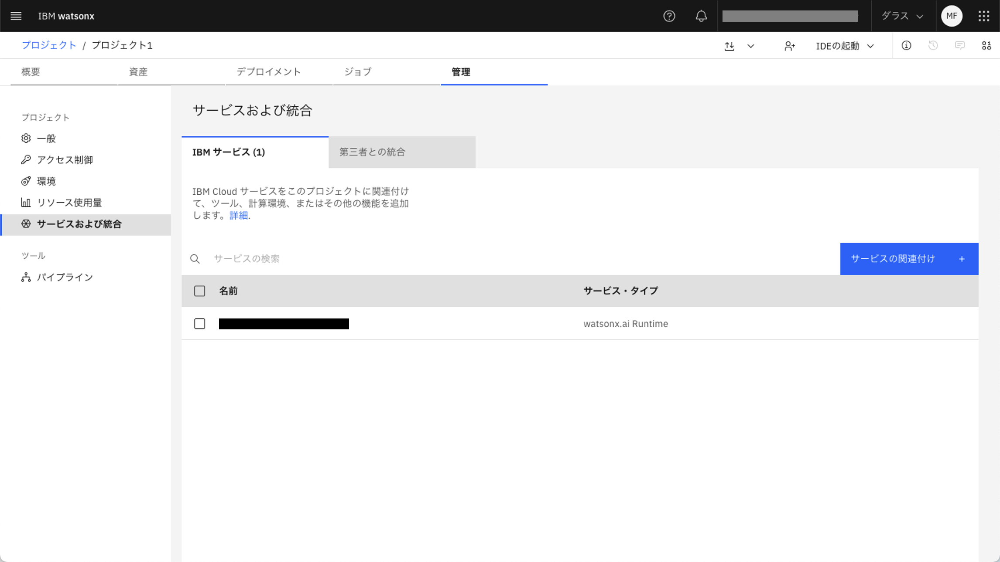
