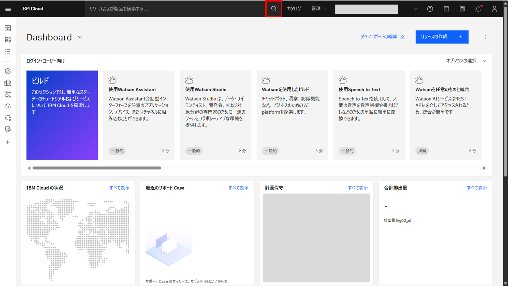
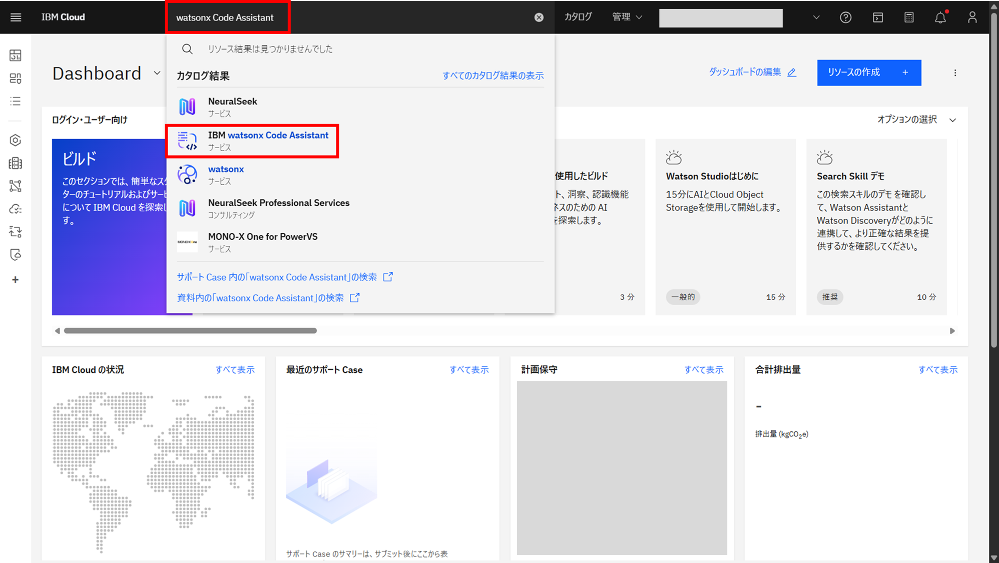
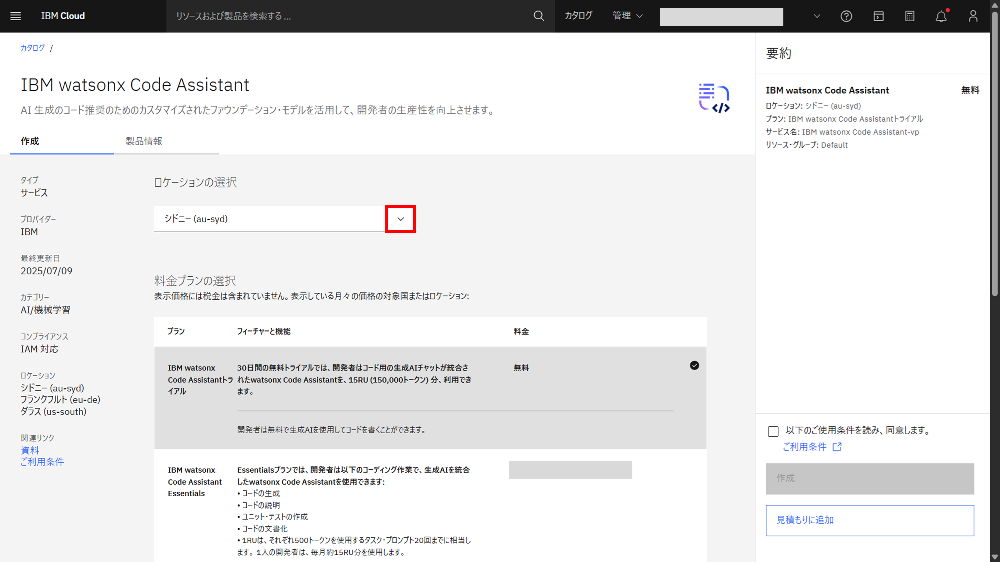
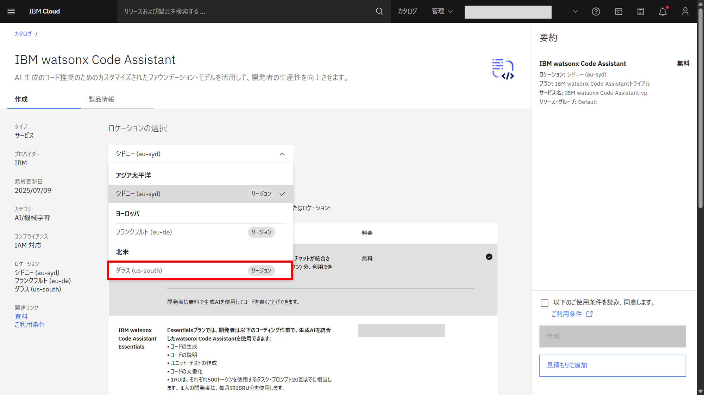
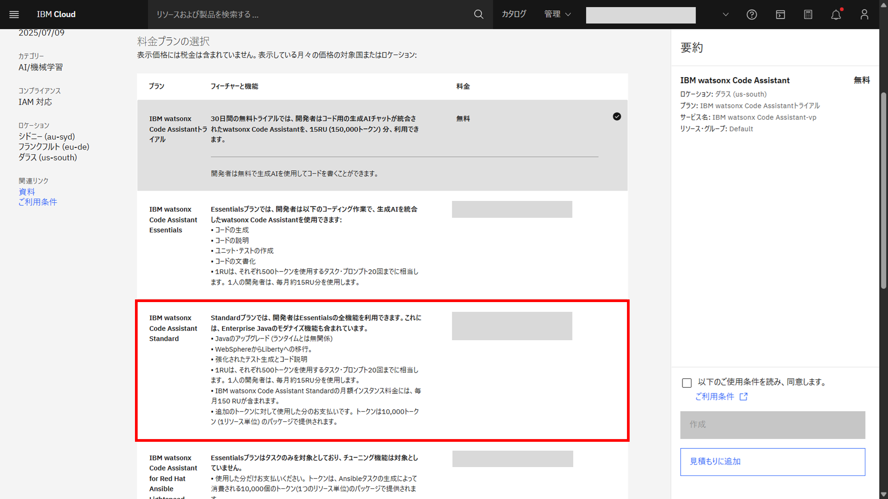
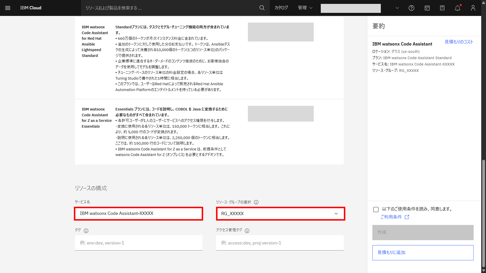
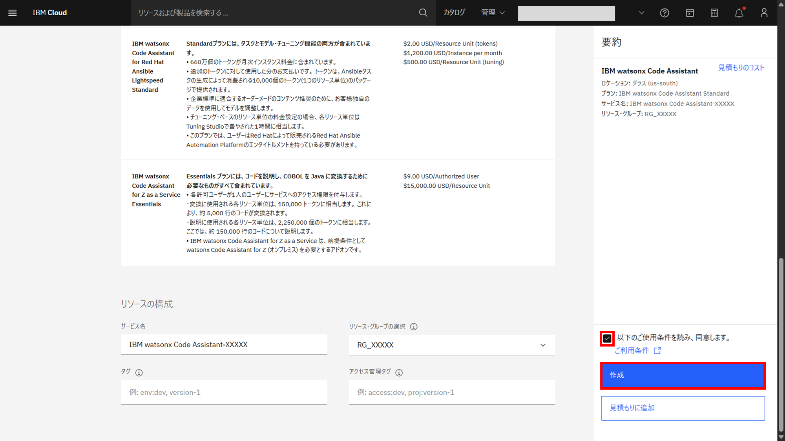
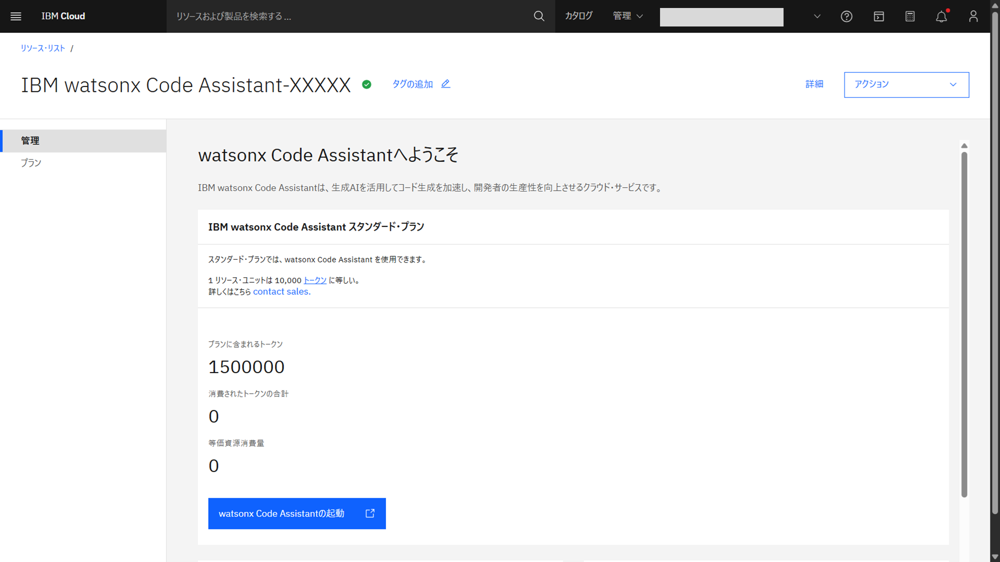

# インスタンス作成

## watsonx Code Assistant

1. 画面上の検索ボタンをクリックする

1. 表示された入力欄に **watsonx Code Assistant** と入力し、数秒後に表示される **カタログ結果** 欄の **watsonx Code Assistant** をクリックする

1. 作成するインスタンスの条件を指定する
   
   1. **ロケーションの選択** セクションで、使用するリージョンを選択する
   
   

   1. **料金プランの選択** セクションで、利用するプランを選択する
   
    
   1. **リソースの構成** セクションで、サービス名に適切なサービス名を入力し、リソース・グループの選択で前工程で作成したリソース・グループを選択する。タグ/アクセス管理タグは空欄でOK
   

1. 画面右の要約欄で **以下のご使用条件を読み、同意します｡** にチェックを入れ、**作成** ボタンをクリックする

1. 作成した **watsonx Code Assistant** の詳細画面に自動的に遷移したら完了

## Cloud Object Storage

Cloud Object Storageのインスタンスを作成します。
詳細手順は下記をご参照ください。

[「インスタンスの作成 -> Cloud Object Storage (watsonx.ai)」へ](../../../watsonx-ai/01_instance/04_create_instance/) 

## 参考
- [サービスインスタンスのプロビジョニング](https://cloud.ibm.com/docs/watsonx-code-assistant?topic=watsonx-code-assistant-cloud-setup-wca#cloud-setup-wca-prereqs)