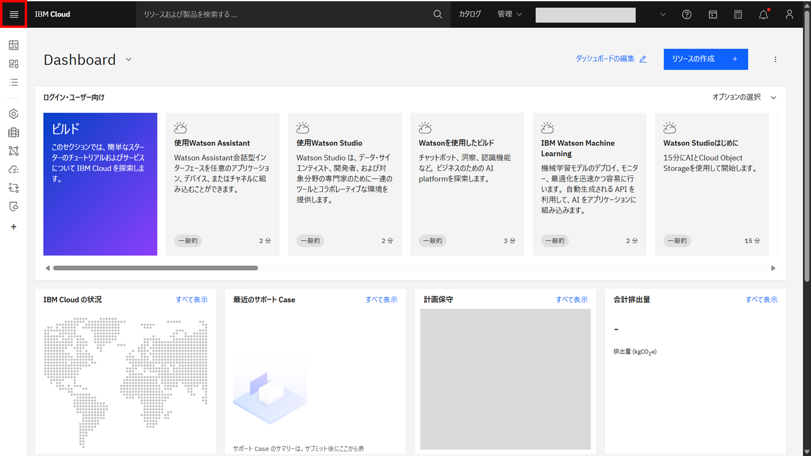
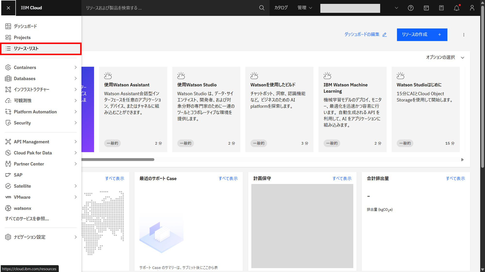
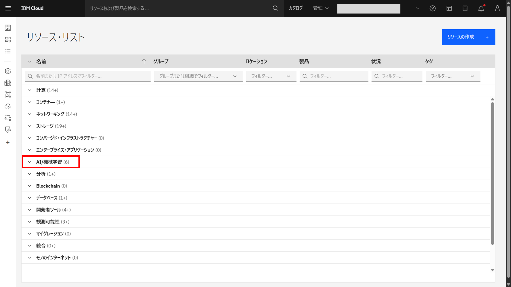
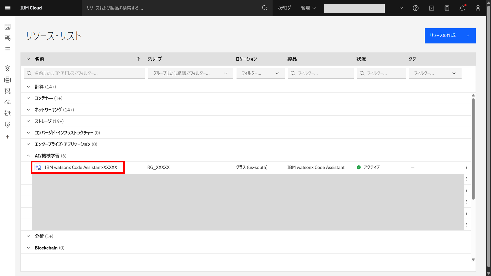
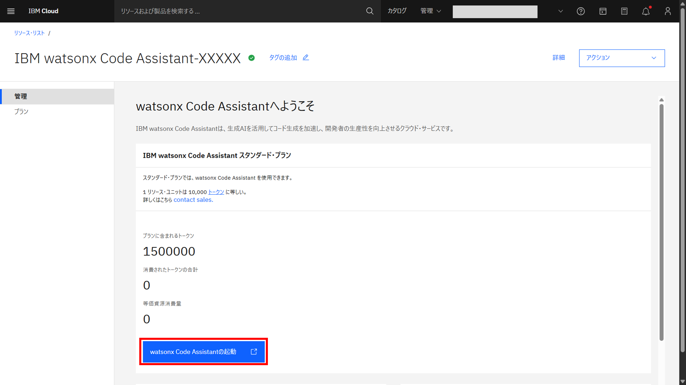
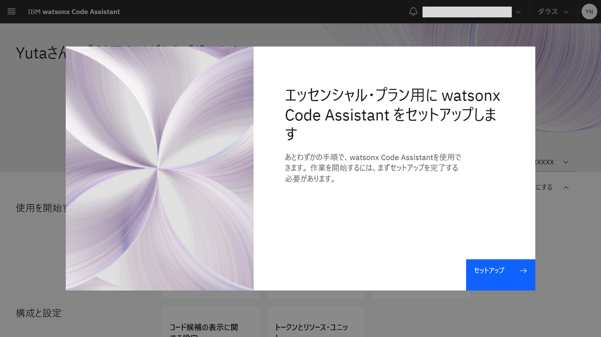
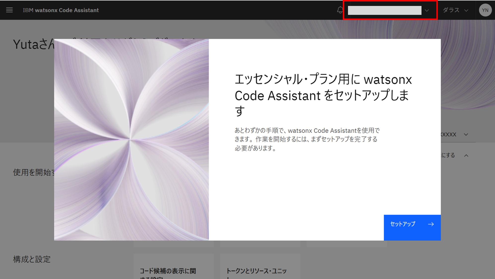

# watsonx Code Assistant へのアクセス

1. [IBM Cloud](https://cloud.ibm.com/) にアクセスし、左上のハンバーガーメニューを選択する

1. ハンバーガーメニューから、**リソースリスト** を選択する

1. **AI/機械学習** を選択する

1. **IBM watsonx Code Assistant** を選択する

1. **watsonx Code Assistantの起動** ボタンをクリックしてwatsonx Code Assistantを起動する

1. 以下の画面が表示されたらwatsonx Code Assistantへのアクセスは完了

※Cloud Accountを複数持っている場合は勝手に切り替わることがあるため、Accountに間違いがないか確認する

