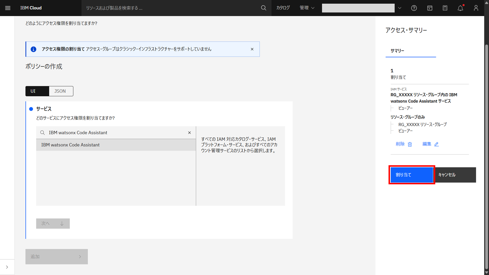
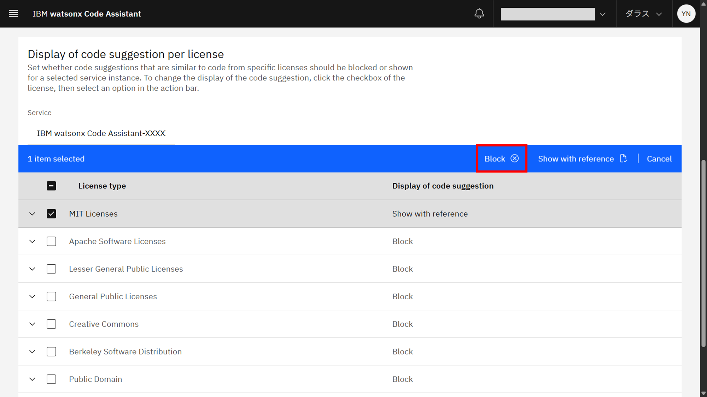

# watsonx Code Assistant のセットアップ

1. セットアップをクリックする

## インストールタイプの選択
1. **インストールのタイプ** を選択する
選択したタイプによってセットアップ手順が異なります。 
複数名で利用する場合は **組織的利用** 、個人で利用する場合は **シングル・ユーザー** を選択します。

## アクセス・グループの作成　※「組織的利用」の場合のみ
1. **IBM Cloud アカウントにアクセス・グループを作成します** の **→** ボタンをクリックする

1. **作成** ボタンをクリックする

1. **名前** に適切な名前を入力し、**作成** ボタンをクリックする

1. 作成したアクセスグループの **アクセス** タブをクリックする

1. **アクセス権限の割り当て** ボタンをクリックする

1. **サービス** で **IBM watsonx Code Assistant** を選択する

1. **次へ** ボタンをクリックする

1. **リソース** で **特定のリソース** を選択する

1. **属性の選択** ドロップダウンリストから **リソース・グループ** を選択する

1. IBM watsonx Code Assistantインスタンスを作成したリソース・グループを選択する

1. **次へ** ボタンをクリックする

1. **リソース・グループ・アクセス** で **ビューア―** を選択する

1. **次へ** ボタンをクリックする

1. **役割とアクション** で **ビューア―** を選択する

1. **次へ** ボタンをクリックする

1. **追加** ボタンをクリックする

1. **アクセス・サマリー** で **割り当て** ボタンをクリックする

1. 割り当てたポリシーが自動的に表示されたら完了

1. IBM watsonx Code Assistantセットアップ画面に戻り、**IBM Cloud アカウントにアクセス・グループを作成します** のチェックボックスをクリックする

## デプロイメント・スペースの作成
1. **デプロイメント・スペースの作成** の **→** ボタンをクリックする

1. **名前** に適切な名前を入力する

1. **ストレージ・サービスの選択** で適切なストレージ・サービスを選択する

    <!--
    ※ストレージ・サービスが未作成の場合、 **新規ストレージ・サービスを作成します。** を選択すると **Cloud Object Storageサービスインスタンスのプロビジョニング** 画面に遷移します。
    
    -->

1. **コード・アシスタント・サービスの選択** で作成したIBM watsonx Code Assistantインスタンスを選択する

    <!--
    ※コード・アシスタント・サービスが未作成の場合、 **新規コード・アシスタント・サービスの作成** を選択すると **IBM watsonx Code Assistantインスタンスのプロビジョニング** 画面に遷移します。
    
    -->

1. **作成** ボタンをクリックする

1. **デプロイメント・スペースの作成** のチェックボックスをクリックする

## デプロイメント・スペースへのアクセス・グループの追加　※「組織的利用」の場合のみ
1. **配置スペースにアクセス・グループを追加する** の **→** ボタンをクリックする

1. **コラボレーターの追加** ドロップダウンリストをクリックする

1. リストから **アクセス・グループの追加** をクリックする

1. 作成したアクセス・グループの **ロール** ドロップダウンリストから **エディター** を選択し、チェックボックスをクリックする

1. **追加** ボタンをクリックする

1. 追加したアクセス・グループが自動的に表示されたら完了

1. IBM watsonx Code Assistantセットアップ画面に戻り、**配置スペースにアクセス・グループを追加する** のチェックボックスをクリックする

## コード候補の表示方法の設定
1. **応答世代に対するライセンスの優先順位を選択します** の **→** ボタンをクリックする

1. **Display of Code Suggestions** 画面が表示される

※デフォルトでは、IBM watsonx Code Assistantは他のコードソースと類似したコード提案をブロックします。

※特定のライセンスのコードに類似するコード候補をIDEに表示するかどうかを設定し、類似するコードソースとそのライセンスを参照することができます。

1. コード候補の表示方法の設定を変更する　**※設定を変更したい場合のみ**

    1. Show code suggestion with referenceへの変更

        1. 設定変更したいライセンスのチェックボックスをクリックする
        

        1. **Show with reference** をクリックする
        

        1. Show with referenceに変更される
        

    1. Block code suggestionへの変更

        1. 設定変更したいライセンスのチェックボックスをクリックする
        

        1. **Block** をクリックする
        

        1. Blockに変更される
        

1. IBM watsonx Code Assistantセットアップ画面に戻り、**応答世代に対するライセンスの優先順位を選択します** のチェックボックスをクリックする

## アクセス・グループへのユーザー追加　※「組織的利用」の場合のみ
1. **IBM Cloud アカウントへの開発者の招待** の **→** ボタンをクリックする

1. IAMメニューから**アクセスの管理** > **アクセス・グループ** を選択する

1. 作成したアクセス・グループを選択する

1. ユーザータブで**追加** ボタンをクリックする

1. IBM Cloudアカウントのメンバーのうち、watsonx Code Assistantにアクセスできるメンバーを選択し、**追加** ボタンをクリックする

1. 追加したユーザーが自動的に表示されたら完了

1. IBM watsonx Code Assistantセットアップ画面に戻り、**IBM Cloud アカウントへの開発者の招待** のチェックボックスをクリックする

## IDE拡張機能またはプラグイン追加の案内　※「組織的利用」の場合のみ
1. **開発者にwatsonx Code Assistant拡張機能を追加するよう案内する** の **→** ボタンをクリックする

1. 表示されるページのURL、または、IBM watsonx Code Assistantセットアップ画面に記載されているURLを参照し、IDEにwatsonx Code Assistant拡張機能またはプラグインを追加するように開発者に案内する

1. IBM watsonx Code Assistantセットアップ画面に戻り、**開発者にwatsonx Code Assistant拡張機能を追加するよう案内する** のチェックボックスをクリックする

以上でIBM watsonx Code Assistant のセットアップは完了です。

## 参考
- [watsonx Code AssistantサービスをIBM Cloudで設定する](https://cloud.ibm.com/docs/watsonx-code-assistant?topic=watsonx-code-assistant-cloud-setup-wca)