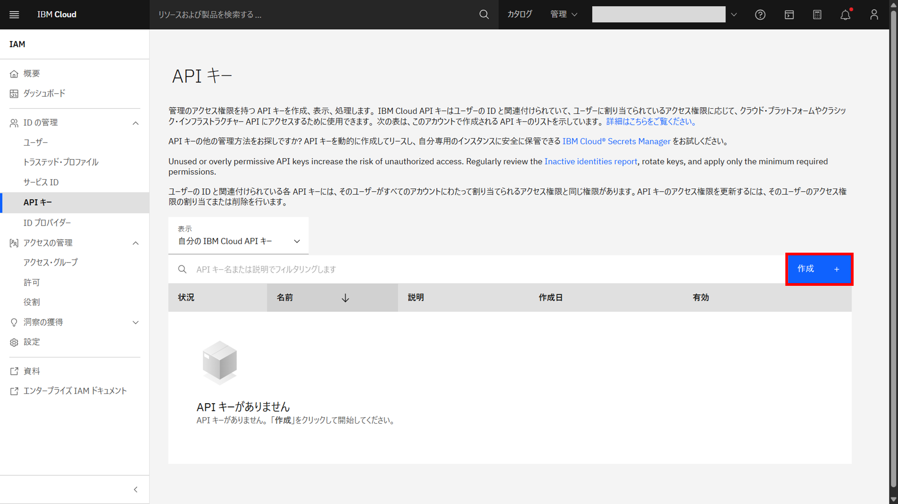
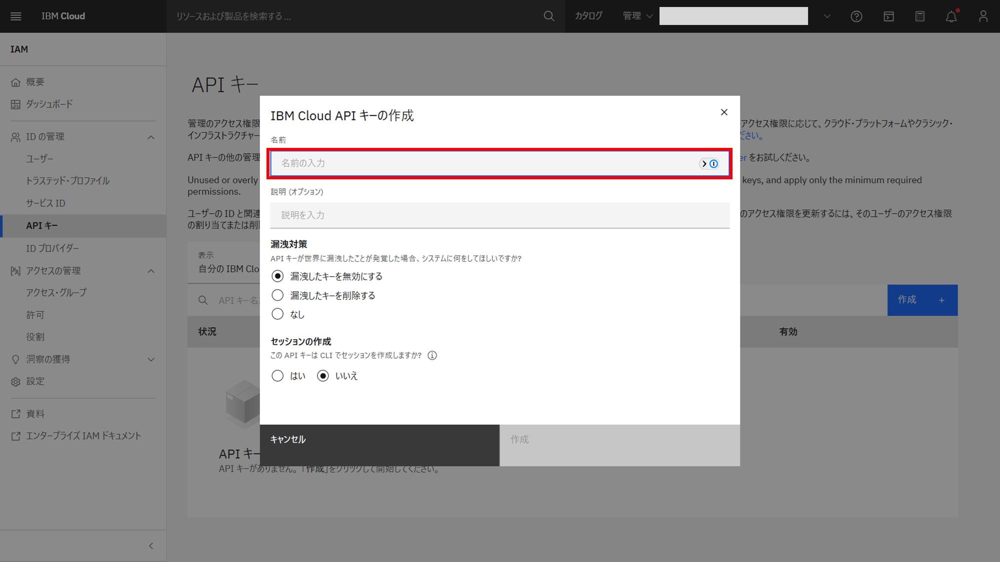
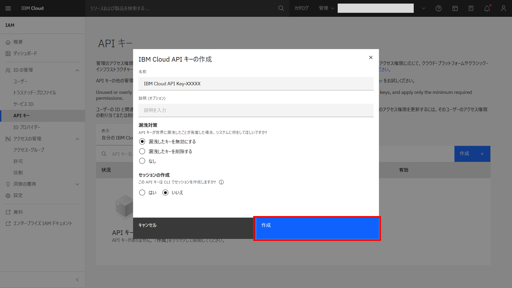
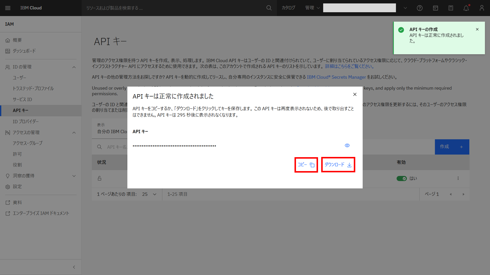

# IBM Cloud API Key の作成

1. [IBM Cloud APIキー](https://cloud.ibm.com/iam/apikeys) にアクセスする

1. **作成** ボタンをクリックする

1. **名前** に適切な名前を入力する

1. **作成** ボタンをクリックする

1. **コピー** または **ダウンロード** をクリックし、APIキーを安全な場所に保管する
※APIキーは296秒間しか表示されないため、後で確認できる場所に保管する

## 参考
- [Microsoft Visual Studio Code：IBM CloudでAPIキーを作成する](https://cloud.ibm.com/docs/watsonx-code-assistant?topic=watsonx-code-assistant-cloud-setup-wca-vscode#cloud-setup-wca-vscode-create-api-key)
- [Eclipse IDE：IBM CloudでAPIキーを作成する](https://cloud.ibm.com/docs/watsonx-code-assistant?topic=watsonx-code-assistant-cloud-setup-wca-vscode#cloud-setup-wca-vscode-create-api-key)