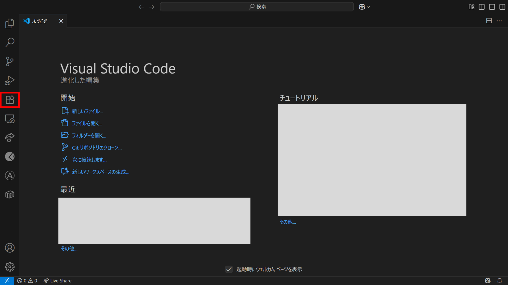
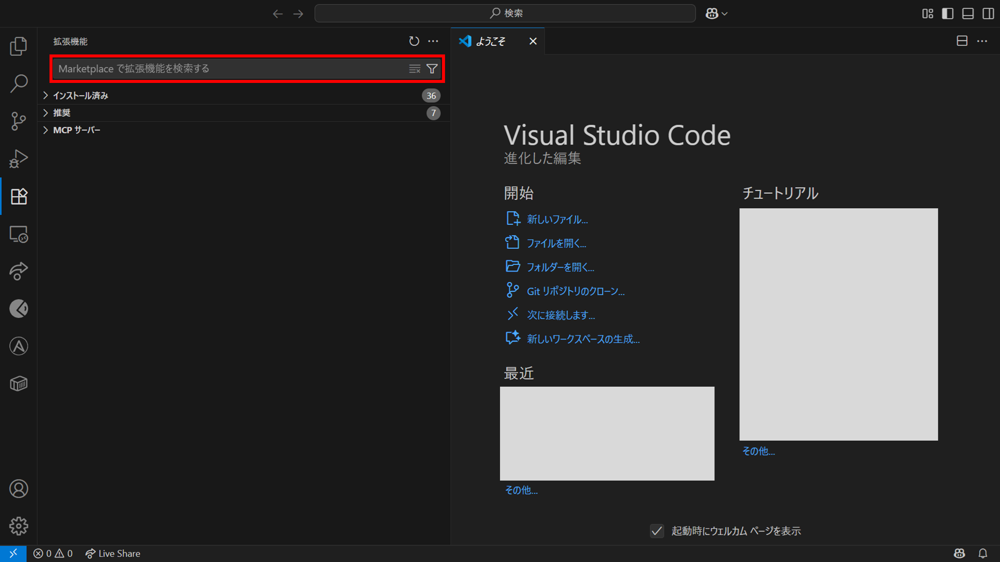
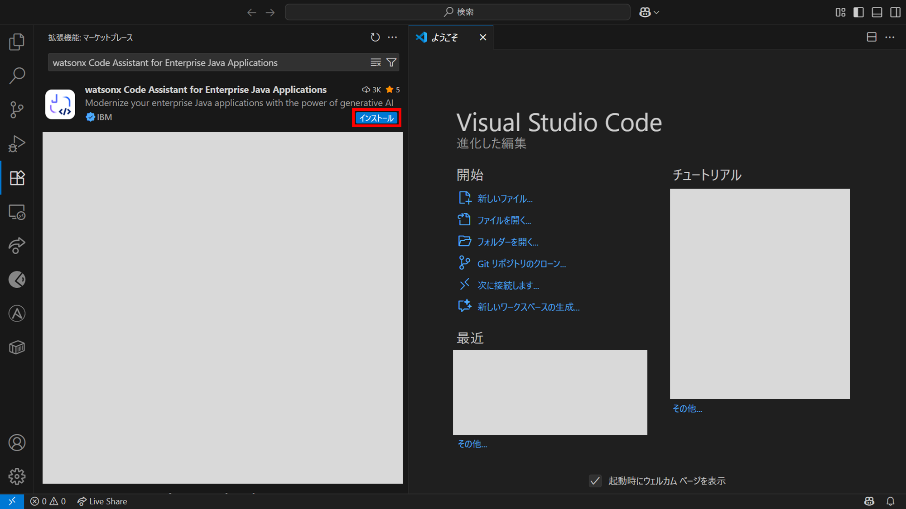
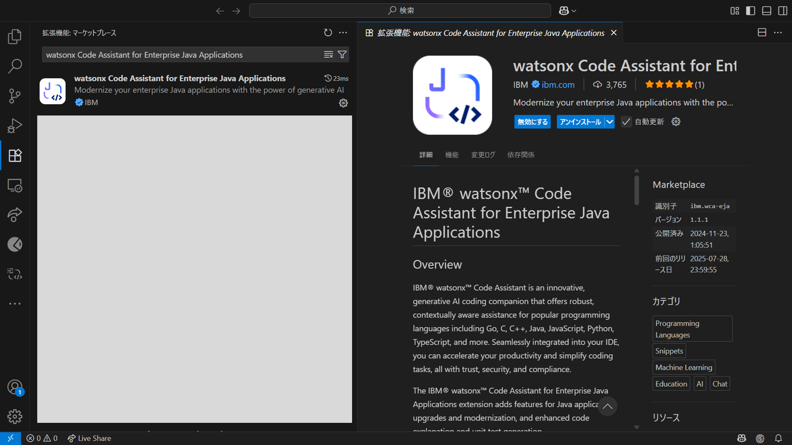
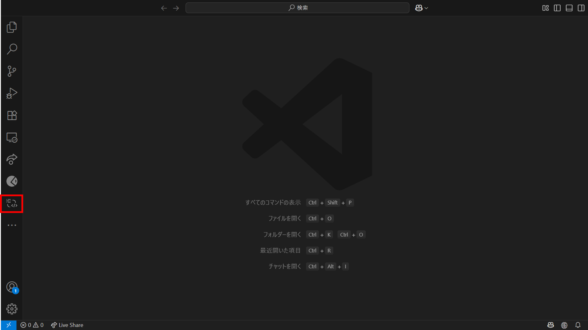
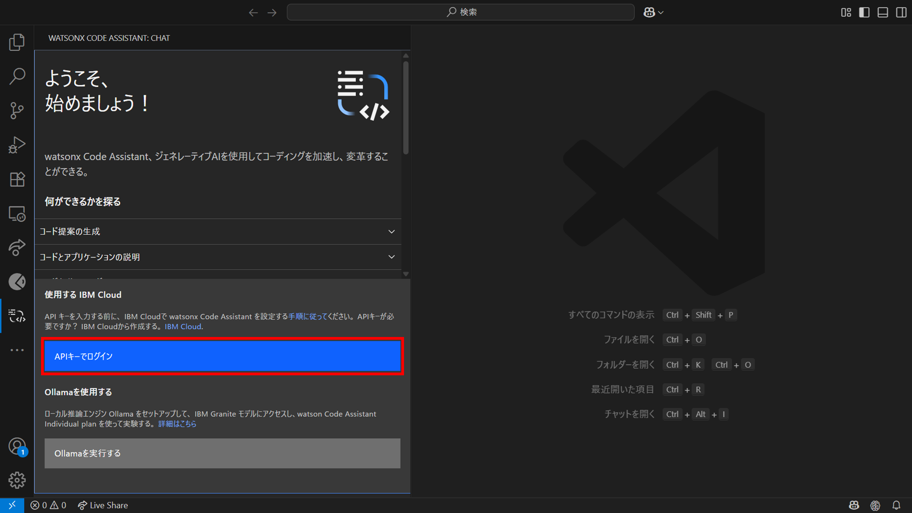
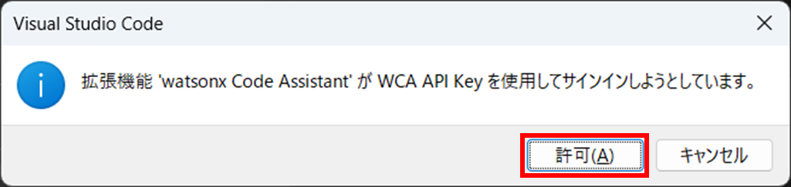
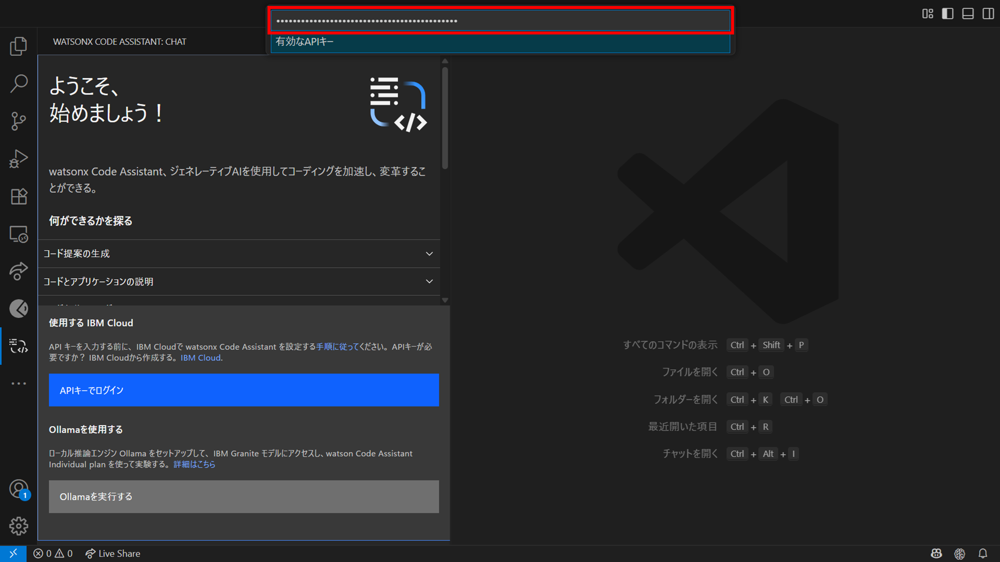
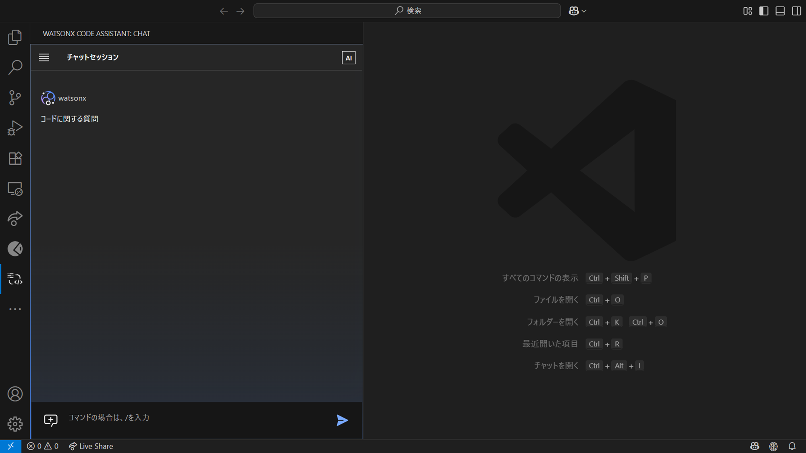

# Visual Studio Code用拡張機能のインストール

1. Visual Studio Codeで**拡張機能** アイコンをクリックする

1. 表示された入力欄に **watsonx Code Assistant for Enterprise Java Applications** と入力する

1. **拡張機能** 一覧に表示された **watsonx Code Assistant for Enterprise Java Applications** の **インストール** ボタンをクリックする

1. 以下の画面が表示されたらwatsonx Code Assistant for Enterprise Java Applicationsのインストールは完了

## 拡張機能のセットアップ
1. Visual Studio Codeで**watsonx Code Assistant** アイコンをクリックする

1. **APIキーでログイン** ボタンをクリックする

1. **許可** ボタンをクリックする

1. 表示された入力欄に保管しておいたAPIキーを入力し、Enterキーを押下する

1. 以下の画面が表示されたら拡張機能のセットアップは完了

## 参考
- [拡張機能のインストール](https://cloud.ibm.com/docs/watsonx-code-assistant?topic=watsonx-code-assistant-cloud-setup-wca-vscode#cloud-setup-wca-vscode-install)
