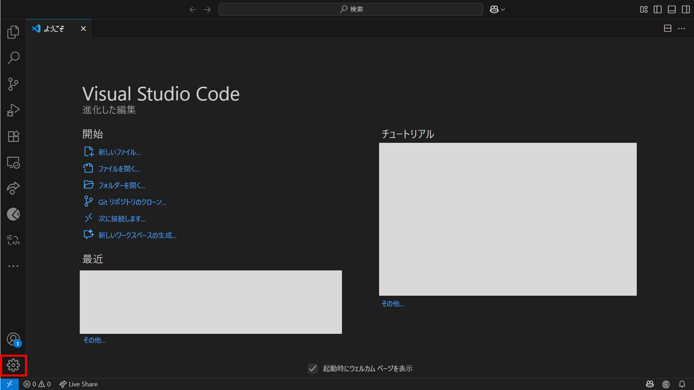
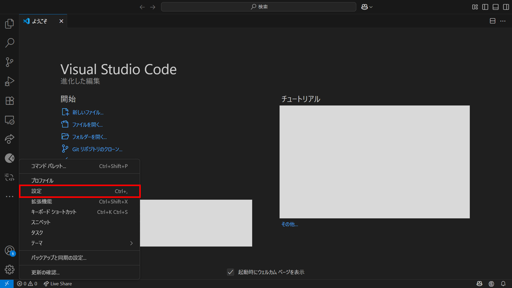
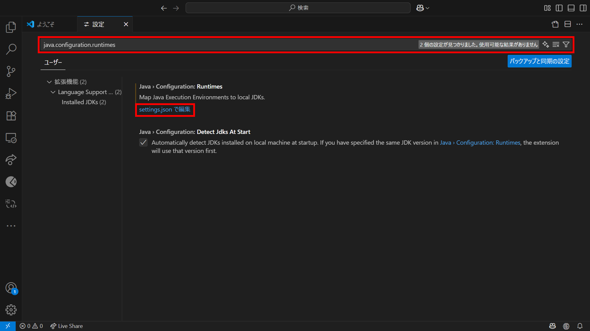

# エンタープライズJava環境のセットアップ

1. [Java 要件](https://cloud.ibm.com/docs/watsonx-code-assistant?topic=watsonx-code-assistant-cloud-setup-wca-java-env&locale=ja#cloud-setup-wca-java-env-requirements) を満たすJava および Mavenをインストールする　**インストールされていない場合**
- [（参考）Java](https://developer.ibm.com/languages/java/semeru-runtimes/downloads/)
- [（参考）Maven](https://maven.apache.org/download.cgi)

1. JAVA_HOME環境変数 および Path変数にJavaを追加する　**※設定されていない場合**  
例：
    | 変数名 | 値 |
    | :--- | :--- |
    | JAVA_HOME | C:\Program Files\Semeru\jdk-17.0.6.10-openj9 |
    | Path | <JAVA_HOME環境変数>\bin\java |

1. Path変数にMavenを追加する　**※設定されていない場合**  
例：
    | 変数名 | 値 |
    | :--- | :--- |
    | Path | C:\Program Files\apache-maven-3.9.9\bin |

※[Extension Pack for Java](https://marketplace.visualstudio.com/items?itemName=vscjava.vscode-java-pack)を利用している場合、[Java開発者キットの決定](https://cloud.ibm.com/docs/watsonx-code-assistant?topic=watsonx-code-assistant-cloud-setup-wca-java-env&locale=ja#cloud-setup-wca-java-env-extension-pack)に記載されている優先順位でJDKを利用する 
確認方法： 
1. **歯車** アイコンをクリックする

1. **設定** をクリックする

1. **設定の検索** 欄に検索したい設定を入力し、表示された設定の**setting.json で編集** をクリックする

## 参考
- [エンタープライズJava環境のセットアップ](https://cloud.ibm.com/docs/watsonx-code-assistant?topic=watsonx-code-assistant-cloud-setup-wca-java-env#cloud-setup-wca-java-env-vscode)