# Eclipse IDEプラグインのインストール

1. Eclipse IDEのメニューから**Help** をクリックする
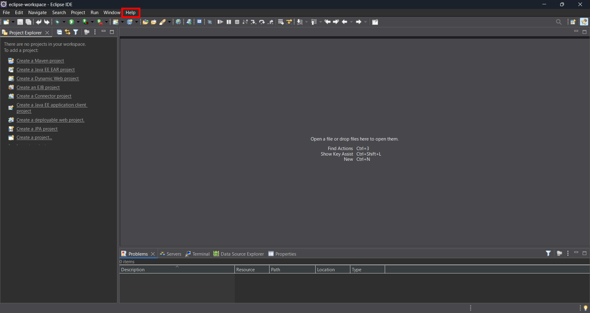

1. 表示されたリストから**Eclipse Marketplace** をクリックする
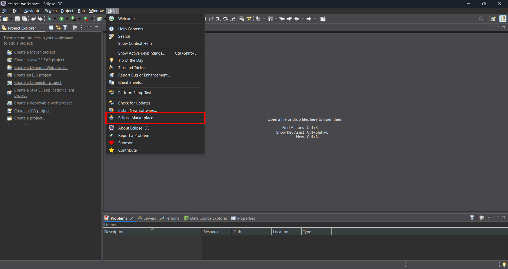

1. 表示された入力欄に **watsonx Code Assistant for Enterprise Java Applications** と入力し、**Go**ボタンをクリックする
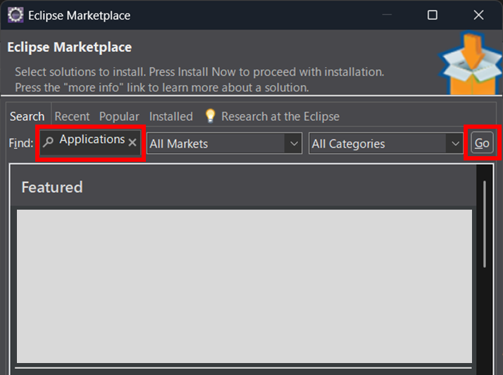

1. **プラグイン** 一覧に表示された **IBM watsonx Code Assistant for Enterprise Java Applications** の **インストール** ボタンをクリックする
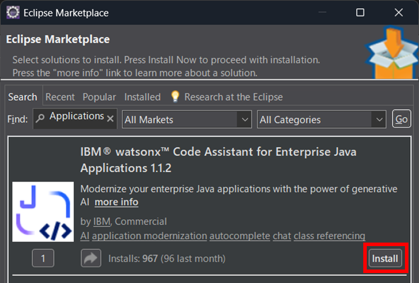

1. Review Licensesで**I accept the terms of license agreements**を選択し、**Finish** ボタンをクリックする
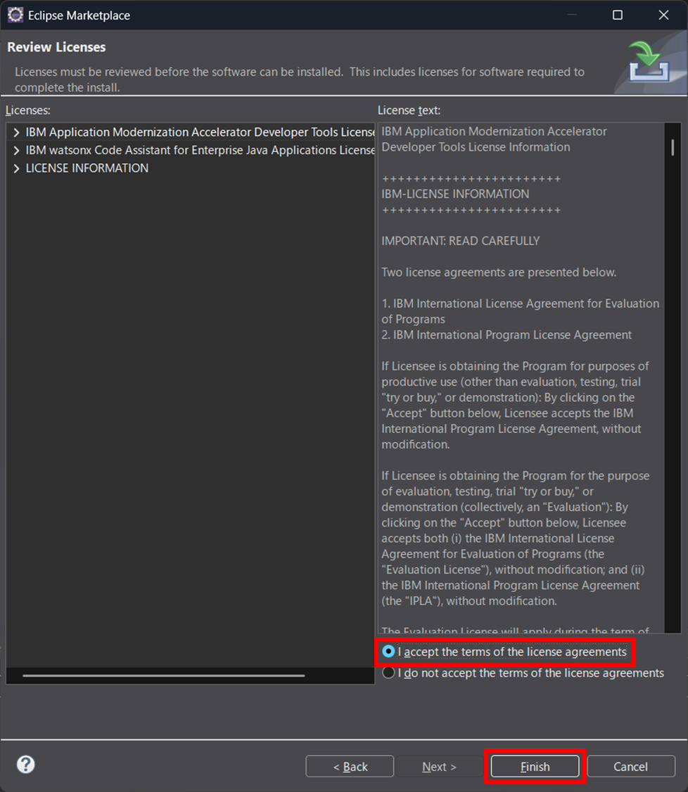

1. Trust Authoritiesで**Authority / Update Site** に表示されたチェックボックスを選択し、**Trust Selected** ボタンをクリックする
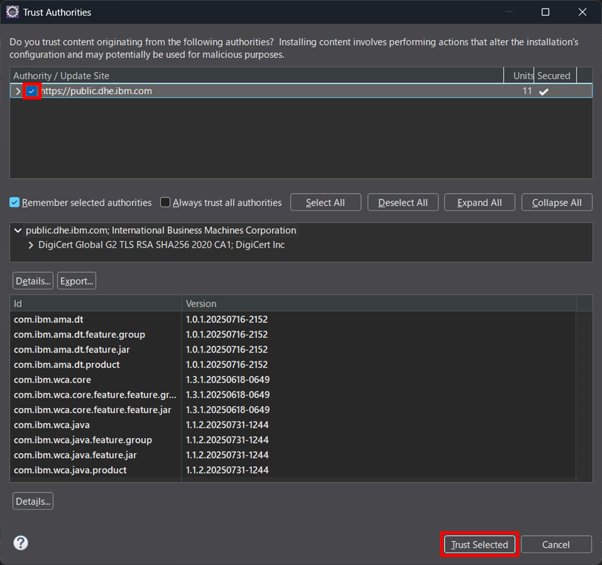

1. Software Updatesで**Restart Now** ボタンをクリックする
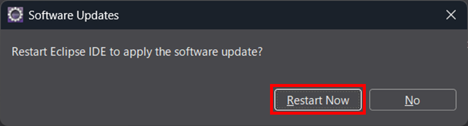

## プラグインのセットアップ
1. Eclipse IDEのメニューから**Window** をクリックする
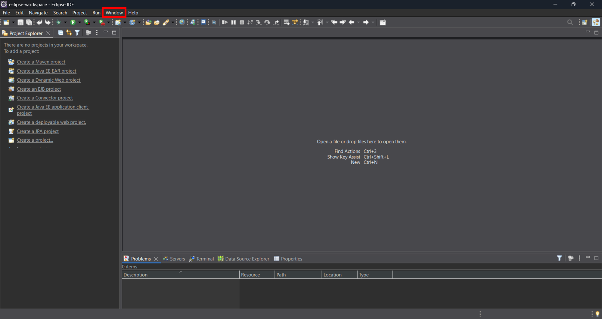

1. 表示されたリストから**Show View** -> **Other**をクリックする
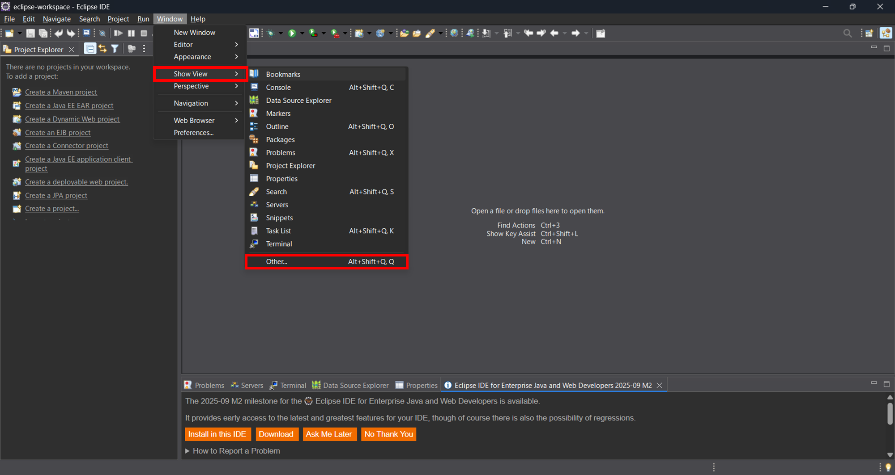

1. Show Viewダイアログで**watsonx Code Assistant** フォルダを開き、**Chat** を選択して、**Open** ボタンをクリックする
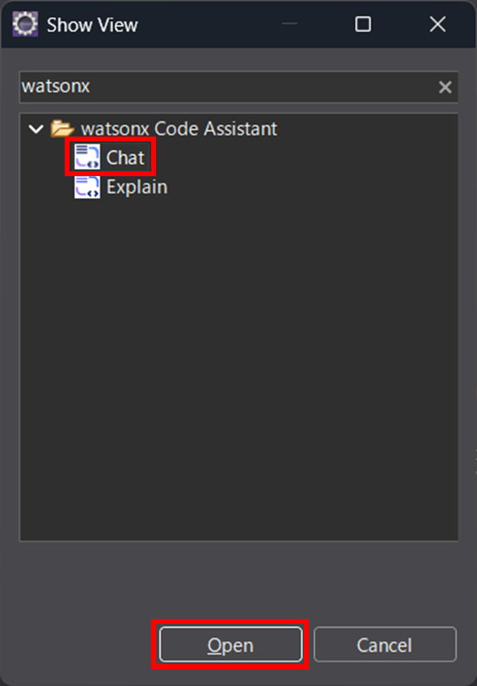

1. **Log in with your API Key** ボタンをクリックする
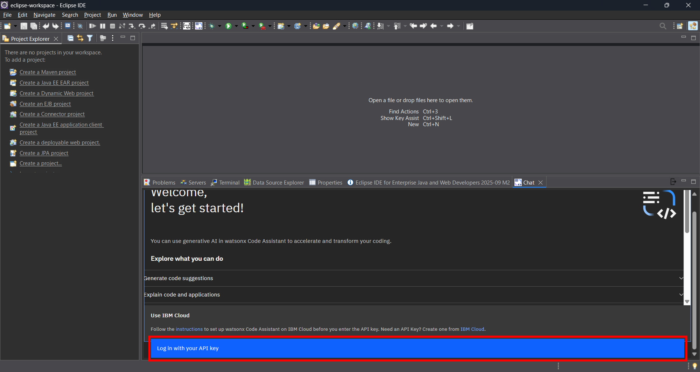

1. 表示された画面の**API Key** に保管しておいたAPIキーを入力し、**Apply and Close** ボタンをクリックする
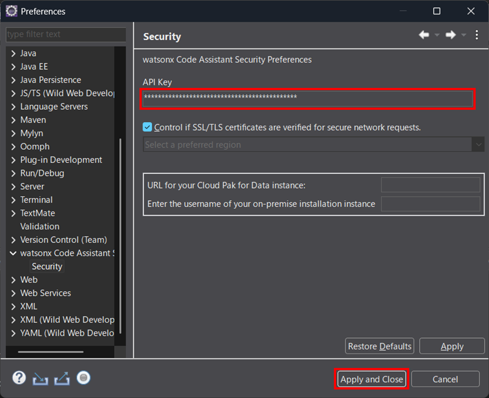

1. 以下の画面が表示されたらプラグインのセットアップは完了
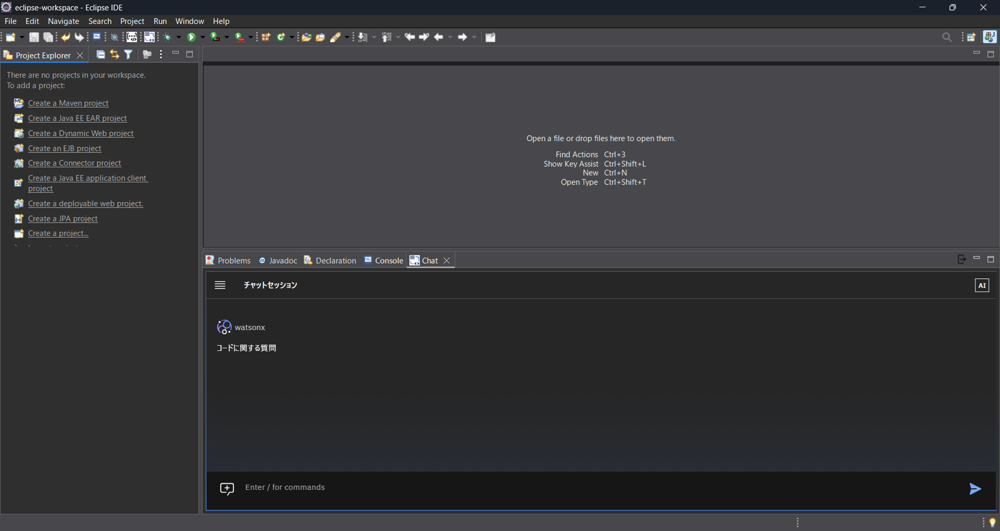

## 参考
- [Eclipse IDEプラグインのインストール](https://cloud.ibm.com/docs/watsonx-code-assistant?topic=watsonx-code-assistant-cloud-setup-wca-eclipse)