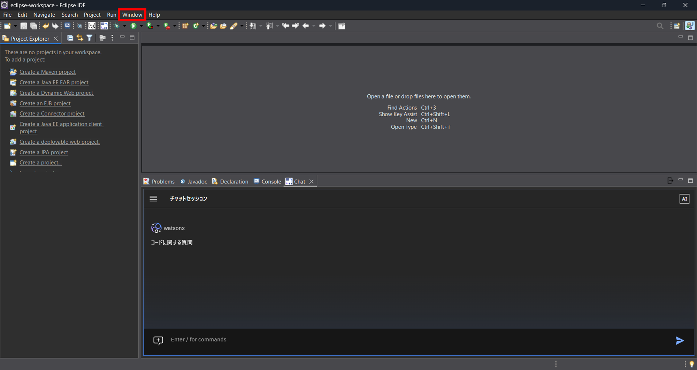
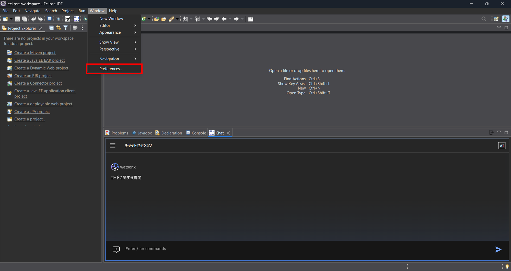
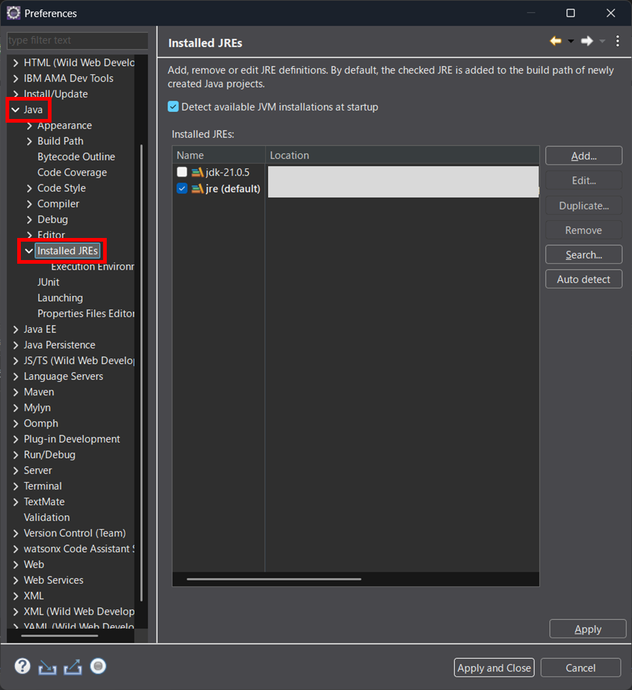
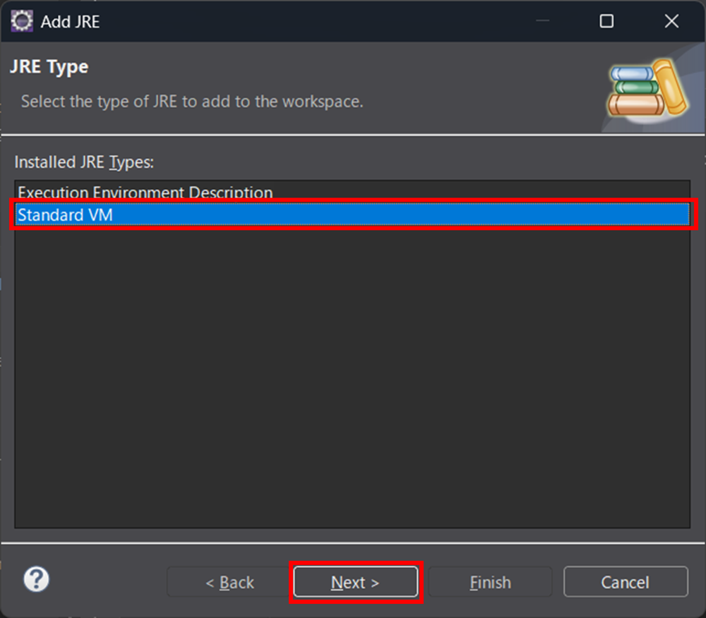
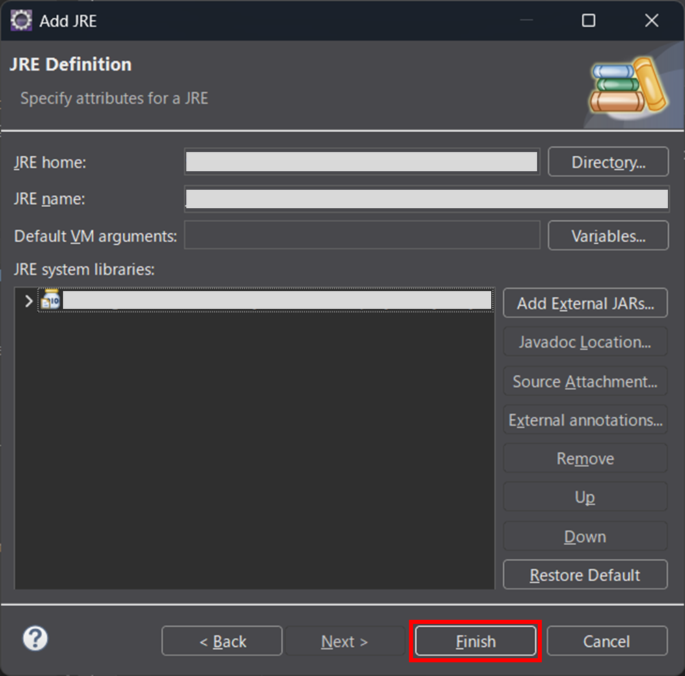
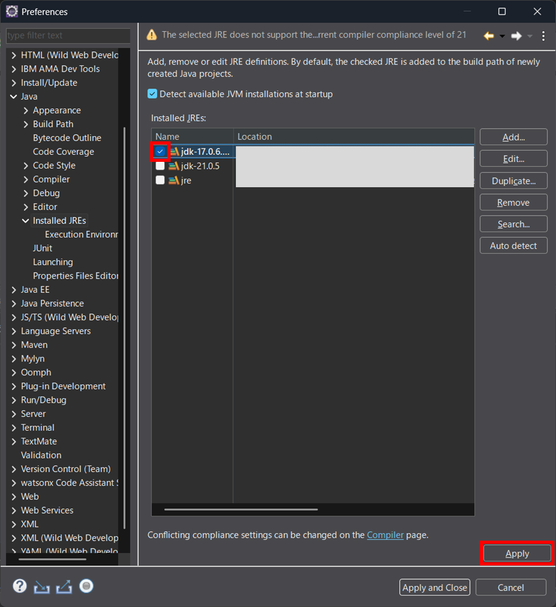
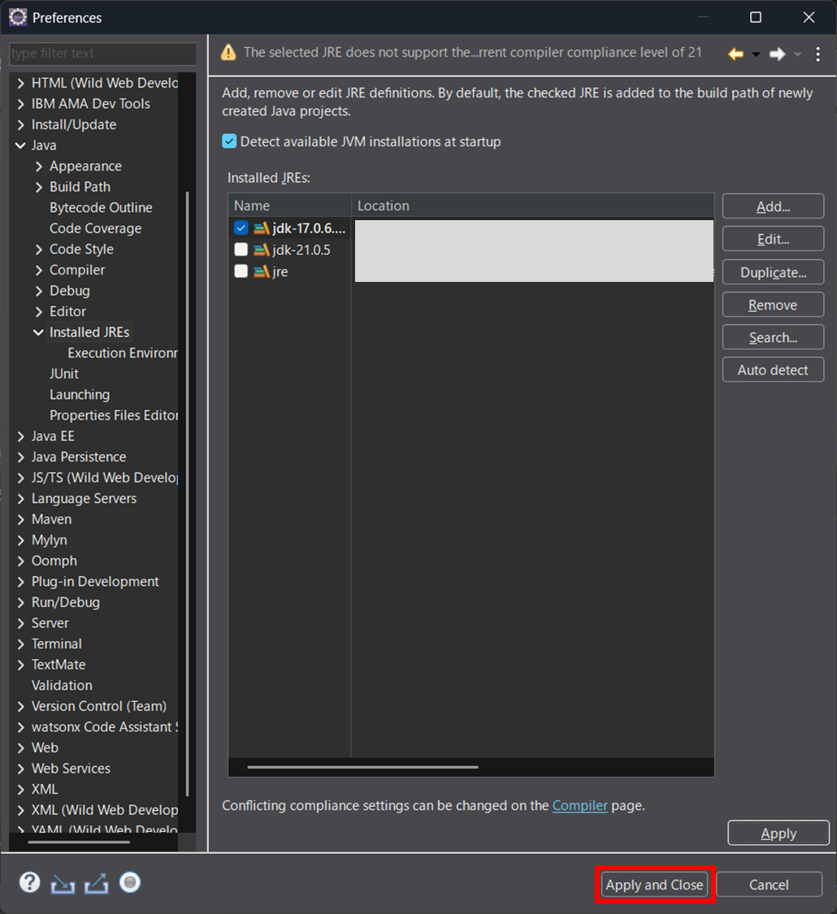

# エンタープライズJava環境のセットアップ

1. Java および Mavenをインストールする　**インストールされていない場合**
- [（参考）Java](https://developer.ibm.com/languages/java/semeru-runtimes/downloads/)
- [（参考）Maven](https://maven.apache.org/download.cgi)

1. Eclipse IDEのメニューから**Window** をクリックする

1. 表示されたリストから**Preferences** をクリックする

1. **Java** -> **Installed JREs** をクリックする

1. **Javaが追加されていない場合**、Javaを追加する

    1. **Add** ボタンをクリックする
    

    1. 適切なJREタイプを選択し、**Next** ボタンをクリックする
    

    1. 適切なJava情報を設定し、**Finish** ボタンをクリックする
    

    1. 追加されたJavaを選択し、**Apply** ボタンをクリックする
    

    1. **Apply and Close** ボタンをクリックする
    

1. Path変数にMavenを追加する　**※設定されていない場合**  
例：
    | 変数名 | 値 |
    | :--- | :--- |
    | Path | C:\Program Files\apache-maven-3.9.9\bin |

## 参考
- [エンタープライズJava環境のセットアップ](https://cloud.ibm.com/docs/watsonx-code-assistant?topic=watsonx-code-assistant-cloud-setup-wca-java-env#cloud-setup-wca-java-env-eclipse)