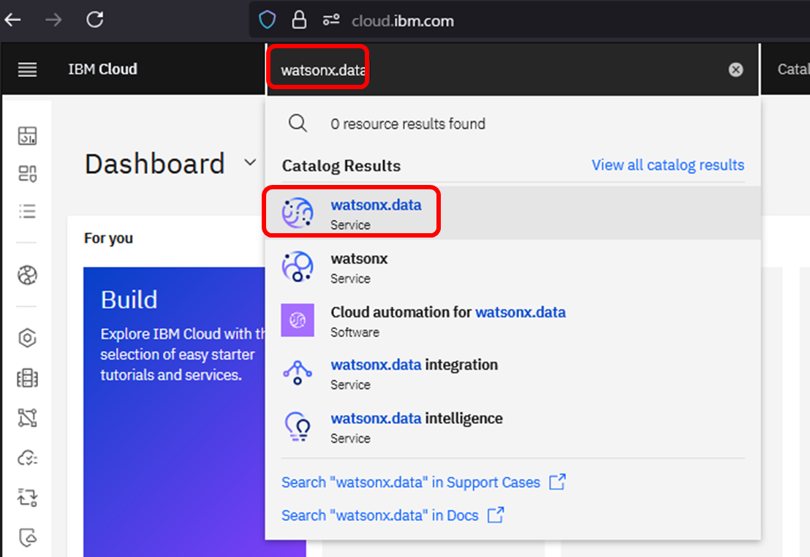
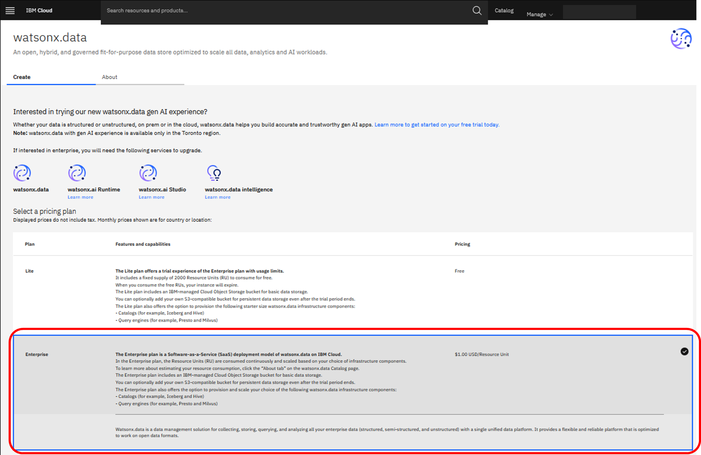
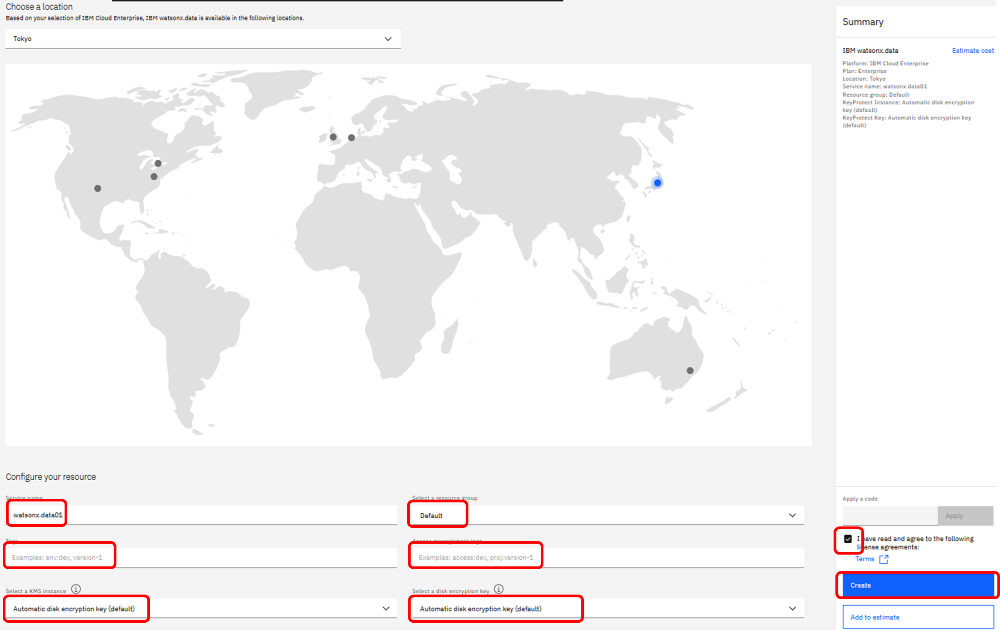
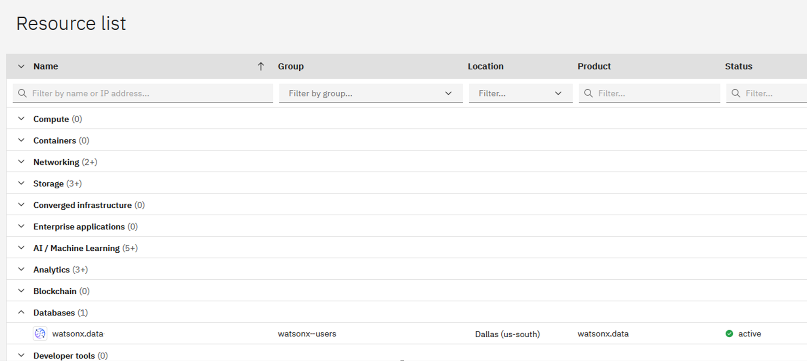

# watsonx.data (SaaS) の利用開始

### watsonx.dataのプロビジョン
左上の検索ボックスに "watsonx.data"と入力し、"Catalog Results"の中から"watsonx.data"を選択します。 
 

watsonx.dataのプロビジョン画面が表示されます。有償環境であればEnterpriseプランを、無償環境の場合にはLiteプランを選択します。ここではEnterpriseプランを選択した場合の画面例を示します。  

Planの詳細は以下をご参照ください。  
https://cloud.ibm.com/docs/watsonxdata?topic=watsonxdata-getting-started_1

LocationやService Nameなどの項目を入力し、ライセンス使用条件に目を通したらチェックボックスをクリックし、"Create"を選択します。下記画面は、以下を選択した場合の例を示します。なお、Service Nameは後から変更することも可能です。  
  ・Location：Tokyo  
  ・Service Name:"watsonx.data-snw" (任意の名前に変更が可能)  
  (その他の項目はデフォルト値のまま)  

  
Createボタンを押下すると、自動的に[IBM CloudのResource List画面](https://cloud.ibm.com/resources)に戻ります。  
watsonx.dataは「**Databases**」カテゴリに含まれます。エントリーが作成されていることを確認してください。    
プロビジョン直後でステータスが「Active」になっていない場合は、下記のように表示されるまでしばらく待機してください。  

