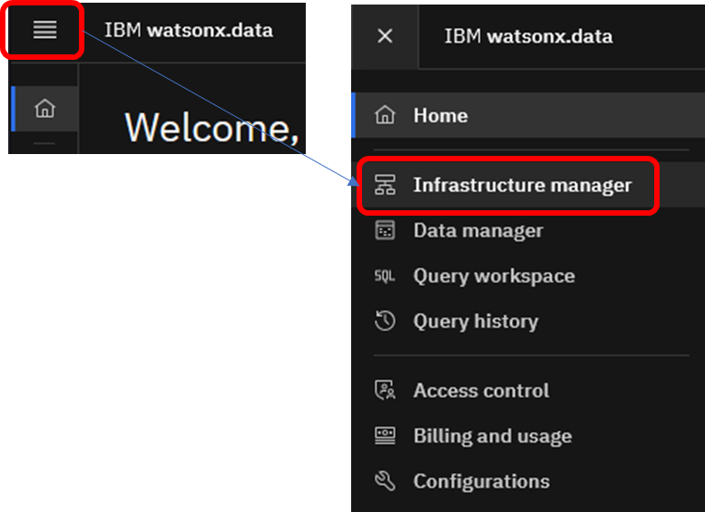

# watsonx.data (SaaS) の初期設定

ここではPresto, Milvusを追加する方法を紹介します。

watsonx.dataのインスタンスが"Active"というステータスになったら、該当インスタンスをクリックします。  

watsonx.dataのManage画面にある「Open Web Console」ボタンを押下し、watsonx.dataのコンソールを開きます。

## Step1. クイックスタート画面の起動
watsonx.data ウェブコンソールへの初回アクセス時は、自動的に下記のようなクイックスタート ウィザードが表示されます。「Next」を押下してStorage設定に進みます。  

## Step2. ICOS設定
watsonx.dataでは、データファイルを保存するためのObject Storage bucketが必要です。 新しいICOS bucketをここで作成するか、あるいは既に存在するbucketを登録することができます。  
ここでは、watsonx.dataのクイックスタート画面からCOSを作成する手順を紹介します。  

「create a new COS instance」をクリックし、COS作成画面を開きます。  

下記を設定し、「Create」を押下してストレージを作成します。  
  ・Plan：Standard (要件がある場合には適切なPlanを選択すること)  
  ・Service Name: Cloud Object Storage-xxx (任意の名前に変更が可能)  
  ・Resource Group : RG_ADMIN (先の手順で作成したリソース・グループ)  

ストレージ名が取り込まれたら「Next」を押下します。  

## Step3. カタログ設定 
次にカタログの設定を選択します。カタログは、テーブルスキーマを管理するための仕組みです。カタログ・サービスが作成された時点から、3RU/hの課金が開始します。  
  
カタログタイプにはHive, Hudi, Delta Lakeなどが選択可能ですが、ここではデフォルトのType「Apache Iceberg」を選択した状態で先に進みます。  
なお、Apache Iceberg はデータバージョン管理をサポートしているため、データの変更を時系列で追跡することが可能です。これにより、タイムトラベル照会機能を利用して、過去時点のデータを確認することが可能です。    

## Step4. エンジン設定(Presto) 
watsonx.dataで利用するエンジンを選択します。2025年7月時点で、選択可能なタイプはPresto(Java)およびPresto(C++)があります。今回はデフォルトのType「Presto (Java) v0.286」のままにしておきます。  
エンジンリソースのサイズを指定します。サイズに応じて料金が変わるので、適切なものを選択します。これもデフォルトのまま先に進みます。この場合、エンジン稼働時に2RU/hが課金されることになります。  

サマリー画面が表示されたら「Finish and go」を押下し作成を開始します。

インスタンス作成には少し時間がかかります。下記のようにProgress Barが表示されるので、処理が完了するまでお待ちください。  

## Step5. 構成の確認 
インスタンス作成が完了すると、watsonx.dataのホーム画面に戻ります。  
watsonx.dataのインフラストラクチャー構成を確認するため、「Go to infrastructure manager」をクリックします。

インフラストラクチャー構成の確認画面は、左側のメニューから「Infrastructure manager」を選択することでも遷移できます。  

エンジン・サービス層 (上段)、カタログ層(中段)、ストレージ層(下段)のコンポーネントがそれぞれ一つずつ表示されます。この画面では、Prestoエンジンが青色で表示されており、該当のエンジンが稼働中であることがわかります。

初期作成の直後でPrestoエンジンが起動中の場合には、しばらく待つと上記のように青色のアイコンに変更されます。  

## Step6. アクセス権限の設定
Prestoエンジンに関するアクセス権を設定します。Prestoのアイコンをクリックします。  
(アクセス権限は、エンジンが起動していない状態でも設定することが可能です)  
 

「Access control」タブを選択します。初期作成後は、Presto作成ユーザーだけがAdmin権限を持っています。他のユーザーにもPresto利用を可能にするには、「Add Access」ボタンを押下し、権限管理画面を開きます。  

設定管理画面で、使用を許可したいユーザーあるいはグループのチェックボックスに印を入れ、右側のRole項目でUser/Manager/Adminから権限を選択します。Userロールは、エンジンに対するワークロードの実行やUI利用は可能ですが、再始動や削除はできない権限になります。

(参考) アクセス管理の詳細を知りたい場合は、下記をご参照ください。  
ユーザー・アクセスの管理 https://cloud.ibm.com/docs/watsonxdata?topic=watsonxdata-manage_access  
ロールおよび特権の管理 https://cloud.ibm.com/docs/watsonxdata?topic=watsonxdata-role_priv  

対象ユーザーあるいはグループに権限が付与されたことを確認します。  

## Step6-1. COS ストレージ、カタログへの権限付与 
同様に、COSバケット、およびカタログへのアクセスコントロールも設定します。クイックスタート画面からCOSを新規作成した場合は、Prestoと同様に、作成者のみがアクセス可能な状態になっているため、許可ユーザーやグループを追加します。  
下記は、COSへの権限付与のイメージを示します。  

COSストレージをクリックします。  

「Add access」をクリックします。

設定管理画面で、使用を許可したいユーザーあるいはグループのチェックボックスに印を入れ、右側のRole項目でReader/Writer/Adminから権限を選択します。  
該当バケットへの書き込みを許す場合は、少なくともWriter権限が必要です。  

権限が付与されたことを確認します。  

同様に、カタログについても権限の付与を実施してください。

## Step7. Milvusの追加(オプション)  
Milvusは、ディープニューラルネットワークや機械学習で作成されたベクトルを保存、インデックス化、管理するベクトルデータベースです。Milvusを使用すると、類似性検索の使用や、生成AIとの連携が可能になります。  
ベクトルDBを使用する予定がある場合には、Milvusを追加する必要があります。

「Add Component」をクリックし、コンポーネント追加画面を開きます。

Milvusを選択します。  

設定値を入力します。
- 表示名(Display Name)： 任意の名前をつけます。ここでは"milvus-starter"としています。
- サイズ(Size)：リソースを選択します。ここでは最小サイズ(1.25RU/h)を選択しています。
- ストレージバケット(Storage bucket)：Milvusで利用するバケットを指定します。既にInfrastructure Managerに表示されているコンポーネントをプルダウンから選択可能です。
- パス(Path)：バケット内でMilvusが使用するパスを指定します。ここでは”milvus"というパス名を設定しましたが、実際にMilvusが利用する際は、このパスの下にサービスIDを示すパス名が自動で付与されます。

「Create」を押下し、Milvusをプロビジョンします。これには数分～数十分かかることがあります。  
プロビジョン開始時点で、画面右上にメッセージが表示されます。  
  

その後、プロビジョンが完了した場合には、完了を示すメッセージが表示されます。  

このようなメッセージは数秒表示された後に消えてしまいますが、画面右上の通知アイコンをクリックすると、過去の通知を確認することが可能です。  

なお、Milvusはカタログ層を定義しなくてもストレージに接続することが可能です。  
(参考：https://cloud.ibm.com/docs/watsonxdata?topic=watsonxdata-adding-milvus-service)
したがって、Infrastructure Managerで構成を確認した際は、カタログ層を介さずにMilvusからストレージへ接続する構成になります。

### Step7-1. Milvusアクセス権限の設定
Milvusの権限を設定します。Milvusのアイコンをクリックします。  

「Access control」タブを選択し、「Add Access」ボタンを押下します。  

設定管理画面で、使用を許可したいユーザーあるいはグループのチェックボックスに印を入れ、右側のRole項目でUser/Manager/Admin/Viewerから権限を選択します。Editorロールは、削除、一時停止、再開を除く大部分の処理が可能です。  

対象ユーザーあるいはグループに権限が付与されたことを確認します。 

ここまででPresto, Milvusの初期設定が完了しました。