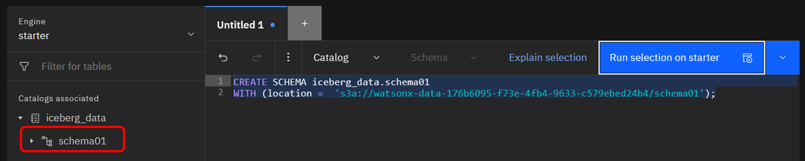
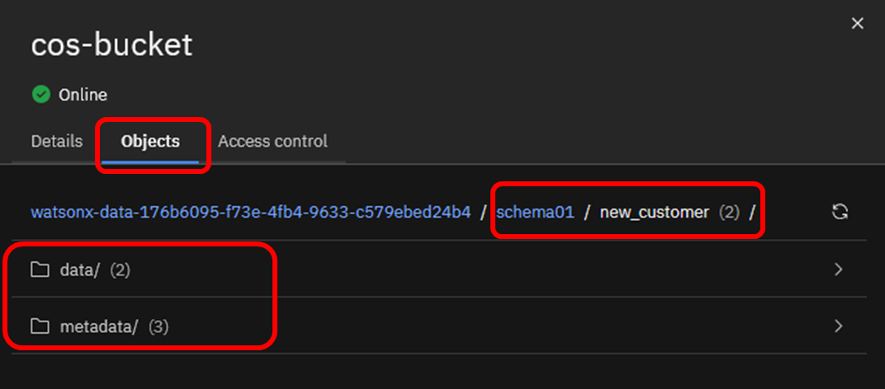

# watsonx.dataの利用方法

## Case1. Query workspaceを使ったデータの参照、テーブル作成
Prestoは、さまざまなデータ・ソースから大規模なデータを照会できる分散SQL Query Engineです。Db2やPostgreSQLのようなリレーショナルデータソースと、IBM Cloud Object StorageやHDFSのような非リレーショナルデータソースの両方をサポートしています。  

watsonx.dataのQuery Workspace(クエリー・ワークスペース)インターフェースを使用して、データをSQLで照会することができます。  

### Query workspaceの起動
watsonx.data画面左上のナビゲーション・メニューから「Query Workspace」を選択します。  


Query workspace画面の左側はナビゲーションペインになっています。複数エンジンが存在する場合、画面左上からエンジンを選択することが可能です。この画面ではstarter(Presto)が選択された状態です。  
その下には、エンジンに関連付けられたカタログ「iceberg_data」が表示されています。  


カタログの下にはSample and benchmarking dataが表示されています。これは、ベンチマーク用に用意されたデータであり、デフォルトで提供されています。今回はtcphデータセットを用いてSQL照会を実行します。

(補足) tcphは、トランザクション処理評議会(TPC)によって維持される意思決定支援ベンチマーク用のデータ群です。顧客、サプライヤー、注文、部品番号などのテーブルが含まれており、sf1, sf100などのスキーマ名はデータのスケール(サイズ)を表しており、sf100はsf1の100倍のデータを含みます。  

### 照会クエリの実行
tpch -> sf1 -> customer と順にクリックし、データセットを展開します。  
ナビゲーションペイン上で、customer表の列定義を確認できます。


customer表に対してSQLを実行する場合、自分で自由にSQL文を記述することも可能ですが、オブジェクトのテンプレートを使用して、より容易にSQLステートメントを作成することが可能です。
customer表の右側に表示されている </> という記号をクリックし、「Generate SELECT」を選択すると、右側のSQLエディタペインにSQLの雛形が挿入されます。


挿入されたSQL文は下記のように、"LIMIT 10"(10行のみ結果を取得する)が付与されています。問題なければ右側の「Run selection on starter」をクリックします。
```
SELECT
  *
FROM
  "tpch"."sf1"."customer"
LIMIT
  10;
```


クエリが完了すると、結果がパネルの下部に表示されます。  


### Iceberg テーブルの作成(CTAS)
starterエンジンに紐づいているiceberg_catalogは、初期作成直後のため、まだデータが含まれていません。ここに、customer表からコピーした新しい表を作成します。  

まず、iceberg_catalogにスキーマを作成します。スキーマは、表などのオブジェクトを作成するための名前空間です。ここでは、schema01というスキーマを作成し、その後で表を作成します。

iceberg_catalogの右側メニューから、「Generate CREATE...」をクリックします。  


すると、右側のペインにCREATE SCHEMA文の雛形が挿入されます。  
「<schema_name>」と表示されている部分を、自分が作成したいスキーマ名である"schema01"に変更し,「Run on starter」でCREATE文を実行します。


```
CREATE SCHEMA iceberg_data.schema01 
WITH (location =  's3a://watsonx-data-176b6095-f73e-4fb4-9633-c579ebed24b4/schema01');
```
CREATE文から明らかなように、このスキーマに作成される表の実体は、該当カタログに紐づくCOS bucket の schema01/という仮想ディレクトリ配下に格納されることになります。
スキーマ作成が完了すると、左側のナビゲーションペインに「schema01」が表示されます。  


作成したスキーマ配下にテーブルを作成します。  
元にするテーブルは先ほどのcustomerを利用し、新しく作成されるテーブルはnew_customerという名前にします。
```
create table if not exists iceberg_data.schema01.new_customer as select * from tpch.sf1.customer;
```
(参考)このCREATE TABLE ... AS SELECT のように、クエリ結果から表を複製する方式を、一般にCTASと呼びます。 


クエリが成功すると、右下に緑色のチェックマークと、SQL実行時間が表示されます。
そのすぐ下に実行結果が表示され、今回は「150000」行がコピーされたことが分かります。  


COSに格納された実体は、Infrastructure managerから確認できます。 
Infrastructure managerで該当のcos-bucketをクリックします。  


Objectsタブを辿ると、スキーマ名およびCOSのパス名に指定した「schema01」、テーブル名「new_customer」の下に、「data」と「metadata」が存在します。  


data配下には、実際の表データを列編成で保持するParquetファイルが格納されています。  
metadata配下には、Icebergが使用する一連のメタデータ(列名や属性など)が含まれます。    


## Case2. ベクトルデータの利用
Milvusを使用すると、ベクトル化されたデータの保管・検索が可能になります。  
watsonx.dataで定義済のMilvusに接続するためには、下記の情報が必要です。
  - GRPCホスト名
  - GRPCポート
  - 接続ユーザー
  - パスワード

GRRPは、分散サービスが通信できるようにするために使用される、リモートプロシージャーコール(RPC)のプロトコルです。当初はGoogleによって開発され、現在はCloud Native Computing Foundation（CNCF）によって管理されています。  

GPRCホスト名とポートは、watsonx.dataコンソールのInfrastructure Managerから取得できます。  
Milvusサービスをクリックします。


View connect details(接続の詳細)をクリックします。


詳細接続情報の「GRPC」セクションを開き、「GRPC host」と「GRPC port」をコピーします。


接続ユーザーは、ibmlhapikey または ibmlhapikey_{cloud-account-email-address}が利用できます。ここで、{cloud-account-email-address}は、該当アカウントで使用しているEメールアドレスに読み替えて下さい。  
     例：ibmlhapikey_NAME@abc.com

パスワードは、それぞれのユーザーのAPI Keyを使用します。  
API Keyを作成するには、IBM CloudのManage → Access(IAM) から作成します。  


左側のメニューで「API Keys」を選択し、「Create」ボタンを押下します。


任意の名前をつけてAPI Keyを作成します。  
ここでは、例としてAPIkey20250729という名前で作成しています。    


API Keyを「Copy」(クリップボードに文字列をコピー)、あるいは「Download」(JSON形式ファイルをローカルPCにダウンロード)のいずれかで保管します。  
この操作は、API Key作成後、300秒以内に実施する必要があります。  
もし300秒が経過してしまった場合には、新しくAPI Keyを作成し直してください。


(補足)  
2025年7月時点では、Milvusへの接続ユーザー名に ibmlhapikey を利用することが可能です。ただし、watsonx.data 2.2のリリースノートには下記の記載があります。  
https://cloud.ibm.com/docs/watsonxdata?topic=watsonxdata-release

>ユーザ名として ibmlhapikey と ibmlhtoken を使用するユーザ認証方法は、現在非推奨となっており、将来のリリースで削除される予定です。 代わりに ibmlhapikey_username と ibmlhtoken_username が使えます。 

これで、Milvus接続に必要な情報(GRPCホスト名/ポート、ユーザー/パスワード)を入手できました。  
この情報を使ってMilvusへ接続します。今回はPython(pymilvus)を使用します。  
Python実行環境を起動するため、watsonx.dataのメニュー下部の「watsonx」を選択してください。  


watsonxへのログイン画面が表示されたら、リージョンとIBMidを利用し、ログインを継続します。  


watsonx.dataのWelcome画面が表示されます。初回アクセス時は下記のようなメッセージが表示されます。Termsを確認後チェックボックスをクリックして下さい。簡単なUI紹介のツアーをスキップして良い場合は、右上のボタンからこのダイアログを閉じることができます。  


NotebookからMilvusに接続するPythonコードを作成するため、Projectを作成します。左上のナビゲーションメニュー(4本線)をクリックし、「Project」→「View all projects」を選択してください。    


新しいプロジェクトを作成します。「New Project」を押下してください。


任意のプロジェクト名を入力し、このプロジェクトで使用するCOSバケットが選択されていることを確認したら、「Create」ボタンを押下し、プロジェクトを作成します。  
利用可能なCOSが存在する場合には、自動で表示されています。もしCOSが存在しない場合には、「Add」というボタンを押下し、この時点でCOSを作成することも可能です。  


プロジェクトを作成したら、下記ファイルを指定し、Jupyter Notebookの資産を作成します。  
[Sample_milvus.ipynb](./sample-milvus.ipynb)  
このNotebookを使用して、以下の処理を確認できます。
- Milvusへの接続
- コレクションの作成
- ベクトルデータの作成
- データ投入
- インデックスの作成
- 投入済データの確認
- ベクトル検索の実行


---
## 補足

### エンジン・サービスの一時停止/再開
watsonx.dataのエンジン・サービスを一時停止すると、RU使用量を削減することができます。  
ただし、メタデータの管理やアクセス・コントロールを実施するためのサポート・サービスというコンポーネントは常時稼働し、停止させることはできません。そのため、すべてのエンジンやサービスをPause状態にしても、watsonx.dataで消費されるRUはゼロにはなりません。  

サービスやエンジンを一時停止する方法を以下に示します。

watsonx.dataのインフラストラクチャー・マネージャー画面で、エンジンやサービスのアイコンをマウスオーバーすると、「Pause」ボタンが表示されます。これをクリックすると、サービスを一時停止することができます。  


確認ダイアログが表示されたら、「Pause」を押下します。  


停止されている状態でアイコンをマウスオーバーすると「Pausing」と表示されます。  


再度起動したい場合は、「Resume」ボタンから再開できます。  


停止や起動が完了するまでには、少し時間がかかる場合があります。このような場合、左側のマークが点滅し、マウスオーバーすると「Resuming」などと表示されます。  


