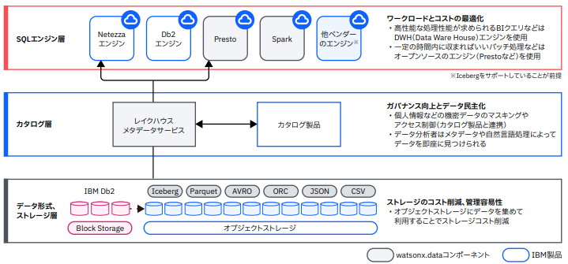

# watsonx.data

> 本ガイドは、watsonx.data のオンボーディングのために作成されています。
> 手順や画面が本ガイドと一致しない場合は、**IBM の最新ドキュメントや公式ガイドラインを必ず参照**し、最新版に沿った対応を行ってください。

## What is watsonx.data?

※当記事の記載内容は2025年7月時点の情報に基づきます

watsonx.dataは、あらゆる場所のデータをAIや分析に活用することができるデータレイクハウスです。  
単一のプラットフォームで、各種データの収集・保管・照会・分析に利用することが可能になります。  
  - データ形式はオープンなデータフォーマット(Iceberg形式など)に対応  
  - 複数のクエリーエンジン(Presto、Sparkなど)による検索が可能  
  
データ層とエンジン層の間にカタログ層を配置し、データとエンジンを疎結合にすることで、データ処理の実行時に「性能を重視した高性能なエンジンを利用する」「安価なエンジンを利用する」といった選択も可能になります。これにより、単一のプラットフォームを用いて、最適なコストでデータを活用することに貢献できます。  

詳細は[こちら](https://www.ibm.com/jp-ja/products/watsonx-data)をご覧ください。

参考：[IBM® watsonx.data の概要](https://cloud.ibm.com/docs/watsonxdata?topic=watsonxdata-wxd_ov) 

## Onboarding Process

watsonx.data のオンボーディングプロセスは、以下の4つの領域に分かれています：

1. インスタンスを立てる

    1. [IBM Cloudログイン](../watsonx-ai/01_instance/01_ibmcloud_login/)
    1. [サブスクリプションコードの適用](../watsonx-ai/01_instance/02_subscription_code/)
    1. [リソース・グループの作成](../watsonx-ai/01_instance/03_resource_group/)
    1. [インスタンスの作成](../watsonx-ai/01_instance/04_create_instance/)
    1. [アクセス・グループの作成と権限設定](../watsonx-ai/01_instance/05_access_group/)
    1. [アクセス・グループへのユーザー追加](../watsonx-ai/01_instance/06_access_group_user/)
    
2. watsonx.dataのセットアップ

    1. [watsonx.dataの初期設定](../watsonx-orchestrate/02_setup/setup/)

3. watsonx.dataの使い方

    1. [watsonx.dataの利用方法](../watsonx-orchestrate/03_usecase/usecase04/)

それぞれのステップに関する情報、ガイド、参考リンクについては、該当するリンクを選択してください。