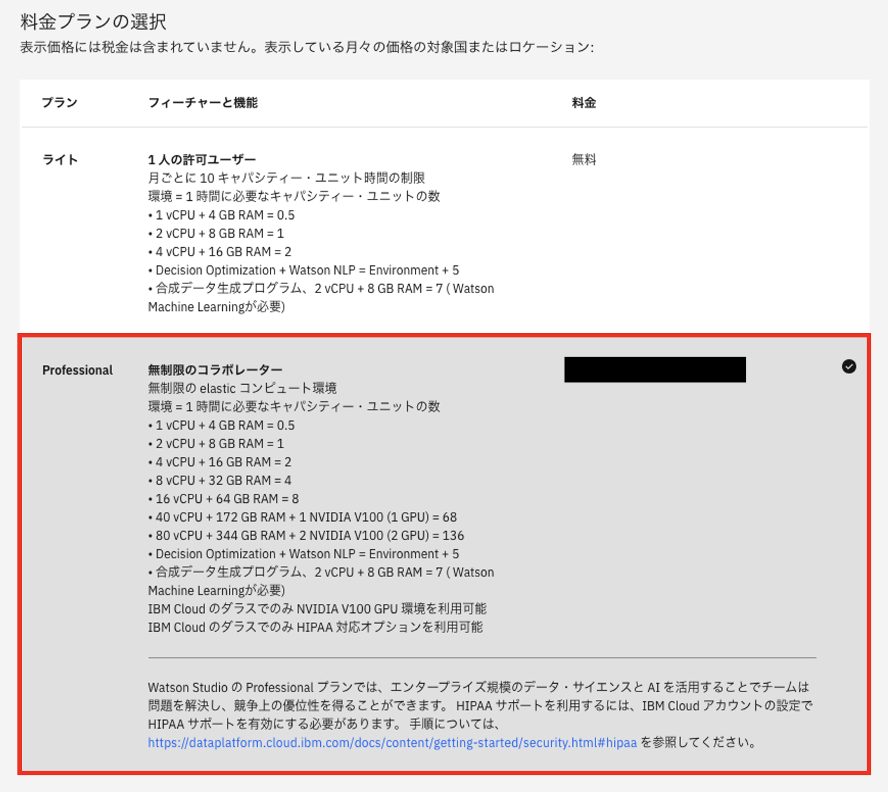

# プロビジョニング

プロビジョニングフェーズでは、以下の流れとなります。

1. [IBM Cloudログイン](../../watsonx-ai/01_instance/01_ibmcloud_login/)
2. [サブスクリプションコードの適用](../../watsonx-ai/01_instance/02_subscription_code/)
3. [リソース・グループの作成](../../watsonx-ai/01_instance/03_resource_group/)
4. 各種インスタンスの作成
    - IBM Cloud Object Storage の作成
    - watsonx.ai Runtime（Watson Machine Learning）の作成
    - watsonx.ai Studio の作成
    - watsonx.governance の作成
    - watsonx.governance Openscale のセットアップ
5. [アクセス・グループの作成と権限設定](../../watsonx-ai/01_instance/05_access_group/)
    - リソース・グループ
    - 使用額参照
6. [アクセス・グループへのユーザー追加](../../watsonx-ai/01_instance/06_access_group_user/)

## watsonx.ai Studio

1. 画面上の検索ボタンをクリックする

2. 表示された入力欄に **watsonx.ai Studio** と入力し、数秒後に表示される **カタログ結果** 欄の **watsonx.ai Studio** をクリックする

3. 作成するインスタンスの条件を指定する
   
   1. **ロケーションの選択** セクションで、使用するリージョンを選択する
      
      1. ダラスの場合  
      **ダラス (us-south)** を選択する
      
 
      1. 東京の場合  
      **東京 (jp-tok)** を選択する
      
    
    1. **料金プランの選択** セクションで、 **Professional** を選択する
    
    
    1. **リソースの構成** セクションで、サービス名に **watsonx.ai Studio-XXXXX** を入力(XXXXXは任意の文字列)、リソース・グループの選択で前で作成した **RG_XXXXX** を選択する。タグは空欄でOK
    

4. 画面右の要約欄で **以下のご使用条件を読み、同意します｡** にチェックを入れ、**作成** ボタンをクリックする

5. 作成した **watsonx.ai Studio** の詳細画面に自動的に遷移したら完了

## watsonx.ai Runtime (Watson Machine Learning)

1. 画面上の検索ボタンをクリックする

2. 表示された入力欄に **watsonx.ai Runtime** と入力し、数秒後に表示される **カタログ結果** 欄の **watsonx.ai Runtime** をクリックする

3. 作成するインスタンスの条件を指定する

    1. **ロケーションの選択** セクションで、使用するリージョンを選択する

        - ダラスの場合   
        **ダラス (us-south)** を選択する
        

        - 東京の場合   
        **東京 (jp-tok)** を選択する
        

    2. **料金プランの選択** セクションで、使用するプランを選択する

        - Essentials の場合   
        **Essentials** を選択する
        

        - Standard の場合   
        **Standard** を選択する
        

    3. **リソースの構成** セクションで、サービス名に **Watson Machine Learning-XXXXX** を入力(XXXXXは任意の文字列)、リソース・グループの選択で前で作成した **RG_XXXXX** を選択する。タグは空欄でOK
    

4. 画面右の要約欄で **以下のご使用条件を読み、同意します｡** にチェックを入れ、**作成** ボタンをクリックする

5. 作成した **watsonx.ai Runtime** の詳細画面に自動的に遷移したら完了

## Cloud Object Storage

1. **起動** セクションで **IBM watsonx** をクリックする
 

2. 新たに表示されたwatsonxタブを選択し、右上の「×」ボタンをクリックする
 

3. **さらに詳しくみる** のポップアップが出てくるので、右上の「×」ボタンをクリックする
 

4. 作業用のプロジェクトを作成するために、左上のハンバーガーメニューをクリックする
 

5. **プロジェクト** セクションで **すべてのプロジェクトの表示** を選択する
 

6. **新規プロジェクト +** をクリックする
 

## watsonx.governance
1. 画面上の検索ボタンをクリックする

2. 表示された入力欄に **watsonx.gov** と入力し、数秒後に表示される **カタログ結果** 欄の **watsonx.governance** をクリックする

3. 作成するインスタンスの条件を指定する
   
   1. **ロケーションの選択** セクションで、使用するリージョンを選択する
      
      1. ダラスの場合  
      **ダラス (us-south)** を選択する
 
    2. **料金プランの選択** セクションで、 **基本情報** を選択する
    
    3. **サービス名** セクションで、サービス名に **watsonx.governance-XXXXX** を入力(XXXXXは任意の文字列)、リソース・グループの選択で前で作成した **RG_XXXXX** を選択する。タグは空欄でOK

4. 画面右の要約欄で **以下のご使用条件を読み、同意します｡** にチェックを入れ、**作成** ボタンをクリックする

5. 作成した **watsonx.governance** の詳細画面に自動的に遷移したら完了

## watsonx.governance　OpenScale
1. リソースリストから作成したwatsonx.governance を選択

2. ドロップダウンリストから「Watson OpenScaleで起動」を選択

3. 「自動セットアップ」をクリック (＊数十分かかります)

