# 基本操作

watsonx.governanceのガバナンス・コンソールの基本操作を紹介します。

1. watsonx.governanceへのログイン
2. ロケール（表示言語）の変更
3. ダッシュボードの操作
4. watsonx.governanceからのログアウト
   
## watsonx.governanceへのログイン

1. 以下のURLへアクセスしIBM Cloudへログインします。
   
    - https://cloud.ibm.com/login

  ログインに成功するとIBM Cloudのダッシュボード画面が表示されます。

  上記URLへアクセスできない、もしくはログインに失敗する場合は、IBM担当者もしくはIBMサポートまでご連絡ください。
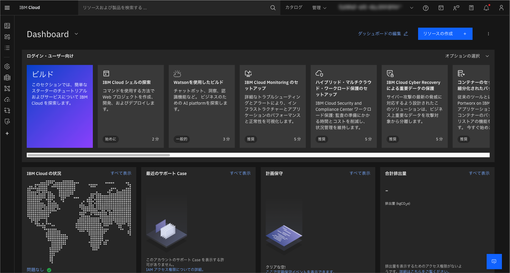

  ※画面右上で設定されているアカウントが[（今回対象となっているアカウント）] となっていることをご確認ください。もし異なる場合は、ドロップダウンリストより上記のアカウントを選択してください。

2. 左側のメニューより、[リソースリスト] をクリックし、表示されたリストより、 [AI/機械学習 ＞ OpenPages-j0] をクリックします。
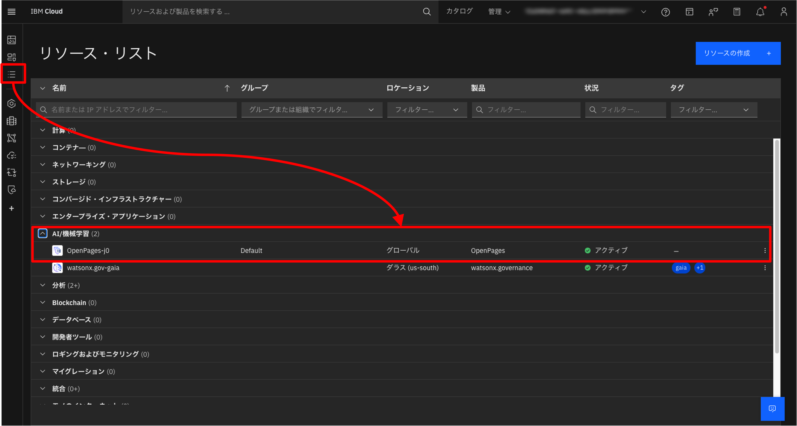

3. 画面左側の [Environment] をクリックし、表示されたURLをクリックします。このURLをBookmark等に登録しておくことで、直接このURLからもwatsonx.governanceへアクセスすることができます。
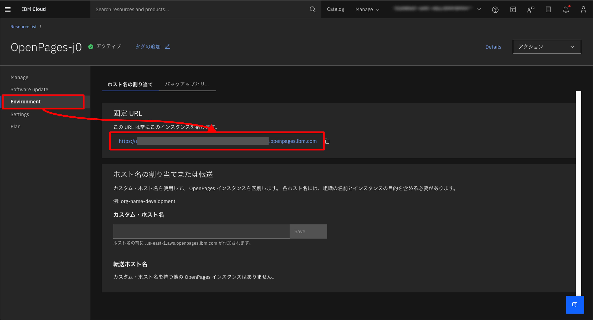

4. ガバナンス・コンソールが表示されます。
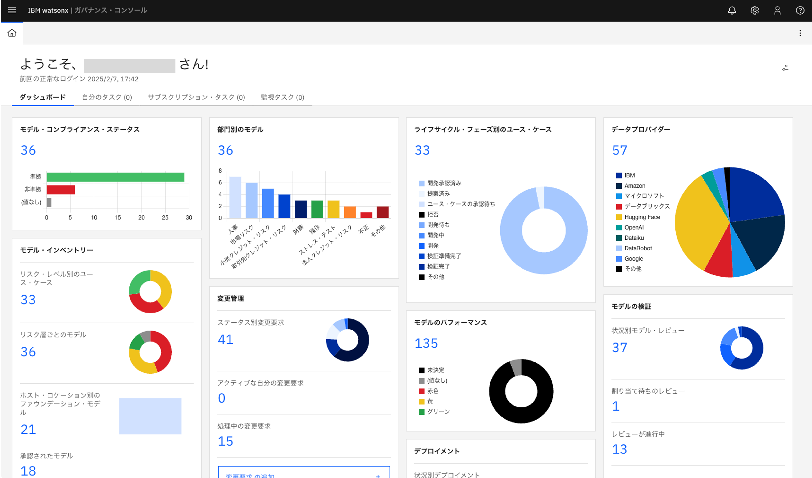

## ロケール（表示言語）の変更

1. ガバナンス・コンソールの画面右上から プロファイルのアイコンをクリックし、表示されたメニューより [ロケールの変更] をクリックします。
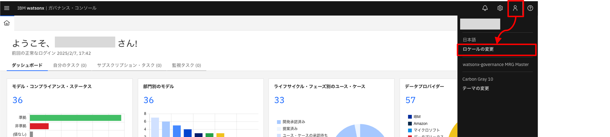

2. 任意のロケール（表示言語）を選択し、 [保存] ボタンをクリックします。
   
   ※ロケールを変更した場合、ガバナンス・コンソール内で開いていたタブはすべて閉じますのでご注意ください。
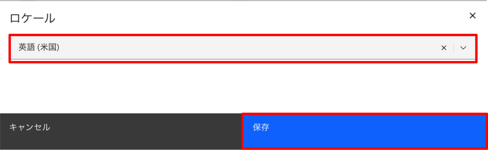

※下記のようなメッセージが表示された場合、メッセージを [x] で閉じ、再度ロケールの変更を行ってください。
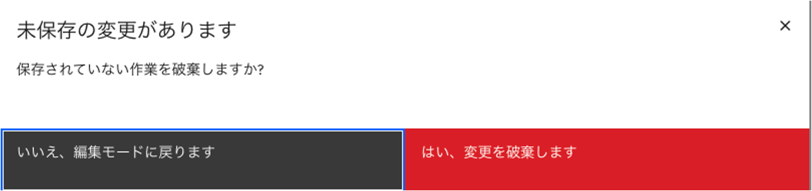

## ダッシュボードの操作

ダッシュボード上の任意のチャートをクリックすると該当データ詳細を確認することができます。

チャートをクリックすることで該当データの一覧が表示され、一覧をクリックすると詳細画面へ遷移します。

例: 青い数字（該当データの全件数）をクリックすると、全件表示されます。
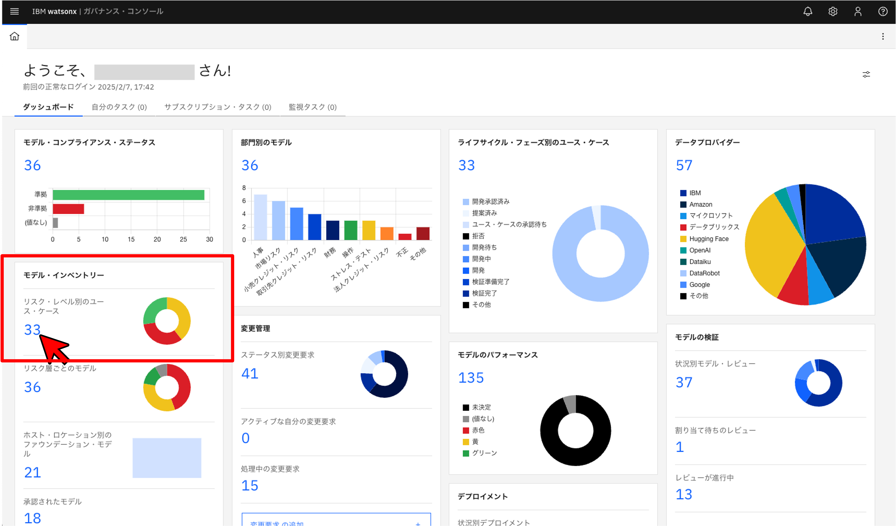

例: ドーナツグラフの赤い部分をクリックすると、リスク・レベル「高」のユースケースのみが表示されます。
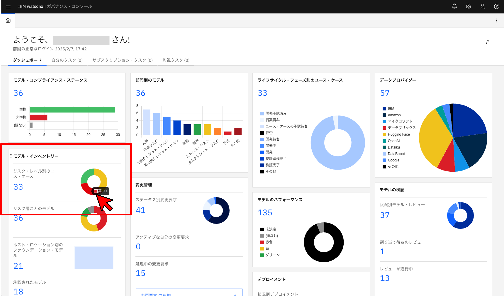
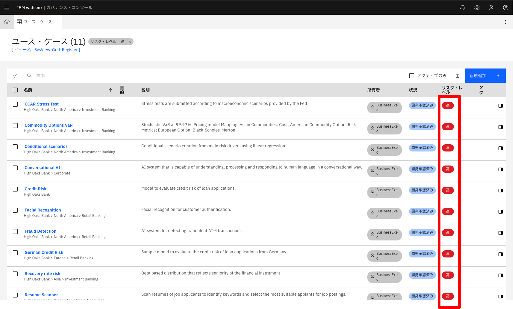

## watsonx.governanceからのログアウト

ガバナンス・コンソールの画面右上から プロファイルのアイコンをクリックし、表示されたメニューから [ログアウト] をクリックします。

※IBM Cloudからもログアウトされます。
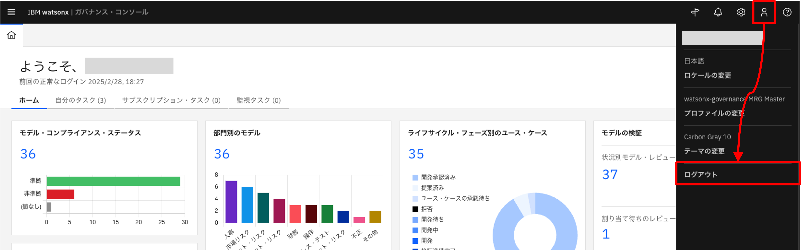
