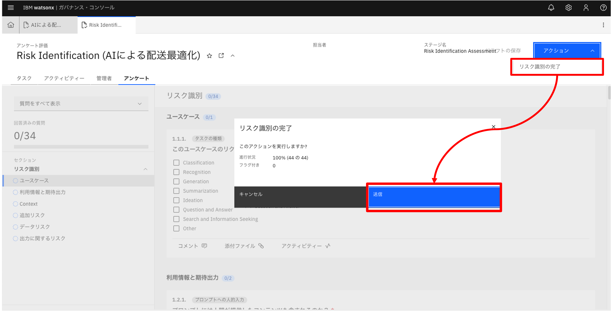

# ワークフロー

ユースケース策定時のリスク評価の標準的な流れとして、

本章で承認ワークフロー（ユースケース起票〜開発承認まで）の実行手順を紹介します。

## ユースケース策定〜開発承認ワークフローの実行

1. ユースケースを新規作成します。ダッシュボードより [ユース・ケース の追加] をクリックします。

2. 新規ユース・ケース作成画面で必要な情報を入力し [保存] ボタンをクリックします。
  - [所有者] には自分のユーザーを指定します。
  - 入力必須項目は [★] が付与されています。
  - 画面右側のガイドエリアをクリックすると該当項目にフォーカスが移動します。入力補助にご利用いただけます。

3. データが保存されると、承認ワークフローが自動的に起動されます。ワークフローの状態は画面右側に表示されます。

ワークフローがデータ収集に進んでいることが確認でき、[状況] が「提案済み」に更新されていることが確認できます。

ユースケースの状況は、ワークフロー機能により自動的に更新されるよう構成されています。

4. 画面右上 [アクション] をクリックし、[初期承認のための送信] をクリックします。

watsonx.governanceでは、ワークフローを次に進める操作を 「アクション」 と呼んでいます。

アクション実行の確認ダイアログが表示されます。ここでは [続行] をクリックします。

他のアクション実行時でも下記ダイアログが表示されますが下記 [続行] 等の操作は共通となります。
  - [続行] ：アクションが実行され、現在表示しているタブはそのまま残ります。
  - [続行してタブを閉じる]：アクションが実行され、現在表示しているタブは閉じられます。
  - アクションをキャンセルする場合、右上の [x] をクリックします。

5. ワークフローステージが「ユースケースの承認待ち」となり、状況も「ユース・ケースの承認待ち」に更新されていることが分かります。

6. ユースケース情報を下へスクロールすると、[リスク] セクションに「Risk Identification（ユースケース名）」、[規制情報] セクションに「Applicability Assessment（ユースケース名）」が割り当てられていることが確認できます。

これらは、それぞれアンケート形式の質問群となっています。アンケート名をクリックすると、回答画面へ遷移します。

  - Risk Identification：該当ユースケースにおけるリスク識別のためのアンケートです。アンケートに回答することにより、ユースケースで評価すべきリスクを自動的に割り当てます。対象となるリスクはIBM Risk Atlasの定義を用います。

  - Applicability Assessment：EU AI Actのリスクレベル判定のためのアンケートです。アンケートに回答することにより、EU AI Actのリスクレベル（禁止、高、制限、最小、範囲外）を自動判定します。

7. ホーム画面に戻り [自分のタスク] タブで割り当てられているタスクを確認することができます。

watsonx.governanceではワークフロー実行により、担当者へタスクを割り当て、状況を確認することができます。タスク割り当て時にメール通知を行うこともできます。

8. それぞれのアンケートに回答します。画面左側が進捗状況、画面右側が質問回答エリアになります。

回答は、[ドラフトの保存] ボタンをクリックすることで途中の状態を保存できます。また、一定のタイミングで自動保存されます。

9. 途中、コメントを求められる質問があります。[コメント] をクリックし入力後、右側の [→] をクリックします。

10. 全ての質問に回答したら、画面右上の [アクション] より、[リスク識別の完了] をクリックします。

全ての質問に回答していない場合、下記のメッセージが表示されます。画面左側の進捗状況エリアで未回答の質問を確認します。

11. ユースケース画面に戻ります。Risk Identificationアンケート回答内容に応じて、評価対象となるリスクが自動的に割り当てられていることが確認できます。

12. ユースケース画面をさらに下にスクロールし、[関連付け] セクションのツリー図でも、このユースケースにリスクが複数関連付けられていることが確認できます。ツリー図は、該当データと関連するデータを視覚的に把握するために用いることができます。ツリーに表示されているデータ名称をクリックすることで詳細を確認することもできます。

例えば、ツリー図でリスク名称をクリックするとを該当リスク情報が画面右側に表示されます（下図の例では「データポイズニング」をクリックしています）。

13. 割り当てられたリスクの評価を行います。リスクの行をクリックすると、リスク詳細画面へ遷移します。

画面右上の [アクション] より [Model Risk Assessment の開始] をクリックします。

14. リスク内容を確認し、評価対象かを確認後、画面右上のボタンよりアクションを実行します。
  - [Ready for Assessment]：リスク評価対象とし後続の評価へ進みます。
  - [Risk Not Applicable]：評価対象外のリスクの場合、評価を終了します。この場合、リスクの [状況] は「適用外」に更新されます。

[Ready for Assessment]を選択します。

15. [Ready for Assessment] を選択した場合、リスクに対する対応を選択します。

    リスクの受容方法は、「受け入れ」「回避」「軽減」「転嫁」から選択します。

ここで「軽減」を選択します。

17. 次に評価結果を登録し [保存] をクリックします。

  - 固有リスク：該当リスクが本来持っているリスクの大きさを評価します。
  - 緩和戦略：固有リスクを軽減するための戦略を記入します。
  - 残存リスク：固有リスクに対し緩和戦略を適用後に残っているリスクを評価します。

17. 画面右上の [アクション] より [Assessment Complete] をクリックします。

18. リスク評価が完了し、[状況] が「承認済み」に更新されます。

19. その他の割り当てられたリスクに関しても評価を完了します。ワークフローを次に進めるために関連付けられているリスクの [状況] が 「承認済み」もしくは「適用外」となっている必要があります。

20. ユースケース画面で、[Applicability Assessment（ユースケース名）] をクリックし、アンケート回答画面へ遷移します。Risk Identificationアンケート同様回答を記入します。

21. 全ての回答を記入したら、画面右上の [アクション] より、[適用性評価の完了] をクリックします。

ユースケース画面に戻ると、[EU AI リスク・カテゴリー] がアンケート回答に従い更新されていることが確認できます。

（以下の例では「高」リスクと判断されています。）

22. リスク評価が完了したら、次は利害関係者のレビューに進みます。

ユースケース画面で [利害関係者の部門]、「基盤モデルを使用」を更新し、[保存] をクリックします。

23. ここでは、画面右上の [アクション] より、[利害関係者のレビューを依頼] をクリックします。

※EU AI リスク・カテゴリーが [禁止] の場合、利害関係者のレビューへ進むことはできません。

選択した利害関係者部門用の承認用データが自動的に関連付けられます。

  - [ユースケースの拒否]：該当ユースケースを却下し、承認フローを終了します。
  - [所有者に戻る]：所有者に差し戻しを行い、評価結果の見直しを実施します。
  
作成された承認用データをクリックするとレビュー用の画面に遷移します。ここでは「情報セキュリティー」部門のデータをクリックします。

25. [レビュアー] を設定します。ここでは仮で自分のユーザーを設定します。

レビュアーは、[レビュー・コメント]、[リスク評価] を記入します。

記入したら画面右上 [アクション] より、[ユースケースの承認] をクリックします。

[ユース・ケースの拒否] を選択した場合、該当ユースケースは却下されます。

26. [承認状況] が、「承認待ち」から「承認済み」へ更新されます。同様に他の利害関係者レビューも実施します。

27. 全ての利害関係者レビューが完了したら、画面右上の [アクション] より、[開発の承認] をクリックします。

[状況] が「開発承認済み」に更新され、該当ユースケースのモデル開発に進むことができるようになります。

承認ワークフロー（ユースケース起票〜開発承認まで）は以上となります。
