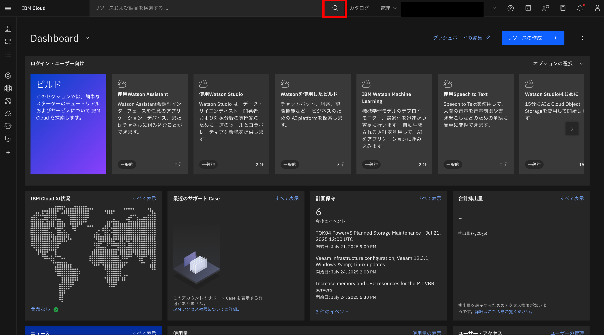
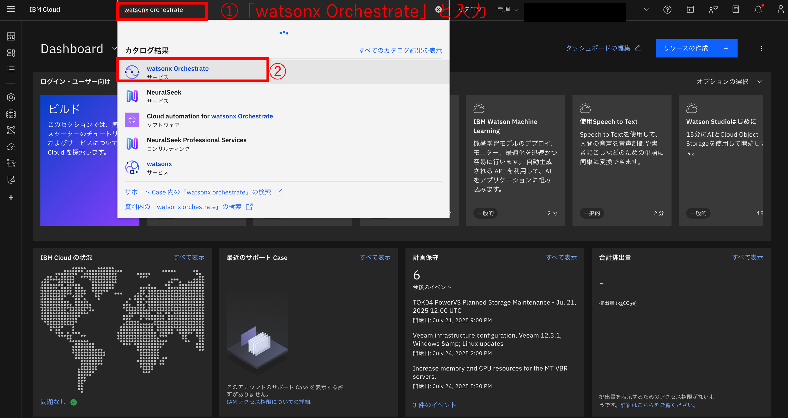
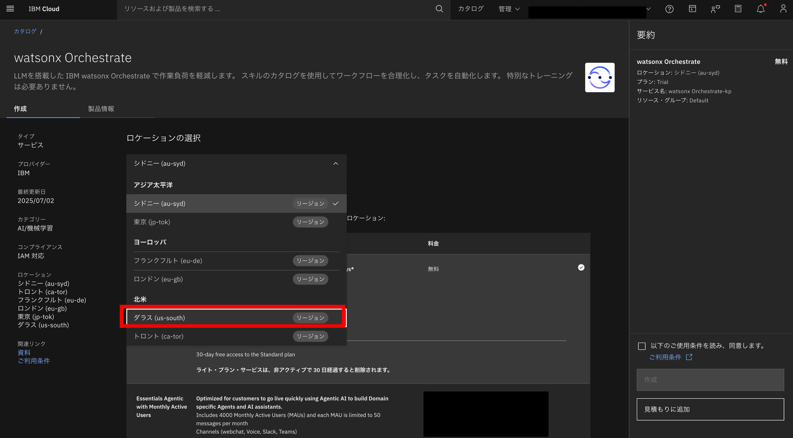
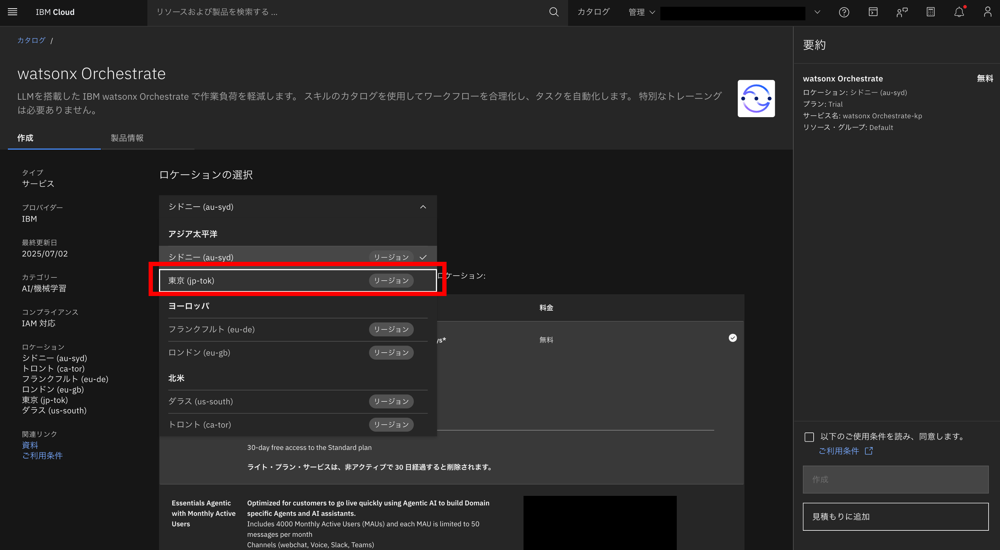
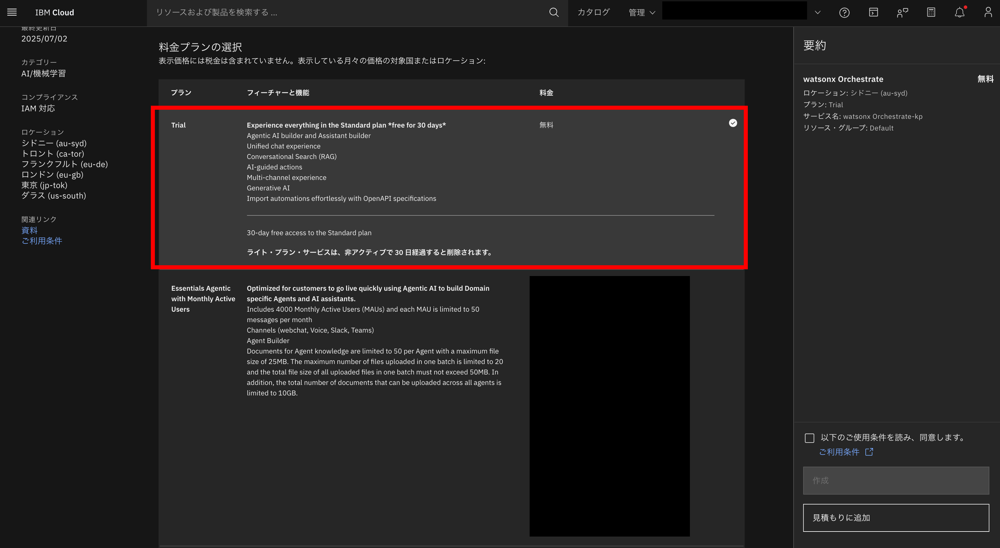
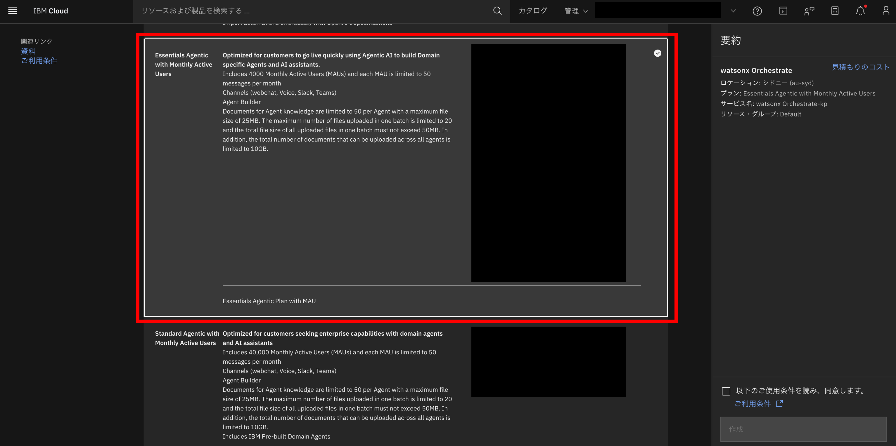
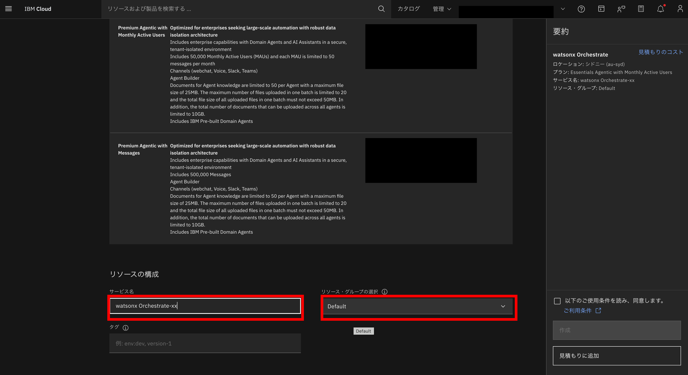
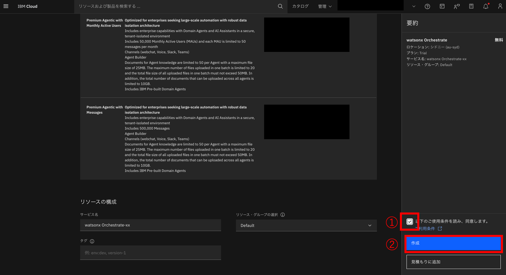

# インスタンスの作成

1. 画面上の検索ボタンをクリックする

1. 表示された入力欄に **watsonx Orchestrate** と入力し、数秒後に表示される**カタログ結果**欄の**watsonx Orchestrate**をクリックする

1. 作成するインスタンスの条件を指定する
   1. **ロケーションの選択** セクションで、使用するリージョンを選択する
      1. ダラスの場合  
      **ダラス (us-south)** を選択する

      1. 東京の場合  
      **東京 (jp-tok)** を選択する

   1. **料金プランの選択** セクションでプランを選択する
      1. **Trial（トライアル）**を選択する

      1. **Essentials Agentic**を選択する
     
   1.  **リソースの構成** セクションで、サービス名に **watsonx Orchestrate-xx** を入力(xxは任意の文字列)、リソース・グループの選択で**Default**もしくは前で作成した **RG_XXXXX** を選択する。タグは空欄でOK
     

1. 画面右の要約欄で **以下のご使用条件を読み、同意します｡** にチェックを入れ、**作成** ボタンをクリックする
     
これで watsonx Orchestrate のインスタンスがプロビジョニングされ、サービスページが表示されます。
1. 「Launch watsonx Orchestrate（watsonx Orchestrate を起動）」をクリックして、サービスを開始
     

<!-- 

  - プラン：Trial（トライアル）を選択
  - サービス名：自動で入力されていますが、必要に応じて変更可能
  - リソースグループ：Default に設定されています
- ライセンス契約に同意し、「Create（作成）」をクリック
  - これで watsonx Orchestrate のインスタンスがプロビジョニングされ、サービスページが表示されます
- 「Launch watsonx Orchestrate（watsonx Orchestrate を起動）」をクリックして、サービスを開始 -->
