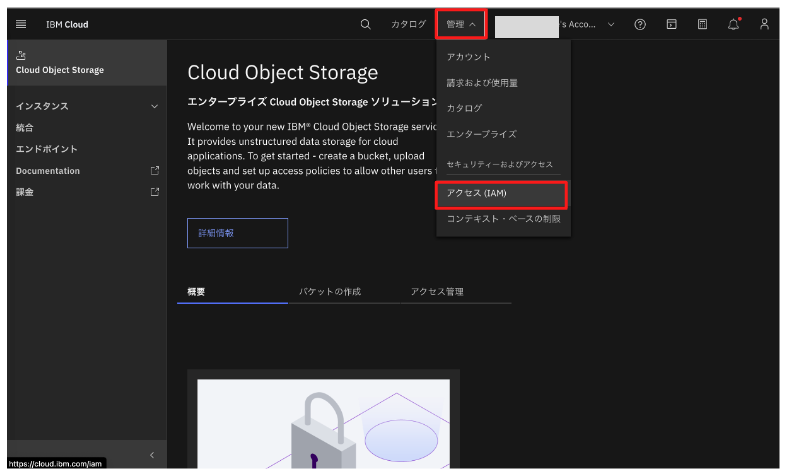
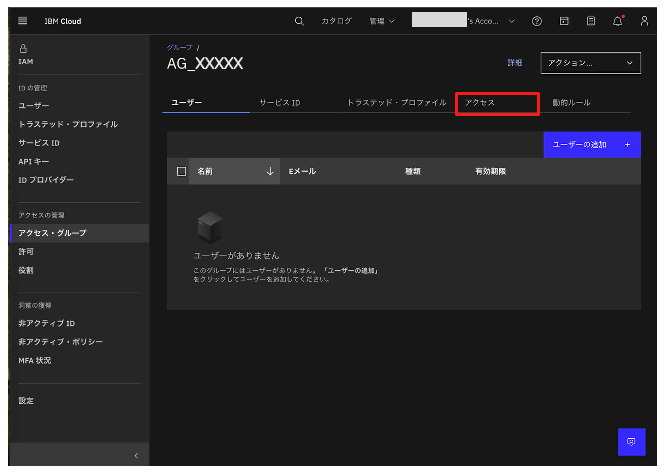
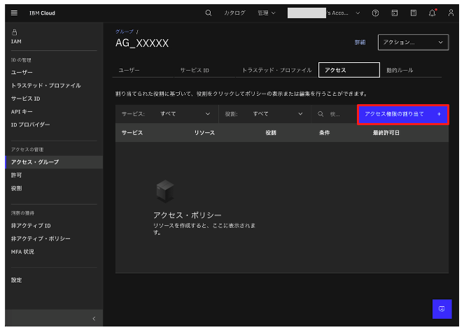

# アクセス・グループの作成

1. 画面右上「管理」→「アクセス(IAM)」をクリックします｡
 
1. 画面左側のメニューから「アクセス・グループ」をクリックします｡

1. 「作成」ボタンをクリックします｡
 
1. 名前に「AG_XXXXX」と入力し､「作成」ボタンをクリックします｡
 

1. 「AG_XXXXX」アクセス・グループが作成されます｡「アクセス」タブをクリックします｡
 

1. 「アクセス権限の割り当て」ボタンをクリックします｡
 
<!-- 
#### リソース・グループ
1. サービスセクションで「リソース・グループのみ」を選択します｡「次へ」ボタンをクリックします｡
 

1. リソースセクションで「条件の追加」ボタンをクリックします｡属性タイプに「リソース・グループ」を選択します｡値に「RG_XXXXX」を入力します｡「次へ」ボタンをクリックします｡
 

1. 「リソース・グループ・アクセス」セクションで「ビューアー」と「エディター」をチェックします｡ 「次へ」ボタンをクリックします｡
 

1. 条件(オプション)セクションで､「レビュー」ボタンをクリックします｡
 

1. 「追加」ボタンをクリックします｡画面右「アクセス・サマリー」に設定内容が追加されます｡「割り当て」ボタンはまだクリックしないでください｡続けて､watsonx Orchestrateのポリシーの追加を行います｡
  -->

#### watsonx Orchestrate
1. サービスセクションで「watsonx Orchestrate」を入力し､一覧に表示された「watsonx Orchestrate」を選択します｡「次へ」ボタンをクリックします｡
 

1. 「リソース」セクションでは、「アクセス権限の範囲の指定」で「特定のリソース」を選択します。
次に、以下のように設定を行います：
- 属性タイプに「Instance Name」を指定します。
- オペレーターに「string equals」を選択します。
- 値の欄には、前の手順で作成したサービス名「watsonx Orchestrate-xx」を指定します。
設定が完了したら、「次へ」ボタンをクリックしてください。
 

3. 「役割とアクション」セクションでは、用途に応じて役割とアクションの設定を行います。
たとえば、管理者権限を付与したい場合は、以下のように設定します：
- 「サービス・アクセス」では、watsonx Orchestrate の利用者権限を「管理者」に設定します。
- 「プラットフォーム・アクセス」では、IBM Cloud の利用者権限を「管理者」に設定します。
設定後、「追加」ボタンをクリックしてください。
 
- アクセス権限の詳細については、以下のリンクをご参照ください。
https://www.ibm.com/docs/ja/watsonx/watson-orchestrate/base?topic=users-managing-cloud

4. 「割り当て」ボタンをクリックします
 

5. watsonx Orchestrateのサービスが追加されました。
 