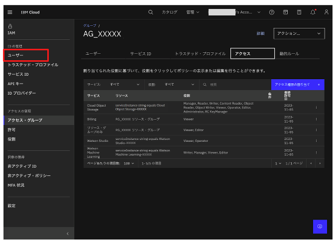
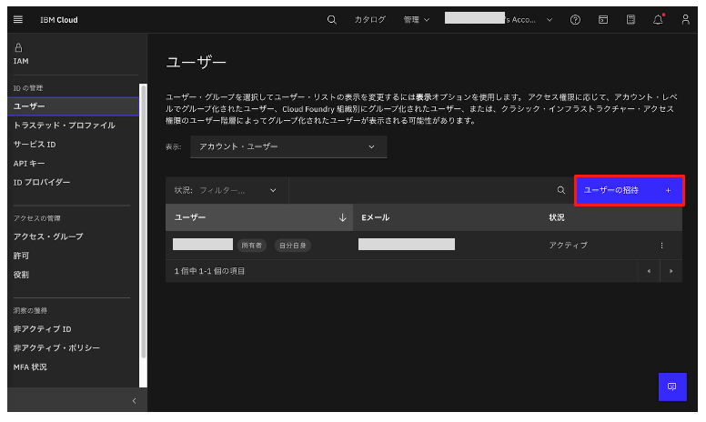
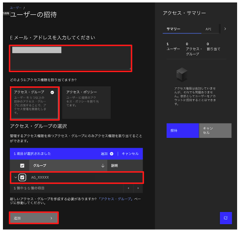
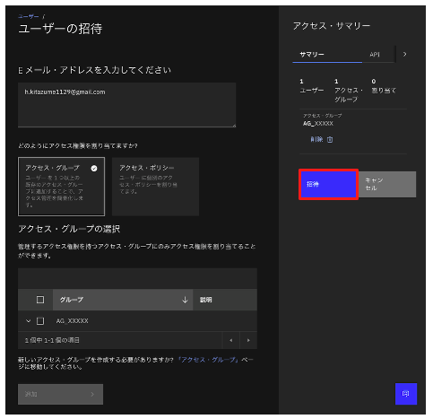
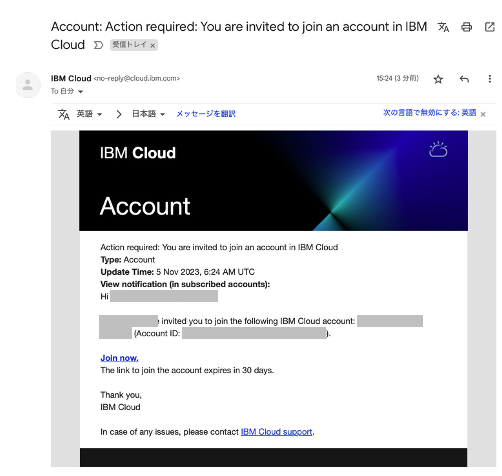
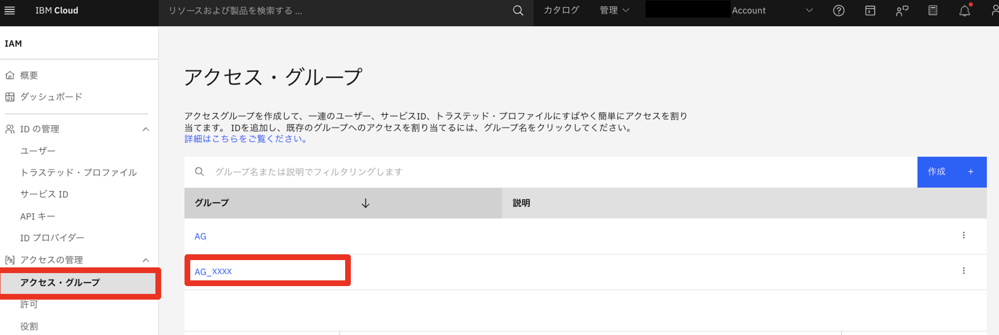
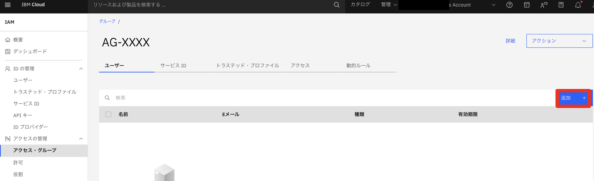
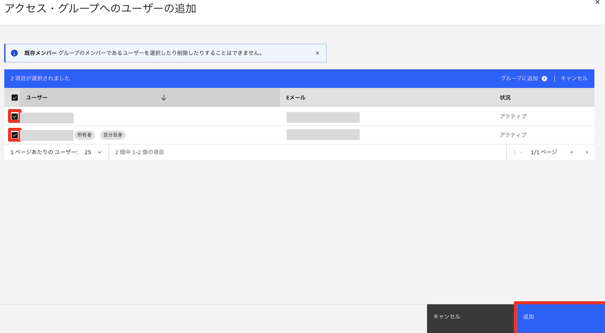
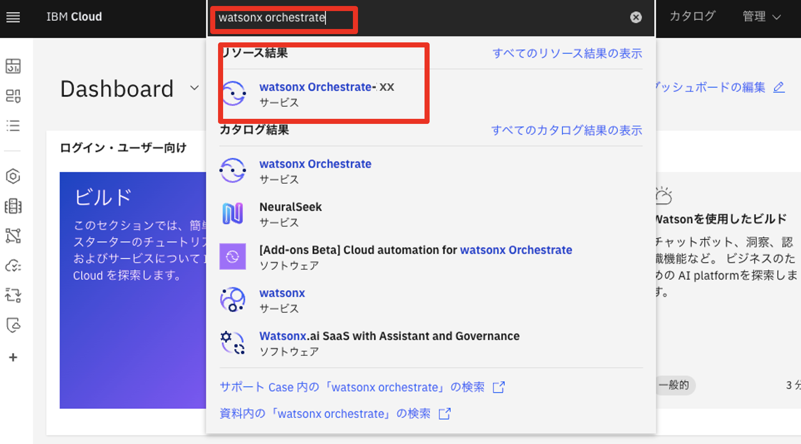

# アクセス・グループユーザーの追加

1. 画面左側のメニューから「ユーザー」をクリックします｡
 

1. 「ユーザーの招待」ボタンをクリックします｡
 

1. 「Eメール・アドレスを入力してください」に対象ユーザのメールアドレスを入力します｡「どのようにアクセス権限を割り当てますか？」で「アクセス・グループ」を選択します｡「アクセス・グループの選択」で「AG_XXXXX」をチェックします｡「追加」ボタンをクリックします｡
 

1. 画面右「アクセス・サマリー」の招待ボタンをクリックします｡
 

1. 参考情報) 招待を受けたユーザは以下のようなメールを受信します｡「Join now」リンクからIBM Cloudにログインして招待をAcceptします｡

1. 作成したアクセスグループを選択します。

8. 「ユーザー」を選択し、「追加」を選択します。

10. 招待したユーザーを選択し、「追加」を選択します。

11. 上記の設定が完了すると、追加したユーザがwatsonx Orchestrateにログインできるようになります。IBM Cloudにログイン後、IBM Cloudの画面上部にある検索バーに「watsonx Orchestrate」と入力し、表示されたリソース結果から「watsonx Orchestrate-xx」を選択してください。

12. 「Launch watsonx Orchestrate」でログインできます。

