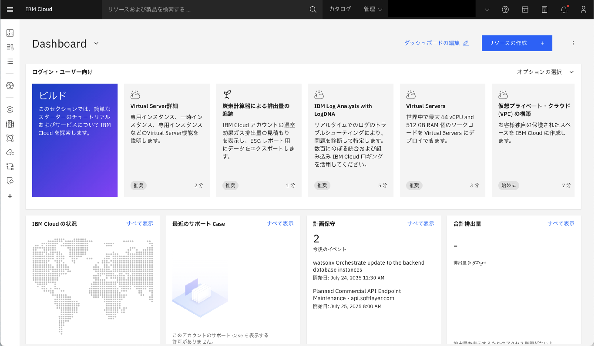
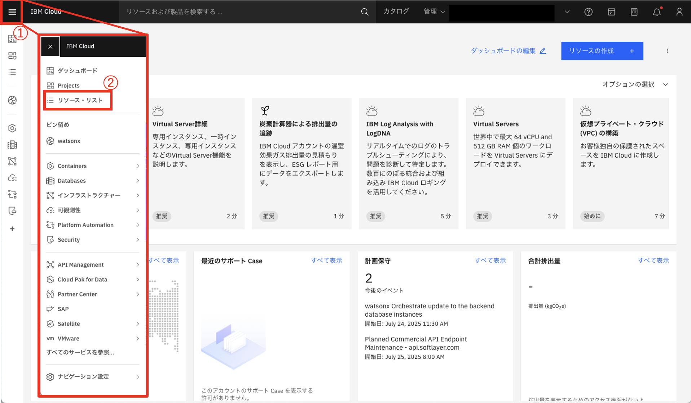
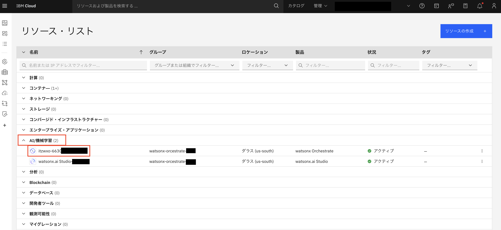
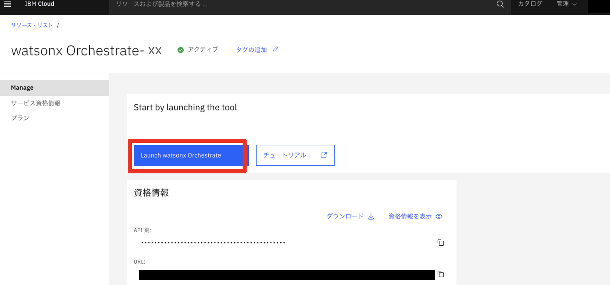
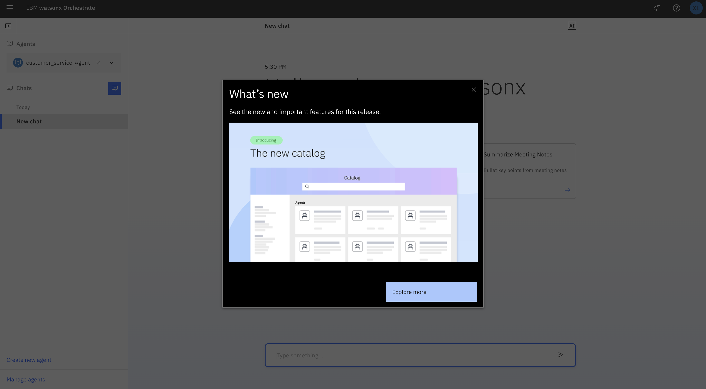

# watsonx Orchestrate にアクセス

1. [IBM Cloud](https://cloud.ibm.com/) にアクセスする

1. ①左上のハンバーガーメニューから、②リソースリストを選択する

2. ①AI/機械学習、②watsonx Orchestrate を選択する

3. 「Launch watsonx Orchestrate」を起動します。

1. 以下の画面が表示されたら、watsonx Orchestrateへのアクセスは完了です。これで、watsonx Orchestrateをご利用いただけるようになります。

