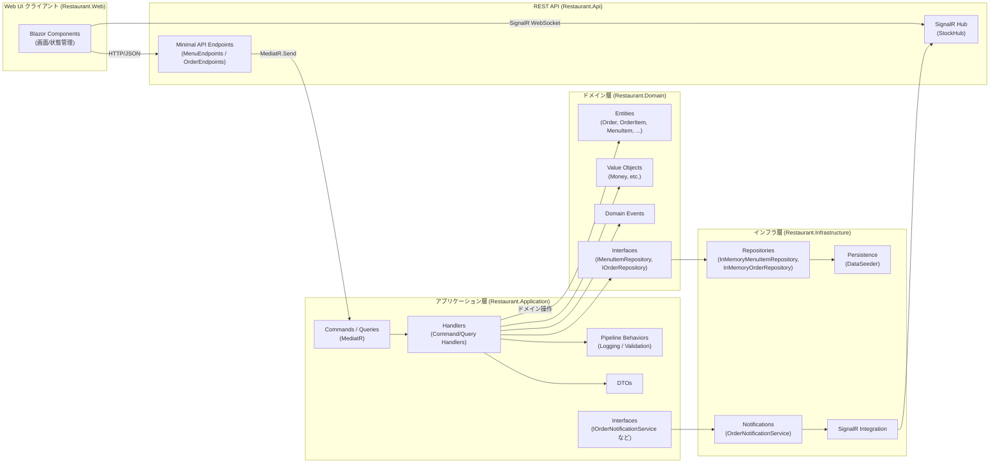
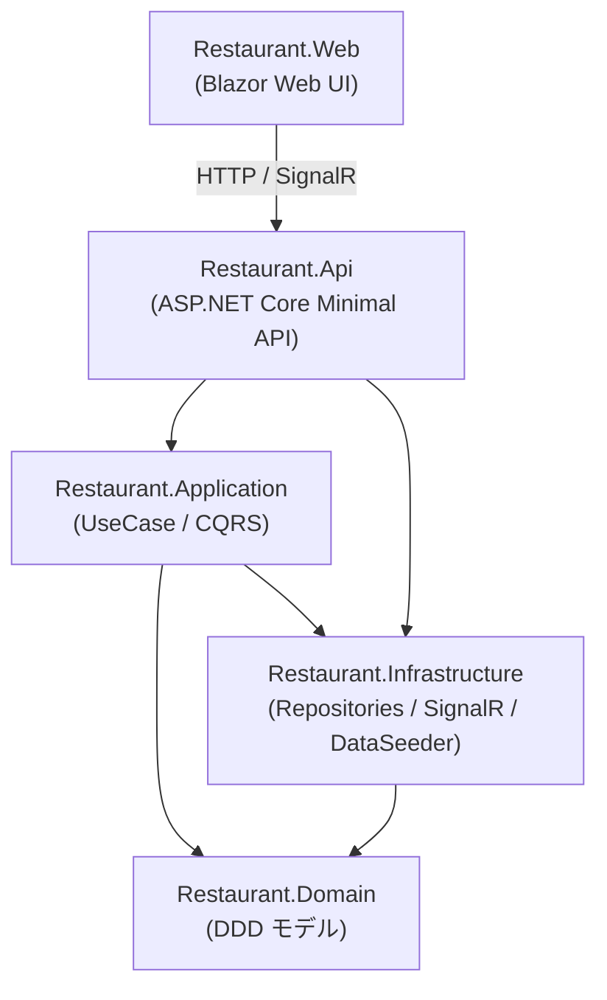
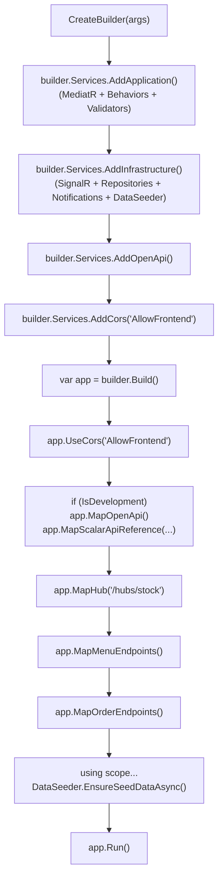
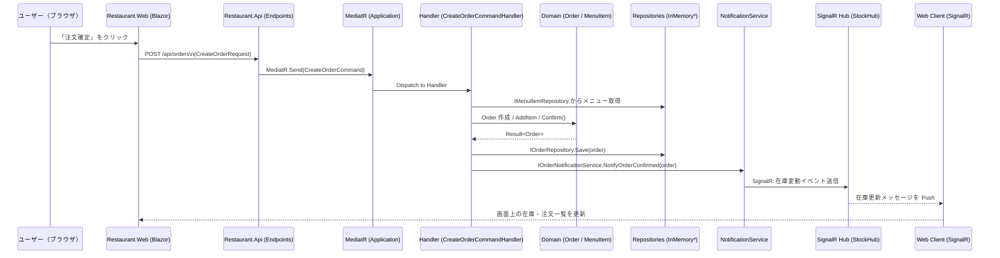
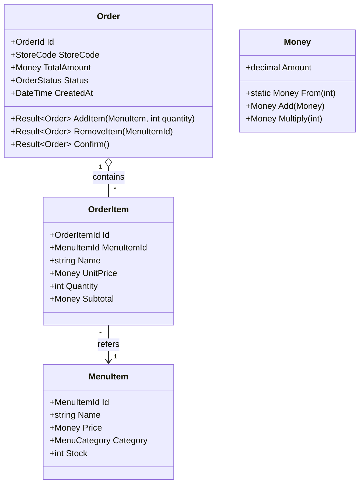
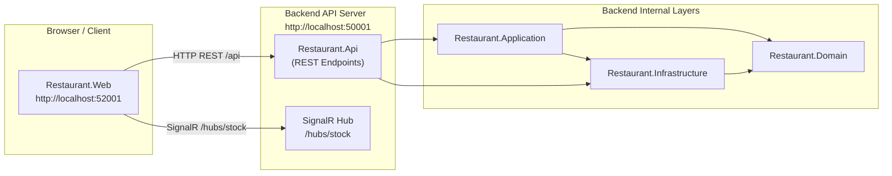
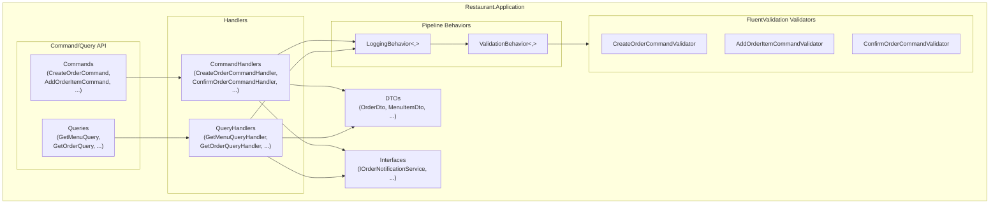
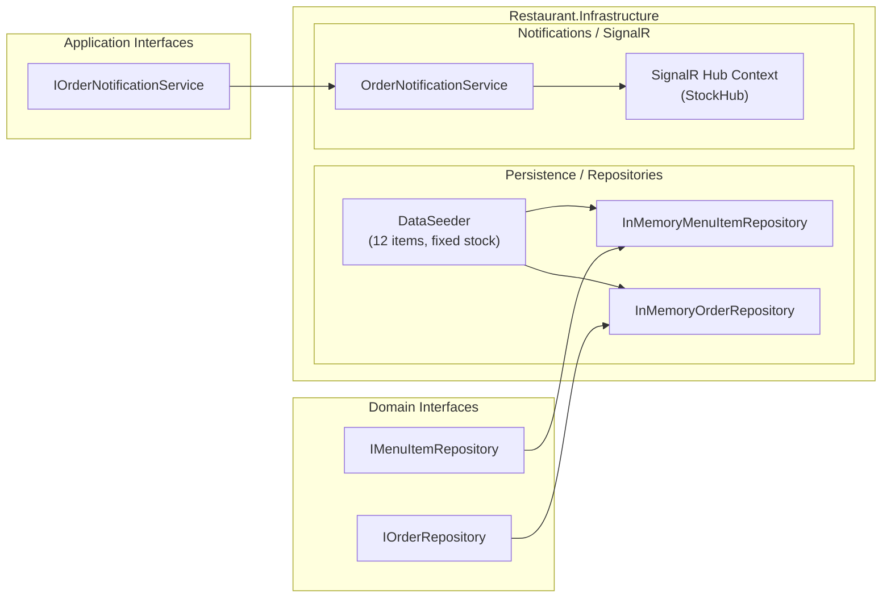
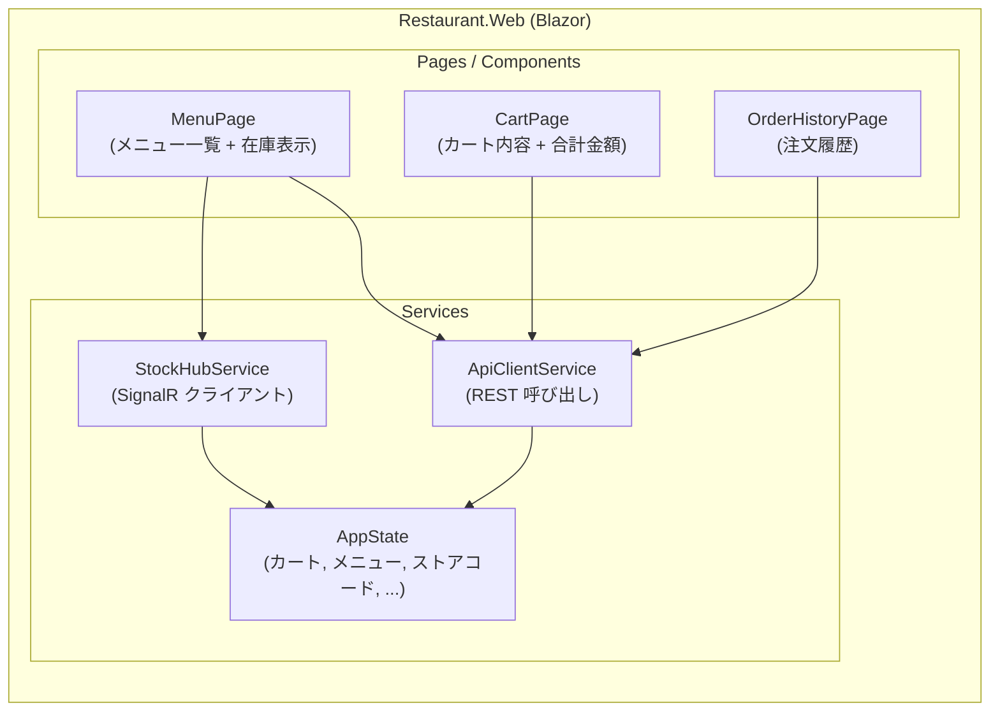
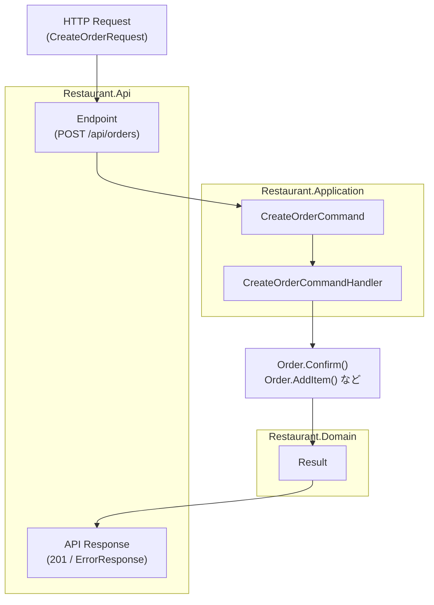

# レストラン注文システム アーキテクチャ概要

IBM TechXchange Summit Japan 2025、G602-6の教材です。

本ドキュメントでは、`G602-6` ソリューションのアーキテクチャを示し、各レイヤー・主要コンポーネントの役割と連携を説明します。
AI搭載ソフトウェア開発パートナー、IBM Project Bobを用いて、ドメイン駆動開発、クリーン・アーキテクチャーを採用し、
レストランの注文業務アプリをAI駆動で開発した体験からまとめた文書です。

あくまでも教材目的なので、意図的にデータベースは使わず、Productionレベルの実装にはしてありません。
.NET 10、C#、ASP.NET Core Blazor、ASP.NET Core Minimal APIを利用しています。
クリーン・アーキテクチャーで設計しているため、データベースとしてMongoDB、IBM Db2、IBM MQ、その他RDBMSに対応させることは容易です。

## ソリューション作成時間

本プロジェクトは、プロンプト駆動開発手法を用いて、レストラン向けの注文管理システムのMVPを**5時間51分**で完成させました。
従来の手動開発と比較して**80-84%の時間短縮**を達成し、プロンプト作成への投資（1時間50分）に対して**8.7-11.5倍のROI**を実現しました。

### 主要成果

- ✅ **完全動作するシステム**: Domain層からWeb UI層まで全層実装完了
- ✅ **高品質なコード**: Clean Architecture、SOLID原則、DDD適用
- ✅ **包括的なテスト**: 全層のユニットテストカバレッジ
- ✅ **リアルタイム機能**: SignalRによる在庫更新の即時反映
- ✅ **優れたUX**: レスポンシブデザイン、トースト通知、モーダルダイアログ

---

## 1. 全体レイヤー構成

フロントエンド（Blazor Web UI）、API、アプリケーション層、ドメイン層、インフラ層の5層構造で構成されています。



**説明**

- `Restaurant.Web` は Blazor ベースのWeb UIで、HTTP API と SignalR を通じてバックエンドと連携します。
- `Restaurant.Api` は Minimal API と SignalR Hub をホストし、アプリケーション層・インフラ層を組み合わせて外部I/Oを担います。
- `Restaurant.Application` はユースケース（コマンド/クエリ）を表現し、MediatR とパイプラインビヘイビア（ロギング、バリデーション）によりアプリケーションフローを制御します。
- `Restaurant.Domain` は DDD 的なドメインモデル（エンティティ、値オブジェクト、ドメインイベント、リポジトリIF）を保持し、ビジネスルールの中心となります。
- `Restaurant.Infrastructure` はドメインやアプリケーションのIFに対する具体実装（リポジトリ、通知、データ投入、SignalR連携）を提供します。

---

## 2. プロジェクト間依存関係

各プロジェクトの依存方向は、ドメインを中心に一方向となるように設計されています。



**説明**

- `Restaurant.Domain` は他の層に依存しない「中心のレイヤー」です。
- `Restaurant.Application` はドメインに依存し、ユースケース実行のために `Restaurant.Infrastructure` のインターフェース実装に依存します。
- `Restaurant.Api` はプレゼンテーションレイヤーとして、アプリケーション層およびインフラ層に依存します。
- `Restaurant.Web` は HTTP / SignalR を通じて `Restaurant.Api` と通信し、直接バックエンドの他レイヤーには依存しません。

---

## 3. API 起動パイプライン（`Program.cs`）

`Restaurant.Api/Program.cs` は、DI登録・ミドルウェア・エンドポイント/Hubマッピング・初期データ投入を行います。



**説明**

- `AddApplication()` でアプリケーション層：MediatRハンドラー、パイプラインビヘイビア（ロギング/バリデーション）、FluentValidation バリデータが登録されます。
- `AddInfrastructure()` でインフラ層：SignalR、リポジトリ実装、通知サービス、`DataSeeder` などが登録されます。
- OpenAPI + Scalar UI は開発環境でのみ有効で、API仕様をブラウザから確認できます。
- SignalR Hub (`/hubs/stock`) と REST エンドポイント（メニュー・注文）がマッピングされ、フロントエンドから利用されます。
- アプリ起動時にスコープを作成し、`DataSeeder.EnsureSeedDataAsync()` により固定データ（12品目）が投入されます。

---

## 4. 代表的ユースケースフロー（注文作成〜在庫通知）

注文確定時にバックエンドでどのようなフローが走るかを示します。



**説明**

- UI は `CreateOrderRequest` を `POST /api/orders` に送信し、API はリクエストをコマンドにマッピングして MediatR に委譲します。
- `CreateOrderCommandHandler` はメニュー情報取得・在庫チェック・注文作成・`Order.Confirm()` などドメインロジックのオーケストレーションを行います。
- ドメイン層では `Result<T>` パターンでビジネスルール違反（例：500円未満での Confirm など）を表現し、例外に過度に依存しない設計になっています。
- 注文保存後、通知サービスを通じて SignalR Hub にイベントを送信し、接続中すべてのクライアントに在庫変動がリアルタイム配信されます。
- UI は SignalR クライアントを購読し、在庫数や注文一覧表示を自動的に更新します。

---

## 5. ドメインモデルの概念図

注文まわりの主要ドメインオブジェクトの関係を示します（実クラス名・プロパティ名はプロンプト仕様に準拠）。



**説明**

- `Order` は注文全体を表し、アイテムの追加/削除/確定などビジネス的な操作メソッドを持ちます。
- `OrderItem` は注文の明細を表し、数量・単価・小計などを保持します（数量は常に1以上）。
- `MenuItem` はメニュー（商品）を表し、価格・カテゴリ・在庫数などを管理します。
- `Money` は金額を表す値オブジェクトで、通貨は JPY 固定とし、金額の加算や乗算などを提供します。

---

## 6. まとめ

- 本ソリューションは DDD・Clean Architecture に基づくレイヤードアーキテクチャを採用し、ドメインモデルを中心に据えています。
- アプリケーション層では MediatR + Pipeline Behaviors により、ユースケース・ロギング・バリデーションを明確に分離しています。
- インフラ層はリポジトリ・通知・SignalR・データシーディングなど技術的関心事を担当し、ドメイン/アプリケーションのインターフェースに従って実装されています。
- フロントエンドとは HTTP + SignalR を通じて接続し、在庫や注文状況をリアルタイムに反映するユーザー体験を提供します。

---

## 7. インフラ構成とポート

API/UI/Hub の URL と内部レイヤーの関係を示します。



**説明**

- フロントエンド UI は `http://localhost:52001` でホストされ、バックエンド API は `http://localhost:50001` でホストされます。
- REST API は `/api/*` パスで公開され、SignalR Hub は `/hubs/stock` パスでリアルタイム通知を提供します。
- バックエンド内部では、アプリケーション層・ドメイン層・インフラ層が前述のレイヤード構造に従って連携します。

---

## 8. アプリケーション層の詳細構成

CQRS と Pipeline Behaviors を含むアプリケーション層の内部構成を示します。



**説明**

- コマンドとクエリは、それぞれ専用のハンドラ（CommandHandler/QueryHandler）によって処理されます。
- すべてのリクエストは `LoggingBehavior` → `ValidationBehavior` → 実ハンドラの順にパイプラインを通過します。
- バリデーションは FluentValidation のバリデータ群により、入力の妥当性チェックとして実装されています。
- ハンドラは DTO を介して入出力を行い、通知などの副作用は `IOrderNotificationService` 等のインターフェース経由で行われます。

---

## 9. インフラ層詳細構成

リポジトリ・データシーダー・SignalR連携を含むインフラ層の構成です。



**説明**

- `InMemoryMenuItemRepository` と `InMemoryOrderRepository` は、ドメイン層のリポジトリインターフェースに対するインメモリ実装です。
- `DataSeeder` は起動時に 12 品目の固定データと在庫数（ラーメン系50、サイド40、デザート100、ドリンク200）を投入します。
- `OrderNotificationService` はアプリケーション層からの通知要求を受け取り、SignalR Hub コンテキストを通じてクライアントにイベントをブロードキャストします。

---

## 10. Web UI 構成

Blazor コンポーネントと、バックエンドと通信するサービス、および状態管理の関係を示します。



**説明**

- 各ページコンポーネントは `ApiClientService` を通じて REST API を呼び出します。
- 在庫のリアルタイム更新は `StockHubService` が SignalR Hub に接続し、`AppState` を更新することで UI に反映されます。
- `AppState` はカートやメニュー一覧、選択中の店舗コードなど、画面間で共有される状態を一元管理します。

---

## 11. エラーハンドリングと Result パターン

エラー/ビジネスルール違反を `Result<T>` で表現し、API レスポンスにどのように反映されるかを示します。



**説明**

- ドメイン層のメソッド（`Order.Confirm()` など）は、例外ではなく `Result<T>` で成功/失敗を返却します。
- アプリケーション層のハンドラは、この `Result` を受けて成功時はドメインオブジェクト/DTO を返し、失敗時はエラー情報を API 層へ伝播させます。
- API 層では `ErrorResponse` 型（`{ "success": false, "error": "..." }`）にマッピングし、HTTP ステータスコードとともにクライアントへ返却します。

---

## 12. テスト戦略

本ソリューションでは、レイヤーごとに責務を分離し、それぞれに対応するテストプロジェクトを用意しています。

- `tests/Restaurant.Domain.Tests`
    - 対象: ドメインモデル（エンティティ、値オブジェクト、ドメインサービス）
    - 目的: ビジネスルールの検証  
        - 例: `Order.Confirm()` が合計金額500円未満で失敗し、メッセージに「500円以上」を含むこと
        - 例: `Order.AddItem()` が在庫数 (`menuItem.Stock`) 未満の数量のみ追加できること
    - 特徴: 例外ではなく `Result<T>` パターンを前提とした成功/失敗パスのテスト

- `tests/Restaurant.Application.Tests`
    - 対象: コマンド/クエリハンドラ、Pipeline Behaviors（Logging/Validation）
    - 目的: ユースケース単位での振る舞い検証  
        - リポジトリや通知サービスは NSubstitute によるモックで置き換え
        - xUnit + FluentAssertions + NSubstitute を使用
    - スタイル:
        - テストメソッド名に「日本語コメント + 英語メソッド名」
        - Arrange / Act / Assert をコメントで明示

- `tests/Restaurant.Api.Tests`
    - 対象: Minimal API エンドポイント
    - 目的: エンドポイントレベルでの入出力・ステータスコード・`ErrorResponse` 形式の検証  
        - `POST /api/orders` が 201 Created を返し、`Location` ヘッダーを設定すること
        - エラー時に `{ "success": false, "error": "..." }` 形式で返却されること

- `tests/Restaurant.Infrastructure.Tests`
    - 対象: リポジトリ実装、`DataSeeder`、`OrderNotificationService` など
    - 目的: インメモリ実装の一貫した振る舞い・初期データ投入の検証

**テストの原則**

- 振る舞い駆動: 実装詳細ではなく「ビジネスルール」「ユースケースの結果」にフォーカスする。
- 独立性: テスト間の依存を避け、任意の順序で実行可能に保つ。
- 高速性: インメモリリポジトリを活用し、外部I/Oに依存しないテストを基本とする。
- エラーケースの重視: 正常系だけでなく、ビジネスルール違反・入力不正などの失敗パスも必ずテストでカバーする。

---

## 13. 非機能要件

本ソリューションでは、プロトタイプ〜MVP レベルを想定しつつ、以下の非機能要件を意識した設計としています。

### 13.1 パフォーマンス

- 軽量な Minimal API + Blazor 構成により、API レイテンシを最小限に抑える。
- インメモリリポジトリにより、I/O 待機をほぼ排除し、高速なレスポンスを実現。
- ドメインロジックは副作用を分離し、CPU・メモリアロケーションを抑えたシンプルな実装を心掛ける。

### 13.2 スケーラビリティ

- 現状は単一ノード想定（InMemory）だが、リポジトリと通知サービスがインターフェース越しに抽象化されているため、将来的に DB や分散メッセージングに差し替え可能。
- SignalR Hub もインターフェース越しの通知経路を持つため、スケールアウト時にバックプレーン（Redis 等）へ移行しやすい。

### 13.3 可用性・信頼性

- ドメインレベルで `Result<T>` パターンを採用し、例外に依存しないエラー制御を徹底することで、予期せぬクラッシュを軽減。
- 外部との境界（API 層）では、失敗時に `ErrorResponse` 形式で統一したエラーメッセージを返却し、クライアント側のハンドリングを容易にする。
- 起動時の `DataSeeder` により、必ず一貫した初期データ状態からアプリケーションを開始できる。

### 13.4 保守性・拡張性

- DDD + Clean Architecture により、ドメイン・アプリケーション・インフラ・UI を明確に分離。
- クラス名・メソッド名・プロパティ名はプロンプト仕様（`prompts/*.md`）に厳密に準拠し、仕様と実装の対応関係を明確化。
- 新しいユースケースは「Command/Query + Handler + Validator + テスト」を追加するパターンで拡張できる。

### 13.5 観測性（ロギング）

- MediatR の `LoggingBehavior` により、すべてのコマンド/クエリについて入力・出力・例外を一元的に記録可能。
- 将来的に構造化ログや分散トレーシングを導入する際にも、パイプライン層での追加により最小限の変更で対応できる。
---

## 14. クリーンアーキテクチャのイメージ

### 14.1 まだクリーンアーキテクチャを知らない人向けのイメージ

クリーンアーキテクチャは「**玉ねぎ or 入れ子の弁当箱**」のように考えると分かりやすいです。

- 一番内側: **ドメイン層**（ビジネスルール）  
  - お店のルールそのもの（「500円未満は注文確定できない」「在庫が足りなければ注文できない」など）。
- その外側: **アプリケーション層**（ユースケース）  
  - 「注文を受け付ける」「カートに商品を追加する」といった“手続きの流れ”を組み立てる層。
- さらに外側: **インフラ層・UI層**（技術/入出力）  
  - データベース、メッセージング、Web API、ブラウザUIなど「どうやって外の世界と話すか」を担当する層。

> 例え話:  
> - ドメイン層 = お店の“社長と店長が決めたルール集”  
> - アプリケーション層 = そのルールに従って動く“マニュアル（手順書）”  
> - インフラ層/UI層 = レジ、券売機、在庫システムなどの“道具”  
>
> 社長がルールを変えても、レジのメーカーは変わらなくてよいし、レジを別メーカーに変えても、ルール自体は変えなくてよい——これが依存方向を内側に向ける（内側が外側を知らない）というクリーンアーキテクチャの発想です。

このプロジェクトでは、

- `Restaurant.Domain` が「ルール集」
- `Restaurant.Application` が「マニュアル（ユースケース）」
- `Restaurant.Infrastructure` と `Restaurant.Api` / `Restaurant.Web` が「道具」

という役割分担になっており、特に `IOrderRepository` のようなインターフェースを間に挟むことで、**道具（DBやMQ）を差し替えてもルールやマニュアルを変えなくて済む**構造になっています。

---

## 15. Order リポジトリの実装バリエーション

ここでは、`IOrderRepository` を異なる技術（IBM Db2 / MongoDB / IBM MQ）で実装する場合のイメージコードを示します。

> 注意: いずれも **プロトタイプレベルの参考コード** であり、実運用にはトランザクション管理・リトライ・接続プール設定・ログ/監視・セキュリティ設定など追加の考慮が必要です。

### 15.1 IBM Db2 での Order リポジトリ実装例

#### 15.1.1 想定テーブル構造

シンプルな例として、注文ヘッダと明細を2テーブルで表現します。

```sql
CREATE TABLE ORDERS (
    ORDER_ID        VARCHAR(36)    NOT NULL PRIMARY KEY,
    STORE_CODE      VARCHAR(32)    NOT NULL,
    STATUS          VARCHAR(16)    NOT NULL,
    TOTAL_AMOUNT    DECIMAL(18,2)  NOT NULL,
    CREATED_AT      TIMESTAMP      NOT NULL
);

CREATE TABLE ORDER_ITEMS (
    ORDER_ITEM_ID   VARCHAR(36)    NOT NULL PRIMARY KEY,
    ORDER_ID        VARCHAR(36)    NOT NULL,
    MENU_ITEM_ID    VARCHAR(36)    NOT NULL,
    NAME            VARCHAR(128)   NOT NULL,
    UNIT_PRICE      DECIMAL(18,2)  NOT NULL,
    QUANTITY        INT            NOT NULL,
    SUBTOTAL        DECIMAL(18,2)  NOT NULL,
    CONSTRAINT FK_ORDER_ITEMS_ORDER
        FOREIGN KEY (ORDER_ID) REFERENCES ORDERS (ORDER_ID)
);
```
#### 15.1.2 C# 実装例（概略）
```
using System.Data;
using IBM.Data.Db2.Core;
using Restaurant.Domain.Entities;
using Restaurant.Domain.Interfaces;

namespace Restaurant.Infrastructure.Repositories;

public sealed class Db2OrderRepository : IOrderRepository
{
    private readonly string _connectionString;

    public Db2OrderRepository(string connectionString)
    {
        _connectionString = connectionString;
    }

    public async Task<Order?> GetByIdAsync(OrderId id, CancellationToken cancellationToken = default)
    {
        await using var connection = new DB2Connection(_connectionString);
        await connection.OpenAsync(cancellationToken);

        // ヘッダ取得
        await using var headerCmd = connection.CreateCommand();
        headerCmd.CommandText = @"SELECT ORDER_ID, STORE_CODE, STATUS, TOTAL_AMOUNT, CREATED_AT
                                  FROM ORDERS WHERE ORDER_ID = @ORDER_ID";
        headerCmd.Parameters.Add(new DB2Parameter("@ORDER_ID", id.Value));

        await using var reader = await headerCmd.ExecuteReaderAsync(cancellationToken);
        if (!await reader.ReadAsync(cancellationToken))
        {
            return null;
        }

        var order = Order.Restore(
            new OrderId(reader.GetString(0)),
            new StoreCode(reader.GetString(1)),
            Enum.Parse<OrderStatus>(reader.GetString(2)),
            Money.From(reader.GetDecimal(3)),
            reader.GetDateTime(4));

        // 明細取得
        await using var itemCmd = connection.CreateCommand();
        itemCmd.CommandText = @"SELECT ORDER_ITEM_ID, MENU_ITEM_ID, NAME, UNIT_PRICE, QUANTITY, SUBTOTAL
                                  FROM ORDER_ITEMS WHERE ORDER_ID = @ORDER_ID";
        itemCmd.Parameters.Add(new DB2Parameter("@ORDER_ID", id.Value));

        await using var itemReader = await itemCmd.ExecuteReaderAsync(cancellationToken);
        while (await itemReader.ReadAsync(cancellationToken))
        {
            var item = OrderItem.Restore(
                new OrderItemId(itemReader.GetString(0)),
                new MenuItemId(itemReader.GetString(1)),
                itemReader.GetString(2),
                Money.From(itemReader.GetDecimal(3)),
                itemReader.GetInt32(4));

            order = order.WithRestoredItem(item);
        }

        return order;
    }

    public async Task SaveAsync(Order order, CancellationToken cancellationToken = default)
    {
        await using var connection = new DB2Connection(_connectionString);
        await connection.OpenAsync(cancellationToken);

        await using var tx = await connection.BeginTransactionAsync(IsolationLevel.ReadCommitted, cancellationToken);

        try
        {
            // ヘッダ upsert（単純化）
            await using (var cmd = connection.CreateCommand())
            {
                cmd.Transaction = tx;
                cmd.CommandText = @"MERGE INTO ORDERS T
                                    USING (VALUES(@ORDER_ID, @STORE_CODE, @STATUS, @TOTAL_AMOUNT, @CREATED_AT)) S
                                    (ORDER_ID, STORE_CODE, STATUS, TOTAL_AMOUNT, CREATED_AT)
                                    ON T.ORDER_ID = S.ORDER_ID
                                    WHEN MATCHED THEN
                                      UPDATE SET STORE_CODE = S.STORE_CODE,
                                                 STATUS = S.STATUS,
                                                 TOTAL_AMOUNT = S.TOTAL_AMOUNT,
                                                 CREATED_AT = S.CREATED_AT
                                    WHEN NOT MATCHED THEN
                                      INSERT (ORDER_ID, STORE_CODE, STATUS, TOTAL_AMOUNT, CREATED_AT)
                                      VALUES (S.ORDER_ID, S.STORE_CODE, S.STATUS, S.TOTAL_AMOUNT, S.CREATED_AT);";

                cmd.Parameters.Add(new DB2Parameter("@ORDER_ID", order.Id.Value));
                cmd.Parameters.Add(new DB2Parameter("@STORE_CODE", order.StoreCode.Value));
                cmd.Parameters.Add(new DB2Parameter("@STATUS", order.Status.ToString()));
                cmd.Parameters.Add(new DB2Parameter("@TOTAL_AMOUNT", order.TotalAmount.Amount));
                cmd.Parameters.Add(new DB2Parameter("@CREATED_AT", order.CreatedAt));

                await cmd.ExecuteNonQueryAsync(cancellationToken);
            }

            // 明細全削除→再挿入（単純化）
            await using (var deleteCmd = connection.CreateCommand())
            {
                deleteCmd.Transaction = tx;
                deleteCmd.CommandText = "DELETE FROM ORDER_ITEMS WHERE ORDER_ID = @ORDER_ID";
                deleteCmd.Parameters.Add(new DB2Parameter("@ORDER_ID", order.Id.Value));
                await deleteCmd.ExecuteNonQueryAsync(cancellationToken);
            }

            foreach (var item in order.Items)
            {
                await using var insertCmd = connection.CreateCommand();
                insertCmd.Transaction = tx;
                insertCmd.CommandText = @"INSERT INTO ORDER_ITEMS
                    (ORDER_ITEM_ID, ORDER_ID, MENU_ITEM_ID, NAME, UNIT_PRICE, QUANTITY, SUBTOTAL)
                    VALUES (@ORDER_ITEM_ID, @ORDER_ID, @MENU_ITEM_ID, @NAME, @UNIT_PRICE, @QUANTITY, @SUBTOTAL)";

                insertCmd.Parameters.Add(new DB2Parameter("@ORDER_ITEM_ID", item.Id.Value));
                insertCmd.Parameters.Add(new DB2Parameter("@ORDER_ID", order.Id.Value));
                insertCmd.Parameters.Add(new DB2Parameter("@MENU_ITEM_ID", item.MenuItemId.Value));
                insertCmd.Parameters.Add(new DB2Parameter("@NAME", item.Name));
                insertCmd.Parameters.Add(new DB2Parameter("@UNIT_PRICE", item.UnitPrice.Amount));
                insertCmd.Parameters.Add(new DB2Parameter("@QUANTITY", item.Quantity));
                insertCmd.Parameters.Add(new DB2Parameter("@SUBTOTAL", item.Subtotal.Amount));

                await insertCmd.ExecuteNonQueryAsync(cancellationToken);
            }

            await tx.CommitAsync(cancellationToken);
        }
        catch
        {
            await tx.RollbackAsync(cancellationToken);
            throw;
        }
    }
}
```
### 15.2 MongoDB での Order リポジトリ実装例
#### 15.2.1 ドキュメント構造（例）
```
{
  "_id": "ORDER-0001",
  "storeCode": "STORE001",
  "status": "Confirmed",
  "totalAmount": 1200,
  "createdAt": "2024-01-01T12:34:56Z",
  "items": [
    {
      "orderItemId": "ITEM-0001",
      "menuItemId": "MENU-001",
      "name": "醤油ラーメン",
      "unitPrice": 800,
      "quantity": 1,
      "subtotal": 800
    },
    {
      "orderItemId": "ITEM-0002",
      "menuItemId": "MENU-010",
      "name": "餃子",
      "unitPrice": 400,
      "quantity": 1,
      "subtotal": 400
    }
  ]
}
```
#### 15.2.2 C# 実装例（MongoDB.Driver）
```
using MongoDB.Bson;
using MongoDB.Bson.Serialization.Attributes;
using MongoDB.Driver;
using Restaurant.Domain.Entities;
using Restaurant.Domain.Interfaces;

namespace Restaurant.Infrastructure.Repositories;

public sealed class MongoOrderRepository : IOrderRepository
{
    private readonly IMongoCollection<OrderDocument> _collection;

    public MongoOrderRepository(IMongoDatabase database)
    {
        _collection = database.GetCollection<OrderDocument>("orders");
    }

    public async Task<Order?> GetByIdAsync(OrderId id, CancellationToken cancellationToken = default)
    {
        var filter = Builders<OrderDocument>.Filter.Eq(x => x.Id, id.Value);
        var doc = await _collection.Find(filter).FirstOrDefaultAsync(cancellationToken);
        if (doc is null)
        {
            return null;
        }

        var order = Order.Restore(
            new OrderId(doc.Id),
            new StoreCode(doc.StoreCode),
            Enum.Parse<OrderStatus>(doc.Status),
            Money.From(doc.TotalAmount),
            doc.CreatedAt);

        foreach (var item in doc.Items)
        {
            var orderItem = OrderItem.Restore(
                new OrderItemId(item.OrderItemId),
                new MenuItemId(item.MenuItemId),
                item.Name,
                Money.From(item.UnitPrice),
                item.Quantity);

            order = order.WithRestoredItem(orderItem);
        }

        return order;
    }

    public async Task SaveAsync(Order order, CancellationToken cancellationToken = default)
    {
        var doc = new OrderDocument
        {
            Id = order.Id.Value,
            StoreCode = order.StoreCode.Value,
            Status = order.Status.ToString(),
            TotalAmount = order.TotalAmount.Amount,
            CreatedAt = order.CreatedAt,
            Items = order.Items.Select(x => new OrderItemDocument
            {
                OrderItemId = x.Id.Value,
                MenuItemId = x.MenuItemId.Value,
                Name = x.Name,
                UnitPrice = x.UnitPrice.Amount,
                Quantity = x.Quantity,
                Subtotal = x.Subtotal.Amount
            }).ToList()
        };

        var filter = Builders<OrderDocument>.Filter.Eq(x => x.Id, order.Id.Value);
        await _collection.ReplaceOneAsync(
            filter,
            doc,
            new ReplaceOptions { IsUpsert = true },
            cancellationToken);
    }

    private sealed class OrderDocument
    {
        [BsonId]
        [BsonRepresentation(BsonType.String)]
        public string Id { get; set; } = default!;

        [BsonElement("storeCode")]
        public string StoreCode { get; set; } = default!;

        [BsonElement("status")]
        public string Status { get; set; } = default!;

        [BsonElement("totalAmount")]
        public decimal TotalAmount { get; set; }

        [BsonElement("createdAt")]
        public DateTime CreatedAt { get; set; }

        [BsonElement("items")]
        public List<OrderItemDocument> Items { get; set; } = new();
    }

    private sealed class OrderItemDocument
    {
        [BsonElement("orderItemId")]
        public string OrderItemId { get; set; } = default!;

        [BsonElement("menuItemId")]
        public string MenuItemId { get; set; } = default!;

        [BsonElement("name")]
        public string Name { get; set; } = default!;

        [BsonElement("unitPrice")]
        public decimal UnitPrice { get; set; }

        [BsonElement("quantity")]
        public int Quantity { get; set; }

        [BsonElement("subtotal")]
        public decimal Subtotal { get; set; }
    }
}
```
### 15.3 IBM MQ での Order リポジトリ実装例
IBM MQ の場合、「リポジトリ = 同期的なクエリ/更新」というよりは、

SaveAsync で「注文確定イベントを MQ に送信する」
別プロセスが MQ からメッセージを購読し、実際のストレージ（Db2/Mongoなど）へ永続化する
という イベント駆動/非同期ストレージ の形になることが多いです。

#### 15.3.1 IOrderRepository を MQ で実装するイメージ
```
using IBM.WMQ;
using Restaurant.Domain.Entities;
using Restaurant.Domain.Interfaces;

namespace Restaurant.Infrastructure.Repositories;

public sealed class MqOrderRepository : IOrderRepository
{
    private readonly MQQueueManager _queueManager;
    private readonly string _queueName;

    public MqOrderRepository(MQQueueManager queueManager, string queueName)
    {
        _queueManager = queueManager;
        _queueName = queueName;
    }

    public Task<Order?> GetByIdAsync(OrderId id, CancellationToken cancellationToken = default)
    {
        // MQ ベースの場合、同期的な Get は別の読み取りストア（Db2/Mongo 等）に任せるケースが多い
        return Task.FromResult<Order?>(null);
    }

    public async Task SaveAsync(Order order, CancellationToken cancellationToken = default)
    {
        var payload = Serialize(order); // JSON など

        var queue = _queueManager.AccessQueue(
            _queueName,
            MQC.MQOO_OUTPUT | MQC.MQOO_FAIL_IF_QUIESCING);

        try
        {
            var msg = new MQMessage
            {
                Format = MQC.MQFMT_STRING,
                CharacterSet = 1208 // UTF-8
            };

            msg.WriteString(payload);

            var putOptions = new MQPutMessageOptions();
            await Task.Run(() => queue.Put(msg, putOptions), cancellationToken);
        }
        finally
        {
            queue.Close();
        }
    }

    private static string Serialize(Order order)
    {
        return System.Text.Json.JsonSerializer.Serialize(new
        {
            orderId = order.Id.Value,
            storeCode = order.StoreCode.Value,
            status = order.Status.ToString(),
            totalAmount = order.TotalAmount.Amount,
            createdAt = order.CreatedAt,
            items = order.Items.Select(x => new
            {
                orderItemId = x.Id.Value,
                menuItemId = x.MenuItemId.Value,
                name = x.Name,
                unitPrice = x.UnitPrice.Amount,
                quantity = x.Quantity,
                subtotal = x.Subtotal.Amount
            })
        });
    }
}
```
#### 15.3.2 MQ メッセージを受け取るアプリの例
```
using IBM.WMQ;

public sealed class OrderConsumer
{
    private readonly MQQueueManager _queueManager;
    private readonly string _queueName;
    private readonly Db2OrderRepository _db2OrderRepository;

    public OrderConsumer(MQQueueManager queueManager, string queueName, Db2OrderRepository db2OrderRepository)
    {
        _queueManager = queueManager;
        _queueName = queueName;
        _db2OrderRepository = db2OrderRepository;
    }

    public async Task RunAsync(CancellationToken cancellationToken)
    {
        var queue = _queueManager.AccessQueue(
            _queueName,
            MQC.MQOO_INPUT_AS_Q_DEF | MQC.MQOO_FAIL_IF_QUIESCING);

        try
        {
            while (!cancellationToken.IsCancellationRequested)
            {
                var msg = new MQMessage();
                var getOptions = new MQGetMessageOptions
                {
                    Options = MQC.MQGMO_WAIT | MQC.MQGMO_FAIL_IF_QUIESCING,
                    WaitInterval = 5000
                };

                try
                {
                    queue.Get(msg, getOptions);
                }
                catch (MQException ex) when (ex.Reason == MQC.MQRC_NO_MSG_AVAILABLE)
                {
                    continue; // タイムアウト
                }

                var payload = msg.ReadString(msg.MessageLength);

                var order = DeserializeOrder(payload);

                await _db2OrderRepository.SaveAsync(order, cancellationToken);
            }
        }
        finally
        {
            queue.Close();
        }
    }

    private static Order DeserializeOrder(string json)
    {
        var dto = System.Text.Json.JsonSerializer.Deserialize<OrderDto>(json)!;

        var order = Order.Create(
            new StoreCode(dto.StoreCode));

        foreach (var item in dto.Items)
        {
            order = order.AddItemFromPersistence(
                new MenuItemId(item.MenuItemId),
                item.Name,
                Money.From(item.UnitPrice),
                item.Quantity).Value;
        }

        if (dto.Status == "Confirmed")
        {
            order = order.Confirm().Value;
        }

        return order;
    }

    private sealed class OrderDto
    {
        public string StoreCode { get; set; } = default!;
        public string Status { get; set; } = default!;
        public decimal TotalAmount { get; set; }
        public DateTime CreatedAt { get; set; }
        public List<OrderItemDto> Items { get; set; } = new();
    }

    private sealed class OrderItemDto
    {
        public string MenuItemId { get; set; } = default!;
        public string Name { get; set; } = default!;
        public decimal UnitPrice { get; set; }
        public int Quantity { get; set; }
        public decimal Subtotal { get; set; }
    }
}
```
このように、IOrderRepository の実装を差し替えるだけで、

* Db2 への同期的な読み書き
* MongoDB へのドキュメント保存
* IBM MQ 経由での非同期永続化
といった異なる技術スタックを組み合わせられるのが、クリーンアーキテクチャとリポジトリパターンの大きな利点です。

# 16: 作業時間
### 16.1 フェーズ1: Domain層実装（17:22 - 17:40）
**所要時間: 18分（5.1%）**

**実装内容**:
- Entities: `Order`, `MenuItem`, `OrderItem`
- ValueObjects: `Money`, `OrderId`, `MenuItemId`
- Events: `OrderCreatedEvent`, `OrderConfirmedEvent`, `StockUpdatedEvent`
- Interfaces: `IOrderRepository`, `IMenuItemRepository`
- Enums: `OrderStatus`, `MenuCategory`
- Common: `Result<T>` パターン

**特徴**:
- 最も基礎的な層、依存関係なし
- ドメインロジックの集約
- 不変性とカプセル化の徹底

### 16.2 フェーズ2: Application層実装（17:40 - 18:00）
**所要時間: 20分（5.7%）**

**実装内容**:
- Commands: `CreateOrderCommand`, `AddOrderItemCommand`, `ConfirmOrderCommand`
- Queries: `GetMenuItemsQuery`, `GetOrderQuery`, `GetOrderHistoryQuery`
- DTOs: `OrderDto`, `MenuItemDto`, `OrderItemDto`
- Validators: FluentValidation による入力検証
- Behaviors: ロギング、バリデーション

**特徴**:
- CQRS パターンの適用
- MediatR による疎結合
- Domain層に依存

### 16.3 フェーズ3: Infrastructure層実装（18:00 - 18:20）
**所要時間: 20分（5.7%）**

**実装内容**:
- Repositories: `InMemoryOrderRepository`, `InMemoryMenuItemRepository`
- Persistence: `DataSeeder`（12品目の初期データ）
- Hubs: `StockHub`（SignalR）
- Notifications: `OrderNotificationService`

**特徴**:
- InMemory実装（開発・テスト用）
- SignalRによるリアルタイム通知
- Domain層とApplication層に依存

### 16.4 フェーズ4: API層実装（18:20 - 18:50）
**所要時間: 30分（8.5%）**

**実装内容**:
- Endpoints: メニュー、注文、注文履歴のエンドポイント
- Extensions: `OrderExtensions`, `MenuItemExtensions`
- Models: `ErrorResponse`, リクエスト/レスポンスモデル
- Scalar UI: API ドキュメント

**特徴**:
- Minimal API スタイル
- CORS設定
- 全ての下位層に依存

### 16.5 フェーズ5: テスト実装（18:50 - 19:20）
**所要時間: 30分（8.5%）**

**実装内容**:
- Domain Tests: エンティティ、値オブジェクトのテスト
- Application Tests: コマンド、クエリのテスト（NSubstituteでモック）
- Infrastructure Tests: リポジトリのテスト
- API Tests: エンドポイントのテスト

**特徴**:
- xUnit + FluentAssertions + NSubstitute
- Arrange/Act/Assert パターン
- 日本語コメント + 英語メソッド名

### 16.6 フェーズ6: Web UI実装（19:20 - 21:23）
**所要時間: 2時間3分（35.0%）**

**詳細タイムライン**:
```
19:20 - 19:40  プロジェクト基盤構築（20分）
               - Program.cs, App.razor, MainLayout.razor
               
19:40 - 19:57  コンポーネント実装（17分）
               - Header, MenuSection, CartSection, Toast
               
19:57 - 20:06  メインページ統合（9分）
               - Index.razor, 状態管理
               
20:06 - 20:11  画像表示修正（5分）
               - MenuItem.ImageUrl プロパティ追加
               
20:11 - 20:34  APIサービス修正（23分）
               - エンドポイントURL不一致の解決
               
20:34 - 20:41  SignalR実装（7分）
               - StockHubService, リアルタイム更新
               
20:41 - 20:48  ヘッダー・モーダル実装（7分）
               - 設定アイコン、注文確定モーダル
               
20:48 - 20:57  注文履歴実装（9分）
               - OrderHistoryModal, 日時変換
               
20:57 - 21:06  トースト改善（9分）
               - 複数トースト同時表示
               
21:06 - 21:12  カテゴリフィルタ修正（6分）
               - 列挙型名への対応
               
21:12 - 21:18  カードデザイン改善（6分）
               - 垂直方向の高さ13%削減
               
21:18 - 21:21  トースト時間調整（3分）
               - 2.5秒 → 1.5秒
               
21:21 - 21:23  ドキュメント作成（2分）
               - lessonsLearned-web.md
```

**実装内容**:
- Components: 10個のRazorコンポーネント
- Services: `ApiService`, `StockHubService`
- Models: 10個のDTOとリクエストモデル
- Styling: レスポンシブCSS、IBM Plex Sans JPフォント

**特徴**:
- Blazor Server + InteractiveServer レンダーモード
- LocalStorageによる状態永続化
- SignalRクライアント統合
- レスポンシブデザイン

---

## 16.7 作業時間の比率分析

### 16.7.1 全体（5時間51分 = 351分）

```
フェーズ              時間        比率    累積
──────────────────────────────────────────────
プロンプト作成      1時間50分    31.3%   31.3%
Domain層            18分         5.1%    36.4%
Application層       20分         5.7%    42.1%
Infrastructure層    20分         5.7%    47.8%
API層               30分         8.5%    56.3%
テスト              30分         8.5%    64.8%
Web UI              2時間3分     35.0%   99.8%
──────────────────────────────────────────────
合計                5時間51分    100%
```

### 16.7.2 実装のみ（4時間1分 = 241分）

```
フェーズ              時間        比率    累積
──────────────────────────────────────────────
Domain層            18分         7.5%    7.5%
Application層       20分         8.3%    15.8%
Infrastructure層    20分         8.3%    24.1%
API層               30分         12.4%   36.5%
テスト              30分         12.4%   48.9%
Web UI              2時間3分     51.0%   99.9%
──────────────────────────────────────────────
合計                4時間1分     100%
```

### 16.7.3 作業内容別の分類

```
カテゴリ              時間        比率
──────────────────────────────────────
設計・仕様作成      1時間50分    31.3%
実装                3時間3分     52.1%
デバッグ・改善      58分         16.5%
──────────────────────────────────────
合計                5時間51分    100%
```
