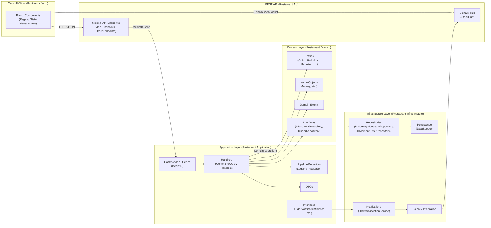
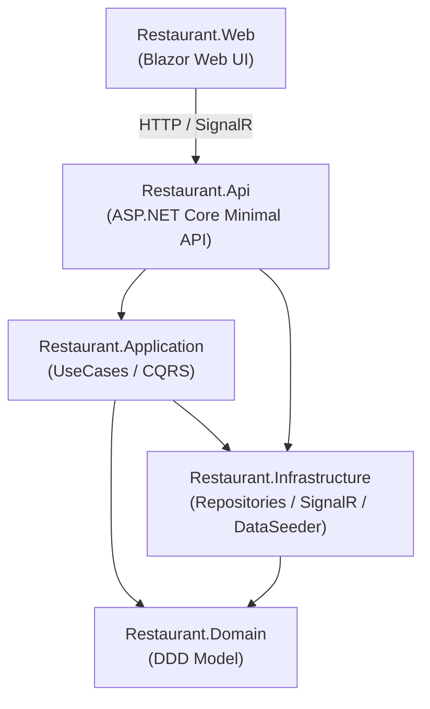
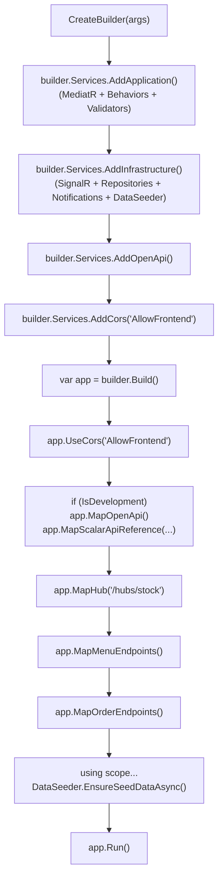
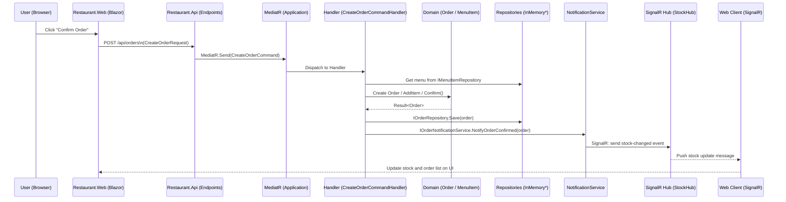
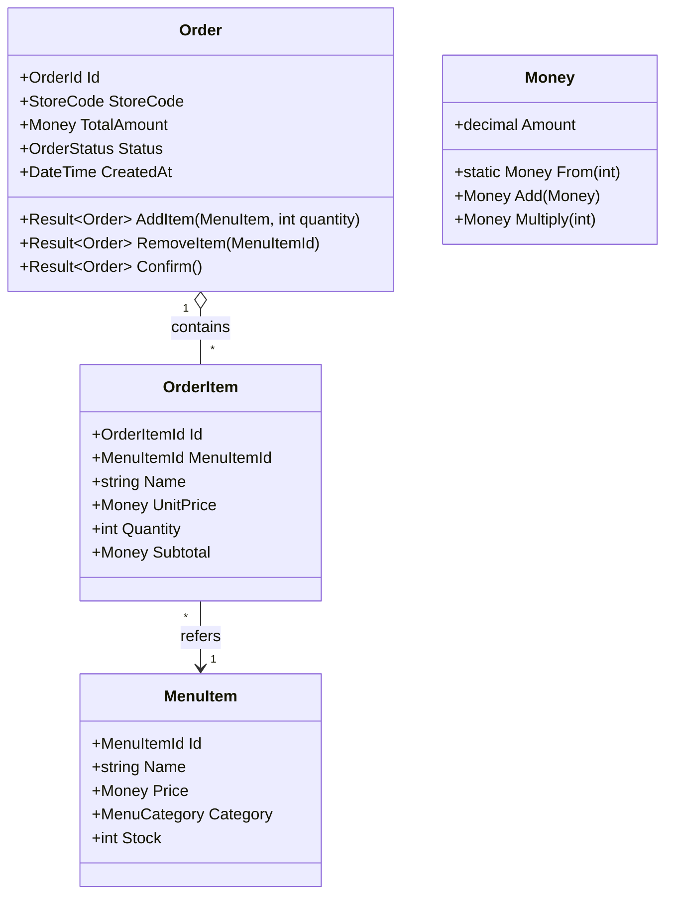
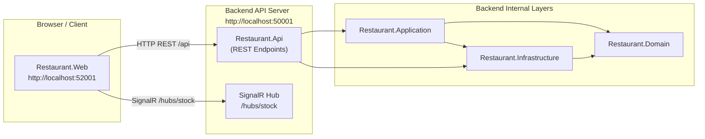
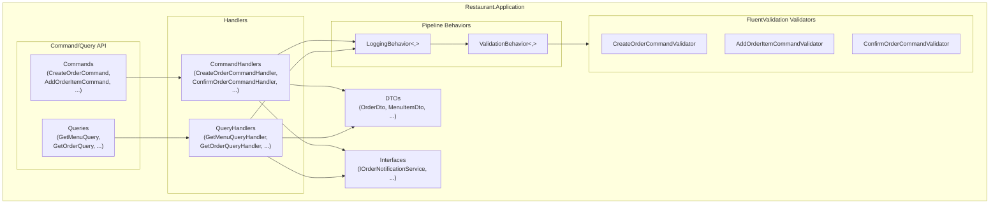
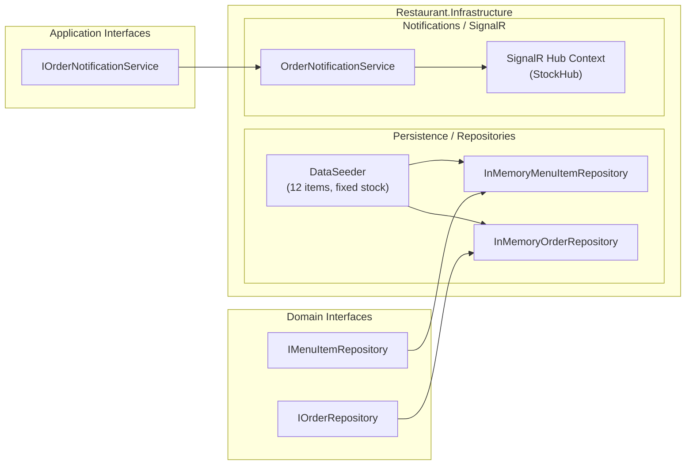
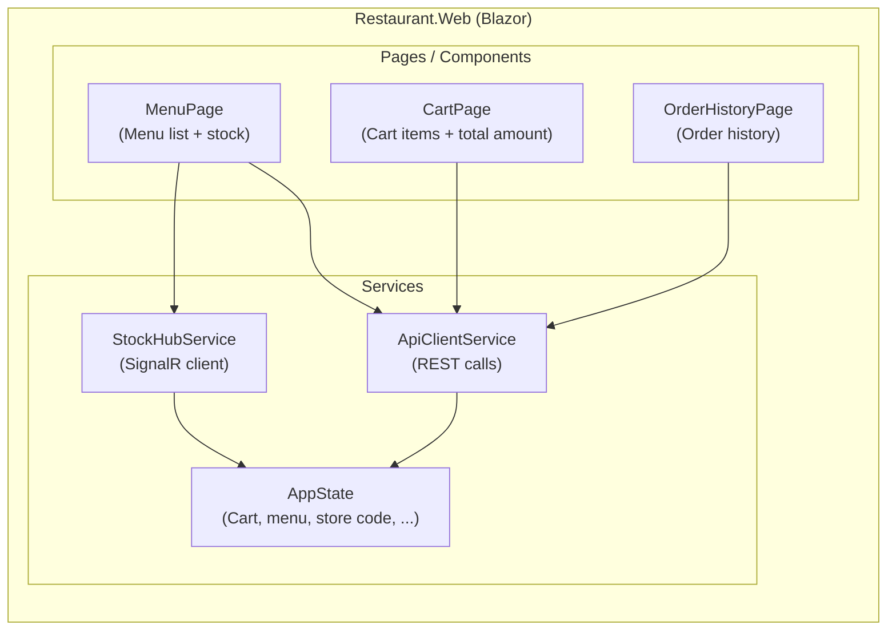
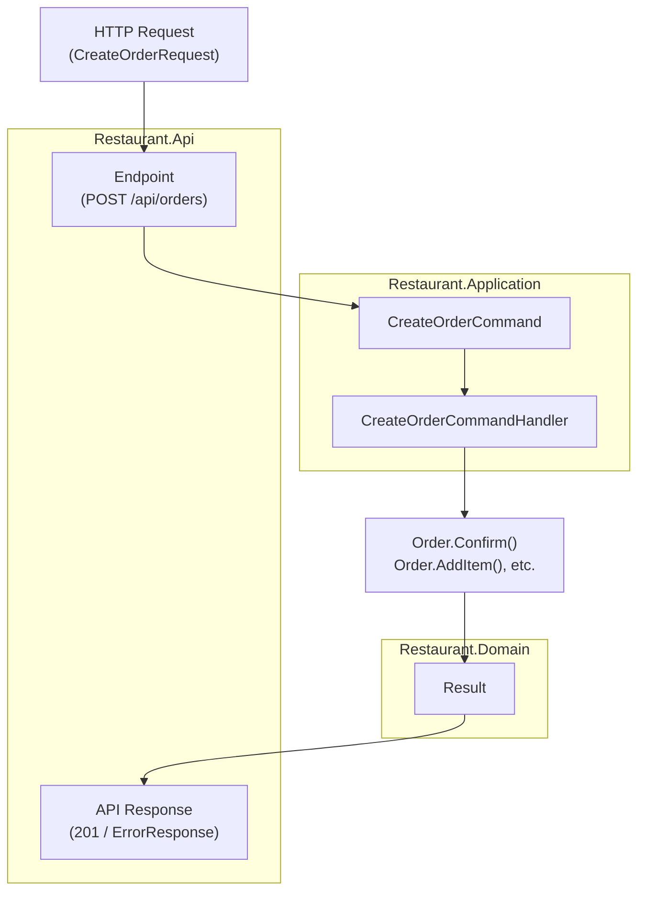

# Restaurant Ordering System Architecture Overview

This document describes the architecture of the `G602-6` solution, explaining the roles and interactions of each layer and major component.

---

## 1. Overall Layered Architecture

The system consists of five layers: Frontend (Blazor Web UI), API, Application, Domain, and Infrastructure.



**Description**

- `Restaurant.Web` is a Blazor-based Web UI that communicates with the backend via HTTP APIs and SignalR.
- `Restaurant.Api` hosts Minimal APIs and a SignalR Hub, combining the Application and Infrastructure layers to handle external I/O.
- `Restaurant.Application` represents use cases (commands/queries) and controls application flow using MediatR and pipeline behaviors (logging, validation).
- `Restaurant.Domain` holds DDD-style domain models (entities, value objects, domain events, repository interfaces) and is the center of business rules.
- `Restaurant.Infrastructure` provides concrete implementations for domain/application interfaces (repositories, notifications, data seeding, SignalR integration).

---

## 2. Project Dependencies

The dependency direction between projects is designed to be unidirectional around the domain layer.



**Description**

- `Restaurant.Domain` does not depend on any other layer and acts as the core.
- `Restaurant.Application` depends on the domain and on concrete implementations from `Restaurant.Infrastructure` via interfaces.
- `Restaurant.Api` is a presentation layer that depends on both application and infrastructure layers.
- `Restaurant.Web` communicates only with `Restaurant.Api` via HTTP and SignalR and does not directly depend on backend layers.

---

## 3. API Startup Pipeline (`Program.cs`)

`Restaurant.Api/Program.cs` configures DI registrations, middleware, endpoint/Hub mappings, and initial data seeding.



**Description**

- `AddApplication()` registers MediatR handlers, pipeline behaviors (logging/validation), and FluentValidation validators.
- `AddInfrastructure()` registers SignalR, repository implementations, notification services, and `DataSeeder`.
- OpenAPI + Scalar UI are enabled only in development, allowing inspection of API specifications.
- The SignalR Hub (`/hubs/stock`) and REST endpoints (menu, orders) are mapped and consumed by the frontend.
- At startup, a DI scope is created and `DataSeeder.EnsureSeedDataAsync()` populates fixed initial data (12 menu items).

---

## 4. Typical Use Case Flow (Create Order to Stock Notification)

The following sequence illustrates what happens in the backend when an order is confirmed.



**Description**

- The UI sends `CreateOrderRequest` to `POST /api/orders`, and the API maps it to a command and delegates to MediatR.
- `CreateOrderCommandHandler` orchestrates domain logic such as loading menu items, checking stock, creating the order, and calling `Order.Confirm()`.
- The domain layer uses a `Result<T>` pattern to represent business rule violations (e.g., confirmation fails under 500 JPY) instead of relying on exceptions.
- After saving the order, the notification service sends an event to the SignalR Hub, which broadcasts stock changes to all connected clients.
- The UI listens to the Hub via a SignalR client and automatically updates stock and order displays.

---

## 5. Domain Model Overview

This diagram shows relationships between main order-related domain objects (class and property names follow the prompt specification).



**Description**

- `Order` represents an entire order and provides business operations such as adding/removing items and confirming the order.
- `OrderItem` represents individual order lines, holding quantity, unit price, and subtotal (quantity is always at least 1).
- `MenuItem` represents menu items with price, category, and stock quantity.
- `Money` is a value object for monetary amounts; the currency is fixed to JPY and it provides operations for addition and multiplication.

---

## 6. Summary

- The solution adopts a layered architecture based on DDD and Clean Architecture, placing the domain model at the center.
- The application layer uses MediatR + pipeline behaviors to clearly separate use cases, logging, and validation.
- The infrastructure layer handles technical concerns such as repositories, notifications, SignalR, and data seeding, implementing interfaces defined by the domain/application layers.
- The frontend communicates via HTTP + SignalR to provide a real-time user experience for stock and order status.

---

## 7. Infrastructure and Ports

This diagram shows API/UI/Hub URLs and how they relate to internal layers.



**Description**

- The frontend UI is hosted at `http://localhost:52001`, while the backend API is hosted at `http://localhost:50001`.
- REST APIs are exposed under `/api/*`, and the SignalR Hub is exposed under `/hubs/stock` for real-time notifications.
- Inside the backend, the application, domain, and infrastructure layers follow the layered structure described above.

---

## 8. Application Layer Details

This diagram shows the internal structure of the application layer, including CQRS and pipeline behaviors.



**Description**

- Commands and queries are handled by dedicated handlers (CommandHandler/QueryHandler).
- All requests pass through `LoggingBehavior` and then `ValidationBehavior` before reaching the actual handler.
- Validation is implemented using FluentValidation validators to ensure input correctness.
- Handlers use DTOs for input/output and perform side effects via interfaces such as `IOrderNotificationService`.

---

## 9. Infrastructure Layer Details

This diagram details repositories, data seeder, and SignalR integration in the infrastructure layer.



**Description**

- `InMemoryMenuItemRepository` and `InMemoryOrderRepository` are in-memory implementations of domain repository interfaces.
- `DataSeeder` populates 12 fixed menu items and stock quantities at startup (ramen: 50, sides: 40, desserts: 100, drinks: 200).
- `OrderNotificationService` receives notification requests from the application layer and broadcasts events to clients through the SignalR Hub context.

---

## 10. Web UI Structure

This diagram shows Blazor components, backend communication services, and state management.



**Description**

- Each page component calls REST APIs through `ApiClientService`.
- Real-time stock updates are delivered via `StockHubService`, which connects to the SignalR Hub and updates `AppState`.
- `AppState` centrally manages shared state such as the cart, menu list, and selected store code across pages.

---

## 11. Error Handling and Result Pattern

This diagram shows how `Result<T>` is used to represent errors/business rule violations and how it flows into API responses.



**Description**

- Domain methods such as `Order.Confirm()` return success/failure via `Result<T>` instead of throwing exceptions.
- Application handlers receive this `Result` and either return domain/DTO objects on success or propagate error information back to the API layer on failure.
- The API layer maps failures to an `ErrorResponse` type (`{ "success": false, "error": "..." }`) and returns it with an appropriate HTTP status code.

---

## 12. Test Strategy

The solution separates responsibilities by layer and provides a dedicated test project for each.

- `tests/Restaurant.Domain.Tests`
  - Target: Domain models (entities, value objects, domain services)
  - Goal: Verify business rules  
    - Example: `Order.Confirm()` fails when total amount is less than 500 JPY and the message contains "500円以上" (500 JPY or more).
    - Example: `Order.AddItem()` only allows quantities up to `menuItem.Stock`.
  - Characteristics: Tests success/failure paths based on the `Result<T>` pattern rather than exceptions.

- `tests/Restaurant.Application.Tests`
  - Target: Command/query handlers and pipeline behaviors (logging/validation)
  - Goal: Verify behavior on a per-use-case basis  
    - Repositories and notification services are replaced with mocks using NSubstitute.
    - Uses xUnit + FluentAssertions + NSubstitute.
  - Style:
    - Test method names include a Japanese comment plus an English method name.
    - Arrange / Act / Assert sections are explicitly marked with comments.

- `tests/Restaurant.Api.Tests`
  - Target: Minimal API endpoints
  - Goal: Verify endpoint-level input/output, status codes, and `ErrorResponse` format  
    - `POST /api/orders` returns 201 Created and sets the `Location` header.
    - Error responses follow the `{ "success": false, "error": "..." }` schema.

- `tests/Restaurant.Infrastructure.Tests`
  - Target: Repository implementations, `DataSeeder`, `OrderNotificationService`, etc.
  - Goal: Verify consistent behavior of in-memory implementations and correct initial data seeding.

**Testing Principles**

- Behavior-driven: Focus on business rules and use-case outcomes rather than implementation details.
- Independence: Avoid inter-test dependencies so tests can run in any order.
- Speed: Prefer in-memory repositories and avoid external I/O for fast feedback.
- Error-path coverage: Always test failure paths such as business rule violations and invalid inputs in addition to happy paths.

---

## 13. Non-Functional Requirements

The solution targets a prototype/MVP level while keeping the following non-functional requirements in mind.

### 13.1 Performance

- Minimal API + Blazor keep API latency low with a lightweight stack.
- In-memory repositories eliminate most I/O wait and provide fast responses.
- Domain logic is side-effect free where possible and kept simple to reduce CPU and memory allocations.

### 13.2 Scalability

- Currently assumes a single-node, in-memory setup, but repositories and notification services are abstracted behind interfaces, allowing migration to real databases or distributed messaging later.
- SignalR Hub notifications also go through an interface-based service, easing future migration to a scale-out setup with a backplane (e.g., Redis).

### 13.3 Availability and Reliability

- The `Result<T>` pattern at the domain level avoids overuse of exceptions and helps prevent unexpected crashes.
- At external boundaries (API layer), failures are consistently returned using the `ErrorResponse` format, simplifying client-side error handling.
- Startup `DataSeeder` guarantees a consistent initial data state each time the application starts.

### 13.4 Maintainability and Extensibility

- DDD + Clean Architecture clearly separates domain, application, infrastructure, and UI concerns.
- Class, method, and property names follow the prompt specifications (`prompts/*.md`), making it easy to map between specification and implementation.
- New use cases can be added by following the pattern: Command/Query + Handler + Validator + Tests.

### 13.5 Observability (Logging)

- MediatR `LoggingBehavior` centralizes logging of inputs, outputs, and exceptions for all commands and queries.
- Future introduction of structured logging or distributed tracing can be done primarily within the pipeline layer, minimizing changes elsewhere.

---

## 14. Clean Architecture in Plain Terms

### 14.1 Intuition for People New to Clean Architecture

You can think of Clean Architecture like an **onion or nested lunch boxes**.

- Innermost: **Domain layer** (business rules)  
  - The store’s core rules (e.g., “you cannot confirm an order under 500 JPY”, “you cannot order if there is not enough stock”).
- Middle: **Application layer** (use cases)  
  - Orchestrates flows such as “accept an order” or “add an item to cart”.
- Outer: **Infrastructure / UI layers** (technical I/O)  
  - Databases, messaging systems, Web APIs, browser UI — how the system talks to the outside world.

> Analogy:  
> - Domain layer = “the rulebook decided by the owner and manager”  
> - Application layer = “the operation manual that follows those rules”  
> - Infrastructure/UI layer = “tools” such as cash registers, vending machines, stock systems  
>
> Even if the owner changes the rules, you don’t necessarily change the cash register vendor.  
> And even if you swap the register vendor, the rules themselves can stay the same.  
> This is the idea of making dependencies point inward (inner layers don’t know outer layers).

In this project:

- `Restaurant.Domain` is the **rulebook**.
- `Restaurant.Application` is the **manual (use cases)**.
- `Restaurant.Infrastructure`, `Restaurant.Api`, and `Restaurant.Web` are the **tools**.

By placing interfaces like `IOrderRepository` in the inner layers, we can **swap tools (DB, MQ, etc.) without changing the rules or manuals**.

---

## 15. Variations of the Order Repository Implementation

This section shows how `IOrderRepository` could be implemented with different technologies: **IBM Db2**, **MongoDB**, and **IBM MQ**.

> Note: All examples are **prototype-level reference code only**.  
> For production, you also need transaction management, retries, connection pooling, logging/monitoring, security configuration, etc.

### 15.1 Implementing Order Repository with IBM Db2

#### 15.1.1 Example Table Schema

A simple design uses two tables: order header and order items.

```sql
CREATE TABLE ORDERS (
    ORDER_ID        VARCHAR(36)    NOT NULL PRIMARY KEY,
    STORE_CODE      VARCHAR(32)    NOT NULL,
    STATUS          VARCHAR(16)    NOT NULL,
    TOTAL_AMOUNT    DECIMAL(18,2)  NOT NULL,
    CREATED_AT      TIMESTAMP      NOT NULL
);

CREATE TABLE ORDER_ITEMS (
    ORDER_ITEM_ID   VARCHAR(36)    NOT NULL PRIMARY KEY,
    ORDER_ID        VARCHAR(36)    NOT NULL,
    MENU_ITEM_ID    VARCHAR(36)    NOT NULL,
    NAME            VARCHAR(128)   NOT NULL,
    UNIT_PRICE      DECIMAL(18,2)  NOT NULL,
    QUANTITY        INT            NOT NULL,
    SUBTOTAL        DECIMAL(18,2)  NOT NULL,
    CONSTRAINT FK_ORDER_ITEMS_ORDER
        FOREIGN KEY (ORDER_ID) REFERENCES ORDERS (ORDER_ID)
);
```
#### 15.1.2 C# Implementation (Outline)
```
using System.Data;
using IBM.Data.Db2.Core;
using Restaurant.Domain.Entities;
using Restaurant.Domain.Interfaces;

namespace Restaurant.Infrastructure.Repositories;

public sealed class Db2OrderRepository : IOrderRepository
{
    private readonly string _connectionString;

    public Db2OrderRepository(string connectionString)
    {
        _connectionString = connectionString;
    }

    public async Task<Order?> GetByIdAsync(OrderId id, CancellationToken cancellationToken = default)
    {
        await using var connection = new DB2Connection(_connectionString);
        await connection.OpenAsync(cancellationToken);

        // Load header
        await using var headerCmd = connection.CreateCommand();
        headerCmd.CommandText = @"SELECT ORDER_ID, STORE_CODE, STATUS, TOTAL_AMOUNT, CREATED_AT
                                  FROM ORDERS WHERE ORDER_ID = @ORDER_ID";
        headerCmd.Parameters.Add(new DB2Parameter("@ORDER_ID", id.Value));

        await using var reader = await headerCmd.ExecuteReaderAsync(cancellationToken);
        if (!await reader.ReadAsync(cancellationToken))
        {
            return null;
        }

        var order = Order.Restore(
            new OrderId(reader.GetString(0)),
            new StoreCode(reader.GetString(1)),
            Enum.Parse<OrderStatus>(reader.GetString(2)),
            Money.From(reader.GetDecimal(3)),
            reader.GetDateTime(4));

        // Load items
        await using var itemCmd = connection.CreateCommand();
        itemCmd.CommandText = @"SELECT ORDER_ITEM_ID, MENU_ITEM_ID, NAME, UNIT_PRICE, QUANTITY, SUBTOTAL
                                  FROM ORDER_ITEMS WHERE ORDER_ID = @ORDER_ID";
        itemCmd.Parameters.Add(new DB2Parameter("@ORDER_ID", id.Value));

        await using var itemReader = await itemCmd.ExecuteReaderAsync(cancellationToken);
        while (await itemReader.ReadAsync(cancellationToken))
        {
            var item = OrderItem.Restore(
                new OrderItemId(itemReader.GetString(0)),
                new MenuItemId(itemReader.GetString(1)),
                itemReader.GetString(2),
                Money.From(itemReader.GetDecimal(3)),
                itemReader.GetInt32(4));

            order = order.WithRestoredItem(item);
        }

        return order;
    }

    public async Task SaveAsync(Order order, CancellationToken cancellationToken = default)
    {
        await using var connection = new DB2Connection(_connectionString);
        await connection.OpenAsync(cancellationToken);

        await using var tx = await connection.BeginTransactionAsync(IsolationLevel.ReadCommitted, cancellationToken);

        try
        {
            // Header upsert (simplified)
            await using (var cmd = connection.CreateCommand())
            {
                cmd.Transaction = tx;
                cmd.CommandText = @"MERGE INTO ORDERS T
                                    USING (VALUES(@ORDER_ID, @STORE_CODE, @STATUS, @TOTAL_AMOUNT, @CREATED_AT)) S
                                    (ORDER_ID, STORE_CODE, STATUS, TOTAL_AMOUNT, CREATED_AT)
                                    ON T.ORDER_ID = S.ORDER_ID
                                    WHEN MATCHED THEN
                                      UPDATE SET STORE_CODE = S.STORE_CODE,
                                                 STATUS = S.STATUS,
                                                 TOTAL_AMOUNT = S.TOTAL_AMOUNT,
                                                 CREATED_AT = S.CREATED_AT
                                    WHEN NOT MATCHED THEN
                                      INSERT (ORDER_ID, STORE_CODE, STATUS, TOTAL_AMOUNT, CREATED_AT)
                                      VALUES (S.ORDER_ID, S.STORE_CODE, S.STATUS, S.TOTAL_AMOUNT, S.CREATED_AT);";

                cmd.Parameters.Add(new DB2Parameter("@ORDER_ID", order.Id.Value));
                cmd.Parameters.Add(new DB2Parameter("@STORE_CODE", order.StoreCode.Value));
                cmd.Parameters.Add(new DB2Parameter("@STATUS", order.Status.ToString()));
                cmd.Parameters.Add(new DB2Parameter("@TOTAL_AMOUNT", order.TotalAmount.Amount));
                cmd.Parameters.Add(new DB2Parameter("@CREATED_AT", order.CreatedAt));

                await cmd.ExecuteNonQueryAsync(cancellationToken);
            }

            // Delete all items → re-insert (simplified)
            await using (var deleteCmd = connection.CreateCommand())
            {
                deleteCmd.Transaction = tx;
                deleteCmd.CommandText = "DELETE FROM ORDER_ITEMS WHERE ORDER_ID = @ORDER_ID";
                deleteCmd.Parameters.Add(new DB2Parameter("@ORDER_ID", order.Id.Value));
                await deleteCmd.ExecuteNonQueryAsync(cancellationToken);
            }

            foreach (var item in order.Items)
            {
                await using var insertCmd = connection.CreateCommand();
                insertCmd.Transaction = tx;
                insertCmd.CommandText = @"INSERT INTO ORDER_ITEMS
                    (ORDER_ITEM_ID, ORDER_ID, MENU_ITEM_ID, NAME, UNIT_PRICE, QUANTITY, SUBTOTAL)
                    VALUES (@ORDER_ITEM_ID, @ORDER_ID, @MENU_ITEM_ID, @NAME, @UNIT_PRICE, @QUANTITY, @SUBTOTAL)";

                insertCmd.Parameters.Add(new DB2Parameter("@ORDER_ITEM_ID", item.Id.Value));
                insertCmd.Parameters.Add(new DB2Parameter("@ORDER_ID", order.Id.Value));
                insertCmd.Parameters.Add(new DB2Parameter("@MENU_ITEM_ID", item.MenuItemId.Value));
                insertCmd.Parameters.Add(new DB2Parameter("@NAME", item.Name));
                insertCmd.Parameters.Add(new DB2Parameter("@UNIT_PRICE", item.UnitPrice.Amount));
                insertCmd.Parameters.Add(new DB2Parameter("@QUANTITY", item.Quantity));
                insertCmd.Parameters.Add(new DB2Parameter("@SUBTOTAL", item.Subtotal.Amount));

                await insertCmd.ExecuteNonQueryAsync(cancellationToken);
            }

            await tx.CommitAsync(cancellationToken);
        }
        catch
        {
            await tx.RollbackAsync(cancellationToken);
            throw;
        }
    }
}
```
### 15.2 Implementing Order Repository with MongoDB
#### 15.2.1 Example Document Structure

```
{
  "_id": "ORDER-0001",
  "storeCode": "STORE001",
  "status": "Confirmed",
  "totalAmount": 1200,
  "createdAt": "2024-01-01T12:34:56Z",
  "items": [
    {
      "orderItemId": "ITEM-0001",
      "menuItemId": "MENU-001",
      "name": "Shoyu Ramen",
      "unitPrice": 800,
      "quantity": 1,
      "subtotal": 800
    },
    {
      "orderItemId": "ITEM-0002",
      "menuItemId": "MENU-010",
      "name": "Gyoza",
      "unitPrice": 400,
      "quantity": 1,
      "subtotal": 400
    }
  ]
}
```
#### 15.2.2 C# Implementation (MongoDB.Driver)
```
using MongoDB.Bson;
using MongoDB.Bson.Serialization.Attributes;
using MongoDB.Driver;
using Restaurant.Domain.Entities;
using Restaurant.Domain.Interfaces;

namespace Restaurant.Infrastructure.Repositories;

public sealed class MongoOrderRepository : IOrderRepository
{
    private readonly IMongoCollection<OrderDocument> _collection;

    public MongoOrderRepository(IMongoDatabase database)
    {
        _collection = database.GetCollection<OrderDocument>("orders");
    }

    public async Task<Order?> GetByIdAsync(OrderId id, CancellationToken cancellationToken = default)
    {
        var filter = Builders<OrderDocument>.Filter.Eq(x => x.Id, id.Value);
        var doc = await _collection.Find(filter).FirstOrDefaultAsync(cancellationToken);
        if (doc is null)
        {
            return null;
        }

        var order = Order.Restore(
            new OrderId(doc.Id),
            new StoreCode(doc.StoreCode),
            Enum.Parse<OrderStatus>(doc.Status),
            Money.From(doc.TotalAmount),
            doc.CreatedAt);

        foreach (var item in doc.Items)
        {
            var orderItem = OrderItem.Restore(
                new OrderItemId(item.OrderItemId),
                new MenuItemId(item.MenuItemId),
                item.Name,
                Money.From(item.UnitPrice),
                item.Quantity);

            order = order.WithRestoredItem(orderItem);
        }

        return order;
    }

    public async Task SaveAsync(Order order, CancellationToken cancellationToken = default)
    {
        var doc = new OrderDocument
        {
            Id = order.Id.Value,
            StoreCode = order.StoreCode.Value,
            Status = order.Status.ToString(),
            TotalAmount = order.TotalAmount.Amount,
            CreatedAt = order.CreatedAt,
            Items = order.Items.Select(x => new OrderItemDocument
            {
                OrderItemId = x.Id.Value,
                MenuItemId = x.MenuItemId.Value,
                Name = x.Name,
                UnitPrice = x.UnitPrice.Amount,
                Quantity = x.Quantity,
                Subtotal = x.Subtotal.Amount
            }).ToList()
        };

        var filter = Builders<OrderDocument>.Filter.Eq(x => x.Id, order.Id.Value);
        await _collection.ReplaceOneAsync(
            filter,
            doc,
            new ReplaceOptions { IsUpsert = true },
            cancellationToken);
    }

    private sealed class OrderDocument
    {
        [BsonId]
        [BsonRepresentation(BsonType.String)]
        public string Id { get; set; } = default!;

        [BsonElement("storeCode")]
        public string StoreCode { get; set; } = default!;

        [BsonElement("status")]
        public string Status { get; set; } = default!;

        [BsonElement("totalAmount")]
        public decimal TotalAmount { get; set; }

        [BsonElement("createdAt")]
        public DateTime CreatedAt { get; set; }

        [BsonElement("items")]
        public List<OrderItemDocument> Items { get; set; } = new();
    }

    private sealed class OrderItemDocument
    {
        [BsonElement("orderItemId")]
        public string OrderItemId { get; set; } = default!;

        [BsonElement("menuItemId")]
        public string MenuItemId { get; set; } = default!;

        [BsonElement("name")]
        public string Name { get; set; } = default!;

        [BsonElement("unitPrice")]
        public decimal UnitPrice { get; set; }

        [BsonElement("quantity")]
        public int Quantity { get; set; }

        [BsonElement("subtotal")]
        public decimal Subtotal { get; set; }
    }
}
```

### 15.3 Implementing Order Repository with IBM MQ
For IBM MQ, an “Order repository” often becomes more of an event-driven, asynchronous persistence pattern:

SaveAsync publishes an “order confirmed” message to MQ.
A separate process consumes messages from MQ and persists them to a storage (Db2, MongoDB, etc.).
#### 15.3.1 Implementing IOrderRepository Using MQ
```
using IBM.WMQ;
using Restaurant.Domain.Entities;
using Restaurant.Domain.Interfaces;

namespace Restaurant.Infrastructure.Repositories;

public sealed class MqOrderRepository : IOrderRepository
{
    private readonly MQQueueManager _queueManager;
    private readonly string _queueName;

    public MqOrderRepository(MQQueueManager queueManager, string queueName)
    {
        _queueManager = queueManager;
        _queueName = queueName;
    }

    public Task<Order?> GetByIdAsync(OrderId id, CancellationToken cancellationToken = default)
    {
        // In an MQ-based design, synchronous reads are typically handled by another read store.
        return Task.FromResult<Order?>(null);
    }

    public async Task SaveAsync(Order order, CancellationToken cancellationToken = default)
    {
        // Serialize the order and send as an MQ message
        var payload = Serialize(order);

        var queue = _queueManager.AccessQueue(
            _queueName,
            MQC.MQOO_OUTPUT | MQC.MQOO_FAIL_IF_QUIESCING);

        try
        {
            var msg = new MQMessage
            {
                Format = MQC.MQFMT_STRING,
                CharacterSet = 1208 // UTF-8
            };

            msg.WriteString(payload);

            var putOptions = new MQPutMessageOptions();
            await Task.Run(() => queue.Put(msg, putOptions), cancellationToken);
        }
        finally
        {
            queue.Close();
        }
    }

    private static string Serialize(Order order)
    {
        return System.Text.Json.JsonSerializer.Serialize(new
        {
            orderId = order.Id.Value,
            storeCode = order.StoreCode.Value,
            status = order.Status.ToString(),
            totalAmount = order.TotalAmount.Amount,
            createdAt = order.CreatedAt,
            items = order.Items.Select(x => new
            {
                orderItemId = x.Id.Value,
                menuItemId = x.MenuItemId.Value,
                name = x.Name,
                unitPrice = x.UnitPrice.Amount,
                quantity = x.Quantity,
                subtotal = x.Subtotal.Amount
            })
        });
    }
}
```

#### 15.3.2 Example MQ Consumer Application
```
using IBM.WMQ;

public sealed class OrderConsumer
{
    private readonly MQQueueManager _queueManager;
    private readonly string _queueName;
    private readonly Db2OrderRepository _db2OrderRepository;

    public OrderConsumer(MQQueueManager queueManager, string queueName, Db2OrderRepository db2OrderRepository)
    {
        _queueManager = queueManager;
        _queueName = queueName;
        _db2OrderRepository = db2OrderRepository;
    }

    public async Task RunAsync(CancellationToken cancellationToken)
    {
        var queue = _queueManager.AccessQueue(
            _queueName,
            MQC.MQOO_INPUT_AS_Q_DEF | MQC.MQOO_FAIL_IF_QUIESCING);

        try
        {
            while (!cancellationToken.IsCancellationRequested)
            {
                var msg = new MQMessage();
                var getOptions = new MQGetMessageOptions
                {
                    Options = MQC.MQGMO_WAIT | MQC.MQGMO_FAIL_IF_QUIESCING,
                    WaitInterval = 5000
                };

                try
                {
                    queue.Get(msg, getOptions);
                }
                catch (MQException ex) when (ex.Reason == MQC.MQRC_NO_MSG_AVAILABLE)
                {
                    continue; // timeout
                }

                var payload = msg.ReadString(msg.MessageLength);

                var order = DeserializeOrder(payload);

                await _db2OrderRepository.SaveAsync(order, cancellationToken);
            }
        }
        finally
        {
            queue.Close();
        }
    }

    private static Order DeserializeOrder(string json)
    {
        var dto = System.Text.Json.JsonSerializer.Deserialize<OrderDto>(json)!;

        var order = Order.Create(
            new StoreCode(dto.StoreCode));

        foreach (var item in dto.Items)
        {
            order = order.AddItemFromPersistence(
                new MenuItemId(item.MenuItemId),
                item.Name,
                Money.From(item.UnitPrice),
                item.Quantity).Value;
        }

        if (dto.Status == "Confirmed")
        {
            order = order.Confirm().Value;
        }

        return order;
    }

    private sealed class OrderDto
    {
        public string StoreCode { get; set; } = default!;
        public string Status { get; set; } = default!;
        public decimal TotalAmount { get; set; }
        public DateTime CreatedAt { get; set; }
        public List<OrderItemDto> Items { get; set; } = new();
    }

    private sealed class OrderItemDto
    {
        public string MenuItemId { get; set; } = default!;
        public string Name { get; set; } = default!;
        public decimal UnitPrice { get; set; }
        public int Quantity { get; set; }
        public decimal Subtotal { get; set; }
    }
}
```
With these variations, swapping the implementation of IOrderRepository lets you combine:

Synchronous reads/writes with Db2
Document-based storage with MongoDB
Asynchronous persistence via IBM MQ
without changing your domain rules or application use cases, which is exactly the benefit of Clean Architecture + Repository pattern.
