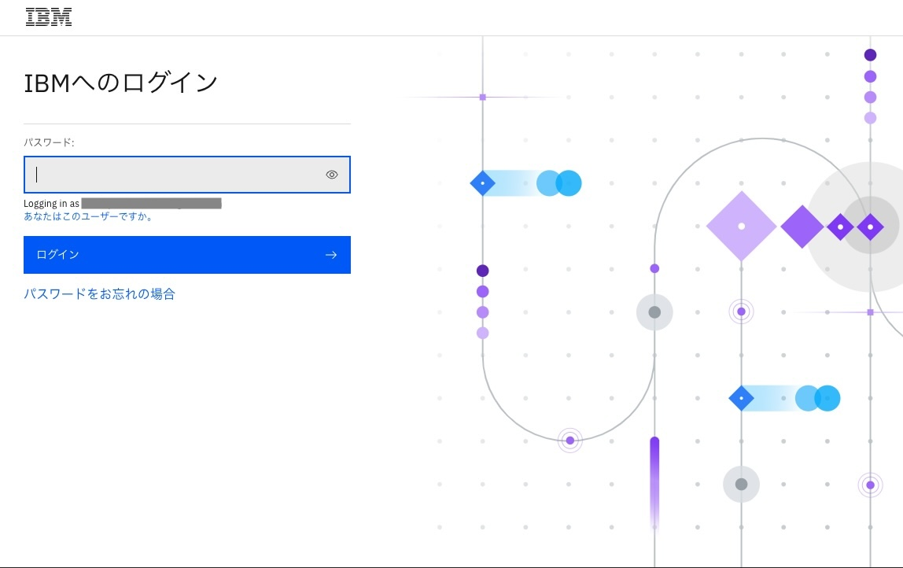
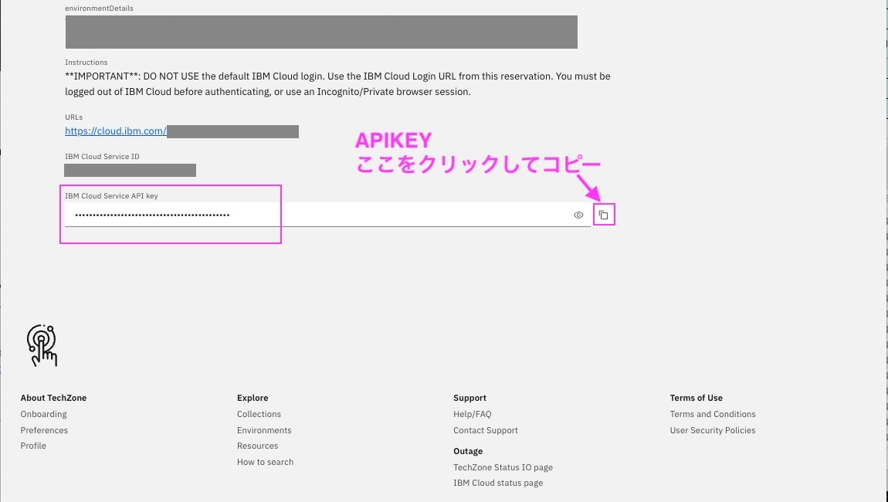

# ワークショップ環境へのアクセス
前提：
[ワークショップ環境の事前準備](00_techzone_environments_preparation.md)が実施していることが前提です。
実施していない場合は、まず[ワークショップ環境の事前準備](00_techzone_environments_preparation.md)を実施してください。

## 1. TechZone初期登録
こちらの初期登録は一度実施すれば次回ログインからは不要です。

### 1-1. 「TechZoneランディングページ」にアクセス
講師から指示のあった「TechZoneランディングページ」にWebブラウザーでアクセスします。 
URLは当日講師が提示します。 

### 1-2. IBM idでのログイン
IBM idでのログインが必要ですので、準備したIBM idでログインしてください。

### 1-3.cookieの許可
cookieの許可の画面が下部に表示されますので、「Accept all」か「Required only」のどちらかをクリックしてください。

### 1-4.IBM Technology Zone Terms and conditionsのAccept
表示された「IBM Technology Zone Terms and conditions」を読んで、問題なければ、 
`I have read and accept the terms and conditions.`にチェックを入れ、「Submit」をクリックしてください。

### 1-5:「Welcome to IBM Technology Zone! Tell us about yourself.」をSkip
「Welcome to IBM Technology Zone! Tell us about yourself.」というウィンドウが表示されたら、「Skip for now」をクリックしてください。

### 1-6: IBM Technology Zoneのトップ画面が表示されます

## 2. 「TechZoneランディングページ」からIBM Cloud 環境にアクセス
### 2-1. 「TechZoneランディングページ」にアクセス
講師から指示のあった「TechZoneランディングページ」にWebブラウザーで再びアクセスします。 
尚、前回のログインから時間が経っていると IBM idでのログイン画面が出ることがあります。　その場合は再度ログインお願いします。

### 2-2. パスワードを入力し、「Submit password/access code」をクリック
「Enter the workshop password/access code.」
に講師が提示したパスワードを入力し、 
「Submit password/access code」をクリックします。

尚、使用したIBM idのメールアドレスに「Account: Action required: You are invited to join an account in IBM Cloud」というSubjectのメールが`no-reply@cloud.ibm.com`より送付されますが、無視してください。特にアクションは不要です。 
送付されるメールの例：

### 2-3. Workshop環境の情報が表示されます
使用するのは以下の4つです
- IBM Cloud Login
- Username
- Password
- IBM Cloud Service API key

`IBM Cloud Login`のURLがログインページです。 
`Username`と`Password`の値を使用してログインします。 
`IBM Cloud Service API key`はハンズオン中に使いますので、このページを表示させたままにしておいてください。
 
 

### 2-4. IBM Cloud LoginのURLをクリックし、ログイン画面を表示
 

### 2-5. Usesrname と　Passwordを入力し「Sign in」をクリックしてIBM Cloudにログイン
 

ログインが成功するとIBM Cloudのダッシュボードが表示されます
 
