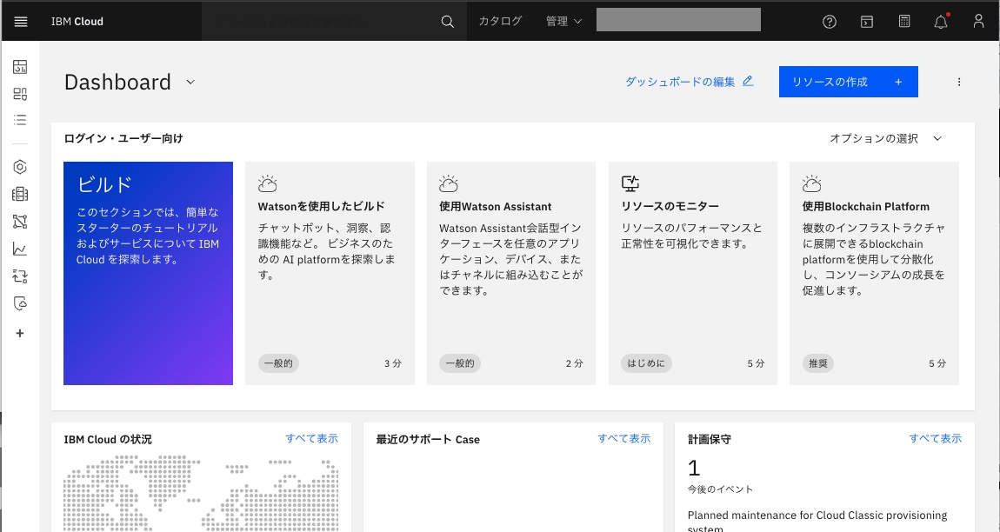
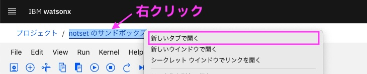
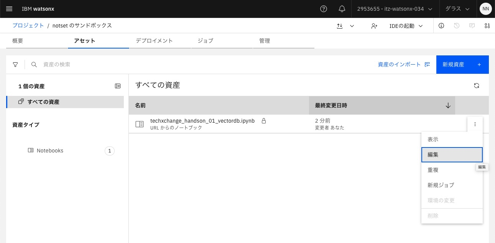

# ハンズオン実施
前提：
[ワークショップ環境へのアクセス](01_techzone_use_environments.md)が完了し、IBM CloudのダッシュボードがWebブラウザーに表示されていることが前提です。
 

## ハンズオン
以下の順序で各リンクにアクセスし、実施してください

### 1. wastonx.data: Milvus 接続情報の取得
wastonx.dataのMilvusの接続情報を取得します
- [wastonx.data: Milvus 接続情報の取得](watsonx_data_get_milvus_info.md)

### 2. wastonx.ai: Watson Studioの立ち上げ
wastonx.aiのWatson Studioを立ち上げ、サンドボックスプロジェクトを開きます
- [wastonx.ai: Watson Studioの立ち上げ](watsonx_ai_open_watson_studio.md) 

### 3. NotebookをJupyter Notebookエディター・ツールで開いて実行

#### 1. Excelをベクトル化してベクトルDB Milvusに入れよう 
TechXchange Japanの情報が入ったExcelファイルをベクトル化してベクトルDB Milvusに入れます
- [Notebook1を新規作成して開く](open_notebook_01.md)

#### 2. ベクトルDB Milvusに入ったデータで類似検索してみよう! 
1で準備したベクトルDBのデータでLangChainを使用して類似検索してみます
- [Notebook2を新規作成して開く](open_notebook_02.md)

#### 3. ベクトルDB Milvusとwatsonx.ai LLMでRAGを構成して、質問をしてみよう! 
1で準備したベクトルDBのデータとwatsonx.ai LLMでLangChainを使用してRAGを構成し、質問をしてみます
- [Notebook3を新規作成して開く](open_notebook_03.md)

#### 4. ベクトルDB Milvusとwatsonx.ai LLMでRAGを構成して、チャットアプリを作成してみよう! 
3で実行した仕組みを利用してチャットアプリを作成します
- [Notebook4を新規作成して開く](open_notebook_04.md)

以上でハンズオンは完了です。お疲れ様でした！

### Tips:
- 別のNotebookに進む際、Notebookを開いたままにするには、上部のプロジェクト名を右クリックし、「新しいタブで開く」でプロジェクトを新しいタブで開いてください。 

 

- もし既に対象のNotenookが作成済みの場合は、「アセット」タブから、対象のファイル名の右側の︙をクリックし、「編集」を選択すると保存したNotenookが開きます。 

---
[watsonxハンズオン1 さわってみようベクトル・データベース watsonx.dataでRAG体験 - トップページに戻る](README.md)

