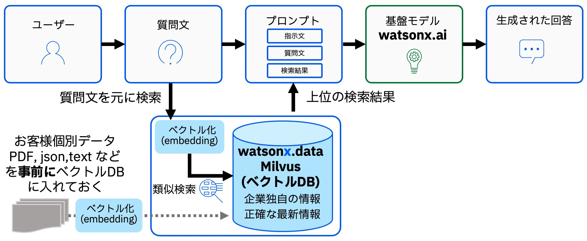
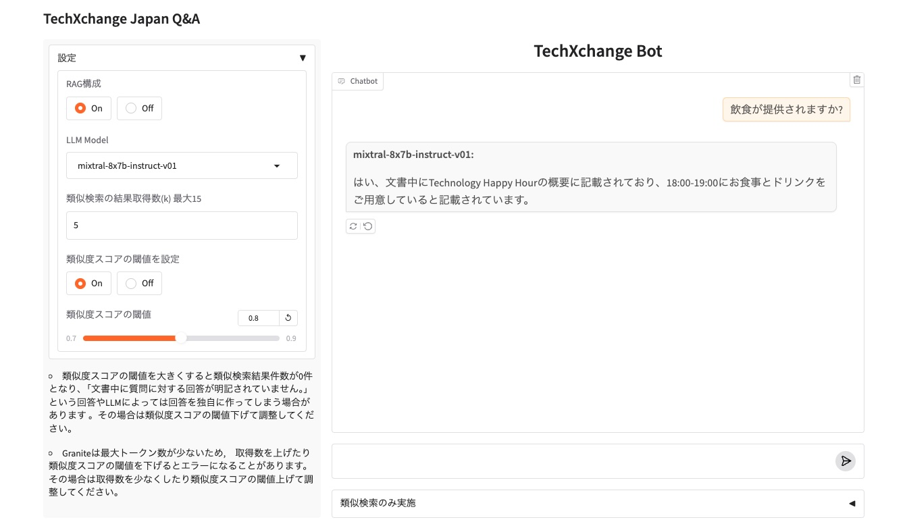

# watsonxハンズオン1
# さわってみようベクトル・データベース watsonx.dataでRAG体験

## このハンズオンについて
TechXchange JapanのWebサイトの内容のソースであるExcelファイルを使って、RAGを構成し、 TechXchange JapanについてQ&Aができるchatbotを作ります。 

chatbotのイメージ:

 

- このハンズオンでは watsonx.dataのベクトル・データベース　Milvusへのアクセス、データの追加をし、watsonx.aiの生成AIを組み合わせてRAGを体験していただくのが目的です。
- あらかじめ準備されたpythonのコードが実行できるjupyter-notebookを使って体験していただきます。pythonの知識はなくとも実行できますが、pythonの知識があればより理解しやすいです。
- RAGのフレームワークとして[LangChain](https://www.ibm.com/jp-ja/topics/langchain)を使います。
- chatbotのGUI構築にはpythonの機械学習モデルのデモを行うWebアプリケーションを簡単に作ることができるPythonのライブラリー[gradio](https://www.gradio.app/)を使います。
- RAGを体験していただくのが目的のため、Milvusのindex typeやmetricsなどの詳細、LangChainの使い方詳細、gradioの使い方詳細など Coding詳細はこのハンズオンでは扱いません。

 

## 00. 事前準備

- [ワークショップ環境の事前準備](00_techzone_environments_preparation.md)

## 01. ワークショップ環境へのアクセス

- [ワークショップ環境へのアクセス](01_techzone_use_environments.md)

## 02. ハンズオン実施
- [ハンズオン実施](02_hands_on_guide.md)

