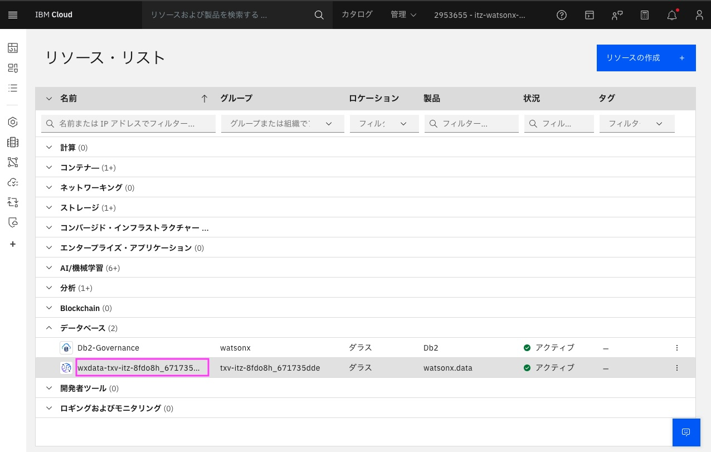
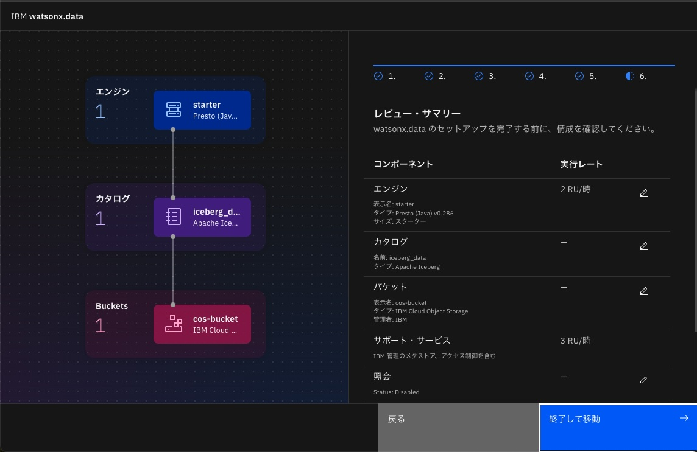
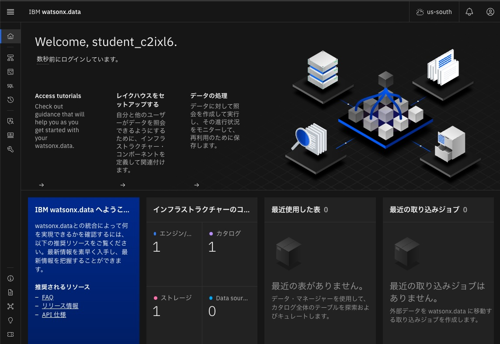
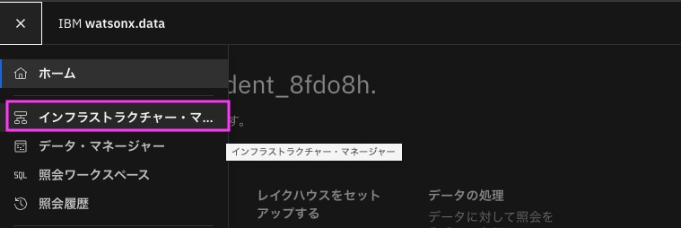
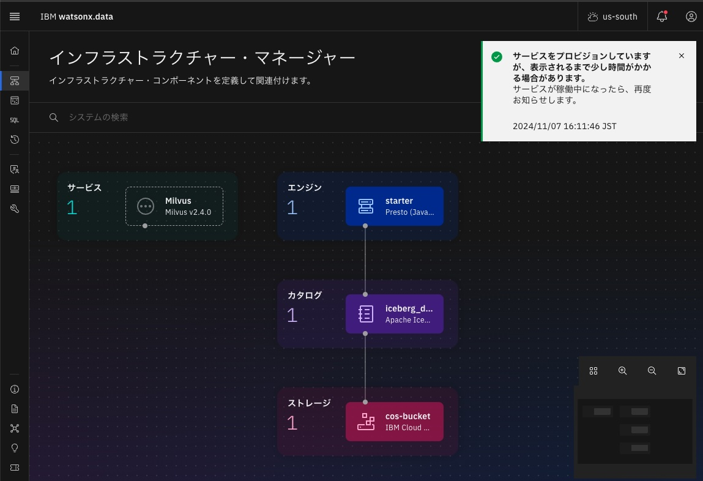

# インストラクター用　watsonx.dataの事前準備

当日ハンズオンをスムーズに進行させるために、watsonx.dataの初期設定、Milvusの作成を事前に行います。

## 1. Instructor URLにアクセス
Instructor URLはメールか、　TechzoneのMy workshopsメニューから取得してください。

## 2. 担当のIDのIBM Cloud LoginのURL, Username, Passwordを使ってIBM Cloudにログイン
Environmentsセクションの　担当番号のセクションを開き、そこに書いてあるIBM Cloud LoginのURL,　Username, Passwordを使ってIBM Cloudにログインします。 
尚、自分のIBMIDでのIBM SSOログインと混ざらないように、シークレットウィンドウ(プライベートウィンドウ)を推奨します。
 

 

## 3. リソースリストを表示
左上のナビゲーション・メニューをクリック後、「リソース・リスト」をクリックし、IBM Cloudのリソース・リストを開きます。 
 
 

### 4. watsonx.dataのリソースの表示
リソース・リストから[データベース]のグループを見つけて、その中に含まれている watsonx.data のサービスを見つけて、表示されている名前をクリックします。 
 

### 5. watsonx.dataのコンソールの表示
watsonx.dataのリソースが表示されるので、「Webコンソールを開く」をクリックします
 
&nbsp; 

### 6. watsonx.dataの初期設定実施
以下、デフォルトのまま全て「次へ」をクリックします(6まで): 
1. 
 
&nbsp; 
2. 
 
&nbsp; 
3.  
 
&nbsp; 
4.  
 
&nbsp; 
5.  
 
&nbsp; 
6.  
 
&nbsp; 

最後に「終了して移動」をクリックします。 
初期設定が終わるまで約12分ほど待ちます。 
この間ブラウザーの画面は表示したままにしておきます。初期設定が終わるまでログアウトもしないでください。 
 
&nbsp; 

初期設定が終わると、watsonx.dataのダッシュボードが表示されます。 
 
&nbsp; 

### 7. Milvusサービスの作成
左上のグローバル・ナビゲーションをクリック後、「インフラストラクチャー・マネージャー」をクリックし、インフラストラクチャー・マネージャーを開きます。 
 
&nbsp; 
 
&nbsp; 
&nbsp; 
インフラストラクチャー・マネージャーが表示されます。 
右上の「コンポーネントの追加」をクリックします。 
 
&nbsp; 
&nbsp; 
「コンポーネントの追加」画面が開きます。 
**Services**の下の「Milvus」をクリックします。 
 
&nbsp; 
「次へ」をクリックします。 
 
&nbsp; 

一般情報の画面が表示されます。 
表示名に`Milvus`を入力し、その他はデフォルトのままで、「作成」をクリックします。 
 
&nbsp; 

Milvusサービスのプロビジョンが開始されます。サービスが稼働するまで待ちます(8〜10分くらい)。 
 
&nbsp; 

以下のようにMilvusが表示されていtれば、Milvus稼働完了です 
 
&nbsp; 

Milvusの上にマウスを重ねると、「Milvus実行中」と表示されます。
 
&nbsp; 

### 8. Milvusサービスに権限追加
「Milvus」アイコンをクリックします。サービスの詳細が表示されます。 
「アクセス制御タブ」をクリックし、「アクセス権限の追加」をクリックします。
 
&nbsp; 

最初にIBM Cloud LoginのURL,　Username, Passwordを取得したのと同じ担当番号のセクション中の下の方にある、`IBM Cloud Service ID`の値を取得します。 
 
&nbsp; 

検索窓にその`IBM Cloud Service ID`の値を入力し、検索します。 
その後表示されたGroupにチェックを入れ、役割を「管理者」にセットし、「追加」をクリックします。 
 
&nbsp; 

「アクセス制御」に追加したグループの権限が正しく表示されているのを確認します。
 
&nbsp; 

Milvsの設定はこれで完了です。

