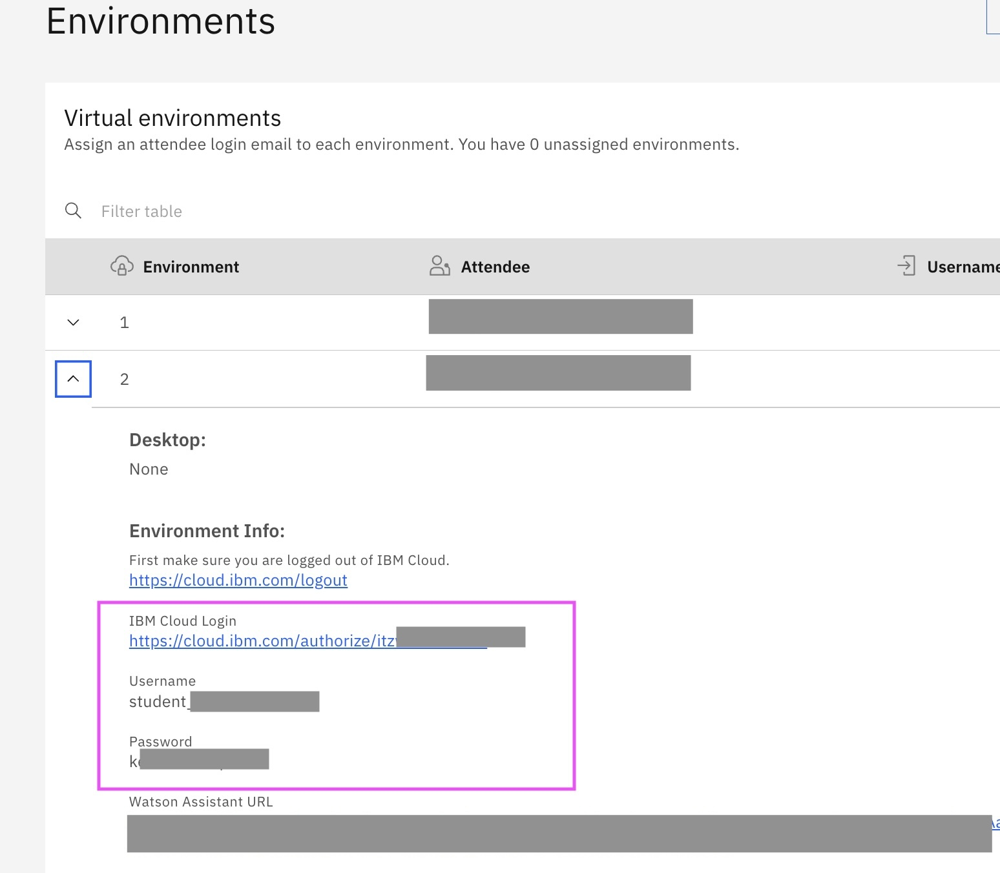
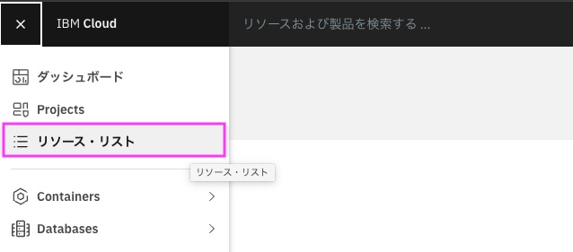
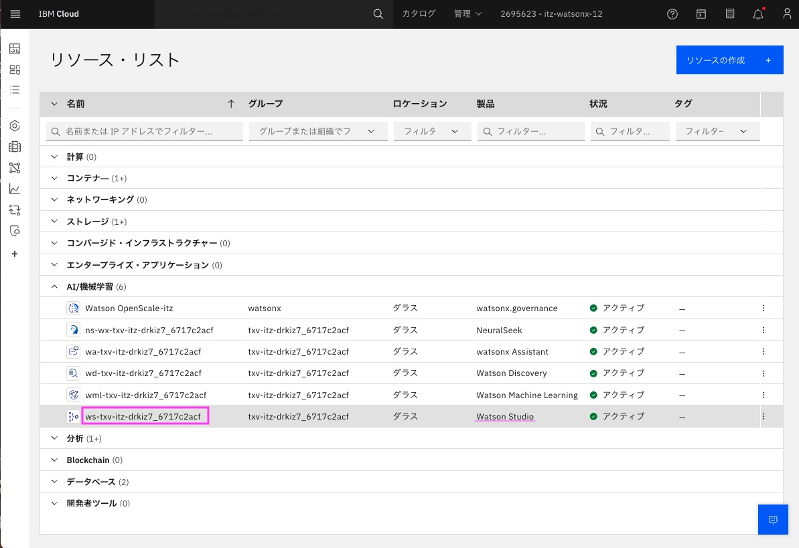
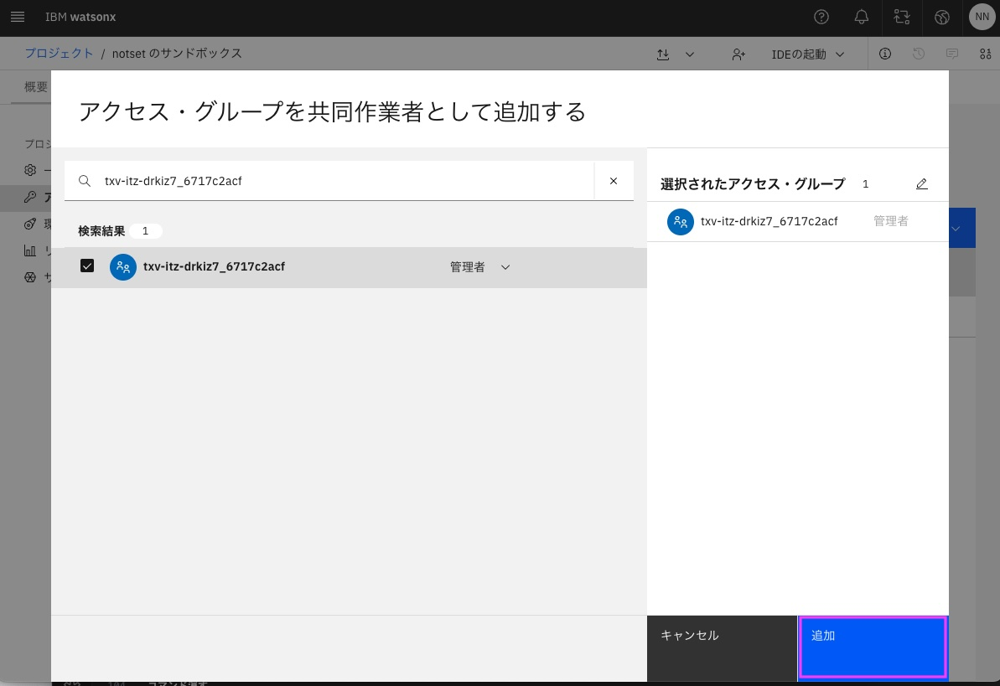

# インストラクター用　watsonx.aiの事前準備

当日ハンズオンをスムーズに進行させるために、watsonx.dataの初期設定、Milvusの作成を事前に行います。

## 1. Instructor URLにアクセス
Instructor URLはメールか、　TechzoneのMy workshopsメニューから取得してください。

## 2. 担当のIDのIBM Cloud LoginのURL, Username, Passwordを使ってIBM Cloudにログイン
Environmentsセクションの　担当番号のセクションを開き、そこに書いてあるIBM Cloud LoginのURL,　Username, Passwordを使ってIBM Cloudにログインします。 

 

## 3. リソースリストを表示
左上のナビゲーション・メニューをクリック後、「リソース・リスト」をクリックし、IBM Cloudのリソース・リストを開きます。 
 
 

### 4. watsonx.aiのリソースの表示
リソース・リストから[AI/機械学習]のグループを見つけて、その中に含まれている Watson Studio のサービスを見つけて、表示されている名前をクリックします。 
 
&nbsp; 

### 5. watsonx.aiのトップページの表示
watsonx.Studioのリソースが表示されるので、[Launch in][v]の[v]をクリックして、表示されたメニューから[watsonx]を選びます。 
 
&nbsp; 

以下の画面が表示されますが、何もしないでしばらく待ちます。 
 
&nbsp; 

しばらくすると以下の画面に変わるので、「続行」をクリックします。 
 
&nbsp; 

watsonx.aiのトップページが開きます。「watsonxへようこそ」というウィンドウが表示された場合は右上の[X]をクリックして閉じてください。 
 
&nbsp; 

「さらに詳しくみる」というウィンドウが表示された場合は右上の[X]をクリックして閉じてください。 
 
&nbsp; 

### 6. サンドボックス・プロジェクトを開く
今回使用するサンドボックス・プロジェクトは最初のwatson.ai利用時に自動的に作成されるプロジェクトです。 
トップページ表示直後はしばらく作成中となりますが、1〜2分で作成されます。 
プロジェクトが、下記のような表示になったら`notsetのサンドボックス`(`notset`は違う文字列になる可能性があります)をクリックします。 
 
&nbsp; 

### 7. サンドボックス・プロジェクトに権限付与
「管理」タブをクリックします 
 
&nbsp; 
左のメニューから「アクセス制御」をクリックします 
 
&nbsp; 
左のメニューから「コラボレーターの追加」をクリックします 
 
&nbsp; 
「アクセスグループの.....」を選択します 
 
&nbsp; 
最初にIBM Cloud LoginのURL,　Username, Passwordを取得したのと同じ担当番号のセクション中の下の方にある、`IBM Cloud Service ID`の値を取得します。 
 
&nbsp; 

検索窓にその`IBM Cloud Service ID`の値を入力し、検索します。 
その後表示されたGroupにチェックを入れ、役割を「管理者」にセットします。 
 
&nbsp; 
「追加」をクリックします。 
 
&nbsp; 
「アクセス制御」のコラボレーターに追加したグループの権限が正しく表示されているのを確認します。
 
&nbsp; 

watsonx.aiの設定はこれで完了です。 
別にUsernameの設定をする場合はwatsonx.ai、watson.data, IBM Cloudコンソール、全てログアウトしてから実行してください。

